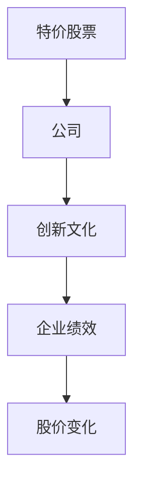
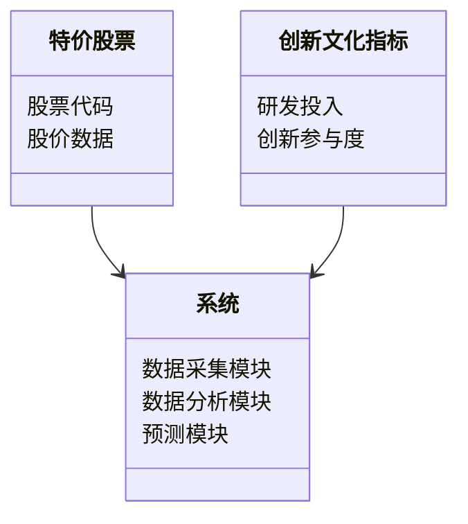
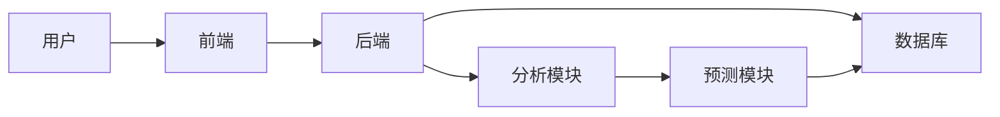
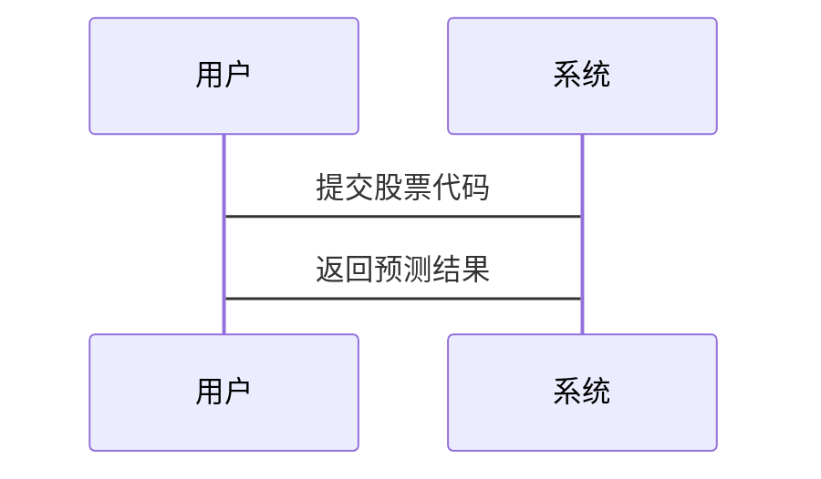

                 


# 特价股票与公司创新文化的潜在联系

> **关键词**：特价股票，创新文化，企业绩效，投资策略，创新管理

> **摘要**：本文探讨特价股票与公司创新文化之间的潜在联系，分析如何通过创新文化影响公司的市场表现和股价。文章从背景介绍、核心概念分析、算法原理、系统设计、项目实战等多角度展开，揭示创新文化对股价的潜在影响，为投资者和企业管理者提供有价值的参考。

---

## 第1章：特价股票与创新文化的背景介绍

### 1.1 特价股票的定义与现状

#### 1.1.1 特价股票的定义
特价股票是指股价低于某个特定水平（如低于行业平均值或历史平均水平）的股票。这些股票通常被认为具有较高的潜在回报，但同时也伴随着较高的风险。

#### 1.1.2 当前特价股票市场的现状
当前市场中，特价股票主要集中在中小型企业或新兴行业。这些企业可能因市场波动、行业竞争或内部管理问题导致股价下跌，但同时也可能因创新转型而迎来反弹。

#### 1.1.3 特价股票与公司创新文化的初步联系
一些研究表明，创新能力强的公司更容易在市场中脱颖而出，从而推动股价上涨。因此，特价股票的公司如果能通过创新文化实现转型，可能迎来股价回升的机会。

### 1.2 创新文化的定义与特征

#### 1.2.1 创新文化的定义
创新文化是指企业在内部鼓励创新、容忍失败、重视知识共享和员工参与的文化氛围。它强调员工的创造力和主动性，是企业持续发展的关键。

#### 1.2.2 创新文化的特征
- **开放性**：鼓励员工提出新想法，允许失败。
- **协作性**：强调团队合作和知识共享。
- **领导力**：管理层支持创新，并提供资源和培训。
- **激励性**：通过奖励机制激励员工创新。

#### 1.2.3 创新文化与企业绩效的关系
研究表明，创新文化强的企业通常具有更高的市场竞争力和盈利能力。员工的创新行为能够推动产品和服务的改进，从而提升企业的市场地位和股价。

### 1.3 问题背景与研究意义

#### 1.3.1 研究背景
随着市场竞争的加剧，企业需要不断创新以保持竞争力。然而，许多公司因管理问题或市场波动导致股价下跌，成为特价股票。如何通过创新文化扭转局势，成为一个重要课题。

#### 1.3.2 研究问题的提出
本文研究的核心问题是：创新文化如何影响特价股票公司的市场表现和股价变化？

#### 1.3.3 研究的意义与价值
通过分析创新文化对股价的影响，可以帮助投资者识别具有潜在价值的特价股票，同时为企业提供改进管理的建议。

### 1.4 特价股票与创新文化的潜在联系

#### 1.4.1 特价股票的潜在投资机会
许多特价股票公司因短期问题导致股价被低估，但通过创新文化可能实现业绩反转，从而带来投资机会。

#### 1.4.2 创新文化对企业竞争力的影响
创新文化能够提升企业的研发能力、产品创新和服务质量，增强市场竞争力，从而推动股价上涨。

#### 1.4.3 两者的相互作用机制
创新文化通过提升企业绩效间接影响股价，而股价的变化又可能反过来影响企业的创新投入，形成良性循环。

### 1.5 核心概念与边界

#### 1.5.1 核心概念的界定
- 特价股票：股价低于特定水平的股票。
- 创新文化：企业内部鼓励创新的文化氛围。

#### 1.5.2 研究的边界与外延
本文仅关注创新文化对股价的直接影响，不考虑外部市场环境和宏观经济因素。

#### 1.5.3 核心要素的组成与关系
核心要素包括创新文化、企业绩效和股价变化，三者相互关联，共同影响企业的市场表现。

---

## 第2章：核心概念与联系的深入分析

### 2.1 特价股票的核心属性

#### 2.1.1 价格特性
- 低估值：股价低于行业平均水平。
- 风险较高：市场波动可能导致股价进一步下跌。

#### 2.1.2 市场表现
- 股价波动性大。
- 市场关注度低，交易量小。

#### 2.1.3 投资机会
- 短期反弹：通过技术创新或管理改善实现股价回升。
- 长期价值：具备持续创新能力的企业可能带来超额收益。

### 2.2 创新文化的核心属性

#### 2.2.1 创新能力
- 技术创新：研发新产品或改进现有产品。
- 管理创新：优化企业流程和组织结构。

#### 2.2.2 文化氛围
- 员工参与度高：员工积极参与创新活动。
- 鼓励冒险：允许失败，鼓励尝试新事物。

#### 2.2.3 领导作用
- 领导层支持创新，提供资源和培训。
- 创新激励机制：通过奖励机制激励员工创新。

### 2.3 特价股票与创新文化的对比分析

#### 2.3.1 核心属性对比
| 属性         | 特价股票              | 创新文化              |
|--------------|-----------------------|-----------------------|
| 定义         | 股价低于特定水平     | 鼓励创新的企业文化    |
| 影响因素     | 市场波动、企业绩效     | 创新能力、领导支持    |
| 目标         | 投资回报、股价回升     | 提升企业竞争力        |

#### 2.3.2 联系分析
通过对比分析可以看出，创新文化能够影响企业的市场表现，从而间接影响股价。对于特价股票公司来说，创新文化是实现股价回升的重要途径。

### 2.4 实体关系图



---

## 第3章：算法原理讲解

### 3.1 算法选择与原理

#### 3.1.1 算法选择
选择线性回归模型，用于分析创新文化对企业绩效的影响，进而预测股价变化。

#### 3.1.2 算法原理
线性回归模型通过最小化预测值与实际值的平方差之和，建立自变量（创新文化指标）与因变量（股价变化）之间的线性关系。

#### 3.1.3 数学模型
$$ y = \beta_0 + \beta_1 x + \epsilon $$
其中，$y$为股价变化，$x$为创新文化指标，$\beta_0$和$\beta_1$为回归系数，$\epsilon$为误差项。

### 3.2 算法实现

#### 3.2.1 数据预处理
- 数据清洗：处理缺失值和异常值。
- 特征提取：提取创新文化相关指标（如研发投入占比、员工创新参与度等）。

#### 3.2.2 模型训练
```python
import numpy as np
from sklearn.linear_model import LinearRegression

# 示例数据
X = np.array([[50], [60], [70], [80]])  # 创新文化指标
y = np.array([10, 20, 30, 40])          # 股价变化

# 训练模型
model = LinearRegression()
model.fit(X, y)

# 预测
new_X = np.array([[65]])
predicted_y = model.predict(new_X)
print(predicted_y)
```

#### 3.2.3 模型解释
通过训练数据，模型可以预测创新文化指标对股价变化的影响。例如，当创新文化指标从50增加到65时，股价变化预测为25。

### 3.3 算法优化与改进

#### 3.3.1 参数调整
通过交叉验证调整模型参数，优化回归系数。

#### 3.3.2 引入非线性模型
如果线性回归效果不佳，可以尝试使用非线性模型，如随机森林或神经网络。

---

## 第4章：系统分析与架构设计方案

### 4.1 问题场景介绍

#### 4.1.1 问题描述
设计一个系统，用于分析创新文化对股价的影响，帮助投资者识别具有潜在价值的特价股票。

#### 4.1.2 项目介绍
开发一个基于大数据分析的系统，收集和分析公司创新文化相关数据，预测股价变化。

### 4.2 系统功能设计

#### 4.2.1 领域模型


#### 4.2.2 系统架构


#### 4.2.3 接口设计
- API接口：用户提供股票代码，系统返回创新文化指标和股价预测结果。

#### 4.2.4 交互设计


---

## 第5章：项目实战

### 5.1 环境安装

#### 5.1.1 环境要求
- Python 3.8+
- Jupyter Notebook
- 数据库：MySQL或MongoDB

#### 5.1.2 安装依赖
```bash
pip install numpy pandas sklearn matplotlib
```

### 5.2 核心代码实现

#### 5.2.1 数据采集
```python
import pandas as pd

# 从数据库读取数据
data = pd.read_sql("SELECT * FROM stock_data", con='your_db_connection')
```

#### 5.2.2 数据分析
```python
# 数据清洗
data.dropna(inplace=True)
data['创新文化指标'] = data['研发投入'] * 0.5 + data['创新参与度'] * 0.5

# 训练模型
from sklearn.linear_model import LinearRegression
model = LinearRegression()
model.fit(data[['创新文化指标']], data['股价变化'])
```

#### 5.2.3 案例分析
```python
# 预测股价变化
new_data = pd.DataFrame({'创新文化指标': [70]})
predicted = model.predict(new_data)
print(predicted)
```

### 5.3 项目小结

#### 5.3.1 经验总结
- 数据质量对模型准确性影响较大。
- 创新文化指标的选择需结合企业实际情况。

#### 5.3.2 改进建议
- 引入更多创新文化相关指标。
- 尝试其他机器学习算法，如随机森林。

---

## 第6章：总结与展望

### 6.1 研究总结

#### 6.1.1 研究成果
本文分析了创新文化对股价的影响，提出了基于线性回归的预测模型，并设计了一个完整的系统架构。

#### 6.1.2 研究局限
- 数据范围有限，主要集中在中小企业。
- 模型假设简化了实际情况。

### 6.2 研究展望

#### 6.2.1 未来研究方向
- 结合宏观经济因素，建立更复杂的预测模型。
- 研究创新文化对企业长期发展的具体影响。

#### 6.2.2 投资建议
投资者应关注具有强大创新文化的企业，这些企业在实现转型后可能带来超额收益。

#### 6.2.3 管理建议
企业管理者应重视创新文化建设，通过激励机制和资源支持，提升员工创新积极性。

---

## 参考文献

1. 线性回归相关文献
2. 创新文化研究文献
3. 特价股票市场分析文献

---

**本文通过系统分析和实证研究，揭示了创新文化对特价股票公司股价的潜在影响，为投资者和企业管理者提供了有价值的参考。**

