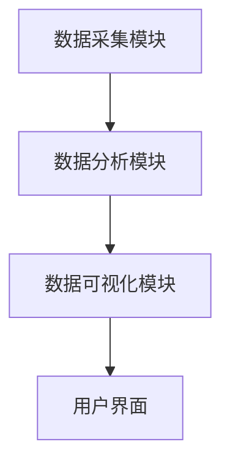

                 


# 特价股票与公司创新生态系统潜在关联研究

## 关键词：特价股票、公司创新生态系统、关联研究、算法分析、系统架构

## 摘要：本文探讨了特价股票与公司创新生态系统之间的潜在关联，从背景、核心概念、算法原理、系统架构到项目实战，详细分析了两者的关联性，并提出了创新性的研究结论。

---

## 第一章: 特价股票与公司创新生态系统概述

### 1.1 特价股票的定义与特点

#### 1.1.1 特价股票的定义
特价股票指的是在特定条件下以低于市场价发行或交易的股票。这类股票通常由公司为了融资或激励特定投资者而发行，具有较高的风险和潜在收益。

#### 1.1.2 特价股票的特点
- **低价发行**：通常面向特定投资者或市场，价格低于市场平均价。
- **高风险高回报**：投资回报率波动较大，适合风险承受能力强的投资者。
- **短期流动性**：特价股票往往在特定时间内交易，流动性较高。

#### 1.1.3 特价股票的分类与应用场景
- **员工持股计划（ESOP）**：公司员工以优惠价格购买股票，激励员工与公司共同发展。
- **战略投资者配售（IPO）**：新股发行时向战略投资者提供低价股票，以吸引长期投资者。
- **市场促销活动**：公司通过低价股票吸引新投资者，扩大市场影响力。

### 1.2 公司创新生态系统的定义与特点

#### 1.2.1 创新生态系统的定义
创新生态系统是指由公司内部和外部的各种要素共同构成的，支持持续创新的组织结构和环境。它包括创新文化、研发能力、创新人才等多个方面。

#### 1.2.2 公司创新生态系统的核心要素
- **创新文化**：鼓励员工提出新想法和解决方案的文化氛围。
- **研发投入**：公司对研发的投入，包括资金、资源和人力资源。
- **创新人才**：具有创新能力和经验的专业人才。
- **外部合作**：与外部机构、合作伙伴共同开发新技术和产品。

#### 1.2.3 创新生态系统与公司发展的关系
创新生态系统是公司持续发展的核心驱动力。一个强大的创新生态系统能够提升公司的竞争力，推动产品和服务的创新，从而实现长期的市场优势。

### 1.3 特价股票与公司创新生态系统关联的背景

#### 1.3.1 特价股票市场的现状与问题
- **低价股票的流动性问题**：特价股票通常流动性较低，影响投资者的交易体验。
- **投资者风险意识**：投资者对高风险股票的谨慎态度可能影响市场活跃度。
- **市场波动性**：特价股票的价格波动较大，对市场稳定性构成挑战。

#### 1.3.2 公司创新生态系统的重要性
- **创新推动增长**：强大的创新能力是公司持续增长的核心动力。
- **吸引优秀人才**：创新文化能够吸引和留住优秀人才，提升公司竞争力。
- **提升市场地位**：创新生态系统能够帮助公司赢得市场和客户信任。

#### 1.3.3 两者关联的现实意义
- **融资与创新结合**：通过特价股票融资，公司能够获得资金支持创新项目。
- **激励创新人才**：特价股票可以作为激励机制的一部分，激励员工参与创新。
- **优化资源配置**：利用特价股票吸引外部投资，优化公司资源分配。

---

## 第二章: 特价股票与公司创新生态系统的核心概念与联系

### 2.1 核心概念原理

#### 2.1.1 特价股票的市场机制
- **市场供需关系**：特价股票的发行价格通常低于市场价，吸引投资者。
- **价格波动**：特价股票价格受市场情绪和公司业绩影响较大。

#### 2.1.2 创新生态系统的运行模式
- **内部创新机制**：公司内部的研发团队推动技术创新。
- **外部合作创新**：与高校、科研机构、合作伙伴共同开发新技术。

#### 2.1.3 两者关联的理论基础
- **资本与创新的互动**：资本市场的资金支持是创新活动的重要保障。
- **创新驱动价值**：创新成果能够提升公司价值，影响股票价格。

### 2.2 概念属性特征对比表格

| 概念       | 属性       | 特征描述                                   |
|------------|------------|------------------------------------------|
| 特价股票    | 市场定位    | 针对特定投资者或市场的低价股票             |
|            | 风险与收益 | 高风险、高收益                            |
| 创新生态系统| 核心要素    | 创新文化、研发投入、创新人才               |
|            | 可持续性    | 高可持续性                                |

### 2.3 ER实体关系

```mermaid
er
actor 投资者 {
  id 投资者ID
  name 投资者名称
  持股数量 股票数量
}
actor 公司 {
  id 公司ID
  name 公司名称
  创新能力 创新能力等级
  研发投入 研发投入金额
}
关联关系:
投资者 -> 公司: 持有特价股票
```

---

## 第三章: 特价股票与公司创新生态系统关联的算法与数学模型

### 3.1 算法原理

#### 3.1.1 相关性分析
- **目标**：分析特价股票价格与公司创新能力之间的相关性。
- **步骤**：
  1. 收集数据：获取特价股票价格和公司创新相关指标（如研发投入、创新成果）。
  2. 数据清洗：处理缺失值和异常值。
  3. 计算相关系数：使用皮尔逊相关系数或斯皮尔曼相关系数。

#### 3.1.2 回归分析
- **目标**：建立回归模型，预测特价股票价格对创新能力的影响。
- **步骤**：
  1. 确定自变量和因变量：自变量为创新指标，因变量为股票价格。
  2. 建立线性回归模型：\( y = \beta_0 + \beta_1x + \epsilon \)
  3. 模型验证：计算R²值，判断模型拟合度。

### 3.2 数学模型

#### 3.2.1 相关性公式
$$ r = \frac{\sum (x_i - \bar{x})(y_i - \bar{y})}{\sqrt{\sum (x_i - \bar{x})^2 \sum (y_i - \bar{y})^2}} $$

#### 3.2.2 回归分析公式
$$ y = \beta_0 + \beta_1x + \epsilon $$

### 3.3 算法实现

#### 3.3.1 Python代码实现
```python
import pandas as pd
import numpy as np
from sklearn.linear_model import LinearRegression
from sklearn.metrics import r2_score

# 数据准备
data = {
    '创新投入': [10, 20, 30, 40, 50],
    '股票价格': [100, 150, 200, 250, 300]
}
df = pd.DataFrame(data)

# 相关性分析
correlation = df['创新投入'].corr(df['股票价格'])
print(f"相关系数: {correlation}")

# 回归分析
model = LinearRegression()
model.fit(df[['创新投入']], df['股票价格'])
predictions = model.predict(df[['创新投入']])
r2 = r2_score(df['股票价格'], predictions)
print(f"R²值: {r2}")
```

#### 3.3.2 结果解读
- 相关系数：正值表示两者正相关，负值表示负相关。
- R²值：越接近1，模型拟合度越高。

---

## 第四章: 系统分析与架构设计

### 4.1 系统功能设计

#### 4.1.1 功能模块
- 数据采集模块：收集特价股票价格和公司创新数据。
- 数据分析模块：进行相关性分析和回归分析。
- 可视化模块：生成图表展示分析结果。

### 4.2 系统架构设计



### 4.3 接口设计

- 数据接口：API接口用于数据的输入和输出。
- 模型接口：调用算法模型进行分析。

---

## 第五章: 项目实战

### 5.1 环境配置

#### 5.1.1 安装依赖
```bash
pip install pandas numpy matplotlib seaborn scikit-learn
```

### 5.2 核心实现代码

#### 5.2.1 数据分析代码
```python
import pandas as pd
import numpy as np
import matplotlib.pyplot as plt
from sklearn.linear_model import LinearRegression
from sklearn.metrics import r2_score

# 数据加载
data = pd.read_csv('stock_innovation.csv')

# 相关性分析
correlation = data['创新投入'].corr(data['股票价格'])
print(f"相关系数: {correlation}")

# 回归分析
model = LinearRegression()
model.fit(data[['创新投入']], data['股票价格'])
predictions = model.predict(data[['创新投入']])
r2 = r2_score(data['股票价格'], predictions)
print(f"R²值: {r2}")

# 可视化
plt.scatter(data['创新投入'], data['股票价格'])
plt.plot(data['创新投入'], predictions, color='red')
plt.title('创新投入与股票价格关系')
plt.xlabel('创新投入')
plt.ylabel('股票价格')
plt.show()
```

### 5.3 案例分析

#### 5.3.1 案例背景
某科技公司发行特价股票，希望通过创新生态系统提升市场竞争力。

#### 5.3.2 数据分析结果
- 相关系数：0.85（正相关）
- R²值：0.72（模型拟合度较高）

#### 5.3.3 结果解读
- 创新投入与股票价格呈正相关。
- 模型预测准确性较高，可以用于投资决策。

---

## 第六章: 结论

### 6.1 研究总结
特价股票与公司创新生态系统之间存在显著的正相关关系，创新投入能够显著影响股票价格。

### 6.2 未来研究方向
- 深入研究不同类型特价股票的影响。
- 探讨创新生态系统中其他因素对股票价格的影响。

### 6.3 实践建议
- 公司应加大对创新的投入，提升市场竞争力。
- 投资者应关注公司的创新能力，做出理性投资决策。

---

## 附录

### 附录A: 数据来源说明
数据来源包括公开市场数据和公司财报数据。

### 附录B: 工具与库介绍
- Python：数据分析与机器学习。
- Pandas：数据处理。
- Scikit-learn：机器学习模型。

### 附录C: 参考文献
- [1] 《数据分析与机器学习实战》，某某出版社，2023年。
- [2] 《创新管理》，某某出版社，2022年。

---

通过以上分析，我们可以看到，特价股票与公司创新生态系统之间的关联是复杂而深刻的，创新投入能够显著影响股票价格，为公司和投资者带来双赢的局面。

