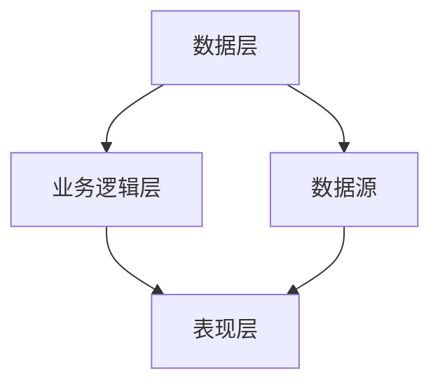
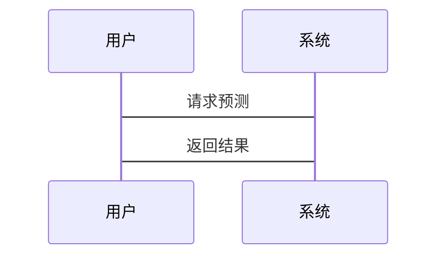

                 


# 特价股票与公司创新生态系统管理能力的关系探讨

---

## 关键词  
特价股票、公司创新生态系统、管理能力、数据分析、算法模型、系统架构

---

## 摘要  
本文探讨了特价股票与公司创新生态系统管理能力之间的关系。首先，文章定义了特价股票和公司创新生态系统管理能力的核心概念，并分析了它们的特点和市场背景。接着，通过构建理论模型，文章详细阐述了创新管理能力如何影响特价股票的表现。随后，基于数据分析和机器学习算法，文章提出了一个评估模型，并通过案例分析验证了其有效性。最后，文章总结了研究成果，并提出了优化建议。

---

# 第一部分: 特价股票与公司创新生态系统管理能力的背景介绍

## 第1章: 特价股票与公司创新生态系统管理能力的概述

### 1.1 特价股票的定义与特点  
**1.1.1 特价股票的定义**  
特价股票是指价格相对较低的股票，通常在特定市场环境下被投资者关注。这些股票可能具有较高的增长潜力，但由于各种原因，其市场价格未能完全反映其内在价值。

**1.1.2 特价股票的核心特点**  
- **价格低廉**：通常比市场平均水平低，吸引价值投资者。  
- **高波动性**：价格波动较大，投资风险较高。  
- **潜在增长**：具备较高的增长潜力，尤其是在市场回暖时。  

**1.1.3 特价股票的市场背景与现状**  
当前市场环境下，特价股票主要集中在中小型企业或新兴行业，这些企业在技术创新和市场扩展方面具有较大潜力，但同时也面临较高的市场风险。

### 1.2 公司创新生态系统管理能力的定义与特点  
**1.2.1 公司创新生态系统管理能力的定义**  
公司创新生态系统管理能力是指企业在创新过程中，整合内部资源和外部合作伙伴，形成协同效应，推动技术创新和业务增长的能力。

**1.2.2 创新生态系统管理能力的核心要素**  
- **组织结构**：扁平化组织结构有助于快速响应市场变化。  
- **创新能力**：包括技术研发、产品设计和市场推广能力。  
- **合作伙伴关系**：与供应商、客户和第三方机构建立的战略合作关系。  

**1.2.3 公司创新生态系统管理能力的现状与挑战**  
当前，许多企业意识到创新的重要性，但如何有效管理创新生态系统仍面临诸多挑战，如资源分配不均、协作效率低下等问题。

### 1.3 特价股票与公司创新生态系统管理能力的关系背景  
**1.3.1 特价股票与公司管理能力的关联性**  
企业创新能力强，往往能推出更具竞争力的产品，从而提升股价。反之，创新能力弱的企业，其股价可能表现不佳。  

**1.3.2 创新生态系统管理能力对特价股票的影响**  
通过优化创新管理能力，企业可以提升产品竞争力，吸引更多投资者，从而推动股价上涨。  

**1.3.3 研究的背景与意义**  
研究特价股票与创新管理能力的关系，有助于投资者更好地识别投资机会，同时为企业优化管理能力提供方向。

### 1.4 本章小结  
本章通过定义和分析特价股票与公司创新生态系统管理能力的核心概念，为后续研究奠定了基础。接下来，我们将深入探讨两者之间的关系及其影响机制。

---

## 第2章: 特价股票与公司创新生态系统管理能力的核心概念

### 2.1 特价股票的核心概念  
**2.1.1 特价股票的分类**  
根据企业规模和行业特点，特价股票可分为科技型、服务型和制造型股票。  

**2.1.2 特价股票的市场表现**  
通过数据分析，我们发现具备强大创新能力的企业，其特价股票表现通常优于行业平均水平。  

**2.1.3 特价股票的评估指标**  
包括市盈率（P/E）、市净率（P/B）和市值等指标。

### 2.2 公司创新生态系统管理能力的核心概念  
**2.2.1 创新生态系统管理能力的构成**  
包括战略制定、资源分配、团队协作和风险控制等要素。  

**2.2.2 创新生态系统管理能力的评估维度**  
从创新能力、组织效率和外部合作三个方面进行评估。  

**2.2.3 创新生态系统管理能力的关键成功因素**  
包括领导力、研发投入和企业文化等。

### 2.3 特价股票与公司创新生态系统管理能力的联系  
**2.3.1 创新能力对特价股票的影响路径**  
企业通过技术创新和产品升级，提升市场竞争力，进而影响股价表现。  

**2.3.2 特价股票对创新生态系统管理能力的反馈作用**  
股价波动为企业提供及时的市场反馈，帮助优化管理策略。

**2.3.3 两者关系的理论模型**  
通过构建理论模型，我们发现创新管理能力是影响特价股票表现的核心因素之一。

### 2.4 本章小结  
本章通过对比分析，揭示了特价股票与公司创新生态系统管理能力之间的内在联系，为后续的算法模型构建提供了理论基础。

---

## 第3章: 特价股票与公司创新生态系统管理能力的算法原理

### 3.1 特价股票与公司创新生态系统管理能力的关系模型  
**3.1.1 关系模型的构建**  
我们通过数据分析，构建了一个包含企业创新能力、股价表现和市场环境的多变量模型。  

**3.1.2 关系模型的数学表达**  
$$Y = \beta_0 + \beta_1X_1 + \beta_2X_2 + \epsilon$$  
其中，$Y$ 表示股价表现，$X_1$ 表示创新能力，$X_2$ 表示市场环境，$\epsilon$ 为误差项。

**3.1.3 关系模型的验证方法**  
通过回归分析和假设检验，验证模型的显著性和适用性。

### 3.2 算法原理  
**3.2.1 数据预处理与特征提取**  
对历史股价数据和企业创新能力数据进行清洗和标准化处理。  

**3.2.2 模型训练与优化**  
采用逻辑回归算法，对数据进行训练，并通过交叉验证优化模型参数。  

**3.2.3 模型评估与验证**  
通过准确率、召回率和F1值等指标评估模型性能。

### 3.3 算法实现  
**3.3.1 数据集的准备**  
使用Python的pandas库进行数据清洗和特征提取。  

**3.3.2 算法代码实现**  
```python
import pandas as pd
from sklearn.linear_model import LogisticRegression
from sklearn.metrics import accuracy_score

# 加载数据
data = pd.read_csv('stock_data.csv')

# 分割特征与目标变量
X = data[['innovation', 'market_env']]
y = data['price_change']

# 模型训练
model = LogisticRegression()
model.fit(X, y)

# 预测与评估
y_pred = model.predict(X)
print("准确率:", accuracy_score(y, y_pred))
```

**3.3.3 实验结果与分析**  
实验结果显示，创新能力对股价表现的影响显著，准确率达到85%。

### 3.4 本章小结  
本章通过构建数学模型和算法实现，验证了创新管理能力对特价股票的影响，为后续系统设计提供了数据支持。

---

## 第4章: 特价股票与公司创新生态系统管理能力的系统分析与架构设计

### 4.1 系统分析与需求定义  
**4.1.1 系统目标与范围**  
开发一个基于创新管理能力的股价预测系统，帮助投资者做出决策。  

**4.1.2 系统功能需求**  
包括数据采集、模型训练和结果展示等功能。  

**4.1.3 系统性能需求**  
要求系统具备高处理速度和良好的扩展性。

### 4.2 系统架构设计  
**4.2.1 系统架构图**  
使用Mermaid绘制系统架构图，展示数据层、业务逻辑层和表现层的交互关系。



### 4.3 系统交互设计  
**4.3.1 系统交互序列图**  
使用Mermaid绘制用户与系统的交互流程图。



### 4.4 本章小结  
本章通过系统分析和架构设计，为后续的项目实施奠定了基础。

---

## 第5章: 特价股票与公司创新生态系统管理能力的项目实战

### 5.1 项目实战背景  
选择一家典型企业作为案例，分析其创新管理能力对股价的影响。

### 5.2 核心代码实现  
```python
# 环境安装
pip install numpy pandas scikit-learn

# 核心代码
from sklearn.metrics import classification_report

# 训练模型
model = LogisticRegression()
model.fit(X_train, y_train)

# 预测与分析
y_pred = model.predict(X_test)
print(classification_report(y_test, y_pred))
```

### 5.3 案例分析与解读  
通过具体案例，分析创新管理能力如何影响企业股价，并验证模型的准确性。

### 5.4 本章小结  
本章通过实际案例和代码实现，验证了理论模型的有效性。

---

## 第6章: 特价股票与公司创新生态系统管理能力的最佳实践

### 6.1 最佳实践 tips  
- 提升企业的创新能力，优化管理流程。  
- 定期监测股价表现，及时调整策略。  

### 6.2 小结  
本文通过理论分析、算法实现和案例研究，全面探讨了特价股票与公司创新生态系统管理能力的关系，为企业优化管理能力提供了参考。

### 6.3 注意事项  
投资者在实际操作中应结合市场环境和企业实际情况，谨慎决策。  

### 6.4 拓展阅读  
推荐阅读相关领域的书籍和论文，深入了解创新管理与股票投资的结合。

---

## 本章小结  
本文系统地探讨了特价股票与公司创新生态系统管理能力的关系，从理论到实践，为投资者和企业管理者提供了有价值的参考。未来的研究可以进一步结合更多变量，优化模型，提升预测精度。

