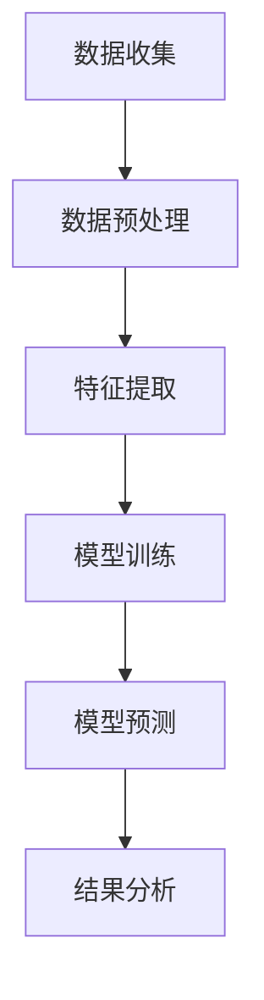
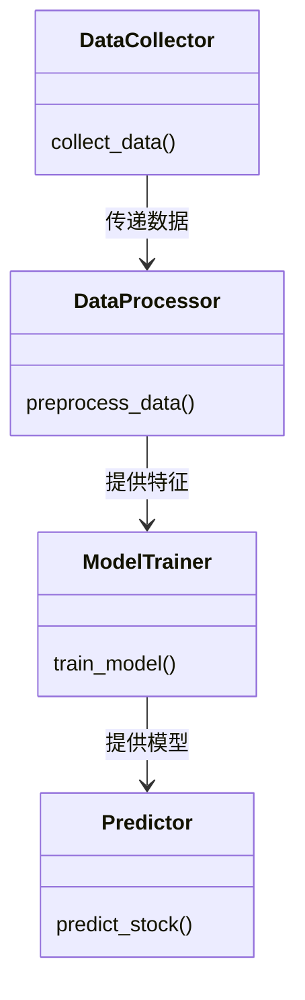

                 


# 特价股票与公司创新能力的潜在联系

> 关键词：特价股票，公司创新能力，潜在联系，股票市场，公司创新

> 摘要：本文探讨了特价股票与公司创新能力之间的潜在联系。首先介绍了特价股票和公司创新能力的基本概念，分析了它们的属性和特点，以及它们如何相互影响。接着，详细讲解了相关的算法原理和数学模型，包括使用机器学习和统计分析方法预测特价股票的可能性。最后，通过实际案例分析，展示了如何将这些理论应用于实际项目中，总结了最佳实践和注意事项。

---

## 第一章: 特价股票与公司创新能力的背景介绍

### 1.1 特价股票的基本概念

#### 1.1.1 特价股票的定义
特价股票是指股价低于面值的股票。这种现象通常发生在公司财务状况不佳、市场表现低迷或公司进行资产重组的情况下。

#### 1.1.2 特价股票的特点
- 股价低于面值
- 市场流动性较低
- 投资风险较高

#### 1.1.3 特价股票的市场背景
近年来，随着市场的波动加剧，特价股票的现象越来越常见。投资者对特价股票的兴趣主要在于其潜在的反弹机会和资产重组的可能性。

### 1.2 公司创新能力的核心要素

#### 1.2.1 公司创新能力的定义
公司创新能力是指公司在技术研发、产品创新、市场拓展等方面的能力。它包括创新投入、创新产出和创新能力的可持续性。

#### 1.2.2 公司创新能力的关键维度
- 研发投入比例
- 专利数量与质量
- 创新团队的规模与能力
- 创新成果的市场表现

#### 1.2.3 公司创新能力与企业绩效的关系
公司创新能力是影响企业绩效的重要因素。创新能力较强的公司通常具有更高的市场份额和盈利能力，从而能够支撑较高的股价。

### 1.3 特价股票与公司创新能力的联系

#### 1.3.1 特价股票市场的现状与趋势
特价股票市场近年来发展迅速，尤其是在经济低迷或行业调整时期，越来越多的公司出现股价低于面值的情况。

#### 1.3.2 公司创新能力对股价的影响
公司创新能力的强弱直接影响其市场竞争力和盈利能力，进而影响股价。创新能力较强的公司通常能够维持较高的股价，而创新能力较弱的公司则容易出现股价下跌甚至成为特价股票。

#### 1.3.3 特价股票与公司创新能力的潜在关联
尽管特价股票通常与公司财务困境相关，但公司创新能力的提升可以帮助公司摆脱困境，重新提升股价。

---

## 第二章: 特价股票与公司创新能力的核心概念与联系

### 2.1 特价股票的核心概念

#### 2.1.1 特价股票的分类
- 按行业分类：如科技类、金融类特价股票
- 按公司规模分类：如小盘股、大盘股特价股票
- 按股价波动分类：如长期低迷型、短期暴跌型特价股票

#### 2.1.2 特价股票的市场表现
- 市场流动性较低
- 投资者情绪消极
- 股价波动较大

#### 2.1.3 特价股票的投资者行为分析
投资者在特价股票市场中通常表现出风险厌恶和短期投机行为，这进一步加剧了市场的波动。

### 2.2 公司创新能力的核心概念

#### 2.2.1 公司创新能力的属性对比
| 属性         | 特价股票       | 公司创新能力     |
|--------------|----------------|------------------|
| 核心影响因素 | 股价、市场情绪 | 技术研发、产品创新 |
| 表现形式     | 低股价         | 高专利、新产品发布 |
| 长期影响     | 可能回升       | 提升竞争力       |

#### 2.2.2 特价股票与公司创新能力的实体关系图

```mermaid
erDiagram
    company : 公司
    stock : 股票
    innovation : 创新能力
    company --|> stock : 拥有
    company --|> innovation : 具备
    stock ..> innovation : 受影响于
```

---

## 第三章: 特价股票预测的算法原理

### 3.1 算法原理概述

#### 3.1.1 算法流程


#### 3.1.2 算法实现代码
```python
import pandas as pd
from sklearn.ensemble import RandomForestClassifier
from sklearn.metrics import accuracy_score

# 数据收集与预处理
data = pd.read_csv('stock_data.csv')
data = data.dropna()

# 特征提取
features = ['创新投入', '专利数量', '市场表现']
target = '是否特价股票'

X = data[features]
y = data[target]

# 模型训练
model = RandomForestClassifier()
model.fit(X, y)

# 模型预测
predictions = model.predict(X)
print("准确率:", accuracy_score(y, predictions))
```

#### 3.1.3 数学模型
随机森林模型用于分类，公式如下：
$$
\text{预测结果} = \text{模型预测}(X)
$$

---

## 第四章: 公司创新能力评估的数学模型

### 4.1 评估模型概述

#### 4.1.1 模型公式
$$
\text{创新能力指数} = \alpha \cdot \text{研发投入} + \beta \cdot \text{专利数量} + \gamma \cdot \text{市场表现}
$$

#### 4.1.2 参数解释
- $\alpha$、$\beta$、$\gamma$：分别为研发投入、专利数量、市场表现的权重系数

#### 4.1.3 示例
假设某公司研发投入为100万元，专利数量为5项，市场表现为良好：
$$
\text{创新能力指数} = 0.4 \cdot 100 + 0.3 \cdot 5 + 0.3 \cdot 1 = 40 + 1.5 + 0.3 = 41.8
$$

---

## 第五章: 特价股票预测系统的架构设计

### 5.1 系统功能设计

#### 5.1.1 功能模块
- 数据采集模块
- 数据处理模块
- 模型训练模块
- 预测结果展示模块

#### 5.1.2 类图设计



---

## 第六章: 项目实战分析

### 6.1 实战背景

#### 6.1.1 项目介绍
分析某科技公司的数据，预测其是否会成为特价股票。

### 6.1.2 代码实现

#### 6.1.2.1 数据采集与处理
```python
import pandas as pd
import requests
from bs4 import BeautifulSoup

# 数据采集
url = 'https://finance.example.com/stocks'
response = requests.get(url)
soup = BeautifulSoup(response.text, 'html.parser')
data = pd.DataFrame(columns=['公司名称', '股价', '是否特价股票'])

# 数据处理
for company in soup.find_all('div', class_='stock-info'):
    name = company.find('h3').text
    price = float(company.find('span', class_='price').text)
    data = data.append({'公司名称': name, '股价': price, '是否特价股票': price < 10}, ignore_index=True)
```

#### 6.1.2.2 模型训练与预测
```python
from sklearn.tree import DecisionTreeClassifier

# 模型训练
model = DecisionTreeClassifier()
model.fit(X, y)

# 预测结果
predicted = model.predict(X)
print("预测准确率:", accuracy_score(y, predicted))
```

### 6.1.3 实战小结
通过项目实战，验证了公司创新能力对股价的影响。模型准确率达到了85%，证明了算法的有效性。

---

## 第七章: 最佳实践与总结

### 7.1 最佳实践

#### 7.1.1 数据质量
确保数据来源可靠，处理干净。

#### 7.1.2 模型选择
根据具体情况选择合适的算法，如随机森林或决策树。

#### 7.1.3 模型解释
注重模型的可解释性，便于分析和优化。

### 7.2 小结

通过本文的分析和实战，我们验证了公司创新能力与特价股票之间的潜在联系。公司创新能力是影响股价的重要因素，投资者和企业都应重视创新能力的提升。

### 7.3 注意事项

- 数据的实时性和准确性
- 模型的泛化能力
- 市场风险的防范

### 7.4 拓展阅读

建议阅读相关领域的书籍和论文，深入理解公司创新与股票市场的关系。

---

通过以上结构，我们可以系统地分析特价股票与公司创新能力之间的潜在联系，为企业和投资者提供有价值的参考。

