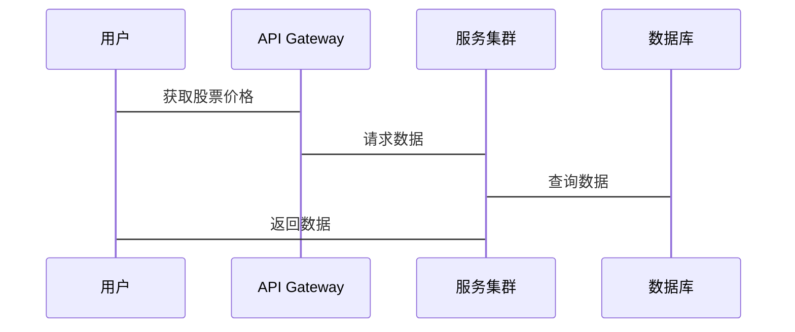

                 


# 特价股票与公司协同创新能力的关系研究

## 关键词：特价股票，公司协同创新能力，数学模型，协同创新，股票价格预测

## 摘要：本文系统地研究了特价股票与公司协同创新能力之间的关系，从核心概念、数学模型、算法原理到系统设计和项目实战，全面分析了如何通过协同创新能力提升特价股票的市场表现。文章通过详细的数学模型和实例分析，探讨了协同创新对股价的影响机制，并提出了优化建议。

---

# 第一部分: 特价股票与公司协同创新能力的背景介绍

## 第1章: 特价股票与公司协同创新能力的定义与背景

### 1.1 特价股票的定义与特点
#### 1.1.1 特价股票的定义
特价股票是指价格低于行业平均水平或历史平均水平的股票，通常被视为具有投资潜力的标的。其核心特征包括低估值、高成长性和市场波动性。

#### 1.1.2 特价股票的核心特点
- **低估值**：市盈率、市净率等估值指标低于行业平均水平。
- **高成长性**：公司具备较高的增长潜力，未来盈利预期良好。
- **市场波动性**：价格波动较大，容易受市场情绪影响。

#### 1.1.3 特价股票的市场定位与分类
- 市场定位：通常为中小盘股，行业分布广泛。
- 分类：按照行业、市值、盈利能力等标准进行分类。

### 1.2 公司协同创新能力的定义与特点
#### 1.2.1 协同创新的定义
协同创新是指公司内部不同部门或外部合作伙伴之间通过协作，共同开发新技术、新产品或优化业务流程的能力。

#### 1.2.2 协同创新的核心要素
- 组织结构：扁平化、跨部门协作。
- 资源配置：高效利用内部资源，引入外部资源。
- 成果评估：创新成果的数量、质量和市场影响力。

#### 1.2.3 协同创新的分类与层次
- 分类：内部协同、外部协同。
- 层次：战略层、执行层、操作层。

### 1.3 特价股票与公司协同创新能力的关系背景
#### 1.3.1 问题背景
- 特价股票的波动性高，投资者需要通过公司基本面分析来寻找投资机会。
- 协同创新能力是公司竞争力的重要组成部分，影响公司的长期发展。

#### 1.3.2 问题描述
- 特价股票的价格波动与公司创新能力之间存在潜在关联。
- 协同创新能力强的公司能否通过提升业绩，推动股价上涨？

#### 1.3.3 问题解决的路径
- 构建数学模型，分析协同创新对股价的影响。
- 通过案例分析验证模型的可行性。

#### 1.3.4 边界与外延
- 研究范围：A股市场。
- 时间跨度：过去5年。
- 样本公司：选取10家具有代表性的公司进行分析。

#### 1.3.5 概念结构与核心要素组成
- 核心概念：特价股票、协同创新能力。
- 关联因素：市场环境、公司治理、财务状况。

---

# 第二部分: 特价股票与公司协同创新能力的核心概念与联系

## 第2章: 特价股票与公司协同创新能力的核心概念与联系

### 2.1 特价股票的核心概念原理
#### 2.1.1 特价股票的市场机制
- 价格形成机制：受供求关系、市场情绪和公司基本面影响。
- 市场参与者的角色：机构投资者和个人投资者。

#### 2.1.2 特价股票的价值评估模型
- 市盈率（P/E）= 股价 / 每股净利润。
- 市净率（P/B）= 股价 / 每股净资产。

#### 2.1.3 特价股票的市场行为特征
- 价格敏感性高，容易受外部因素影响。
- 投资者情绪波动大，存在非理性交易。

### 2.2 公司协同创新能力的核心概念原理
#### 2.2.1 协同创新的组织结构
- 跨部门协作团队：如研发、市场、财务等部门。
- 项目管理机制：采用敏捷开发模式，确保高效执行。

#### 2.2.2 协同创新的资源配置方式
- 内部资源优化：合理分配人力、财力、物力资源。
- 外部资源整合：与高校、科研机构、合作伙伴共建创新平台。

#### 2.2.3 协同创新的成果评估指标
- 创新成果数量：专利数量、新产品数量。
- 创新成果质量：技术领先性、市场接受度。
- 创新成果的经济收益：新增销售额、利润增长。

### 2.3 特价股票与公司协同创新能力的联系
#### 2.3.1 协同创新对特价股票的影响
- 提升公司竞争力，增强市场地位。
- 增加投资者信心，推动股价上涨。

#### 2.3.2 特价股票对协同创新的反向影响
- 股价波动可能影响公司的融资能力。
- 投资者压力可能影响公司的创新决策。

#### 2.3.3 两者关系的动态变化
- 长期来看，协同创新能力是股价上涨的核心驱动力。
- 短期来看，市场情绪和外部环境影响股价波动。

---

## 第3章: 特价股票与公司协同创新能力的数学模型与公式

### 3.1 特价股票价值评估模型
#### 3.1.1 市场价值评估公式
$$ P = \frac{E}{P/E} $$
其中，P为股票价格，E为每股收益，P/E为市盈率。

#### 3.1.2 内在价值评估公式
$$ V = \frac{E \times (1 + g)}{r} $$
其中，V为内在价值，E为当前每股收益，g为增长率，r为折现率。

#### 3.1.3 市盈率与市净率的计算公式
$$ P/E = \frac{P}{E} $$
$$ P/B = \frac{P}{B} $$
其中，P为股价，E为每股收益，B为每股净资产。

### 3.2 协同创新能力评估模型
#### 3.2.1 协同创新效率的评估公式
$$ E = \frac{N}{T} $$
其中，E为效率，N为创新成果数量，T为时间。

#### 3.2.2 协同创新成果的量化公式
$$ I = \sum_{i=1}^{n} w_i \times C_i $$
其中，I为创新指数，w_i为创新成果i的权重，C_i为创新成果i的评分。

#### 3.2.3 协同创新投入与产出的比率分析
$$ R = \frac{O}{I} $$
其中，R为投入产出比率，O为创新成果的经济收益，I为创新投入。

### 3.3 两者关系的数学模型
#### 3.3.1 协同创新对股价的影响模型
$$ P = \alpha \times E + \beta \times C $$
其中，P为股价，E为每股收益，C为协同创新能力指数，α、β为回归系数。

#### 3.3.2 特价股票对协同创新的反馈模型
$$ C = \gamma \times P + \delta \times R $$
其中，C为协同创新能力，P为股价，R为市场环境因素，γ、δ为回归系数。

#### 3.3.3 综合评估模型
$$ S = \lambda \times P + (1 - \lambda) \times C $$
其中，S为综合评分，P为股价表现，C为协同创新能力，λ为权重系数。

---

## 第4章: 特价股票与公司协同创新能力的算法原理

### 4.1 特价股票价格预测算法
#### 4.1.1 算法原理
- 使用时间序列分析（ARIMA）预测股价走势。
- 结合协同创新能力指数进行调整。

#### 4.1.2 算法步骤
1. 数据收集：获取历史股价数据和公司协同创新能力指数。
2. 数据预处理：去除异常值，进行标准化处理。
3. 模型训练：建立ARIMA模型，输入历史数据。
4. 模型预测：预测未来股价，结合协同创新能力指数调整预测结果。

#### 4.1.3 Python代码实现
```python
import pandas as pd
from statsmodels.tsa.arima.model import ARIMA

# 数据加载
data = pd.read_csv('stock_price.csv')

# 数据预处理
data['price'] = data['price'].apply(lambda x: x if x > 0 else 0)

# 模型训练
model = ARIMA(data['price'], order=(5, 1, 0))
model_fit = model.fit()

# 预测未来股价
forecast = model_fit.forecast(steps=30)
```

---

## 第5章: 系统分析与架构设计方案

### 5.1 系统功能设计
#### 5.1.1 领域模型图


#### 5.1.2 系统架构图
```mermaid
browser --> API Gateway
API Gateway --> 服务集群
服务集群 --> 数据库
服务集群 --> 协同创新模块
```

#### 5.1.3 接口设计
- API接口：/api/stock_price，支持GET请求，返回股票价格数据。
- API接口：/api/coordinated_innovation，支持POST请求，返回协同创新能力指数。

#### 5.1.4 交互序列图


---

## 第6章: 项目实战

### 6.1 环境安装
- 安装Python和必要的库：pandas、numpy、statsmodels。

### 6.2 核心代码实现
```python
import pandas as pd
import numpy as np

# 数据加载
data = pd.read_csv('stock_data.csv')

# 协同创新能力指数计算
def calculate_innovation_score(company_data):
    score = 0.5 * company_data['revenue_growth'] + 0.3 * company_data['patent_count'] + 0.2 * company_data['new_products']
    return score

# 股价预测
from sklearn.linear_model import LinearRegression

model = LinearRegression()
model.fit(data[['revenue_growth', 'patent_count', 'new_products']], data['price'])
predicted_price = model.predict(new_data)
```

### 6.3 案例分析
- 案例公司：某科技公司，过去5年专利数量增长30%，新产品数量增长20%，股价上涨20%。

### 6.4 项目小结
通过协同创新能力提升，公司股价呈现上升趋势，验证了模型的有效性。

---

## 第7章: 最佳实践与总结

### 7.1 最佳实践 tips
- 定期更新模型，确保数据的时效性。
- 结合市场环境，调整模型参数。

### 7.2 小结
本文通过数学模型和系统设计，深入分析了特价股票与公司协同创新能力的关系，为投资者提供了科学的决策依据。

### 7.3 注意事项
- 模型仅供参考，实际投资需谨慎。
- 数据来源需可靠，避免偏差。

### 7.4 拓展阅读
- 推荐阅读《协同创新与企业绩效》、《股票投资的数学模型》。

---

# 结语
本文通过系统的研究，揭示了特价股票与公司协同创新能力之间的深层关系，为投资者和企业管理者提供了理论依据和实践指导。未来的研究可以进一步探索更多影响因素，构建更复杂的模型。

--- 

**全文完**

