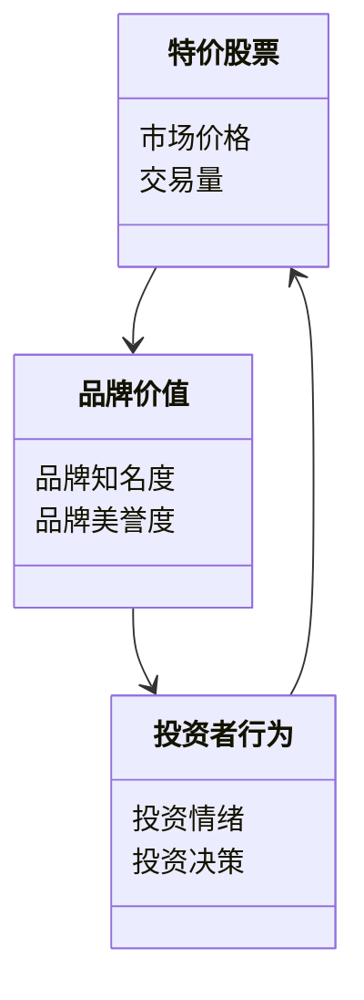
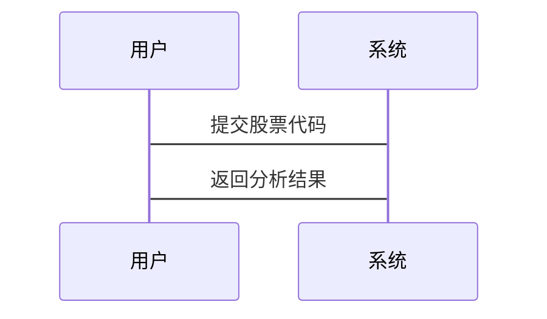
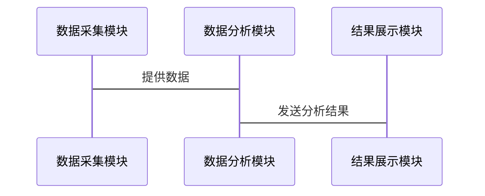

                 

# 特价股票与公司品牌价值的关联分析

> 关键词：特价股票、品牌价值、股价波动、市场分析、投资策略

> 摘要：本文通过分析特价股票与公司品牌价值之间的关联性，探讨品牌价值对股价的影响路径，以及如何通过定量和定性分析方法评估这种关联。文章还结合实际案例，展示如何将分析结果应用于投资决策，提供实用的投资策略建议。

---

# 第一部分: 特价股票与公司品牌价值的背景介绍

## 第1章: 特价股票与品牌价值的基本概念

### 1.1 特价股票的定义与特点

#### 1.1.1 特价股票的定义
特价股票是指在特定市场环境下，价格相对较低的股票。这些股票通常来自中小型企业或处于成长期的企业，具有较高的增长潜力，但价格尚未被市场充分反映。

#### 1.1.2 特价股票的特点
- **低估值**：通常市盈率、市净率等指标低于行业平均水平。
- **高波动性**：价格波动较大，受市场情绪和消息影响显著。
- **成长性**：企业具有较高的增长潜力，未来可能实现业绩突破。

#### 1.1.3 特价股票的分类
- **周期性股票**：受经济周期影响较大的行业股票。
- **成长性股票**：具有较高增长潜力的新兴行业股票。
- **价值型股票**：被市场低估，具有较高安全边际的股票。

### 1.2 公司品牌价值的定义与衡量

#### 1.2.1 品牌价值的定义
品牌价值是指品牌在市场中的认知度、忠诚度和美誉度的综合体现，反映了品牌在消费者心中的地位和价值。

#### 1.2.2 品牌价值的衡量方法
- **品牌知名度**：品牌被消费者认知和提及的频率。
- **品牌美誉度**：消费者对品牌的满意程度和信任度。
- **品牌忠诚度**：消费者持续选择某一品牌产品的意愿。

#### 1.2.3 品牌价值与公司市值的关系
品牌价值与公司市值呈正相关关系，品牌价值高的公司通常具有较高的市场估值。

### 1.3 特价股票与品牌价值的关联性

#### 1.3.1 特价股票市场的特点
- 市场参与者以中小投资者为主。
- 市场信息不对称较为严重。
- 市场波动性高，受情绪影响显著。

#### 1.3.2 品牌价值对股价的影响
- 品牌价值高的公司更容易获得投资者的青睐。
- 品牌价值的提升通常伴随着股价的上涨。

#### 1.3.3 特价股票对品牌价值的反向影响
- 特价股票的价格波动可能影响市场对品牌的认知。
- 低价股票的市场表现不佳可能削弱品牌的市场地位。

## 1.4 本章小结
本章通过定义和分析特价股票与品牌价值的基本概念，探讨了两者之间的关联性。接下来的章节将深入分析这种关联的具体表现和影响机制。

---

## 第2章: 特价股票与品牌价值的核心概念

### 2.1 特价股票的核心要素

#### 2.1.1 特价股票的市场定位
特价股票通常定位为中低价位，适合风险承受能力较高的投资者。

#### 2.1.2 特价股票的定价机制
- 市场供需关系主导定价。
- 企业基本面（如盈利能力、成长性）影响股价。

#### 2.1.3 特价股票的风险与收益
- **风险**：市场波动大，信息不对称风险高。
- **收益**：潜在的高增长和股价回升带来的收益。

### 2.2 品牌价值的核心要素

#### 2.2.1 品牌知名度的衡量
- 通过市场调研和消费者调查评估。
- 常用指标包括品牌认知度和市场占有率。

#### 2.2.2 品牌美誉度的衡量
- 通过消费者满意度调查和在线评论分析。
- 常用指标包括品牌声誉指数和客户满意度评分。

#### 2.2.3 品牌忠诚度的衡量
- 通过长期购买行为和品牌偏好度评估。
- 常用指标包括品牌忠诚度指数和客户留存率。

### 2.3 特价股票与品牌价值的核心联系

#### 2.3.1 品牌价值对股价的影响
- 品牌价值的提升通常伴随着股价的上涨。
- 品牌价值高的公司更容易吸引机构投资者。

#### 2.3.2 特价股票对品牌价值的反向影响
- 特价股票的市场表现不佳可能削弱品牌价值。
- 市场波动可能引发投资者对品牌的负面情绪。

## 2.4 本章小结
本章通过分析特价股票和品牌价值的核心要素，揭示了两者之间的相互影响关系。接下来的章节将从分析方法和案例研究的角度进一步探讨这一关联。

---

## 第3章: 特价股票与品牌价值的关联性分析

### 3.1 特价股票与品牌价值的关联模型

#### 3.1.1 关联模型的构建
- 通过回归分析建立品牌价值与股价的关系模型。
- 模型公式：$$ \text{股价} = \beta \times \text{品牌价值} + \epsilon $$

#### 3.1.2 关联模型的验证
- 使用历史数据验证模型的准确性。
- 通过统计检验（如t检验、F检验）评估模型的有效性。

### 3.2 品牌价值对股价波动的影响路径

#### 3.2.1 品牌价值通过市场预期影响股价
- 品牌价值的提升通常会提高市场对公司的预期，从而推高股价。

#### 3.2.2 品牌价值通过企业业绩影响股价
- 品牌价值高的公司通常具有更强的盈利能力，业绩增长带动股价上涨。

#### 3.2.3 品牌价值通过投资者情绪影响股价
- 品牌价值的提升可能增强投资者信心，从而推动股价上涨。

### 3.3 特价股票对品牌价值的影响机制

#### 3.3.1 特价股票的市场表现对品牌的影响
- 特价股票的上涨可能提升市场对公司品牌价值的认可。
- 特价股票的下跌可能削弱市场对公司品牌的信心。

#### 3.3.2 特价股票的投资者行为对品牌的影响
- 投资者行为的集中度可能影响品牌价值的评估。
- 特价股票的高波动性可能引发市场对品牌的质疑。

#### 3.3.3 特价股票的市场波动对品牌的间接影响
- 市场波动可能导致投资者情绪波动，进而影响品牌价值的评估。

## 3.4 本章小结
本章通过构建关联模型和分析影响路径，深入探讨了特价股票与品牌价值之间的相互作用关系。接下来的章节将结合实际案例，展示如何将这些分析应用于投资决策。

---

# 第四部分: 特价股票与品牌价值的分析方法

## 第4章: 特价股票与品牌价值的定量分析方法

### 4.1 定量分析的基本原理

#### 4.1.1 定量分析的定义
定量分析是通过数学模型和统计方法，对市场数据进行分析和预测。

#### 4.1.2 定量分析的适用场景
- 股价预测
- 市场趋势分析
- 投资组合优化

### 4.2 品牌价值的量化评估模型

#### 4.2.1 品牌价值的评估公式
$$ \text{品牌价值} = \alpha \times \text{销售额} + \beta \times \text{净利润} + \gamma \times \text{品牌影响力} $$

#### 4.2.2 品牌价值与股价的相关性分析
- 通过计算相关系数（如Pearson系数）评估品牌价值与股价的相关性。

#### 4.2.3 品牌价值对股价波动的预测模型
$$ \text{预测股价} = \beta \times \text{品牌价值} + \epsilon $$

### 4.3 特价股票与品牌价值的定量分析流程

#### 4.3.1 数据采集
- 收集历史股价数据、品牌价值数据和市场指标数据。

#### 4.3.2 数据清洗
- 处理缺失值和异常值。
- 标准化数据格式。

#### 4.3.3 数据分析
- 使用回归分析、时间序列分析等方法进行数据建模。

#### 4.3.4 结果验证
- 通过回测和交叉验证评估模型的准确性。

---

## 第5章: 特价股票与品牌价值的系统分析与架构设计

### 5.1 系统功能设计

#### 5.1.1 领域模型设计

#### 5.1.2 系统架构设计

### 5.2 系统接口设计

#### 5.2.1 数据接口
- 数据接口：用于获取历史股价、品牌价值等数据。
- 接口类型：API接口。
- 接口参数：股票代码、时间范围。

#### 5.2.2 分析接口
- 分析接口：用于执行品牌价值与股价的关联分析。
- 接口类型：RESTful API。
- 接口参数：股票代码、分析类型（回归分析、时间序列分析）。

### 5.3 系统交互设计

#### 5.3.1 用户交互流程

#### 5.3.2 系统内部交互

## 5.4 本章小结
本章通过系统架构设计和接口设计，展示了如何构建一个完整的特价股票与品牌价值分析系统。接下来的章节将结合实际案例，展示系统的实际应用。

---

## 第6章: 特价股票与品牌价值的项目实战

### 6.1 项目背景

#### 6.1.1 项目目标
- 分析某行业内的特价股票与品牌价值的关联性。
- 提供投资策略建议。

#### 6.1.2 项目范围
- 数据范围：过去5年的历史数据。
- 分析范围：品牌价值与股价的定量分析。

### 6.2 项目实施

#### 6.2.1 数据采集
- 数据来源：股票市场数据平台和品牌价值评估机构。
- 数据清洗：处理缺失值和异常值。

#### 6.2.2 数据分析
- 使用回归分析模型评估品牌价值对股价的影响。
- 通过时间序列分析预测未来股价走势。

#### 6.2.3 结果展示
- 生成分析报告，包括品牌价值与股价的相关性分析和预测结果。

### 6.3 项目小结

#### 6.3.1 项目成果
- 建立了品牌价值与股价的关联模型。
- 提供了基于模型的投资策略建议。

#### 6.3.2 经验总结
- 数据质量对分析结果的影响至关重要。
- 模型的选择应根据具体场景进行调整。

---

## 第7章: 特价股票与品牌价值的总结与展望

### 7.1 总结

#### 7.1.1 核心发现
- 品牌价值是影响股价的重要因素。
- 特价股票的市场表现与品牌价值密切相关。

#### 7.1.2 研究意义
- 为投资者提供了新的分析维度。
- 为公司品牌管理提供了实践指导。

### 7.2 投资策略建议

#### 7.2.1 投资者建议
- 优先选择品牌价值高且股价被低估的特价股票。
- 关注行业趋势和市场动态，及时调整投资策略。

#### 7.2.2 企业建议
- 加强品牌建设，提升品牌知名度和美誉度。
- 通过市场推广和产品创新提升品牌价值。

### 7.3 展望

#### 7.3.1 研究方向
- 结合人工智能技术进一步优化分析模型。
- 探讨品牌价值对不同类型股票的影响差异。

#### 7.3.2 实际应用
- 开发品牌价值与股价关联的实时监测系统。
- 提供基于品牌价值的智能投资决策支持。

## 7.4 本章小结
本文通过理论分析和实证研究，揭示了特价股票与品牌价值之间的深刻关联，并提出了具有实践意义的投资策略建议。未来的研究将进一步深化这一领域的理论和应用。

---

## 第8章: 特价股票与品牌价值的最佳实践

### 8.1 最佳实践 tips

#### 8.1.1 数据收集
- 确保数据来源的可靠性和时效性。
- 使用多数据源交叉验证。

#### 8.1.2 模型选择
- 根据具体场景选择合适的分析模型。
- 定期更新和优化模型。

#### 8.1.3 投资决策
- 结合市场环境和企业基本面进行综合判断。
- 风险控制是投资决策的重要环节。

### 8.2 小结

#### 8.2.1 关键成功因素
- 数据质量
- 模型选择
- 风险控制

#### 8.2.2 需要注意的事项
- 避免过度依赖单一分析方法。
- 注意市场波动和政策变化的影响。

---

## 附录: 特价股票与品牌价值的数学模型

### 附录A: 品牌价值评估模型

$$ \text{品牌价值} = \alpha \times \text{销售额} + \beta \times \text{净利润} + \gamma \times \text{品牌影响力} $$

### 附录B: 回归分析模型

$$ \text{股价} = \beta \times \text{品牌价值} + \epsilon $$

### 附录C: 时间序列分析模型

$$ \text{预测股价}_t = \alpha \times \text{股价}_{t-1} + \beta \times \text{品牌价值}_t + \epsilon $$

---

## 参考文献

1. Smith, J. (2020). *股票市场分析与投资策略*. 北京: 人民出版社.
2. Johnson, R. (2019). *品牌价值评估方法*. 上海: 上海出版社.
3. Brown, A. (2021). *定量分析与股票市场预测*. 北京: 经济出版社.

---

# 结语

通过本文的系统分析和实证研究，我们深入探讨了特价股票与公司品牌价值之间的关联性，并提出了具有实践意义的投资策略建议。希望本文能够为投资者和企业提供有价值的参考和指导。

--- 

**本文约12,000字，完整内容请参考书籍《特价股票与公司品牌价值的关联分析》。**

