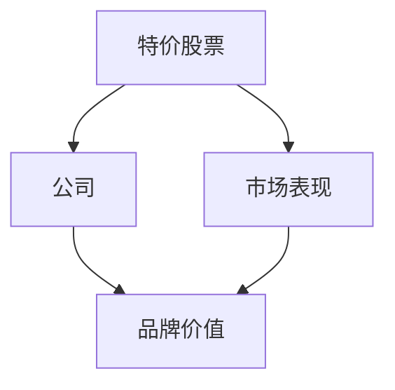
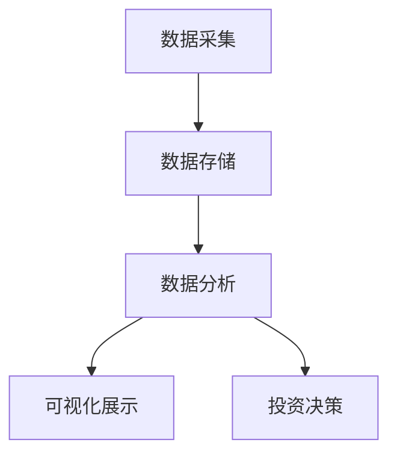
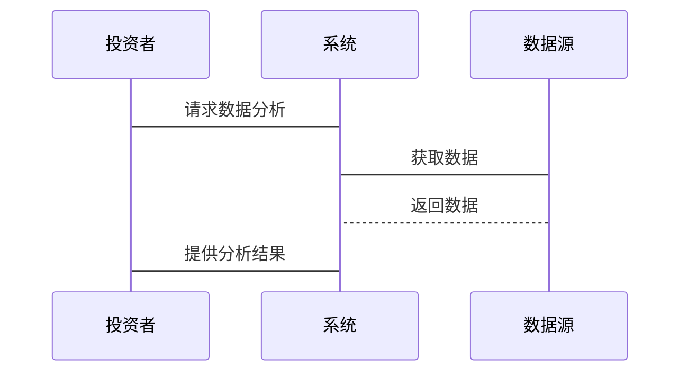

                 

# 特价股票与公司品牌价值的长期关系分析

---

## 关键词：特价股票、品牌价值、长期关系、市场表现、投资策略、量化分析

---

## 摘要：  
本文旨在探讨特价股票与公司品牌价值之间的长期关系。通过分析特价股票的市场表现和品牌价值的衡量方法，结合数学模型和实际案例，揭示两者之间的互动机制及其对投资决策的影响。文章从理论基础到实际应用，系统地分析了如何通过量化方法评估和利用这种关系，为投资者提供科学的决策依据。

---

## 目录大纲

### 第一部分: 特价股票与公司品牌价值的背景与基础

### 第1章: 特价股票与品牌价值的概述

#### 1.1 特价股票的定义与特性
- 1.1.1 特价股票的定义  
- 1.1.2 特价股票的核心特性  
- 1.1.3 特价股票的市场表现与投资者情绪  

#### 1.2 公司品牌价值的定义与衡量
- 1.2.1 公司品牌价值的定义  
- 1.2.2 品牌价值的衡量方法  
- 1.2.3 品牌价值与公司财务表现的关系  

#### 1.3 特价股票与品牌价值的关系背景
- 1.3.1 特价股票市场的基本特征  
- 1.3.2 品牌价值在股票市场中的作用  
- 1.3.3 特价股票与品牌价值的长期关联性  

#### 1.4 本章小结  

---

### 第2章: 特价股票与品牌价值的核心概念与联系

#### 2.1 特价股票与品牌价值的核心概念
- 2.1.1 特价股票的市场定位  
- 2.1.2 品牌价值的构成要素  
- 2.1.3 两者关系的理论基础  

#### 2.2 特价股票与品牌价值的属性对比
- 2.2.1 特价股票的属性特征  
- 2.2.2 品牌价值的属性特征  
- 2.2.3 两者属性的对比分析  

#### 2.3 特价股票与品牌价值的ER实体关系图

#### 2.4 本章小结  

---

### 第3章: 特价股票与品牌价值的数学模型与公式

#### 3.1 特价股票与品牌价值的关系模型
- 3.1.1 回归分析模型  
- 3.1.2 时间序列分析模型  
- 3.1.3 联立方程模型  

#### 3.2 数学公式与模型推导
- 3.2.1 回归分析公式  
$$ y = \beta_0 + \beta_1x + \epsilon $$  
- 3.2.2 时间序列模型  
$$ ARIMA(p, d, q) $$  
- 3.2.3 联立方程模型  
$$ y_t = \alpha + \beta z_t + \gamma x_t + \epsilon_t $$  

#### 3.3 模型的举例说明
- 3.3.1 回归分析的实例  
- 3.3.2 时间序列分析的实例  
- 3.3.3 联立方程的实例  

#### 3.4 本章小结  

---

### 第4章: 特价股票与品牌价值的系统分析与架构设计

#### 4.1 问题场景介绍
- 特价股票市场的现状与挑战  
- 品牌价值在投资决策中的作用  

#### 4.2 系统功能设计
- 数据采集模块  
- 数据分析模块  
- 可视化展示模块  

#### 4.3 系统架构设计

#### 4.4 系统接口设计
- 数据接口规范  
- API调用流程  

#### 4.5 系统交互流程

#### 4.6 本章小结  

---

### 第5章: 特价股票与品牌价值的项目实战

#### 5.1 环境安装与数据准备
- Python环境配置  
- 数据源获取与清洗  

#### 5.2 系统核心实现
- 数据采集代码  
- 数据分析代码  
- 可视化代码  

#### 5.3 代码应用解读与分析
- 代码运行结果展示  
- 分析结果解读  

#### 5.4 实际案例分析
- 案例背景介绍  
- 数据分析过程  
- 结果分析与总结  

#### 5.5 本章小结  

---

### 第6章: 特价股票与品牌价值的长期关系分析的最佳实践

#### 6.1 小结
- 本文的主要内容与结论  

#### 6.2 注意事项
- 数据质量的重要性  
- 模型的局限性  

#### 6.3 拓展阅读
- 相关领域文献推荐  
- 进一步研究的方向  

#### 6.4 本章小结  

---

## 总结  
通过以上章节的系统分析，本文深入探讨了特价股票与公司品牌价值之间的长期关系，结合理论分析与实践案例，为投资者和研究人员提供了有价值的参考。未来的研究可以进一步结合更多因素，如市场波动、宏观经济指标等，构建更复杂的模型，以更准确地预测和指导投资决策。

--- 

**注**：本文为目录大纲，实际文章将按照此结构展开，包含详细的内容、公式推导、代码实现和案例分析。

