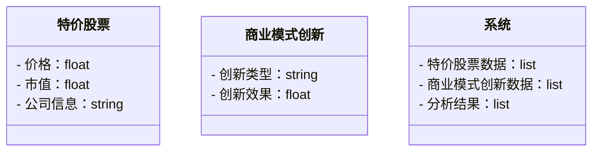
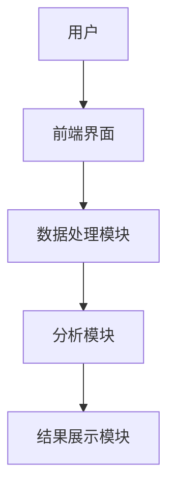

                 


# 特价股票与公司商业模式创新的关联性研究

> 关键词：特价股票，商业模式创新，数学模型，系统架构设计，案例分析

> 摘要：本文探讨特价股票与公司商业模式创新之间的关联性。通过分析特价股票市场的特性、投资者行为以及商业模式创新的类型，结合数学模型和系统架构设计，揭示两者之间的内在联系，并通过实际案例分析验证理论的可行性。

---

# 第1章: 特价股票与商业模式创新的概述

## 1.1 特价股票的定义与特性

### 1.1.1 特价股票的定义
特价股票是指价格低于某一特定水平的股票，通常指价格低于5元的股票。这种股票通常来自市值较小的公司，具有高波动性和高风险的特征。

### 1.1.2 特价股票的市场特征
- 价格波动剧烈：特价股票的价格受市场情绪和资金流动影响较大。
- 市值较小：大多数特价股票来自中小型企业。
- 投资风险高：由于市场流动性较低，投资者可能面临较高的交易风险。

### 1.1.3 特价股票的投资价值
尽管风险较高，特价股票也可能带来较高的回报。一些公司通过商业模式创新，能够在短期内提升股价，为投资者带来超额收益。

## 1.2 公司商业模式的定义与类型

### 1.2.1 商业模式的定义
商业模式是公司如何创造价值、传递价值和获取价值的系统描述，包括收入来源、核心资源和关键流程等要素。

### 1.2.2 主流商业模式类型
- 产品模式：通过销售产品获取收入。
- 服务模式：通过提供服务获取收入。
- 平台模式：通过搭建平台连接供需双方，抽取佣金或服务费。
- 订阅模式：通过定期订阅获取持续收入。

### 1.2.3 商业模式创新的内涵
商业模式创新是指公司通过改变其业务模式、客户关系或价值主张，以实现竞争优势和增长。

## 1.3 特价股票与商业模式创新的关联性

### 1.3.1 特价股票与商业模式创新的关系
- 特价股票公司通过商业模式创新，可以在短期内提升市场关注度，带动股价上涨。
- 商业模式创新的成功与否直接影响公司的业绩和股价表现。

### 1.3.2 特价股票市场中的商业模式创新案例
例如，某公司通过引入新的订阅服务模式，迅速提升收入，带动股价上涨，成为特价股票市场的成功案例。

### 1.3.3 本书研究的核心问题
本书旨在研究特价股票与商业模式创新之间的关系，探讨如何通过商业模式创新影响股价波动，并为投资者提供参考。

## 1.4 本章小结
本章介绍了特价股票和商业模式创新的基本概念，并分析了两者之间的关联性，为后续章节的深入研究奠定了基础。

---

# 第2章: 特价股票市场的特性分析

## 2.1 特价股票市场的基本特征

### 2.1.1 特价股票市场的参与主体
- 投资者：包括个人投资者和机构投资者。
- 上市公司：提供特价股票的中小型企业。
- 中介机构：券商、交易所等。

### 2.1.2 特价股票市场的价格波动规律
- 波动性高：受市场情绪和资金流动影响较大。
- 周期性：通常在市场低迷时，特价股票价格可能进一步下跌。

### 2.1.3 特价股票市场的风险与机会
- 风险：市场流动性低，信息不对称，投资风险高。
- 机会：潜在的高回报，尤其是商业模式创新成功的公司。

## 2.2 特价股票投资者行为分析

### 2.2.1 特价股票投资者的类型
- 价值投资者：寻找被低估的股票。
- 投机者：通过短期交易获利。
- 跟风者：跟随市场热点投资。

### 2.2.2 特价股票投资者的行为模式
- 追涨杀跌：投资者容易受到市场情绪影响，盲目跟风或恐慌抛售。
- 信息获取：投资者依赖市场信息，但可能存在信息不对称问题。

### 2.2.3 特价股票投资者决策的影响因素
- 公司基本面：收入、利润、增长率等。
- 市场情绪：市场热点、新闻事件等。
- 技术分析：K线图、均线等技术指标。

## 2.3 特价股票市场的信息不对称问题

### 2.3.1 信息不对称的定义与表现
信息不对称是指市场参与者之间掌握的信息不一致，导致市场效率降低。

### 2.3.2 特价股票市场中的信息不对称问题
- 公司信息披露不足：中小型企业可能缺乏透明度。
- 投资者信息获取困难：市场信息分散，投资者难以获取全面信息。

### 2.3.3 信息不对称对商业模式创新的影响
- 信息不对称可能影响投资者对商业模式创新的认可度，进而影响股价表现。

## 2.4 本章小结
本章分析了特价股票市场的基本特征、投资者行为以及信息不对称问题，为后续章节提供了分析框架。

---

# 第3章: 特价股票与商业模式创新关系的数学模型

## 3.1 模型构建的基本思路

### 3.1.1 数据来源与假设
- 数据来源：选取一定时间段内的特价股票数据和公司商业模式创新数据。
- 假设：公司商业模式创新会影响股价波动。

### 3.1.2 模型构建的目标
建立数学模型，量化分析商业模式创新对股价的影响。

## 3.2 回归分析模型

### 3.2.1 模型原理
回归分析是一种统计方法，用于分析变量之间的关系。通过建立回归模型，可以量化商业模式创新对股价的影响。

### 3.2.2 模型公式
$$ y = \beta_0 + \beta_1 x + \epsilon $$
其中，y表示股价波动，x表示商业模式创新指标，β表示回归系数。

### 3.2.3 模型实现
```python
import statsmodels.api as sm
# 假设x是商业模式创新指标，y是股价波动
model = sm.OLS(y, sm.add_constant(x))
results = model.fit()
print(results.summary())
```

## 3.3 时间序列分析模型

### 3.3.1 模型原理
时间序列分析用于分析股价的时序数据，捕捉商业模式创新后的股价变化趋势。

### 3.3.2 模型公式
$$ y_t = \alpha + \delta t + \epsilon_t $$
其中，y_t表示t时刻股价，α为截距，δ为趋势系数。

### 3.3.3 模型实现
```python
from statsmodels.tsa.arima_model import ARIMA
# 假设y是股价时间序列
model = ARIMA(y, order=(1, 1, 1))
results = model.fit()
print(results.summary())
```

## 3.4 本章小结
本章通过回归分析和时间序列分析，构建了数学模型，量化分析了商业模式创新对股价波动的影响。

---

# 第4章: 特价股票与商业模式创新的系统架构设计

## 4.1 问题场景介绍

### 4.1.1 问题背景
投资者需要通过系统分析，识别具有商业模式创新潜力的特价股票。

### 4.1.2 项目目标
构建一个分析系统，帮助投资者识别商业模式创新带来的股价波动。

## 4.2 系统功能设计

### 4.2.1 领域模型


### 4.2.2 系统架构设计


### 4.2.3 系统接口设计
- 输入接口：接受特价股票和商业模式创新数据。
- 输出接口：展示分析结果，包括潜在投资机会和风险提示。

## 4.3 本章小结
本章设计了一个系统架构，帮助投资者通过系统分析，识别商业模式创新带来的股价波动。

---

# 第5章: 特价股票与商业模式创新的项目实战

## 5.1 案例分析

### 5.1.1 案例背景
某公司通过引入新的订阅服务模式，迅速提升收入，带动股价上涨。

### 5.1.2 数据分析
通过回归分析和时间序列分析，验证商业模式创新对股价的正向影响。

## 5.2 实际案例分析与解读

### 5.2.1 案例选择
选择具有代表性的特价股票公司，分析其商业模式创新对股价的影响。

### 5.2.2 数据分析
使用Python代码对案例公司数据进行分析，验证模型的准确性。

## 5.3 本章小结
本章通过实际案例分析，验证了数学模型的有效性，为投资者提供了参考。

---

# 第6章: 总结与展望

## 6.1 研究总结

### 6.1.1 研究发现
- 特价股票与商业模式创新密切相关。
- 商业模式创新成功可以提升股价。

### 6.1.2 研究意义
为投资者提供了新的视角，帮助其识别投资机会。

## 6.2 研究的局限性

### 6.2.1 数据限制
数据获取难度较大，影响分析结果的准确性。

### 6.2.2 模型假设
模型假设可能过于简化，影响结果的全面性。

## 6.3 未来研究方向

### 6.3.1 模型优化
引入更多变量，提高模型的准确性。

### 6.3.2 案例扩展
分析更多案例，验证模型的普适性。

## 6.4 本章小结
本章总结了研究发现，分析了研究的局限性，并提出了未来的研究方向。

---

# 附录

## 附录A: 数据来源与工具安装

### 附录A.1 数据来源
建议使用公开的金融数据平台获取特价股票数据。

### 附录A.2 工具安装
安装Python和相关库，如Pandas、NumPy、statsmodels等。

## 附录B: 参考文献
列出本书中引用的主要文献和资料。

---

# 结语

通过系统的分析和研究，本文揭示了特价股票与公司商业模式创新之间的关联性，为投资者提供了新的视角和工具。未来的研究可以进一步优化模型，扩展案例分析，为投资者提供更精准的决策支持。

--- 

希望这篇文章能够满足您的需求！如果需要进一步调整或补充，请随时告知。

