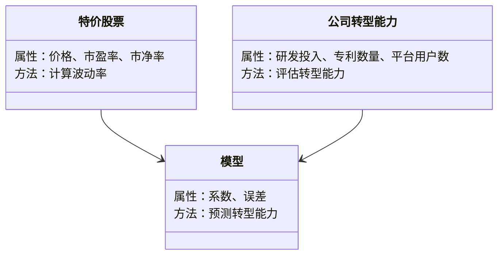

                 


# 特价股票与公司平台化转型能力的关联性研究

> 关键词：特价股票，公司转型，平台化能力，数据挖掘，机器学习

> 摘要：本文系统地研究了特价股票与公司平台化转型能力之间的关联性，从背景介绍、核心概念、算法原理、系统分析、项目实战到最佳实践等方面进行了深入探讨。通过构建数学模型和机器学习算法，分析了特价股票市场对公司平台化转型的影响，以及公司平台化转型能力对特价股票市场的反向作用。文章最后总结了研究成果，并提出了未来的研究方向。

---

## 第1章: 特价股票与公司平台化转型的背景介绍

### 1.1 特价股票的定义与特征
#### 1.1.1 特价股票的定义
特价股票是指在特定市场条件下，价格远低于市场平均水平的股票。这些股票通常被市场低估，具有较高的投资潜力。其特征包括低估值、高波动性和较高的市场风险。

#### 1.1.2 特价股票的市场特征
- **低估值**：市盈率、市净率等指标远低于行业平均水平。
- **高波动性**：价格波动剧烈，容易受市场情绪影响。
- **高风险**：投资风险较高，但潜在回报也较高。

#### 1.1.3 特价股票的影响因素
- **市场环境**：宏观经济环境、政策变化等。
- **公司基本面**：盈利能力、财务状况等。
- **投资者情绪**：市场情绪波动对特价股票价格影响显著。

### 1.2 公司平台化转型的定义与特点
#### 1.2.1 公司平台化转型的定义
公司平台化转型是指企业从传统业务模式向以平台为核心的发展模式转变。这种转型通常涉及构建在线平台、优化业务流程、引入新技术等。

#### 1.2.2 公司平台化转型的核心要素
- **平台构建**：搭建在线平台，提供产品或服务。
- **技术驱动**：利用大数据、人工智能等技术优化运营。
- **生态合作**：与合作伙伴共同构建生态体系。

#### 1.2.3 平台化转型与传统业务模式的区别
- **模式差异**：传统模式注重垂直一体化，平台化模式注重生态合作。
- **技术依赖**：平台化转型高度依赖数字技术。
- **灵活性**：平台化模式更具灵活性和扩展性。

### 1.3 特价股票与公司平台化转型的关联性背景
#### 1.3.1 特价股票市场的现状与趋势
- 近年来，全球资本市场波动加剧，特价股票数量增加。
- 投资者对低价股票的关注度提高。

#### 1.3.2 公司平台化转型的现状与趋势
- 数字化转型成为企业发展的必经之路。
- 平台化转型逐渐成为企业提升竞争力的重要手段。

#### 1.3.3 两者关联性的研究意义
- 探讨特价股票市场对公司平台化转型的影响。
- 分析公司平台化转型能力对特价股票市场的反向作用。

---

## 第2章: 特价股票与公司平台化转型的核心概念与联系

### 2.1 特价股票的核心概念
#### 2.1.1 特价股票的市场定位
- 特价股票通常位于市场低估值区域，容易被忽视。
- 投资者可能因市场波动而误判其价值。

#### 2.1.2 特价股票的定价机制
- 市场供需决定价格，容易受情绪影响。
- 机构投资者和散户的行为差异影响价格。

#### 2.1.3 特价股票的风险特征
- 高波动性带来的投资风险。
- 信息不对称导致的估值偏差。

### 2.2 公司平台化转型的核心概念
#### 2.2.1 公司平台化转型的战略目标
- 提升企业灵活性和创新能力。
- 构建可持续的商业模式。

#### 2.2.2 公司平台化转型的实施路径
- 技术驱动：引入大数据、人工智能等技术。
- 组织变革：优化组织结构，提升协作效率。
- 生态合作：与合作伙伴共同构建生态体系。

#### 2.2.3 平台化转型与传统业务模式的区别
- **业务模式**：从垂直一体化到平台化。
- **技术依赖**：高度依赖数字化技术。
- **灵活性**：平台化模式更具灵活性和扩展性。

### 2.3 特价股票与公司平台化转型的关联性分析
#### 2.3.1 特价股票对公司平台化转型的影响
- **市场波动**：特价股票的高波动性可能影响公司的市值。
- **投资者情绪**：投资者对特价股票的关注可能影响公司形象。
- **融资能力**：公司平台化转型需要大量资金，特价股票市场的波动可能影响融资能力。

#### 2.3.2 公司平台化转型对特价股票市场的反向影响
- **技术创新**：公司平台化转型可能带来技术创新，影响市场估值。
- **市场扩展**：平台化转型可能扩大市场，吸引更多投资者。
- **品牌效应**：公司平台化转型可能提升品牌价值，影响股价。

#### 2.3.3 两者关联性的动态变化
- 市场环境变化会影响特价股票和公司平台化转型的关联性。
- 技术进步和政策变化可能改变两者的关系。

---

## 第3章: 特价股票与公司平台化转型的关联性模型构建

### 3.1 数据挖掘与特征提取
#### 3.1.1 数据来源与预处理
- 数据来源：历史股价数据、公司财务数据、市场新闻等。
- 数据预处理：清洗、归一化、特征选择。

#### 3.1.2 特价股票与公司转型能力的特征提取
- 提取股价波动率、市盈率、市净率等指标。
- 提取公司平台化转型能力相关的指标，如研发投入、专利数量等。

#### 3.1.3 数据挖掘算法的选择与应用
- 使用回归分析、聚类分析、决策树等算法进行特征分析。

### 3.2 关联性模型的建立
#### 3.2.1 模型构建的逻辑框架
- 确定自变量和因变量。
- 设定模型假设和目标函数。

#### 3.2.2 关联性模型的数学表达
$$
y = \beta_0 + \beta_1x_1 + \beta_2x_2 + \epsilon
$$
其中，$y$为公司平台化转型能力，$x_1$和$x_2$为特价股票相关特征。

#### 3.2.3 模型的验证与优化
- 使用交叉验证评估模型性能。
- 调整模型参数，优化预测精度。

### 3.3 模型的可视化与分析
#### 3.3.1 数据可视化
使用Python的Matplotlib库绘制股价波动与公司转型能力的散点图和回归线。

#### 3.3.2 模型解释
通过系数分析，确定特价股票特征对公司平台化转型能力的影响程度。

---

## 第4章: 特价股票与公司平台化转型的系统分析与架构设计

### 4.1 系统分析
#### 4.1.1 问题场景介绍
- 特价股票市场对公司平台化转型的影响。
- 公司平台化转型能力对市场的影响。

#### 4.1.2 项目介绍
构建一个基于机器学习的模型，分析特价股票与公司平台化转型能力的关联性。

### 4.2 系统功能设计
#### 4.2.1 领域模型（Mermaid类图）


#### 4.2.2 系统架构设计（Mermaid架构图）


### 4.3 系统接口设计
#### 4.3.1 接口描述
- 前端与后端接口：RESTful API。
- 数据库接口：查询和存储数据。
- 模型接口：接收输入数据，返回预测结果。

### 4.4 系统交互（Mermaid序列图）
```mermaid
sequenceDiagram
    用户 -> 前端：提交查询请求
    前端 -> 后端：发送API请求
    后端 -> 数据库：查询数据
    数据库 -> 后端：返回数据
    后端 -> 模型：调用预测方法
    模型 -> 后端：返回预测结果
    后端 -> 前端：返回结果
    前端 -> 用户：显示结果
```

---

## 第5章: 特价股票与公司平台化转型的项目实战

### 5.1 环境安装
- Python：安装Anaconda或Pyenv。
- 数据处理库：Pandas、NumPy。
- 可视化库：Matplotlib、Seaborn。
- 机器学习库：Scikit-learn、XGBoost。

### 5.2 核心代码实现
#### 5.2.1 数据加载与预处理
```python
import pandas as pd
import numpy as np

# 加载数据
df = pd.read_csv('stock_data.csv')

# 数据清洗
df.dropna(inplace=True)
df['price'] = df['price'].astype(float)
```

#### 5.2.2 模型训练
```python
from sklearn.linear_model import LinearRegression
from sklearn.metrics import mean_squared_error

# 特征选择
X = df[['price', '市盈率']]
y = df['转型能力']

# 训练模型
model = LinearRegression()
model.fit(X, y)

# 预测
y_pred = model.predict(X)
print(mean_squared_error(y, y_pred))
```

#### 5.2.3 模型解释
- 系数解释：价格和市盈率对转型能力的影响。
- 模型精度：评估预测效果。

### 5.3 案例分析
分析某公司平台化转型能力与特价股票的关系，展示模型预测结果。

---

## 第6章: 总结与展望

### 6.1 研究总结
- 特价股票与公司平台化转型能力密切相关。
- 机器学习模型能够有效预测两者的关系。

### 6.2 应用价值
- 为投资者提供决策支持。
- 为企业平台化转型提供参考。

### 6.3 未来研究方向
- 更复杂模型的引入，如深度学习。
- 多因素分析，考虑更多市场变量。

---

## 附录

### 附录A: 数据来源与处理
详细说明数据来源和处理方法。

### 附录B: 工具与库安装
列出项目所需工具和库的安装方法。

### 附录C: 参考文献
列出文章中引用的文献和资料。

---

通过本文的研究，我们深入探讨了特价股票与公司平台化转型能力的关联性，并构建了数学模型进行分析。未来的研究可以进一步扩展模型，考虑更多因素，以提高预测精度。

