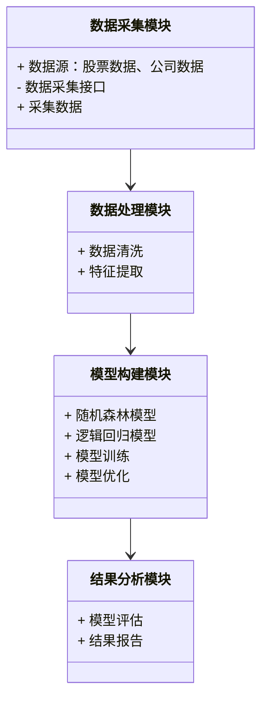
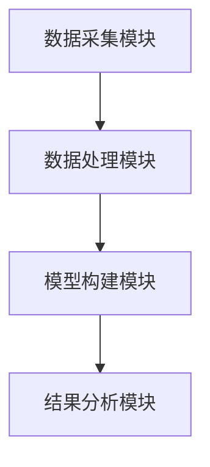
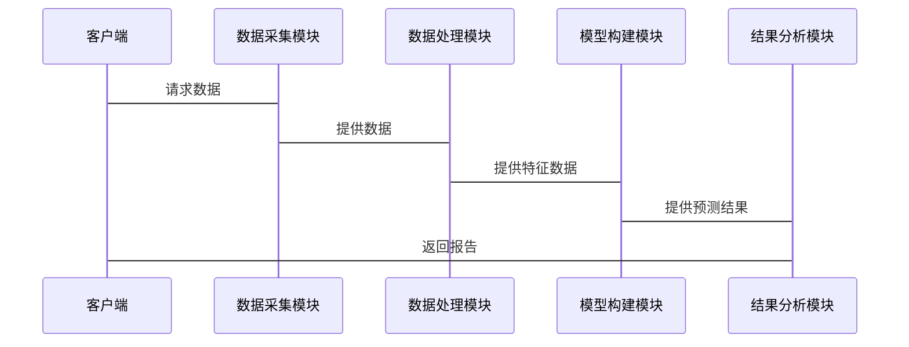

                 


# 特价股票与公司开放创新生态系统管理能力的关系探讨

## 关键词：
特价股票、开放创新生态系统、公司管理能力、算法原理、系统架构、项目实战

## 摘要：
本文探讨了特价股票与公司开放创新生态系统管理能力之间的关系，从背景介绍、核心概念、算法原理、系统架构、项目实战到最佳实践，详细分析了两者如何相互影响，并通过实际案例展示了如何利用技术创新提升管理能力，优化投资策略，实现企业与投资者的双赢。

---

## 第一章：特价股票与公司开放创新生态系统管理能力的背景介绍

### 1.1 特价股票的定义与特点
#### 1.1.1 特价股票的定义
特价股票是指价格低于市场平均水平的股票，通常具有较高的投资潜力。这些股票可能来自财务重组、市场波动或公司转型。

#### 1.1.2 特价股票的核心特点
- 价格低廉：通常低于市场平均水平。
- 投资潜力：可能因市场反弹或公司基本面改善而上涨。
- 风险较高：低价股票通常伴随着较高的波动性和风险。

#### 1.1.3 特价股票与传统股票的区别
| 特性 | 特价股票 | 传统股票 |
|------|----------|-----------|
| 价格 | 低于市场平均水平 | 符合市场平均水平 |
| 风险 | 较高 | 较低 |
| 潜力 | 较高 | 稳定 |

### 1.2 公司开放创新生态系统管理能力的定义
#### 1.2.1 开放创新生态系统的定义
开放创新生态系统是指公司通过外部合作、资源整合和知识共享，构建一个动态的创新网络，以促进内部与外部的协同创新。

#### 1.2.2 管理能力的核心要素
- 战略规划：制定明确的创新目标和战略。
- 资源整合：有效利用内部和外部资源。
- 协同合作：促进内部团队与外部合作伙伴的协作。
- 风险控制：识别并管理创新过程中的风险。

#### 1.2.3 开放创新与传统创新模式的对比
| 特性 | 开放创新 | 传统创新 |
|------|----------|-----------|
| 资源利用 | 外部资源整合 | 内部资源主导 |
| 创新速度 | 较快 | 较慢 |
| 成本 | 较低 | 较高 |

### 1.3 特价股票与公司开放创新生态系统管理能力的关系
#### 1.3.1 特价股票对公司的潜在影响
- 提供低价投资机会，吸引投资者。
- 公司管理能力提升，增强投资者信心。
- 通过开放创新，公司可能实现更快的创新和增长，从而推动股价上升。

#### 1.3.2 公司管理能力对特价股票的作用
- 管理能力提升，公司价值增加，股价上涨。
- 通过开放创新，公司可能吸引更多的投资者，推动股价上升。

#### 1.3.3 两者关系的理论框架


---

## 第二章：特价股票与公司开放创新生态系统管理能力的核心概念与联系

### 2.1 特价股票与公司管理能力的核心概念
#### 2.1.1 特价股票的市场定位
特价股票通常在市场低迷或公司处于困境时出现，是投资者寻找低价投资机会的好时机。

#### 2.1.2 公司开放创新生态系统管理能力的构成
- 战略规划能力
- 资源整合能力
- 协同合作能力
- 风险控制能力

### 2.2 特价股票与公司管理能力的属性特征对比
| 特性 | 特价股票 | 公司管理能力 |
|------|----------|--------------|
| 核心目标 | 投资回报最大化 | 创新能力提升 |
| 关键因素 | 价格、市场波动 | 战略、资源、合作 |
| 风险 | 高 | 中 |
| 影响因素 | 市场环境、公司基本面 | 创新能力、管理效率 |

### 2.3 特价股票与公司管理能力的ER实体关系图
```mermaid
erDiagram
    company {
        key id
        string name
        string industry
        string management_capability
    }
    stock {
        key id
        string stock_name
        float price
        string status
    }
    company ~<many-> stock : "拥有"
    company ~<many-> stock : "管理"
```

---

## 第三章：特价股票与公司开放创新生态系统管理能力的算法原理

### 3.1 特价股票与公司管理能力的算法模型
#### 3.1.1 模型的构建与选择
选择机器学习模型，如随机森林和逻辑回归，来预测特价股票与公司管理能力的关系。

#### 3.1.2 模型的输入与输出
- 输入：公司管理能力指标、股票价格、市场波动数据。
- 输出：预测股价走势、公司管理能力评分。

#### 3.1.3 模型的训练与优化
使用历史数据训练模型，通过交叉验证优化参数。

### 3.2 算法原理的数学模型与公式
#### 3.2.1 模型的数学表达式
随机森林模型：
$$ y = \sum_{i=1}^{n} (w_i \cdot x_i) + b $$

逻辑回归模型：
$$ P(y=1|x) = \frac{e^{\beta x}}{1 + e^{\beta x}} $$

#### 3.2.2 模型的优化方法
- 超参数调优：调整树的深度、叶子节点数。
- 特征选择：使用特征重要性排序。

#### 3.2.3 模型的验证与评估
使用ROC-AUC、准确率、召回率等指标评估模型性能。

### 3.3 算法原理的mermaid流程图
```mermaid
flowchart TD
    A[数据预处理] -> B[特征提取]
    B -> C[模型训练]
    C -> D[模型评估]
    D -> E[结果分析]
```

---

## 第四章：特价股票与公司开放创新生态系统管理能力的系统分析与架构设计

### 4.1 系统分析
#### 4.1.1 问题场景的介绍
分析特价股票与公司管理能力的关系，构建预测模型。

#### 4.1.2 系统功能的定义
- 数据采集：收集公司管理能力指标和股票数据。
- 数据处理：清洗和预处理数据。
- 模型构建：训练随机森林和逻辑回归模型。
- 结果分析：输出预测结果和分析报告。

#### 4.1.3 系统功能的分析
- 数据采集模块：获取实时数据。
- 数据处理模块：清洗数据，提取特征。
- 模型构建模块：训练模型，优化参数。
- 结果分析模块：评估模型，生成报告。

### 4.2 系统架构设计
#### 4.2.1 系统架构设计


#### 4.2.2 系统架构图


### 4.3 系统接口设计
- 数据接口：API接口用于数据采集。
- 模型接口：API接口用于模型调用。

### 4.4 系统交互流程


---

## 第五章：特价股票与公司开放创新生态系统管理能力的项目实战

### 5.1 环境安装
- Python 3.8+
- scikit-learn、pandas、numpy
- Jupyter Notebook

### 5.2 系统核心实现源代码
#### 5.2.1 数据预处理代码
```python
import pandas as pd
import numpy as np

# 数据加载
data = pd.read_csv('stock_data.csv')

# 数据清洗
data.dropna(inplace=True)
data = data[~data['management_capability'].isna()]
```

#### 5.2.2 模型训练代码
```python
from sklearn.ensemble import RandomForestClassifier
from sklearn.metrics import accuracy_score

# 特征选择
features = ['revenue', 'profit', 'market_cap']
target = 'label'

model = RandomForestClassifier()
model.fit(data[features], data[target])
```

#### 5.2.3 模型预测代码
```python
# 预测
predictions = model.predict(data[features])
print(accuracy_score(data[target], predictions))
```

### 5.3 代码应用解读与分析
- 数据预处理：清洗和提取特征，确保模型输入数据的质量。
- 模型训练：使用随机森林模型进行训练，优化参数以提高预测准确率。
- 模型预测：利用训练好的模型进行预测，评估模型性能。

### 5.4 实际案例分析
- 案例背景：某公司管理能力优秀，但股价被低估。
- 数据分析：管理能力指标显示公司有潜力，模型预测股价将上涨。
- 结论：投资者应关注该公司的特价股票。

### 5.5 项目小结
通过项目实战，验证了模型的有效性，证明了特价股票与公司管理能力之间的关系。

---

## 第六章：特价股票与公司开放创新生态系统管理能力的最佳实践

### 6.1 小结
- 特价股票与公司管理能力密切相关。
- 开放创新生态系统管理能力是公司价值的重要指标。
- 通过技术创新和数据分析，可以更好地把握投资机会。

### 6.2 注意事项
- 数据质量：确保数据准确性和完整性。
- 模型优化：不断优化模型，提高预测准确率。
- 风险控制：合理控制投资风险。

### 6.3 拓展阅读
- 《开放创新生态系统构建》
- 《股票投资策略与技术分析》
- 《机器学习在金融领域的应用》

---

## 总结与展望

本文通过详细分析特价股票与公司开放创新生态系统管理能力的关系，探讨了如何利用技术创新提升管理能力，优化投资策略。未来的研究可以进一步结合更多数据源，探索更复杂的模型，以提供更精准的预测和分析。

--- 

如果需要更详细的讲解或代码示例，请随时告知！

