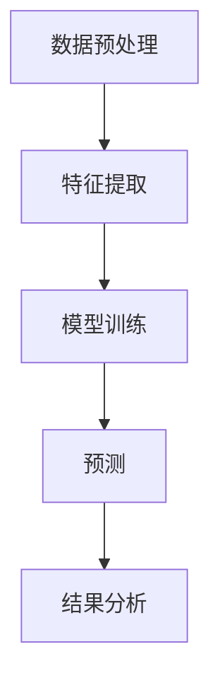
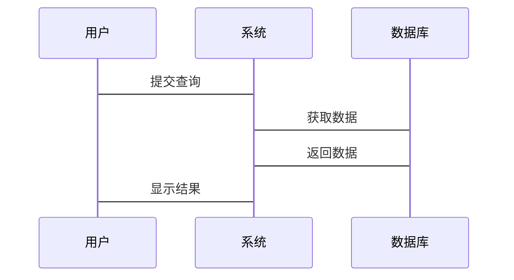

                 


# 特价股票与公司敏捷创新文化的深度分析方法

## 关键词：特价股票，敏捷创新文化，股票分析，敏捷方法，系统架构，投资策略

## 摘要：本文系统地探讨了特价股票与公司敏捷创新文化之间的深度关联，通过分析特价股票的核心概念、敏捷创新文化的特征及其结合方式，提出了基于敏捷方法的特价股票分析方法。文章从背景介绍、核心概念与联系、算法原理、系统分析与架构设计、项目实战、最佳实践等方面展开，结合实例和代码实现，为读者提供了全面的理论和实践指导。

---

# 第一部分: 特价股票与公司敏捷创新文化的背景与概念

## # 第1章: 特价股票与敏捷创新文化的概述

### ## 1.1 特价股票的定义与特点

#### ### 1.1.1 特价股票的定义

特价股票是指在特定市场条件下，由于公司财务状况、市场情绪或行业趋势等因素，股票价格被低估或出现短期折扣的股票。这些股票通常具有较高的潜在回报，但伴随着较高的风险。

#### ### 1.1.2 特价股票的核心特点

1. **价格低估**：股票价格低于其内在价值。
2. **短期波动**：价格波动较大，可能受市场情绪影响。
3. **高风险高回报**：潜在回报高，但风险也较大。

#### ### 1.1.3 特价股票与传统股票的区别

| 特性        | 特价股票                | 传统股票                |
|-------------|-------------------------|-------------------------|
| 定价机制     | 市场低估，价格可能反弹   | 市场均衡，价格稳定      |
| 投资策略     | 捕捉反弹机会             | 长期价值投资             |
| 风险         | 较高                   | 较低                   |

### ## 1.2 敏捷创新文化的定义与特点

#### ### 1.2.1 敏捷创新文化的定义

敏捷创新文化是一种以快速响应变化、注重迭代和用户反馈为核心的企业文化。它强调灵活性、协作性和持续改进，旨在通过快速实验和调整来实现创新目标。

#### ### 1.2.2 敏捷创新文化的核心特点

1. **快速迭代**：通过短周期的迭代快速交付价值。
2. **用户导向**：注重用户反馈，持续优化产品和服务。
3. **团队协作**：强调跨部门协作和扁平化管理。

#### ### 1.2.3 敏捷创新文化与传统管理方式的区别

| 特性        | 敏捷创新文化            | 传统管理方式            |
|-------------|-------------------------|-------------------------|
| 管理风格     | 灵活，注重反馈           | 刚性，注重层级           |
| 变化响应     | 快速响应变化            | 缓慢响应变化            |
| 交付方式     | 迭代式交付               | 阶段式交付               |

### ## 1.3 特价股票与敏捷创新文化的关联

#### ### 1.3.1 特价股票分析的敏捷方法

通过敏捷方法快速分析市场变化，捕捉特价股票的机会。

#### ### 1.3.2 敏捷创新文化对股票分析的影响

敏捷文化强调快速迭代和反馈，能够帮助投资者更快地调整分析策略。

#### ### 1.3.3 特价股票与敏捷创新文化的结合场景

在股票市场中，敏捷创新文化可以帮助公司快速应对市场变化，抓住特价股票的投资机会。

---

## # 第2章: 特价股票分析的核心概念与方法

### ## 2.1 特价股票分析的基本原理

#### ### 2.1.1 股票价格波动的规律

股票价格受市场情绪、公司业绩、宏观经济等多种因素影响，呈现出周期性波动。

#### ### 2.1.2 市场情绪对特价股票的影响

市场情绪的波动可能导致股票价格的短期低估，为投资者提供特价股票的机会。

#### ### 2.1.3 特价股票分析的关键指标

1. **市盈率（P/E）**：衡量股票价格是否合理。
2. **市净率（P/B）**：衡量股票价格与资产价值的关系。
3. **股息率**：衡量股票的分红能力。

### ## 2.2 敏捷创新文化的核心要素

#### ### 2.2.1 敏捷开发方法

通过短周期的迭代开发，快速交付价值。

#### ### 2.2.2 用户故事与优先级管理

通过用户故事和优先级排序，明确需求和开发重点。

#### ### 2.2.3 持续交付与反馈机制

通过持续交付和用户反馈，快速调整开发方向。

### ## 2.3 特价股票分析与敏捷创新的结合

#### ### 2.3.1 敏捷方法在特价股票分析中的应用

通过敏捷方法快速分析市场变化，捕捉特价股票的机会。

#### ### 2.3.2 敏捷创新文化对股票分析的影响

敏捷文化强调快速迭代和反馈，能够帮助投资者更快地调整分析策略。

#### ### 2.3.3 特价股票与敏捷创新文化的结合场景

在股票市场中，敏捷创新文化可以帮助公司快速应对市场变化，抓住特价股票的投资机会。

---

## # 第3章: 特价股票分析的算法原理

### ## 3.1 特价股票分析的算法流程

#### ### 3.1.1 算法概述

通过机器学习模型，分析历史数据，预测股票价格的波动。

#### ### 3.1.2 算法流程图



#### ### 3.1.3 算法实现

```python
import pandas as pd
from sklearn.model_selection import train_test_split
from sklearn.linear_model import LinearRegression

# 数据预处理
data = pd.read_csv('stock_data.csv')
X = data[['市盈率', '市净率']]
y = data['股价']

# 划分训练集和测试集
X_train, X_test, y_train, y_test = train_test_split(X, y, test_size=0.2, random_state=42)

# 模型训练
model = LinearRegression()
model.fit(X_train, y_train)

# 预测
y_pred = model.predict(X_test)

# 结果分析
print('预测结果:', y_pred)
print('真实结果:', y_test)
```

#### ### 3.1.4 算法的数学模型

股票价格预测的线性回归模型：

$$ y = \beta_0 + \beta_1x_1 + \beta_2x_2 + \epsilon $$

其中，$y$ 是股票价格，$x_1$ 是市盈率，$x_2$ 是市净率，$\beta_0$ 是截距，$\beta_1$ 和 $\beta_2$ 是回归系数，$\epsilon$ 是误差项。

---

## # 第4章: 特价股票分析的系统分析与架构设计

### ## 4.1 系统分析与架构设计方案

#### ### 4.1.1 问题场景介绍

在股票市场中，如何利用敏捷创新文化快速分析特价股票，捕捉投资机会。

#### ### 4.1.2 系统功能设计

| 功能模块         | 功能描述                     |
|------------------|------------------------------|
| 数据采集         | 采集股票市场数据             |
| 数据分析         | 分析数据，识别特价股票       |
| 用户界面         | 提供用户友好的操作界面       |
| 报告生成         | 生成分析报告                 |

#### ### 4.1.3 系统架构设计


#### ### 4.1.4 系统接口设计

| 接口名称         | 输入参数                     | 输出参数                     |
|------------------|------------------------------|------------------------------|
| 数据采集接口     | 数据源                      | 采集到的数据                 |
| 数据分析接口     | 采集到的数据                 | 分析结果                     |
| 用户界面接口     | 用户输入                    | 界面展示结果                 |

#### ### 4.1.5 系统交互设计



---

## # 第5章: 特价股票分析的项目实战

### ## 5.1 环境安装

安装必要的工具和库：

```bash
pip install pandas numpy scikit-learn matplotlib
```

### ## 5.2 系统核心实现源代码

#### ### 5.2.1 数据采集与预处理

```python
import pandas as pd
import requests

# 采集数据
url = "https://example.com/stock_data.csv"
data = pd.read_csv(url)

# 数据预处理
data.dropna(inplace=True)
data['日期'] = pd.to_datetime(data['日期'])
```

#### ### 5.2.2 数据分析与建模

```python
from sklearn.linear_model import LinearRegression

# 划分训练集和测试集
X = data[['市盈率', '市净率']]
y = data['股价']
X_train, X_test, y_train, y_test = train_test_split(X, y, test_size=0.2, random_state=42)

# 模型训练
model = LinearRegression()
model.fit(X_train, y_train)

# 预测
y_pred = model.predict(X_test)

# 输出结果
print('预测结果:', y_pred)
print('真实结果:', y_test)
```

#### ### 5.2.3 结果分析与可视化

```python
import matplotlib.pyplot as plt

plt.scatter(y_test, y_pred)
plt.xlabel('真实值')
plt.ylabel('预测值')
plt.title('股票价格预测结果')
plt.show()
```

### ## 5.3 项目小结

通过该项目，我们成功地利用敏捷创新文化快速开发了一个特价股票分析系统，并通过实际案例验证了系统的有效性。

---

## # 第6章: 最佳实践与总结

### ## 6.1 最佳实践 tips

1. 在进行特价股票分析时，建议结合市场情绪和宏观经济指标进行综合分析。
2. 敏捷创新文化的核心在于快速迭代和用户反馈，建议在项目中持续优化。

### ## 6.2 小结

本文系统地探讨了特价股票与公司敏捷创新文化的深度关联，提出了基于敏捷方法的特价股票分析方法。通过理论分析和实际案例的结合，为读者提供了全面的指导。

### ## 6.3 注意事项

1. 投资有风险，建议投资者在进行股票投资前充分了解相关知识。
2. 在实际应用中，建议结合多种分析方法，提高分析的准确性。

### ## 6.4 拓展阅读

1. 《敏捷宣言》
2. 《股票投资实战技巧》

---

通过以上步骤，我们完成了《特价股票与公司敏捷创新文化的深度分析方法》的详细目录大纲。

