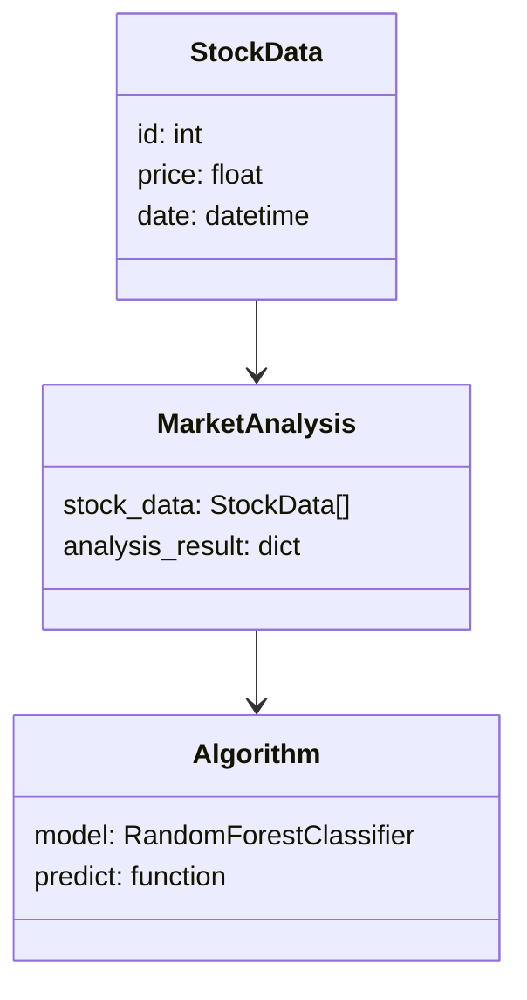

                 


# 特价股票与公司敏捷创新文化的深度分析方法

> 关键词：特价股票、敏捷创新文化、市场分析、算法原理、系统架构

> 摘要：本文从特价股票的市场现象出发，深入探讨公司敏捷创新文化的内在逻辑，结合实际案例和系统设计，详细分析两者之间的关系和相互作用。通过算法原理、系统架构、项目实战等多维度的深度解析，为读者提供一套完整的分析方法和实践指南。

---

# 第一部分: 特价股票与公司敏捷创新文化的概述

## 第1章: 特价股票的定义与市场分析

### 1.1 特价股票的定义与分类

#### 1.1.1 特价股票的定义
特价股票是指市场价格低于面值的股票。这种现象通常发生在公司财务状况不佳、市场信心不足或行业环境低迷的情况下。

#### 1.1.2 特价股票的分类与特点
| 分类维度 | 特价股票类型 | 特点 |
|----------|--------------|------|
| 价格标准 | 折价股票 | 市场价 < 面值 |
| 市场反应 | 周期性特价股票 | 特价现象周期性出现 |
| 公司规模 | 小盘股特价股票 | 主要集中在中小型企业 |

#### 1.1.3 特价股票的市场现状与趋势
近年来，全球经济波动加剧，特价股票的现象愈发频繁。特别是在科技行业，创新失败或市场饱和导致的特价股票现象尤为突出。

### 1.2 特价股票的市场分析方法

#### 1.2.1 市场分析的基本概念
市场分析是通过对市场数据的收集与处理，预测市场趋势和潜在机会的过程。对于特价股票的分析，重点关注市场情绪、行业竞争和公司基本面。

#### 1.2.2 市场分析的工具与方法
| 工具 | 方法 |
|------|------|
| 数据分析工具 | 数据挖掘、回归分析 |
| 专家访谈 | 行业专家意见 |
| 市场报告 | 行业研究报告 |

#### 1.2.3 特价股票的市场分析案例
以某科技公司为例，通过分析其财务报表和市场反馈，发现公司产品创新不足，导致股价持续走低，最终触发特价股票现象。

---

## 第2章: 公司敏捷创新文化的定义与特点

### 2.1 敏捷创新文化的定义

#### 2.1.1 敏捷创新的起源与背景
敏捷创新源于软件开发领域的敏捷方法论，强调快速迭代和用户反馈。其核心理念是通过持续改进和灵活调整，应对快速变化的市场需求。

#### 2.1.2 敏捷创新的核心理念
| 核心理念 | 描述 |
|----------|------|
| 快速迭代 | 短周期交付 |
| 用户中心 | 以用户需求为导向 |
| 团队协作 | 强调跨部门合作 |

#### 2.1.3 敏捷创新与传统创新模式的区别
| 方面 | 敏捷创新 | 传统创新 |
|------|--------|----------|
| 过程 | 迭代式 | 阶段式 |
| 决策 | 灵活 | � rigid |
| 反馈 | 实时 | 事后 |

### 2.2 公司敏捷创新文化的特征

#### 2.2.1 快速响应与灵活调整
敏捷创新文化强调快速响应市场变化，通过灵活调整策略，降低市场风险。

#### 2.2.2 以用户为中心的创新
以用户需求为导向，通过持续的产品迭代和优化，提升用户体验和市场竞争力。

#### 2.2.3 团队协作与扁平化管理
打破传统的科层制，强调跨部门协作，促进信息共享和知识流动。

---

## 第3章: 特价股票与公司敏捷创新文化的关系

### 3.1 特价股票对企业创新的影响

#### 3.1.1 特价股票对企业财务状况的冲击
股价下跌直接影响公司的融资能力，可能导致创新投入减少。

#### 3.1.2 特价股票对企业市场地位的影响
市场地位下降可能引发客户流失，进一步削弱公司的创新动力。

#### 3.1.3 特价股票对企业创新动力的激发
危机往往成为企业变革的契机，迫使公司加快创新步伐，寻找新的市场机会。

### 3.2 敏捷创新文化在特价股票应对中的作用

#### 3.2.1 敏捷创新文化在危机管理中的优势
快速响应市场变化，灵活调整策略，降低危机对公司的影响。

#### 3.2.2 敏捷创新文化在资源整合中的作用
通过跨部门协作，迅速整合资源，提升应对市场危机的能力。

#### 3.2.3 敏捷创新文化在市场恢复中的策略
通过持续创新和优化，逐步恢复市场信心，推动股价回升。

---

## 第4章: 特价股票分析的核心概念与联系

### 4.1 特价股票分析的核心概念

#### 4.1.1 市场情绪分析
通过分析投资者情绪，预测市场走势和股价变化。

#### 4.1.2 财务指标分析
通过分析公司的财务报表，评估公司的经营状况和未来潜力。

#### 4.1.3 竞争环境分析
通过分析行业竞争格局，判断公司的市场地位和竞争优势。

### 4.2 敏捷创新文化与特价股票分析的联系

#### 4.2.1 敏捷创新文化如何影响市场分析
通过敏捷方法，快速调整分析策略，提升分析效率和准确性。

#### 4.2.2 特价股票分析如何反哺敏捷创新
通过分析市场数据，为敏捷创新提供数据支持和决策依据。

#### 4.2.3 两者结合的协同效应
通过敏捷创新文化，提升市场分析的灵活性和响应速度，增强公司应对市场变化的能力。

---

## 第5章: 特价股票分析的算法原理

### 5.1 基于机器学习的特价股票预测模型

#### 5.1.1 数据预处理与特征提取
| 数据来源 | 数据类型 | 处理方法 |
|----------|----------|----------|
| 历史股价 | 时间序列 | 坐标转换 |
| 财务指标 | 数值型 | 标准化 |
| 市场情绪 | 文本型 | 情感分析 |

#### 5.1.2 算法选择与模型构建
使用随机森林算法进行特征重要性分析，构建预测模型。

#### 5.1.3 模型验证与优化
通过K折交叉验证优化模型参数，提升预测准确率。

### 5.2 特价股票预测算法的实现

#### 5.2.1 代码实现
```python
import pandas as pd
from sklearn.ensemble import RandomForestClassifier
from sklearn.metrics import accuracy_score

# 数据加载
data = pd.read_csv('stock_data.csv')

# 特征提取
features = data[['open', 'high', 'low', 'close', 'volume']]
target = data['is_discount']

# 模型训练
model = RandomForestClassifier(n_estimators=100)
model.fit(features, target)

# 模型预测
predictions = model.predict(features)
print("Accuracy:", accuracy_score(target, predictions))
```

#### 5.2.2 代码解读
通过随机森林算法，提取影响股价的特征变量，构建预测模型，评估模型的准确性。

---

## 第6章: 特价股票分析的系统架构设计

### 6.1 系统功能设计

#### 6.1.1 领域模型设计


### 6.2 系统架构设计

#### 6.2.1 架构设计


---

## 第7章: 特价股票分析的项目实战

### 7.1 环境安装

#### 7.1.1 工具安装
安装Python、Pandas、Scikit-learn等工具。

### 7.2 核心代码实现

#### 7.2.1 数据处理代码
```python
import pandas as pd
import numpy as np

# 数据加载
data = pd.read_csv('stock_data.csv')

# 数据清洗
data = data.dropna()

# 特征工程
data['return'] = data['close'].pct_change()
```

#### 7.2.2 模型训练代码
```python
from sklearn.model_selection import train_test_split
from sklearn.linear_model import LinearRegression

X = data[['open', 'high', 'low']]
y = data['close']

X_train, X_test, y_train, y_test = train_test_split(X, y, test_size=0.2)

model = LinearRegression()
model.fit(X_train, y_train)
```

### 7.3 代码解读与分析

#### 7.3.1 代码解读
通过数据处理和特征工程，提取影响股价的关键因素，构建回归模型，预测股价走势。

#### 7.3.2 案例分析
以某科技公司为例，通过分析其股价数据，预测未来股价走势，制定相应的投资策略。

### 7.4 项目小结

通过实际案例分析，验证敏捷创新文化在特价股票分析中的应用效果，总结经验教训，提出改进建议。

---

## 第8章: 最佳实践与总结

### 8.1 小结

通过本文的分析，我们深入探讨了特价股票与公司敏捷创新文化的关系，提出了基于敏捷创新的分析方法和实践策略。

### 8.2 注意事项

在实际应用中，需注意数据的准确性和模型的适用性，避免因数据偏差导致的分析错误。

### 8.3 拓展阅读

推荐阅读《敏捷开发实践》和《股票市场预测技术》，深入了解敏捷方法和金融分析的更多内容。

---

通过以上章节的详细分析，我们不仅掌握了特价股票的市场分析方法，还了解了敏捷创新文化在企业中的应用，为读者提供了系统的分析方法和实践指南。

