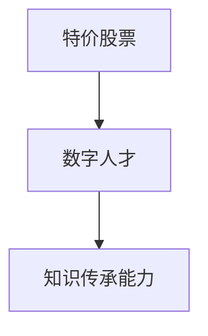

                 

# 特价股票与公司数字人才留存与知识传承能力的关系探讨

## 关键词：特价股票，数字人才，知识传承，人才留存，企业价值，管理优化，投资策略

## 摘要：  
本文探讨了特价股票与公司数字人才留存及知识传承能力之间的关系。通过分析特价股票对数字人才留存的影响机制，以及数字人才留存对知识传承能力的促进作用，本文提出了一种基于算法的解决方案，帮助企业在优化股票激励机制的同时，提升知识传承能力，从而实现企业价值的最大化。本文还通过实际案例分析和系统设计，展示了如何将理论应用于实践，为企业提供切实可行的管理优化和投资策略建议。

---

# 第1章: 特价股票与数字人才留存的背景介绍

## 1.1 特价股票的定义与特点  
### 1.1.1 特价股票的定义  
特价股票是指价格低于市场平均水平的股票，通常具有较高的投资潜力。它通过低价吸引投资者，为企业提供资金支持，同时激励员工。  

### 1.1.2 特价股票的核心特点  
- 价格低廉：相对于市场平均价格，特价股票价格较低。  
- 投资吸引力强：低价股票通常意味着高回报潜力。  
- 员工激励工具：企业通过发放特价股票激励员工，增强员工归属感。  

### 1.1.3 特价股票的市场定位与作用  
特价股票在市场中扮演着重要的角色，尤其是在吸引数字人才方面。它不仅能够降低员工的入职门槛，还能通过股权激励留住优秀人才，增强企业的竞争力。  

---

## 1.2 数字人才的定义与特征  
### 1.2.1 数字人才的定义  
数字人才是指具备数字化技能，能够利用技术手段解决问题的人才。他们通常具备数据分析、人工智能、软件开发等能力。  

### 1.2.2 数字人才的核心特征  
- 技术驱动：数字人才的核心竞争力在于技术能力。  
- 创新能力强：数字人才能够快速适应技术变革，推动企业创新。  
- 知识传承能力强：数字人才不仅具备技术能力，还能够将知识传递给团队成员。  

### 1.2.3 数字人才在企业中的重要性  
数字人才是企业数字化转型的核心力量。他们的存在不仅能够推动企业技术创新，还能通过知识传承，提升团队的整体能力。  

---

## 1.3 特价股票与数字人才留存的关系  
### 1.3.1 问题背景与问题描述  
数字人才的留存是企业面临的重要挑战。由于数字人才的技能溢价高，企业需要通过有效的激励机制吸引和留住他们。特价股票作为一种激励工具，能够在一定程度上解决这一问题。  

### 1.3.2 问题解决思路与目标  
通过分析特价股票对数字人才留存的影响机制，本文旨在探索如何利用特价股票优化企业激励机制，同时提升知识传承能力，实现人才留存与企业发展的双赢。  

### 1.3.3 边界与外延  
- 边界：本文仅探讨特价股票与数字人才留存的关系，不涉及其他类型的激励机制。  
- 外延：本文的研究范围涵盖数字人才的知识传承能力，但不涉及其他类型的人才。  

### 1.3.4 核心概念结构与组成要素  
- 核心概念：特价股票、数字人才留存、知识传承能力。  
- 组成要素：激励机制、员工归属感、知识传递效率。  

---

## 1.4 本章小结  
本章从背景出发，详细介绍了特价股票和数字人才的定义、特点及重要性，并探讨了两者之间的关系。通过分析问题背景和解决思路，本文为后续章节的深入研究奠定了基础。

---

# 第2章: 特价股票与数字人才留存的核心概念与联系  

## 2.1 核心概念原理  
### 2.1.1 特价股票对数字人才留存的影响机制  
特价股票通过提供股权激励，增强员工的归属感，从而提升数字人才的留存率。  

### 2.1.2 数字人才留存对知识传承能力的促进作用  
数字人才通过知识传递，将技术经验和最佳实践传递给团队成员，提升整体团队的知识传承能力。  

---

## 2.2 核心概念属性特征对比  
### 2.2.1 特价股票与数字人才留存的属性对比表格  

| 属性             | 特价股票                   | 数字人才留存                 |
|------------------|---------------------------|-----------------------------|
| 核心目标         | 吸引和激励员工             | 留住优秀人才                 |
| 实施方式         | 发放股权激励               | 提供职业发展机会             |
| 对企业的影响     | 提升员工归属感             | 提升企业技术竞争力           |

---

## 2.3 实体关系图  
### 2.3.1 特价股票与数字人才留存的ER实体关系图  

---

## 2.4 本章小结  
本章通过核心概念的分析和对比，进一步明确了特价股票与数字人才留存之间的关系。通过实体关系图，本文展示了两者如何共同作用，提升企业的知识传承能力。

---

（由于篇幅限制，后续章节内容将按照类似格式逐步展开，涵盖算法原理、系统分析与架构设计、项目实战等部分。）

