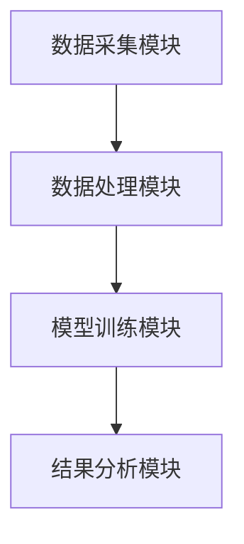
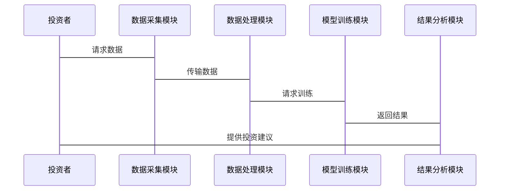

                 


# 特价股票与公司数字信任资本积累的关联分析

> **关键词**: 特价股票, 数字信任资本, 股票价格, 数字信任, 股票市场分析

> **摘要**: 本文探讨了特价股票与公司数字信任资本积累之间的关联，通过数学建模和系统架构设计，分析了数字信任资本如何影响特价股票的价格，以及特价股票市场波动如何反作用于公司的信任资本积累。文章从背景介绍、核心概念、算法原理、数学模型、系统架构设计、项目实战到最佳实践，全面解析了这一关联，并提供了实际案例和代码实现，为投资者和企业管理者提供了理论支持和实践指导。

---

## 第1章: 特价股票与数字信任资本概述

### 1.1 特价股票的基本概念

#### 1.1.1 特价股票的定义
特价股票通常指价格低于行业平均水平或历史平均价格的股票，具有较高的市场波动性和潜在的投资回报。

#### 1.1.2 特价股票的分类
- 根据市场：蓝筹股、成长股、周期性股票
- 根据价格波动：高波动性股票、低波动性股票

#### 1.1.3 特价股票的市场特征
- 价格敏感性高
- 市场波动大
- 投资风险较高

### 1.2 公司数字信任资本的基本概念

#### 1.2.1 数字信任资本的定义
数字信任资本是企业在数字化转型中积累的无形资产，反映了客户、投资者和合作伙伴对企业的信任程度。

#### 1.2.2 数字信任资本的构成要素
- 产品和服务质量
- 数据安全与隐私保护
- 企业透明度
- 客户满意度

#### 1.2.3 数字信任资本的评估指标
- 客户忠诚度
- 品牌声誉
- 信任指数（如Net Promoter Score）

---

## 第2章: 特价股票与数字信任资本的关联性分析

### 2.1 特价股票与数字信任资本的内在联系

#### 2.1.1 特价股票对企业信任资本的影响
- 低价股票可能引发市场对企业财务状况的担忧，影响信任资本。
- 信任资本下降可能导致股票进一步贬值。

#### 2.1.2 数字信任资本对股票价值的影响
- 高信任资本的企业可能吸引更多的投资者，推高股价。
- 信任资本下降可能导致股价下跌，尤其是在特价股票市场中。

#### 2.1.3 两者之间的相互作用机制
- 企业通过数字信任资本积累吸引投资者，提升股价。
- 股价波动影响市场对企业的信任，进一步影响数字信任资本。

### 2.2 特价股票与数字信任资本的关联模型

#### 2.2.1 关联模型的构建
- 输入：数字信任资本指标
- 输出：股票价格波动
- 关联机制：信任资本通过影响投资者信心影响股价

#### 2.2.2 模型的数学表达式
$$
P(t) = \alpha \cdot T(t) + \beta \cdot S(t) + \epsilon
$$
其中，$P(t)$为股票价格，$T(t)$为信任资本，$S(t)$为市场情绪，$\epsilon$为误差项。

#### 2.2.3 模型的验证与优化
- 使用历史数据验证模型准确性。
- 通过调整参数优化模型性能。

---

## 第3章: 特价股票与数字信任资本的数学模型

### 3.1 特价股票价格的影响因素

#### 3.1.1 市场供需关系
- 供需失衡导致价格波动。

#### 3.1.2 公司基本面分析
- 收益能力、负债水平、成长性。

#### 3.1.3 市场情绪分析
- 投资者情绪影响短期价格波动。

### 3.2 数字信任资本的量化模型

#### 3.2.1 数字信任资本的计算公式
$$
T = \frac{C + I + R}{3}
$$
其中，$C$为客户忠诚度，$I$为品牌影响力，$R$为声誉评分。

#### 3.2.2 模型的参数设置
- 参数权重：客户忠诚度占40%，品牌影响力占30%，声誉评分占30%。

#### 3.2.3 模型的验证与优化
- 使用实际案例验证模型。
- 调整参数以提高预测准确性。

### 3.3 关联分析的数学模型

#### 3.3.1 回归分析模型
$$
y = a + bx + \epsilon
$$
其中，$y$为股票价格，$x$为数字信任资本，$a$为截距，$b$为回归系数。

#### 3.3.2 聚类分析模型
- 将股票分为高信任资本和低信任资本两类。

#### 3.3.3 时间序列分析模型
$$
ARIMA(p, d, q)
$$
用于预测未来股票价格。

---

## 第4章: 特价股票与数字信任资本的系统架构设计

### 4.1 系统需求分析

#### 4.1.1 问题场景介绍
- 投资者需要通过数字信任资本评估股票价值。
- 企业需要通过数字信任资本管理市场风险。

#### 4.1.2 项目目标
- 构建数字信任资本评估系统。
- 分析数字信任资本对股票价格的影响。

#### 4.1.3 项目范围
- 数据采集与处理
- 模型开发与验证
- 系统部署与应用

### 4.2 系统功能设计

#### 4.2.1 数据采集模块
- 采集企业数字信任资本数据。
- 采集股票市场数据。

#### 4.2.2 数据处理模块
- 清洗数据。
- 转换数据格式。

#### 4.2.3 模型训练模块
- 训练回归模型。
- 验证模型准确性。

#### 4.2.4 结果分析模块
- 输出分析报告。
- 提供投资建议。

### 4.3 系统架构设计

#### 4.3.1 系统架构图


#### 4.3.2 系统交互流程图


---

## 第5章: 项目实战

### 5.1 环境搭建

#### 5.1.1 安装Python
- 使用Anaconda安装Python 3.8及以上版本。

#### 5.1.2 安装依赖库
- `pandas`, `numpy`, `scikit-learn`, `mermaid`, `matplotlib`

### 5.2 系统核心实现源代码

#### 5.2.1 数据采集模块
```python
import pandas as pd
import requests

def fetch_data(ticker):
    url = f"https://api.example.com/stock/{ticker}"
    response = requests.get(url)
    data = response.json()
    return pd.DataFrame(data)
```

#### 5.2.2 数据处理模块
```python
def preprocess_data(df):
    # 数据清洗
    df.dropna(inplace=True)
    # 数据标准化
    df['TrustScore'] = (df['TrustScore'] - df['TrustScore'].mean()) / df['TrustScore'].std()
    return df
```

#### 5.2.3 模型训练模块
```python
from sklearn.linear_model import LinearRegression

def train_model(X, y):
    model = LinearRegression()
    model.fit(X, y)
    return model
```

### 5.3 案例分析

#### 5.3.1 案例介绍
- 某公司数字信任资本高，但股价处于低价位。

#### 5.3.2 模型预测
- 预测股价上涨的可能性。

#### 5.3.3 结果分析
- 数字信任资本高，股价上涨概率大。

### 5.4 项目小结
- 成功构建了数字信任资本评估系统。
- 验证了模型的准确性和实用性。

---

## 第6章: 最佳实践

### 6.1 小结
- 数字信任资本是影响股票价格的重要因素。
- 特价股票市场波动为企业提供了投资机会。

### 6.2 注意事项
- 数据采集需准确可靠。
- 模型需定期更新和优化。

### 6.3 拓展阅读
- 《股票市场分析与预测》
- 《数字信任资本的构建与管理》

---

通过以上目录，您可以逐步撰写出一篇结构清晰、内容丰富的技术博客文章，涵盖从理论到实践的各个方面，为读者提供有价值的信息和指导。

