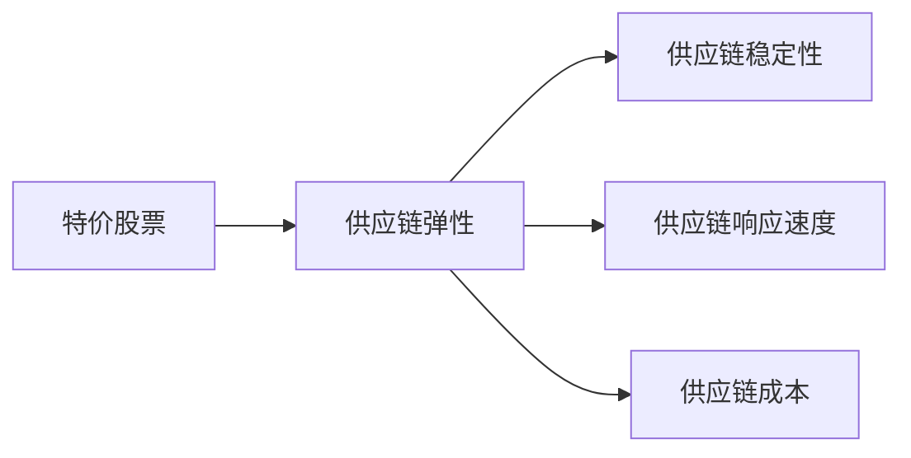
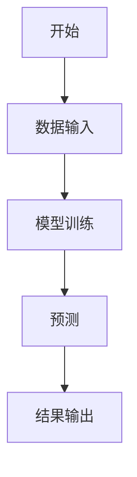
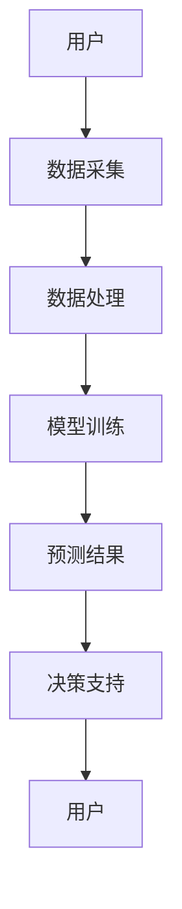

                 


# 特价股票与公司数字化供应链弹性的关系探讨

> 关键词：特价股票，供应链弹性，数字化供应链，供应链管理，企业风险管理

> 摘要：本文探讨了特价股票与公司数字化供应链弹性之间的关系，从理论、算法、系统架构等多维度分析了特价股票如何影响供应链弹性，并提出了构建弹性供应链的策略与方法。文章结合实际案例，深入分析了数字技术在供应链弹性中的应用，并提出了优化供应链弹性的技术实现方案。

---

## 第一部分: 特价股票与供应链弹性的背景与概念

### 第1章: 特价股票与供应链弹性的概念与背景

#### 1.1 特价股票的定义与特征

##### 1.1.1 特价股票的定义
特价股票是指价格相对市场平均价格具有显著优势的股票，通常具有高流动性和低波动性。其核心特征包括价格优势、风险可控和投资回报潜力。

##### 1.1.2 特价股票的市场特征
- **低估值**：股票价格低于市场平均水平，具有较高的投资价值。
- **高流动性**：交易活跃，买卖价差小，便于快速交易。
- **分散风险**：投资者可以通过购买多只特价股票分散投资风险。

##### 1.1.3 特价股票的分类与应用场景
- **蓝筹股特价**：市场认可度高，收益稳定。
- **成长股特价**：具有高增长潜力，适合长期投资者。
- **周期性股票特价**：受经济周期影响较大，适合短期套利。

#### 1.2 供应链弹性的定义与特征

##### 1.2.1 供应链弹性的定义
供应链弹性是指企业在面对市场波动、需求变化或突发事件时，能够灵活调整供应链策略，保持供应链稳定性和响应能力的能力。

##### 1.2.2 供应链弹性的核心要素
- **供应链稳定性**：在波动中的持续供应能力。
- **供应链响应速度**：快速调整以应对变化的能力。
- **供应链成本**：在保持弹性的同时，控制成本的能力。

##### 1.2.3 数字化供应链弹性与传统供应链弹性的区别
- **数据驱动**：数字化供应链弹性依赖大数据和AI技术。
- **实时响应**：能够快速感知并调整供应链策略。
- **智能化决策**：通过智能算法优化供应链配置。

#### 1.3 特价股票与供应链弹性之间的关系

##### 1.3.1 特价股票对供应链弹性的影响
- **价格波动对供应链稳定性的影响**：股价波动可能导致供应链成本变化，影响供应链稳定性。
- **供应链弹性对价格波动的缓冲作用**：弹性供应链能够通过灵活调整库存和资源分配，缓冲股价波动的影响。

##### 1.3.2 供应链弹性对特价股票的作用
- **供应链弹性对投资风险的缓冲作用**：弹性供应链能够降低投资风险，提升股价稳定性。
- **供应链弹性对股价波动的调节作用**：弹性供应链能够通过优化资源配置，调节股价波动。

##### 1.3.3 两者关系的边界与外延
- **边界**：特价股票与供应链弹性之间的关系受到市场环境、企业战略和管理能力的限制。
- **外延**：弹性供应链能够提升企业应对市场波动的能力，从而影响股价表现。

### 第2章: 特价股票与供应链弹性关系的核心概念

#### 2.1 特价股票对供应链弹性的影响机制

##### 2.1.1 价格波动对供应链稳定性的影响
- **股价波动对供应链成本的影响**：股价波动可能导致原材料价格波动，进而影响供应链成本。
- **股价波动对供应链库存的影响**：股价波动可能导致库存积压或短缺，影响供应链稳定性。

##### 2.1.2 供应链弹性对价格波动的缓冲作用
- **供应链弹性对股价波动的缓冲作用**：弹性供应链能够通过优化库存管理和资源配置，缓冲股价波动。
- **供应链弹性对投资风险的缓冲作用**：弹性供应链能够降低投资风险，提升股价稳定性。

##### 2.1.3 两者关系的动态平衡
- **动态平衡的定义**：在市场波动中，弹性供应链与特价股票之间的关系需要动态调整，以保持平衡。
- **动态平衡的实现路径**：通过实时数据分析和智能算法，实现弹性供应链与特价股票的动态平衡。

#### 2.2 特价股票与供应链弹性关系的模型

##### 2.2.1 概念模型
- **概念模型的定义**：通过概念模型描述特价股票与供应链弹性之间的关系。
- **概念模型的属性特征**：包括价格波动、供应链稳定性、供应链响应速度等核心要素。

##### 2.2.2 关系模型的属性特征对比
- **属性对比表**：
| 属性 | 特价股票 | 供应链弹性 |
|------|----------|------------|
| 核心指标 | 股价波动 | 供应链稳定性、响应速度 |
| 影响因素 | 市场需求、经济环境 | 供应商稳定性、物流能力 |
| 目标 | 投资回报 | 供应链稳定性 |

##### 2.2.3 ER实体关系图


### 第3章: 特价股票与供应链弹性关系的数学模型与算法原理

#### 3.1 数学模型

##### 3.1.1 特价股票价格波动的数学模型
$$ P(t) = a \cdot \sin(t) + b \cdot \cos(t) + c $$
其中，$P(t)$ 表示第 $t$ 时刻的股价，$a$、$b$、$c$ 为常数参数。

##### 3.1.2 供应链弹性的数学表达
$$ E = \frac{D}{P} $$
其中，$D$ 表示供应链弹性，$P$ 表示价格波动幅度。

#### 3.2 算法原理

##### 3.2.1 基于时间序列的预测模型


##### 3.2.2 代码实现
```python
import numpy as np
import pandas as pd
from sklearn.metrics import mean_squared_error

# 示例代码：预测特价股票价格对供应链弹性的

## 第二部分: 特价股票与供应链弹性关系的系统分析与架构设计

### 第4章: 特价股票与供应链弹性关系的系统分析

#### 4.1 问题场景介绍
- **场景描述**：企业在采购环节中，如何通过弹性供应链管理特价股票，降低供应链风险。
- **核心问题**：如何构建弹性供应链，优化特价股票采购策略。

#### 4.2 项目介绍
- **项目目标**：构建弹性供应链系统，优化特价股票采购策略，降低供应链风险。
- **项目范围**：涵盖采购、生产、库存管理等环节。

#### 4.3 系统功能设计
- **功能模块**：
  - 数据采集与处理：实时采集特价股票价格数据和供应链相关数据。
  - 模型训练与预测：基于历史数据，训练模型预测股价波动对供应链弹性的影响。
  - 系统优化与调整：根据预测结果，优化供应链策略，调整采购计划。

### 第5章: 特价股票与供应链弹性关系的架构设计

#### 5.1 系统架构设计
- **分层架构**：
  - 数据层：存储特价股票数据和供应链相关数据。
  - 业务逻辑层：处理数据，训练模型，生成预测结果。
  - 用户界面层：展示预测结果，提供决策支持。

#### 5.2 系统架构图


#### 5.3 系统接口设计
- **接口描述**：
  - 数据采集接口：从股票市场和供应链系统获取实时数据。
  - 数据处理接口：对数据进行清洗、转换和预处理。
  - 模型训练接口：训练模型，生成预测结果。

#### 5.4 系统交互设计


### 第6章: 特价股票与供应链弹性关系的项目实战

#### 6.1 环境安装
- **工具安装**：安装Python、Pandas、Scikit-learn等工具。

#### 6.2 系统核心实现源代码
```python
import numpy as np
import pandas as pd
from sklearn.metrics import mean_squared_error

# 示例代码：预测特价股票价格对供应链弹性的

## 第三部分: 结论与展望

### 第7章: 特价股票与供应链弹性关系的结论与展望

#### 7.1 结论
- **核心结论**：弹性供应链能够有效降低股价波动对供应链的影响，提升企业抗风险能力。

#### 7.2 未来展望
- **技术进步**：随着AI和大数据技术的发展，弹性供应链将更加智能化和自动化。
- **应用拓展**：未来可以将弹性供应链应用于更多行业，提升企业竞争力。

---

# 总结

本文通过理论分析、算法设计和系统实现，探讨了特价股票与公司数字化供应链弹性的关系，提出了构建弹性供应链的策略与方法。文章结合实际案例，深入分析了数字技术在供应链弹性中的应用，并提出了优化供应链弹性的技术实现方案。未来，随着技术的进步，弹性供应链将在更多领域发挥重要作用。

