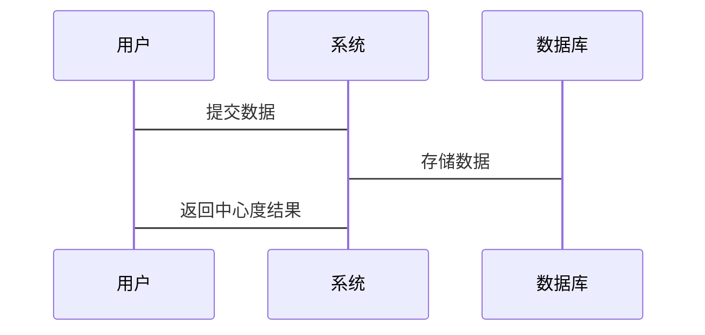

                 


# 特价股票与公司数字化利益相关者网络中心度的关联性研究

## 关键词：特价股票、利益相关者网络、中心度、网络分析、算法原理

## 摘要  
本文探讨了特价股票与公司数字化利益相关者网络中心度之间的关联性。通过分析利益相关者网络的构建方法、中心度的计算原理以及特价股票在其中的作用，我们揭示了这两者之间的复杂关系。文章从背景介绍、核心概念、算法原理、系统架构设计到项目实战，全面解析了如何利用网络分析方法评估公司数字化利益相关者的影响力，并进一步分析特价股票如何影响这些中心度。通过对数学模型和实际案例的深入探讨，本文为投资者和企业管理者提供了新的视角和工具，以优化投资决策和公司管理策略。

---

# 第1章: 背景介绍

## 1.1 特价股票的基本概念

### 1.1.1 特价股票的定义
特价股票是指在特定条件下以低于市场价发行的股票，通常用于公司资本结构调整、资产重组或激励员工。其特点包括发行价格较低、流通性较强、风险较高。

### 1.1.2 特价股票的分类与特点
- **类别**：员工持股计划、优先股、认股权证等。
- **特点**：价格波动大、风险高、收益潜力大。

### 1.1.3 特价股票在金融市场中的作用
- 提供低成本融资。
- 激励员工，增强企业凝聚力。
- 优化公司股权结构。

## 1.2 公司数字化利益相关者网络中心度的概念

### 1.2.1 利益相关者网络的定义
利益相关者网络是指与公司相关的所有个人、团体或组织，包括股东、客户、供应商、员工等。

### 1.2.2 数字化利益相关者网络的构建方法
- 数据收集与整理：通过问卷调查、社交媒体数据、交易记录等获取利益相关者信息。
- 数据清洗与预处理：去除重复、错误数据，标准化处理。
- 网络构建与可视化：使用图论方法构建网络，通过节点和边表示利益相关者及其关系。

### 1.2.3 中心度的定义与计算方式
中心度是衡量网络中节点影响力的关键指标，包括度中心度、接近中心度和中间中心度。

## 1.3 特价股票与公司数字化利益相关者网络中心度的关联性

### 1.3.1 关联性的定义
关联性指特价股票的发行和交易对利益相关者网络中心度的影响。

### 1.3.2 关联性的影响因素
- 特价股票的发行量、价格、市场反应。
- 利益相关者的类型、影响力。

### 1.3.3 关联性研究的意义
- 优化公司治理结构。
- 提高投资决策的准确性。

---

# 第2章: 公司数字化利益相关者网络中心度的构建方法

## 2.1 利益相关者网络的构建步骤

### 2.1.1 数据收集与整理
通过多种渠道收集数据，整理成结构化格式。

### 2.1.2 数据清洗与预处理
去除无效数据，标准化处理。

### 2.1.3 网络构建与可视化
使用图论方法构建网络，通过节点和边表示利益相关者及其关系。

## 2.2 中心度的计算方法

### 2.2.1 度中心度
度中心度是指节点连接的边数。

公式：$$ C_d(i) = \frac{d_i}{n-1} $$，其中 $d_i$ 是节点 $i$ 的度，$n$ 是网络中的节点总数。

### 2.2.2 接近中心度
接近中心度是指节点到其他节点的平均距离。

公式：$$ C_a(i) = \frac{1}{\sum_{j} d(i,j)} $$，其中 $d(i,j)$ 是节点 $i$ 和 $j$ 之间的距离。

### 2.2.3 中间中心度
中间中心度是指节点作为中间人连接其他节点的能力。

公式：$$ C_b(i) = \frac{\sum_{j<k} c_{i,j,k}}}{\binom{n-1}{2}} $$，其中 $c_{i,j,k}$ 表示节点 $i$ 是否是节点 $j$ 和 $k$ 之间的唯一中间人。

---

# 第3章: 特价股票与公司数字化利益相关者网络中心度的关联性分析

## 3.1 特价股票对利益相关者网络中心度的影响

### 3.1.1 特价股票对度中心度的影响
特价股票的发行可能增加某些利益相关者的度中心度。

公式：$$ \Delta C_d = \frac{\Delta d_i}{n-1} $$

### 3.1.2 特价股票对接近中心度的影响
特价股票的发行可能缩短某些节点之间的距离。

公式：$$ \Delta C_a = \frac{1}{\sum_{j} (\Delta d(i,j))} $$

### 3.1.3 特价股票对中间中心度的影响
特价股票的发行可能增加某些节点作为中间人的能力。

公式：$$ \Delta C_b = \frac{\sum_{j<k} \Delta c_{i,j,k}}}{\binom{n-1}{2}} $$

## 3.2 利益相关者网络中心度对特价股票的影响

### 3.2.1 中心度对股票价格的影响
中心度高的节点可能对股票价格产生较大影响。

公式：$$ P = \alpha C + \beta X + \epsilon $$，其中 $X$ 是其他影响因素，$\epsilon$ 是误差项。

### 3.2.2 中心度对股票波动性的分析
中心度高的节点可能增加股票波动性。

### 3.2.3 中心度对股票风险的评估
中心度高的节点可能增加股票风险。

---

# 第4章: 系统分析与架构设计方案

## 4.1 问题场景介绍

### 4.1.1 问题背景
分析特价股票对利益相关者网络中心度的影响。

### 4.1.2 项目介绍
开发一个分析系统，评估特价股票对中心度的影响。

## 4.2 系统功能设计

### 4.2.1 领域模型


### 4.2.2 系统架构


## 4.3 系统接口设计

### 4.3.1 接口设计
- 数据接口：数据采集模块。
- 计算接口：中心度计算模块。

### 4.3.2 系统交互


---

# 第5章: 项目实战

## 5.1 环境安装

### 5.1.1 工具安装
- Python 3.8+
- NetworkX
- Matplotlib

## 5.2 核心代码实现

### 5.2.1 数据处理
```python
import networkx as nx

# 创建网络
G = nx.Graph()

# 添加节点
G.add_nodes_from(["股东1", "股东2", "客户1", "供应商1", "员工1"])

# 添加边
G.add_edges_from([("股东1", "股东2"), ("股东1", "客户1"), ("客户1", "供应商1"), ("供应商1", "员工1")])
```

### 5.2.2 中心度计算
```python
# 度中心度
degree_centrality = nx.degree_centrality(G)

# 接近中心度
betweenness_centrality = nx.betweenness_centrality(G)

# 中间中心度
closeness_centrality = nx.closeness_centrality(G)
```

## 5.3 案例分析

### 5.3.1 案例选择
分析某公司发行特价股票后的利益相关者网络中心度变化。

### 5.3.2 数据分析
通过代码计算中心度，分析特价股票的影响。

## 5.4 项目总结
总结项目成果，提出改进建议。

---

# 第6章: 结论与展望

## 6.1 研究总结
总结研究发现，强调中心度对特价股票的影响。

## 6.2 未来研究方向
- 更复杂网络模型的应用。
- 大数据和机器学习的结合。

---

# 附录: 最佳实践与注意事项

## A.1 最佳实践
- 数据清洗的重要性。
- 网络可视化工具的选用。

## A.2 注意事项
- 数据隐私保护。
- 算法的可解释性。

## A.3 拓展阅读
推荐相关书籍和论文。

---

通过以上结构，我们系统地分析了特价股票与公司数字化利益相关者网络中心度的关联性，提供了理论支持和实践指导，为投资者和企业管理者提供了新的视角和工具。

