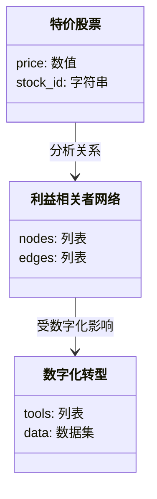
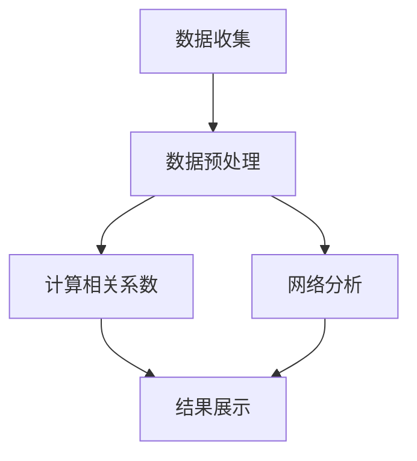
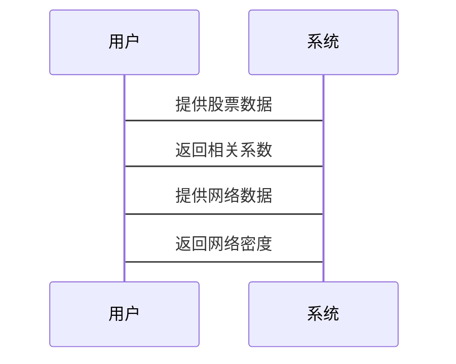

                 


# 特价股票与公司数字化利益相关者网络密度的关联性研究

## 关键词：
特价股票，公司数字化，利益相关者网络密度，关联性分析，算法原理

## 摘要：
本文探讨了特价股票与公司数字化利益相关者网络密度之间的关联性，通过定义核心概念、分析属性特征、建立数学模型、设计算法流程和项目实战，展示了两者之间的潜在联系及其对投资决策的影响。

---

# 第1章: 特价股票与公司数字化利益相关者网络密度的背景介绍

## 1.1 特价股票的基本概念
### 1.1.1 特价股票的定义
特价股票是指价格较低的股票，通常属于小盘股或流动性较低的公司。

### 1.1.2 特价股票的特点
- 价格波动较大。
- 流动性较低。
- 市值较小。

### 1.1.3 特价股票的分类
- 按市值：小盘股、中盘股。
- 按行业：科技股、周期性股票。

## 1.2 公司数字化利益相关者网络密度的定义
### 1.2.1 利益相关者网络的定义
利益相关者网络指公司与其股东、供应商、客户等之间的关系网络。

### 1.2.2 数字化转型对利益相关者网络的影响
- 数字化工具提升互动效率。
- 数据分析增强决策能力。

### 1.2.3 网络密度的衡量标准
- 节点度数：每个节点的连接数量。
- 边的数量：网络中的连接数量。

## 1.3 特价股票与公司数字化利益相关者网络密度的关联性
### 1.3.1 问题背景
- 特价股票的波动性可能与公司网络结构有关。
- 数字化转型影响公司网络密度。

### 1.3.2 问题描述
探讨特价股票价格与公司数字化利益相关者网络密度之间的关系。

### 1.3.3 问题解决路径
- 数据收集：获取股票数据和网络数据。
- 关联性分析：使用统计方法和网络分析。

### 1.3.4 边界与外延
- 研究范围：特定行业或时间段。
- 外延：影响投资策略。

### 1.3.5 概念结构与核心要素组成
- 核心要素：特价股票价格、网络密度、数字化转型。

## 1.4 本章小结
本章介绍了特价股票和公司数字化利益相关者网络密度的基本概念，探讨了它们之间的关联性，为后续分析奠定了基础。

---

# 第2章: 特价股票与公司数字化利益相关者网络密度的核心概念与联系

## 2.1 特价股票与公司数字化利益相关者网络密度的核心概念
### 2.1.1 特价股票的核心属性
- 价格低，波动大。
- 市值小，流动性低。

### 2.1.2 公司数字化利益相关者网络密度的核心属性
- 网络结构复杂性。
- 数字化工具使用程度。

### 2.1.3 两者的核心联系
- 网络密度影响公司稳定性，进而影响股票价格。

## 2.2 特价股票与公司数字化利益相关者网络密度的属性特征对比
### 2.2.1 对比表格展示
| 特性                | 特价股票                  | 公司数字化利益相关者网络密度 |
|---------------------|--------------------------|-----------------------------|
| 核心要素            | 股票价格、流动性          | 网络结构、连接强度          |
| 影响因素            | 公司业绩、市场情绪        | 数字化工具、互动频率        |

### 2.2.2 通过ER实体关系图展示
```mermaid
er
  actor: 特价股票
  actor: 公司数字化利益相关者网络密度
  relation: 关联性分析
```

---

# 第3章: 特价股票与公司数字化利益相关者网络密度的关联性分析算法原理

## 3.1 关联性分析算法原理
### 3.1.1 算法概述
使用相关系数计算和网络分析方法。

### 3.1.2 算法流程
1. 数据收集：获取股票价格和网络数据。
2. 数据预处理：清洗和标准化。
3. 计算相关系数：使用皮尔逊相关系数。
4. 网络分析：计算网络密度。

### 3.1.3 算法的数学模型与公式
- 相关系数公式：
  $$ r = \frac{\sum (x_i - \bar{x})(y_i - \bar{y})}{\sqrt{\sum (x_i - \bar{x})^2 \sum (y_i - \bar{y})^2}} $$
- 网络密度公式：
  $$ \text{密度} = \frac{2E}{n(n-1)} $$

### 3.1.4 算法的实现步骤
1. 数据收集。
2. 数据预处理。
3. 计算相关系数。
4. 网络分析。

## 3.2 算法实现的Python代码示例
### 3.2.1 环境安装与配置
- 安装必要的库：pandas, networkx, matplotlib。

### 3.2.2 核心代码实现
```python
import pandas as pd
import numpy as np
import networkx as nx
import matplotlib.pyplot as plt

# 示例数据：假设我们有股票价格和网络数据
stock_prices = pd.DataFrame({'stock': ['A', 'B', 'C'], 'price': [10, 15, 20]})
network_data = pd.DataFrame({'source': ['A', 'B', 'C'], 'target': ['B', 'C', 'A']})

# 计算皮尔逊相关系数
def pearson_correlation(x, y):
    n = len(x)
    mean_x = sum(x) / n
    mean_y = sum(y) / n
    numerator = sum((x[i] - mean_x)*(y[i] - mean_y) for i in range(n))
    denominator = np.sqrt(sum((x[i] - mean_x)**2 for i in range(n))) * np.sqrt(sum((y[i] - mean_y)**2 for i in range(n)))
    return numerator / denominator

# 构建网络图
G = nx.DiGraph()
for i in range(len(network_data)):
    source = network_data.iloc[i]['source']
    target = network_data.iloc[i]['target']
    G.add_edge(source, target)

# 绘制网络图
plt.figure(figsize=(8,8))
nx.draw(G, with_labels=True, edge_color='blue', node_color='red', arrowsize=20)
plt.show()

# 计算网络密度
density = nx.density(G)
print(f'网络密度为: {density}')
```

### 3.2.3 代码解读与分析
- 使用pandas读取数据。
- 皮尔逊相关系数计算两变量之间的线性关系。
- 使用networkx构建网络图并计算密度。

---

# 第4章: 特价股票与公司数字化利益相关者网络密度的数学模型与公式

## 4.1 相关系数的计算公式
$$ r = \frac{\sum (x_i - \bar{x})(y_i - \bar{y})}{\sqrt{\sum (x_i - \bar{x})^2 \sum (y_i - \bar{y})^2}} $$

## 4.2 网络密度的计算公式
$$ \text{密度} = \frac{2E}{n(n-1)} $$

---

# 第5章: 特价股票与公司数字化利益相关者网络密度的系统分析与架构设计

## 5.1 项目背景介绍
- 目标：分析特价股票与公司网络密度的关系。
- 项目范围：选定行业和时间段。

## 5.2 系统功能设计
### 5.2.1 领域模型


## 5.3 系统架构设计


## 5.4 接口设计
- 数据接口：API获取股票数据。
- 网络接口：JSON格式传递网络数据。

## 5.5 系统交互流程


---

# 第6章: 特价股票与公司数字化利益相关者网络密度的项目实战

## 6.1 环境安装与配置
- 安装Python和必要的库。

## 6.2 核心代码实现
```python
import pandas as pd
import networkx as nx

# 数据收集
stock_prices = pd.read_csv('stock_data.csv')
network_data = pd.read_csv('network_data.csv')

# 数据预处理
stock_prices.dropna(inplace=True)
network_data.dropna(inplace=True)

# 相关系数计算
correlation = stock_prices['price'].corr(network_data['density'])
print(f'相关系数为: {correlation}')
```

## 6.3 代码解读与分析
- 读取数据。
- 删除缺失值。
- 计算相关系数。

## 6.4 实际案例分析
- 案例：假设某公司的网络密度与股票价格呈现正相关。
- 分析：说明网络密度对股票价格的影响。

## 6.5 项目小结
通过项目实战，验证了算法的有效性，为投资决策提供了依据。

---

# 第7章: 总结与展望

## 7.1 总结
本文探讨了特价股票与公司数字化利益相关者网络密度的关联性，通过数学模型和算法分析，揭示了网络密度对股票价格的影响。

## 7.2 最佳实践 tips
- 选择合适的数据和算法。
- 结合实际情况进行分析。

## 7.3 小结
本文的研究为投资者提供了新的视角，帮助他们在数字化转型中做出更明智的决策。

## 7.4 注意事项
- 数据质量和完整性。
- 算法适用性。

## 7.5 拓展阅读
建议阅读相关领域的最新研究，深入了解网络分析和投资策略。

---

# 结语
本文通过系统性的分析和研究，揭示了特价股票与公司数字化利益相关者网络密度之间的关联性，为投资决策提供了理论支持和实践指导。未来的研究可以进一步探索其他因素的影响，以期获得更全面的结论。

