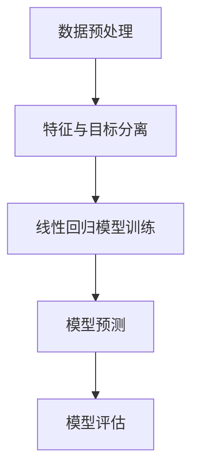
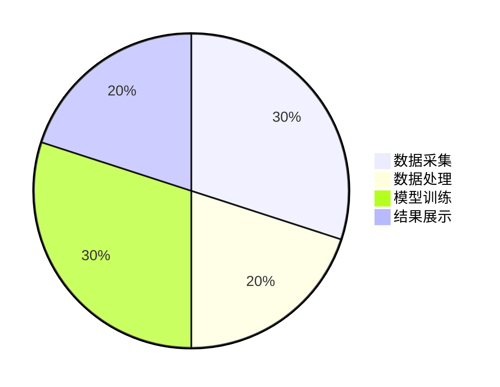

                 


# 特价股票与公司数字化转型能力的关联

> 关键词：特价股票，数字化转型，股票分析，公司能力评估，算法模型，系统架构

> 摘要：本文探讨了特价股票与公司数字化转型能力之间的关联，分析了数字化转型能力如何影响股票价值，提出了基于数字化能力评估的股票价值预测模型，并通过实际案例展示了模型的应用。

---

## 引言

数字化转型已成为现代企业发展的核心驱动力。在股票市场中，特价股票因其低于市场价的特性，常被视为投资机会。然而，公司数字化转型能力的强弱直接影响其市场表现和股价波动。本文将深入分析特价股票与公司数字化转型能力之间的关联，并探讨如何通过数字化能力评估影响股票价值。

---

## 第1章: 特价股票的基本概念与分析方法

### 1.1 特价股票的定义与特征

#### 1.1.1 什么是特价股票
特价股票是指价格显著低于其内在价值的股票。这类股票通常被市场低估，具有较高的投资潜力。

#### 1.1.2 特价股票的市场特征
- 市场流动性较低
- 股价波动较大
- 投资风险较高

#### 1.1.3 特价股票的投资价值
- 低估的股价为投资者提供了安全边际
- 公司价值被市场忽视，具备增值空间

### 1.2 特价股票的分析方法

#### 1.2.1 基本面分析法
基本面分析通过评估公司的财务状况、盈利能力等指标来判断股票价值。

#### 1.2.2 技术分析法
技术分析通过分析股价走势、成交量等技术指标来预测股票价格变化。

#### 1.2.3 财务指标分析法
常用的财务指标包括市盈率（P/E）、市净率（P/B）等。

---

## 第2章: 公司数字化转型能力的核心要素

### 2.1 数字化转型的定义与目标

#### 2.1.1 数字化转型的定义
数字化转型是指企业利用数字技术（如大数据、人工智能、云计算等）重构业务模式、流程和文化的过程。

#### 2.1.2 数字化转型的目标
- 提高业务效率
- 优化客户体验
- 创新商业模式

### 2.2 数字化转型能力的评估指标

#### 2.2.1 技术能力评估
- IT基础设施
- 数字化工具的采用

#### 2.2.2 组织能力评估
- 数字化团队能力
- 组织文化适应性

#### 2.2.3 业务能力评估
- 数字化产品和服务
- 数据驱动的决策能力

---

## 第3章: 特价股票与公司数字化能力的关联机制

### 3.1 数字化能力对股票价值的影响

#### 3.1.1 数字化能力提升公司竞争力
- 数字化转型增强了企业的市场地位和盈利能力，从而提高股票价值。

#### 3.1.2 数字化能力影响股价波动
- 具有较强数字化能力的公司，其股价波动更小，稳定性更高。

### 3.2 数字化能力与投资者决策的关系

#### 3.2.1 投资者更关注数字化能力
- 投资者倾向于选择具备强大数字化能力的公司，因为这些公司更具成长性和抗风险能力。

#### 3.2.2 数字化能力影响投资者信心
- 公司数字化能力的强弱直接影响投资者对其未来表现的信心。

---

## 第4章: 数字化能力对特价股票影响的数学模型

### 4.1 模型构建

#### 4.1.1 数据来源
- 公司数字化能力评估指标
- 股票价格数据

#### 4.1.2 模型假设
- 公司数字化能力越强，其股票价值越高。
- 数字化能力通过影响公司盈利能力间接影响股价。

#### 4.1.3 模型公式
$$ V = \alpha D + \beta T $$
其中，$V$ 为股票价值，$D$ 为数字化能力指数，$T$ 为时间变量，$\alpha$ 和 $\beta$ 为回归系数。

---

## 第5章: 基于数字化能力的股票价值预测算法

### 5.1 算法原理

#### 5.1.1 线性回归模型
使用线性回归模型，将数字化能力指数作为自变量，股票价值作为因变量，进行预测。

#### 5.1.2 数据预处理
- 数据清洗
- 标准化处理

### 5.2 算法实现

#### 5.2.1 Python代码实现
```python
import pandas as pd
import numpy as np
from sklearn.linear_model import LinearRegression
from sklearn.metrics import mean_squared_error

# 数据加载
data = pd.read_csv('stock_data.csv')

# 特征与目标分离
X = data[['digital_capability']]
y = data['stock_value']

# 模型训练
model = LinearRegression()
model.fit(X, y)

# 预测与评估
y_pred = model.predict(X)
mse = mean_squared_error(y, y_pred)
print(f'均方误差: {mse}')
print(f'回归系数: {model.coef_}')
print(f'截距: {model.intercept_}')
```

#### 5.2.2 算法流程图


---

## 第6章: 系统架构设计

### 6.1 系统功能设计

#### 6.1.1 功能模块
- 数据采集模块
- 数字化能力评估模块
- 股票价值预测模块

#### 6.1.2 系统架构


### 6.2 系统接口设计

#### 6.2.1 API接口
- 数据接口：获取股票数据
- 模型接口：进行股票价值预测

---

## 第7章: 项目实战

### 7.1 实验环境安装

#### 7.1.1 Python环境安装
```bash
pip install pandas numpy scikit-learn
```

#### 7.1.2 数据集获取
从公开数据源获取股票数据和公司数字化能力评估数据。

### 7.2 核心代码实现

#### 7.2.1 数据预处理
```python
data = pd.read_csv('stock_data.csv')
data = data.dropna()
data = (data - data.mean()) / data.std()
```

#### 7.2.2 模型训练
```python
model = LinearRegression()
model.fit(X_train, y_train)
```

#### 7.2.3 模型预测与评估
```python
y_pred = model.predict(X_test)
print('均方误差:', mean_squared_error(y_test, y_pred))
```

### 7.3 案例分析

#### 7.3.1 数据分析结果
- 数字化能力指数较高的公司，其股票价值显著高于数字化能力较低的公司。

#### 7.3.2 模型优化
通过引入更多特征（如市场趋势）优化模型，提高预测准确性。

---

## 第8章: 总结与展望

### 8.1 总结
本文探讨了特价股票与公司数字化转型能力的关联，提出了基于数字化能力的股票价值预测模型，并通过实际案例验证了模型的有效性。

### 8.2 最佳实践 tips
- 投资者应关注公司数字化能力，选择具备较强数字化能力的公司。
- 企业应加快数字化转型，提升核心竞争力。

### 8.3 注意事项
- 投资有风险，需谨慎决策。
- 模型结果仅供参考，实际操作需结合市场实际情况。

### 8.4 拓展阅读
- 《数字化转型的策略与实施》
- 《股票投资分析方法》

---

## 结语

通过本文的分析，读者可以更好地理解特价股票与公司数字化转型能力之间的关联，并能够实际应用这些知识进行股票投资和企业数字化转型决策。

