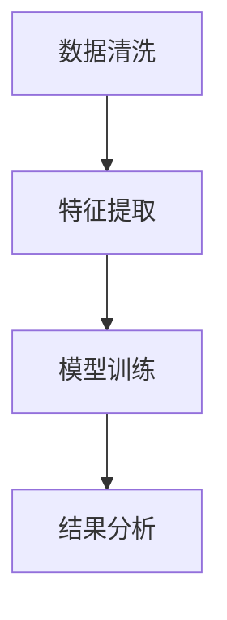
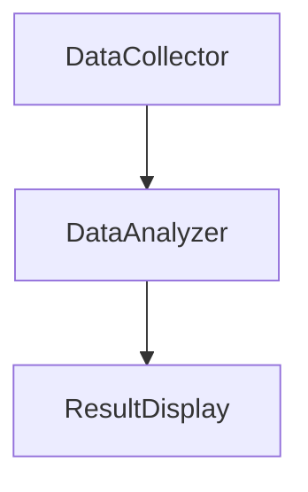

                 


# 特价股票与公司数字化转型能力的潜在联系

## 关键词：特价股票，数字化转型，数据分析，算法原理，系统架构

## 摘要：本文探讨了特价股票与公司数字化转型能力之间的潜在联系，分析了特价股票的特征和公司数字化转型的核心能力，并通过数据驱动的方法，结合算法和系统架构设计，揭示了两者之间的深层次关联。

---

## 第一部分: 特价股票与公司数字化转型能力的背景与概念

### 第1章: 特价股票与公司数字化转型能力的背景介绍

#### 1.1 特价股票的定义与特征
##### 1.1.1 特价股票的定义
特价股票通常指价格低于市场平均水平的股票，具有较高的投资潜力和风险。它们可能由于市场波动、公司基本面变化或行业周期性影响而出现。

##### 1.1.2 特价股票的特征
- **低估值**：市盈率、市净率等指标低于行业平均水平。
- **高波动性**：价格波动较大，容易受市场情绪影响。
- **投资风险**：高波动性意味着较高的投资风险。

##### 1.1.3 特价股票的市场表现
特价股票在短期内可能表现不佳，但长期来看，具备潜力的公司可能会反弹。投资者需要具备一定的市场洞察力和风险承受能力。

#### 1.2 公司数字化转型能力的定义与构成
##### 1.2.1 数字化转型的定义
数字化转型是指企业利用数字技术（如人工智能、大数据、云计算等）改造业务流程、商业模式和决策方式，以提高效率和竞争力。

##### 1.2.2 数字化转型的核心要素
- **技术能力**：包括大数据分析、人工智能、云计算等技术的应用。
- **组织能力**：包括组织结构的调整、员工技能的提升。
- **业务能力**：包括业务流程的优化、新业务模式的创新。

##### 1.2.3 数字化转型能力的评估标准
- **技术投入**：企业是否在技术上进行持续投入。
- **组织变革**：组织结构是否适应数字化需求。
- **业务创新**：是否通过数字化手段实现业务创新。

#### 1.3 特价股票与公司数字化转型能力的联系
##### 1.3.1 特价股票市场的现状
当前市场中，许多特价股票可能来自于数字化转型能力不足的公司，这些公司可能在短期内面临业绩压力，但具备潜力。

##### 1.3.2 公司数字化转型能力的现状
许多企业正在推进数字化转型，但部分企业在转型过程中面临技术、组织和业务上的挑战。

##### 1.3.3 两者之间的潜在联系
通过分析公司数字化转型能力，投资者可以更好地判断特价股票的潜在价值，找到那些具备数字化转型能力的公司，这些公司在未来可能实现业绩反弹。

#### 1.4 本章小结
本章介绍了特价股票和公司数字化转型能力的基本概念和特征，并提出了两者之间的潜在联系，为后续分析奠定了基础。

---

### 第2章: 特价股票与公司数字化转型能力的核心概念

#### 2.1 特价股票的特征分析
##### 2.1.1 市场波动性
特价股票的价格波动较大，容易受到市场情绪和外部环境的影响。

##### 2.1.2 投资风险
由于价格波动大，投资特价股票的风险较高，需要谨慎选择。

##### 2.1.3 投资机会
具备潜力的特价股票可能在短期内实现高收益，为投资者提供机会。

#### 2.2 公司数字化转型能力的特征分析
##### 2.2.1 技术能力
具备先进数字技术的应用能力是数字化转型的核心。

##### 2.2.2 组织能力
组织结构和文化是否适应数字化转型需求是关键。

##### 2.2.3 业务能力
业务模式是否能够通过数字化手段实现创新和优化是评估的重要标准。

#### 2.3 特价股票与公司数字化转型能力的对比分析
##### 2.3.1 特征对比表格
| 特征                | 特价股票                 | 数字化转型能力             |
|---------------------|--------------------------|-----------------------------|
| 核心要素            | 价格波动、投资风险       | 技术能力、组织能力、业务能力 |
| 目标                | 投资收益最大化           | 提高效率和竞争力             |
| 风险                | 高风险                   | 技术、组织、业务风险         |

##### 2.3.2 ER实体关系图
```mermaid
erd
    title 特价股票与数字化转型能力的关系
    Company [公司]
    DigitalCapability [数字化能力]
    StockPrice [股价]
    company(digital_capability)
    company(has_stock_price)
    digital_capability(influence_stock_price)
```

#### 2.4 本章小结
本章通过对比分析，揭示了特价股票与公司数字化转型能力之间的关键差异和联系，为后续的分析提供了理论基础。

---

### 第3章: 特价股票与公司数字化转型能力的算法原理

#### 3.1 数据分析方法
##### 3.1.1 数据清洗
- 去除缺失值和异常值。
- 标准化数据，确保数据一致性。

##### 3.1.2 特征提取
- 提取公司数字化转型能力相关的特征，如技术投入、组织变革、业务创新等。
- 提取股价相关的特征，如市盈率、市净率、波动率等。

##### 3.1.3 模型训练
- 使用机器学习算法（如决策树、随机森林）对数据进行建模，预测公司数字化转型能力对股价的影响。

#### 3.2 算法流程图


#### 3.3 算法实现
##### 3.3.1 Python代码实现
```python
import pandas as pd
from sklearn.ensemble import RandomForestRegressor

# 数据清洗
data = pd.read_csv('data.csv')
data = data.dropna()
data = data[(data['市盈率'] < data['市盈率'].mean())]

# 特征提取
features = ['市盈率', '市净率', '波动率']
target = '股价'

X = data[features]
y = data[target]

# 模型训练
model = RandomForestRegressor()
model.fit(X, y)

# 预测结果
predictions = model.predict(X)
```

##### 3.3.2 算法原理
- **随机森林**：通过构建多个决策树，集成学习，提高模型的准确性和鲁棒性。
- **数学模型**：随机森林通过特征重要性分析，找到影响股价的关键因素。

##### 3.3.3 举例说明
假设某公司数字化转型能力较强，其股价可能在模型预测下表现出较高的增长潜力。

#### 3.4 本章小结
本章通过数据分析方法和机器学习算法，展示了如何利用数字化转型能力预测股价，为投资者提供数据支持。

---

### 第4章: 特价股票与公司数字化转型能力的系统分析

#### 4.1 系统功能设计
##### 4.1.1 数据采集模块
- 采集公司数字化转型能力相关的数据，如技术投入、组织变革等。
- 采集股价数据，包括历史股价、市盈率等。

##### 4.1.2 数据分析模块
- 对数据进行清洗和特征提取。
- 构建模型，分析数字化转型能力对股价的影响。

##### 4.1.3 结果展示模块
- 展示分析结果，包括特征重要性、股价预测等。

#### 4.2 系统架构设计
##### 4.2.1 模块划分
- 数据采集模块、数据分析模块、结果展示模块。

##### 4.2.2 数据流


##### 4.2.3 系统交互
```mermaid
sequence
    User -> DataCollector: 请求数据
    DataCollector -> DataAnalyzer: 提供数据
    DataAnalyzer -> ResultDisplay: 分析结果
    ResultDisplay -> User: 显示结果
```

#### 4.3 系统接口设计
##### 4.3.1 数据接口
- 数据采集接口：接收外部数据，如股价和公司数据。
- 数据分析接口：接收特征提取和模型训练的结果。

##### 4.3.2 系统交互
- 用户通过界面输入查询条件。
- 系统根据条件进行分析并返回结果。

#### 4.4 本章小结
本章通过系统设计，展示了如何构建一个基于数字化转型能力的股价分析系统，为投资者提供决策支持。

---

## 第五部分: 总结与展望

### 5.1 总结
本文探讨了特价股票与公司数字化转型能力之间的潜在联系，分析了两者的核心特征和数据驱动的关联。通过算法和系统设计，展示了如何利用数字化转型能力评估股价，为投资者提供数据支持。

### 5.2 展望
未来，随着人工智能和大数据技术的不断发展，数字化转型能力对股价的影响将更加显著。投资者可以通过更先进的技术手段，进一步挖掘特价股票的潜在价值。

---

## 最佳实践 Tips

- **数据驱动决策**：投资者应利用数据和算法，而非仅仅依靠市场情绪做决策。
- **技术能力提升**：企业应加大对数字化转型技术的投入，提升自身竞争力。
- **风险控制**：投资特价股票需谨慎，注意分散投资，降低风险。

---

## 小结
本文通过系统的分析，揭示了特价股票与公司数字化转型能力之间的深层次联系，为投资者和企业提供了一种新的视角来评估和优化投资策略。

---

## 注意事项
- 本文内容仅供参考，不构成具体的投资建议。
- 投资者在进行股票投资时，应充分考虑市场风险和个人风险承受能力。

---

## 拓展阅读
- 《数据驱动的股票投资策略》
- 《数字化转型：企业的未来之路》
- 《机器学习在金融领域的应用》

--- 

希望这篇文章能为您提供有价值的见解和启发！

