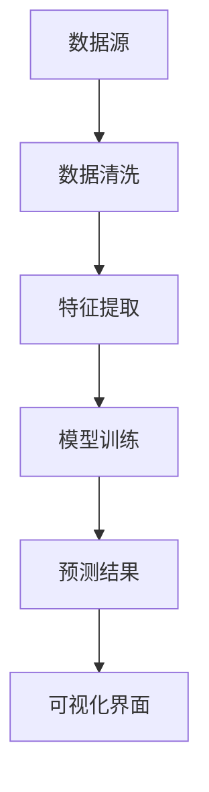

                 


# 特价股票与公司数字化转型速度的潜在关联研究

## 关键词：
特价股票、数字化转型、股价波动、公司价值、数字技术

## 摘要：
本文探讨了特价股票与公司数字化转型速度之间的潜在关联。通过分析特价股票的定义、数字化转型的核心要素，以及两者之间的关系，本文构建了一个数学模型，预测数字化转型速度对股价的影响。通过实际案例分析和系统设计，本文提出了企业如何通过加快数字化转型来避免成为特价股票的最佳实践。

---

## 第1章: 特价股票的定义与分类

### 1.1 特价股票的定义
#### 1.1.1 特价股票的定义与特征
特价股票是指价格低于面值的股票，通常表示公司面临财务困境或市场对其前景的不看好。这些股票可能包括暂停上市公司（如A股的ST股）或被标记为“ penny stocks ”的公司。

#### 1.1.2 特价股票的分类与标准
- 按股价高低分类：低于面值的股票、低于行业平均水平的股票。
- 按公司类型分类：亏损公司、财务状况不佳的公司。

#### 1.1.3 特价股票的市场表现与风险
特价股票通常波动较大，风险较高，但潜在回报也较高。投资者需要谨慎评估其投资价值。

### 1.2 公司数字化转型的定义与阶段
#### 1.2.1 数字化转型的定义与内涵
数字化转型是指公司利用数字技术（如大数据、人工智能、云计算）改变业务模式、流程和文化，以提高效率和竞争力。

#### 1.2.2 数字化转型的阶段与路径
- 初期阶段：引入数字工具，如CRM系统。
- 中期阶段：全面数字化，如数据驱动的决策。
- 高级阶段：智能化转型，如AI驱动的自动化。

#### 1.2.3 数字化转型的核心要素与挑战
- 核心要素：数据采集、分析、应用。
- 挑战：技术实施难度、员工适应性、数据隐私问题。

---

## 第2章: 特价股票与公司数字化转型的关联性

### 2.1 特价股票与公司基本面的关系
#### 2.1.1 特价股票反映的公司财务状况
- 财务亏损：公司可能因管理不善或市场环境恶化导致业绩下滑。
- 资产负债表恶化：高负债率、低资产周转率。

#### 2.1.2 特价股票与公司治理结构的关系
- 治理不善可能导致股价下跌，进而成为特价股票。
- 股东结构不稳定：可能导致公司控制权变化。

#### 2.1.3 特价股票与市场情绪的关联
- 投资者情绪波动会影响股价，尤其是负面情绪会导致股价下跌。
- 媒体报道和市场传闻可能加剧股价波动。

### 2.2 数字化转型对股价的影响
#### 2.2.1 数字化转型如何提升公司价值
- 提高效率：降低成本，提高利润率。
- 创新业务模式：开拓新市场，增加收入来源。
- 提升品牌价值：通过数字化转型增强市场竞争力。

#### 2.2.2 数字化转型对股价波动的潜在影响
- 短期波动：转型初期可能因投入加大而影响利润，导致股价下跌。
- 长期增长：成功的转型能带来持续增长，提升股价。

#### 2.2.3 数字化转型与股价稳定性的关系
- 数字化转型能力强的公司能更好地应对市场波动，保持股价稳定。

---

## 第3章: 特价股票与公司数字化转型的核心概念

### 3.1 特价股票的核心属性
#### 3.1.1 特价股票的市场定位
- 通常出现在中小型企业或夕阳行业。
- 可能因行业衰退或公司管理不善导致股价暴跌。

#### 3.1.2 特价股票与公司治理结构的关系
- 治理不善可能导致公司业绩下滑，进而股价下跌。

#### 3.1.3 特价股票与市场情绪的关联
- 负面情绪加剧股价波动，可能导致股价进一步下跌。

### 3.2 数字化转型的核心要素
#### 3.2.1 数据驱动的决策
- 利用大数据分析优化业务流程。
- 数据驱动的营销策略提高客户满意度。

#### 3.2.2 智能化业务模式
- AI驱动的自动化生产提高效率。
- 数字化供应链管理降低成本。

#### 3.2.3 创新文化与员工适应性
- 培养创新文化推动数字化转型。
- 提供员工培训，提升数字化技能。

---

## 第4章: 影响特价股票的核心因素分析

### 4.1 财务指标与股价的关系
#### 4.1.1 财务指标对股价的影响
- 净利润：直接影响公司盈利能力和股价。
- 资产负债率：高负债率可能导致股价下跌。

#### 4.1.2 市盈率与股价的关系
- 市盈率低的公司可能被视为低估，股价可能上涨。
- 市盈率高的公司可能面临股价泡沫风险。

### 4.2 市场情绪与股价波动
#### 4.2.1 投资者情绪对股价的影响
- 负面情绪可能导致股价下跌，进而成为特价股票。
- 积极情绪可能推动股价上涨。

#### 4.2.2 媒体与市场传闻的影响
- 负面报道可能导致股价下跌。
- 正面报道可能推动股价上涨。

---

## 第5章: 数字化转型对股价的潜在影响

### 5.1 数字化转型如何提升股价
#### 5.1.1 提高公司效率与利润
- 数字化转型降低成本，提高利润率，推动股价上涨。

#### 5.1.2 创新业务模式
- 开拓新市场，增加收入来源，提升股价。

#### 5.1.3 提升品牌价值
- 成功的数字化转型增强品牌影响力，提升股价。

### 5.2 数字化转型对股价波动的预测
#### 5.2.1 数字化转型初期的股价波动
- 投入阶段可能导致短期股价下跌。

#### 5.2.2 数字化转型成熟期的股价增长
- 成功转型带来长期股价增长。

#### 5.2.3 数字化转型失败的风险
- 转型失败可能导致股价大幅下跌，成为特价股票。

---

## 第6章: 数字化转型与股价预测的数学模型

### 6.1 模型构建
#### 6.1.1 数据预处理
- 清洗数据，去除异常值。

#### 6.1.2 特征选择
- 选取影响股价的关键因素，如净利润增长率、数字化转型投入比例。

#### 6.1.3 模型训练
- 使用线性回归或随机森林模型进行训练。

### 6.2 数学模型
#### 6.2.1 线性回归模型
$$ y = \beta_0 + \beta_1 x_1 + \beta_2 x_2 + \epsilon $$
其中，y为股价变化，x1为数字化转型投入，x2为净利润增长率。

#### 6.2.2 随机森林模型
- 使用随机森林算法进行非线性关系建模。

### 6.3 模型验证
#### 6.3.1 交叉验证
- 使用k折交叉验证评估模型性能。

#### 6.3.2 模型调优
- 调整参数，优化模型性能。

---

## 第7章: 系统架构与数字化转型分析

### 7.1 系统架构设计
#### 7.1.1 数据流图
- 数据源：公司财务数据、市场数据。
- 数据处理：清洗、分析。
- 数据存储：数据库存储分析结果。
- 数据输出：可视化界面展示预测结果。

#### 7.1.2 系统架构图


### 7.2 系统功能设计
#### 7.2.1 数据采集模块
- 从财务报表和市场数据中提取相关信息。

#### 7.2.2 数据分析模块
- 使用机器学习算法预测股价变化。

#### 7.2.3 可视化模块
- 展示预测结果，帮助投资者做出决策。

---

## 第8章: 项目实战与案例分析

### 8.1 环境安装
#### 8.1.1 安装Python
- 使用Anaconda安装Python环境。

#### 8.1.2 安装依赖库
- 安装pandas、numpy、scikit-learn等库。

### 8.2 核心实现
#### 8.2.1 数据预处理
```python
import pandas as pd
data = pd.read_csv('stock_data.csv')
data = data.dropna()
```

#### 8.2.2 模型训练
```python
from sklearn.model_selection import train_test_split
from sklearn.linear_model import LinearRegression

X = data[['revenue', 'profit_margin']]
y = data['stock_price']

X_train, X_test, y_train, y_test = train_test_split(X, y, test_size=0.2)

model = LinearRegression()
model.fit(X_train, y_train)
```

#### 8.2.3 模型预测
```python
predictions = model.predict(X_test)
print('预测股价:', predictions)
```

### 8.3 案例分析
#### 8.3.1 某公司数字化转型案例
- 公司A通过数字化转型提高了效率，股价稳步上升。

#### 8.3.2 某公司失败案例
- 公司B转型失败，股价暴跌，成为特价股票。

---

## 第9章: 总结与最佳实践

### 9.1 总结
- 数字化转型能力强的公司更可能避免成为特价股票。
- 股价波动受多种因素影响，数字化转型是其中一个关键因素。

### 9.2 最佳实践
#### 9.2.1 加快数字化转型
- 投资于数字技术，提升公司竞争力。

#### 9.2.2 优化公司治理
- 建立良好的治理结构，避免股价大幅波动。

#### 9.2.3 监测市场情绪
- 及时应对市场变化，维护股价稳定。

### 9.3 注意事项
- 股价受多种因素影响，数字化转型只是其中之一。
- 投资者需全面评估公司情况，避免仅依赖数字化转型速度判断股价。

---

## 第10章: 拓展阅读与进一步研究

### 10.1 拓展阅读
- 建议阅读关于数字化转型的书籍，如《数字化转型》。
- 关注行业动态，了解最新数字化转型趋势。

### 10.2 进一步研究
- 研究其他因素对股价的影响，如宏观经济环境。
- 探讨数字化转型在不同行业的效果差异。

---

通过以上分析，我们可以看到，公司数字化转型速度与股价波动之间存在潜在关联。加快数字化转型不仅有助于提升公司价值，还能在一定程度上稳定股价，避免成为特价股票。

