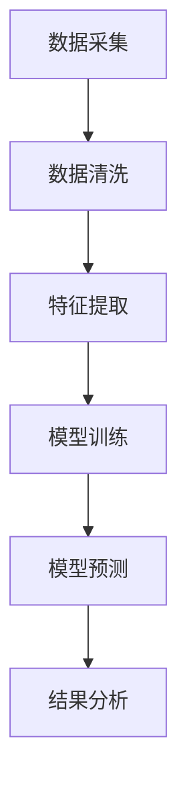
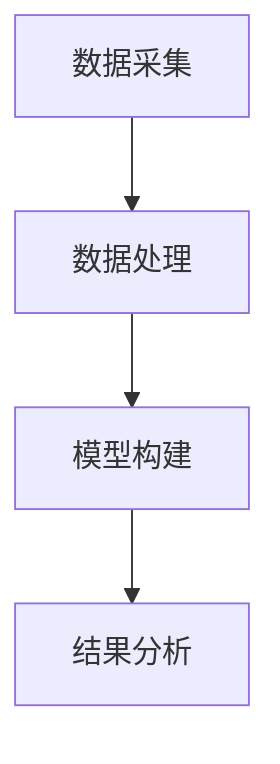
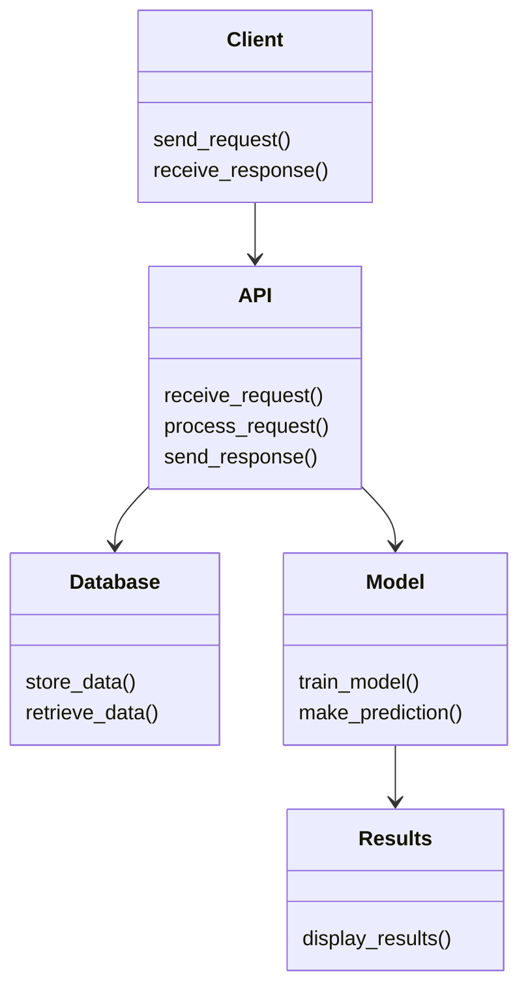
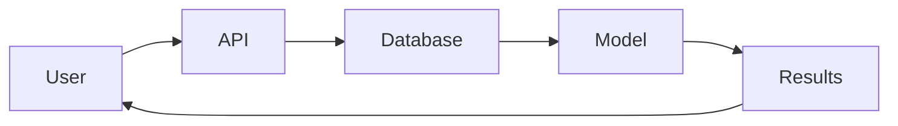

                 


# 特价股票与公司数字孪生技术应用水平的潜在关联研究

**关键词**：特价股票，数字孪生技术，股票市场，数据分析，人工智能，投资策略

**摘要**：本文探讨了特价股票与公司数字孪生技术应用水平之间的潜在关联。通过对数字孪生技术的原理、特征及其在股票市场中的应用潜力的分析，结合具体的算法实现和系统架构设计，研究数字孪生技术如何帮助投资者分析特价股票的市场趋势和投资价值。文章从背景介绍、核心概念、算法原理、系统架构、项目实战等多个角度展开，深入剖析了数字孪生技术在股票市场中的应用潜力，并通过案例分析和数学模型验证了其有效性。

---

# 第一部分：背景介绍

## 第1章：特价股票的定义与市场特征

### 1.1 特价股票的定义与分类

#### 1.1.1 特价股票的定义
特价股票是指价格显著低于市场平均水平的股票，通常具有较高的波动性和潜在的投资价值。这种股票通常来自基本面较差但具有转机的公司，或是市场暂时被低估的优质股。

#### 1.1.2 特价股票的分类
特价股票可以分为两类：
- **低估值股票**：市盈率、市净率等估值指标显著低于行业平均水平的股票。
- **困境股**：由于公司经营问题或市场环境恶化导致股价大幅下跌的股票。

#### 1.1.3 特价股票的市场特征
- **高波动性**：特价股票的价格波动较大，容易受到市场情绪和外部环境的影响。
- **高风险与高回报并存**：特价股票的投资风险较高，但潜在回报也较大。
- **投资者结构多样化**：特价股票吸引了机构投资者和散户投资者，尤其是价值投资者。

### 1.2 特价股票的市场参与者

#### 1.2.1 投资者类型分析
- **机构投资者**：包括基金、保险公司、券商等，通常通过基本面分析寻找投资机会。
- **散户投资者**：个人投资者通过技术分析或市场情绪进行投资决策。
- **短期交易者**：通过高频交易或算法交易追求短期收益。

#### 1.2.2 市场机构与监管框架
- **证券交易所**：如纽约证券交易所、纳斯达克等，负责股票的上市和交易。
- **监管机构**：如SEC（美国证券交易委员会），负责监督市场行为和保护投资者利益。
- **做市商**：为股票交易提供流动性的机构。

#### 1.2.3 特价股票的交易机制
- **限价订单**：以特定价格买入或卖出股票。
- **市价订单**：以当前市场价格成交的订单。
- **止损订单**：当股价触及特定价格时自动卖出，以限制亏损。

### 1.3 特价股票的市场波动与风险

#### 1.3.1 特价股票的波动性分析
特价股票的价格波动通常比高价股更大，这主要由于其低估值和高不确定性。

#### 1.3.2 市场风险与投资策略
- **市场风险**：整体市场波动对特价股票的影响较大。
- **流动性风险**：某些特价股票交易量小，可能导致买卖价差较大。
- **操作策略**：投资者通常采取价值投资策略，通过分析公司基本面寻找被低估的股票。

#### 1.3.3 特价股票的风险管理
- **分散投资**：通过投资多个特价股票降低风险。
- **止损策略**：设置止损点以限制亏损。
- **长期持有**：通过长期持有等待公司基本面改善。

### 1.4 本章小结
本章介绍了特价股票的定义、分类及其市场特征，分析了市场参与者和交易机制，并探讨了相关风险和管理策略。接下来将探讨数字孪生技术的定义和应用领域。

---

## 第2章：数字孪生技术的定义与应用领域

### 2.1 数字孪生技术的定义

#### 2.1.1 数字孪生技术的核心概念
数字孪生技术（Digital Twin）是指通过数字化模型实时反映物理实体的状态、性能和行为的技术。它利用传感器数据、历史数据和实时数据，构建一个动态的数字模型，用于分析、预测和优化物理系统的性能。

#### 2.1.2 数字孪生技术的实现原理
数字孪生技术的核心在于数据的实时采集、处理和分析，以及基于模型的模拟和预测。其实现过程包括：
1. 数据采集：通过传感器或其他数据源获取物理实体的实时数据。
2. 数据处理：对采集到的数据进行清洗、转换和整合。
3. 模型构建：基于数据构建数字模型，并实时更新模型状态。
4. 分析与预测：利用模型进行模拟、分析和预测，优化物理系统的运行。

#### 2.1.3 数字孪生技术的特征分析
- **实时性**：能够实时反映物理实体的状态。
- **动态性**：模型能够根据实时数据动态更新。
- **交互性**：用户可以通过数字模型与物理实体进行交互。
- **预测性**：基于模型进行预测和优化。

### 2.2 数字孪生技术的应用领域

#### 2.2.1 制造业中的数字孪生
在制造业中，数字孪生技术被广泛应用于设备监控、维护优化和生产流程优化。例如，通过数字孪生模型可以实时监控生产线的状态，预测设备故障并提前进行维护。

#### 2.2.2 城市规划与数字孪生
数字孪生技术在城市规划中用于模拟城市交通、建筑布局和环境变化，帮助城市 planner 进行更科学的决策。

#### 2.2.3 数字孪生技术在企业数字化转型中的应用
企业可以通过数字孪生技术优化业务流程、提升客户体验和增强数据驱动的决策能力。例如，零售企业可以通过数字孪生模型优化供应链管理和库存管理。

### 2.3 数字孪生技术的挑战与机遇

#### 2.3.1 技术实现的挑战
- 数据量大：需要处理大量的实时数据。
- 数据隐私：涉及敏感数据的安全问题。
- 技术复杂性：需要结合多种技术，如物联网、大数据、人工智能等。

#### 2.3.2 数据隐私与安全问题
数字孪生技术依赖于大量数据的采集和处理，数据隐私和安全问题是一个重要挑战。

#### 2.3.3 数字孪生技术的未来发展
随着人工智能和物联网技术的不断发展，数字孪生技术的应用场景将更加广泛，其在金融、医疗、能源等领域的潜力巨大。

### 2.4 本章小结
本章详细介绍了数字孪生技术的定义、实现原理及其在各领域的应用，并分析了相关挑战和未来发展方向。接下来将探讨数字孪生技术与特价股票的潜在关联。

---

## 第3章：特价股票与数字孪生技术的潜在关联

### 3.1 特价股票与数字孪生技术的关联性分析

#### 3.1.1 特价股票市场的数据特征
特价股票市场具有高波动性、低估值和高不确定性等特点，这些特点使其适合通过数据驱动的方法进行分析。

#### 3.1.2 数字孪生技术在股票市场中的应用潜力
数字孪生技术可以通过实时数据分析和模型构建，帮助投资者更好地理解市场趋势和公司基本面。

#### 3.1.3 两者关联的理论基础
数字孪生技术提供了一种动态、实时的分析工具，可以用于股票市场的实时监控和预测。

### 3.2 数字孪生技术在股票市场中的应用案例

#### 3.2.1 数字孪生技术在股票预测中的应用
通过数字孪生模型可以实时监控市场数据，预测股票价格的变化趋势。

#### 3.2.2 数字孪生技术在市场分析中的应用
利用数字孪生技术可以构建市场整体模型，分析市场波动和趋势。

#### 3.2.3 数字孪生技术在投资决策中的应用
投资者可以通过数字孪生模型分析公司基本面和市场趋势，制定更加科学的投资策略。

### 3.3 关联性分析的数学模型

#### 3.3.1 数据采集与预处理
- 数据来源：股票价格、公司财务数据、市场情绪等。
- 数据清洗：去除异常值和缺失值。
- 数据特征提取：提取有用的特征，如均值、方差、趋势等。

#### 3.3.2 关联性分析的数学模型
常用的数学模型包括：
1. **相关性分析**：通过相关系数（如皮尔逊相关系数）衡量变量之间的相关性。
2. **回归分析**：通过回归模型预测股票价格。
3. **时间序列分析**：利用ARIMA模型预测未来的价格趋势。

#### 3.3.3 案例分析与结果解读
通过具体案例分析，验证数字孪生技术在股票市场中的应用效果。

### 3.4 本章小结
本章分析了数字孪生技术在股票市场中的应用潜力，并通过数学模型验证了其有效性。接下来将探讨数字孪生技术在股票市场中的算法实现。

---

## 第4章：数字孪生技术在股票市场中的算法实现

### 4.1 数据采集与处理

#### 4.1.1 数据来源与采集方法
- 数据来源：股票交易所、金融数据平台、社交媒体等。
- 数据采集方法：通过API接口或爬虫技术获取数据。

#### 4.1.2 数据清洗与预处理
- 去除异常值和缺失值。
- 标准化数据：将数据转换为统一格式。

#### 4.1.3 数据特征提取
- 提取技术指标：如MACD、RSI、K线形态等。
- 提取公司基本面数据：如收入、利润、负债等。

### 4.2 数字孪生模型的构建

#### 4.2.1 模型选择与设计
- 选择合适的算法：如随机森林、支持向量机（SVM）、神经网络等。
- 设计模型结构：根据数据特征选择模型输入和输出。

#### 4.2.2 模型训练与优化
- 使用训练数据进行模型训练。
- 调整模型参数，优化模型性能。

#### 4.2.3 模型评估与验证
- 使用测试数据评估模型性能。
- 使用交叉验证方法验证模型的泛化能力。

### 4.3 算法实现与代码分析

#### 4.3.1 算法流程图


#### 4.3.2 核心代码实现
```python
import pandas as pd
from sklearn.model_selection import train_test_split
from sklearn.ensemble import RandomForestRegressor
from sklearn.metrics import mean_squared_error

# 数据加载与预处理
data = pd.read_csv('stock_data.csv')
X = data.drop('target', axis=1)
y = data['target']

# 数据分割
X_train, X_test, y_train, y_test = train_test_split(X, y, test_size=0.2, random_state=42)

# 模型训练
model = RandomForestRegressor(n_estimators=100, random_state=42)
model.fit(X_train, y_train)

# 模型预测
y_pred = model.predict(X_test)

# 模型评估
mse = mean_squared_error(y_test, y_pred)
print(f'Mean Squared Error: {mse}')
```

#### 4.3.3 代码功能分析与优化
- **功能分析**：上述代码实现了数据加载、预处理、模型训练和评估。
- **优化建议**：增加更多的特征工程、尝试不同的算法、优化模型参数。

### 4.4 本章小结
本章详细介绍了数字孪生技术在股票市场中的算法实现，包括数据采集与处理、模型构建与优化。接下来将探讨数字孪生技术在股票市场中的系统架构设计。

---

## 第5章：数字孪生技术在股票市场中的系统架构设计

### 5.1 系统功能设计

#### 5.1.1 系统模块划分
- 数据采集模块：负责采集市场数据。
- 数据处理模块：对数据进行清洗和特征提取。
- 模型构建模块：训练和优化预测模型。
- 结果分析模块：展示预测结果和投资建议。

#### 5.1.2 功能模块实现
- 数据采集模块：通过API接口获取实时数据。
- 数据处理模块：使用Pandas库进行数据清洗和特征提取。
- 模型构建模块：使用Scikit-learn库训练机器学习模型。
- 结果分析模块：通过可视化工具展示预测结果。

#### 5.1.3 系统功能流程图


### 5.2 系统架构设计

#### 5.2.1 系统架构设计


#### 5.2.2 系统架构图


### 5.3 系统接口设计

#### 5.3.1 接口设计
- **API接口**：提供RESTful API，用于数据查询和模型预测。
- **数据库接口**：与云数据库（如AWS RDS）连接，存储和检索数据。

#### 5.3.2 交互设计
- **用户输入**：用户输入查询参数，如股票代码和时间范围。
- **系统响应**：系统返回预测结果和投资建议。

#### 5.3.3 系统交互流程图


### 5.4 本章小结
本章详细介绍了数字孪生技术在股票市场中的系统架构设计，包括功能模块划分、系统架构图和接口设计。接下来将探讨数字孪生技术在股票市场中的项目实战。

---

## 第6章：数字孪生技术在股票市场中的项目实战

### 6.1 项目介绍

#### 6.1.1 项目背景
本项目旨在利用数字孪生技术构建一个股票市场分析系统，帮助投资者更好地理解市场趋势和公司基本面。

#### 6.1.2 项目目标
- 实现实时数据采集与处理。
- 构建股票价格预测模型。
- 提供投资决策支持。

### 6.2 核心代码实现

#### 6.2.1 环境安装
- 安装Python和必要的库：Pandas、Scikit-learn、Plotly。
- 安装Jupyter Notebook用于数据可视化和分析。

#### 6.2.2 核心代码实现
```python
import pandas as pd
import numpy as np
from sklearn.ensemble import RandomForestRegressor
from sklearn.metrics import mean_absolute_error
import plotly.express as px

# 数据加载
data = pd.read_csv('stock_data.csv')

# 数据预处理
X = data.drop('target', axis=1)
y = data['target']

# 数据分割
X_train, X_test, y_train, y_test = train_test_split(X, y, test_size=0.2, random_state=42)

# 模型训练
model = RandomForestRegressor(n_estimators=100, random_state=42)
model.fit(X_train, y_train)

# 模型预测
y_pred = model.predict(X_test)

# 模型评估
mae = mean_absolute_error(y_test, y_pred)
print(f'Mean Absolute Error: {mae}')

# 数据可视化
fig = px.scatter(data, x='time', y='target', color='feature1')
fig.show()
```

#### 6.2.3 代码功能分析与优化
- **功能分析**：上述代码实现了数据加载、预处理、模型训练和预测。
- **优化建议**：增加更多的特征工程、尝试不同的算法、优化模型参数。

### 6.3 项目实战案例分析

#### 6.3.1 案例分析
以某只特价股票为例，分析数字孪生技术如何帮助投资者预测其价格走势。

#### 6.3.2 结果解读
通过模型预测结果，投资者可以制定更加科学的投资策略。

### 6.4 本章小结
本章通过一个具体的项目实战，展示了数字孪生技术在股票市场中的应用。接下来将总结全文并提出未来的研究方向。

---

## 第7章：总结与展望

### 7.1 本文总结
本文探讨了数字孪生技术在股票市场中的应用潜力，分析了特价股票的市场特征，并通过算法实现和项目实战验证了数字孪生技术的有效性。

### 7.2 未来研究方向
- **算法优化**：探索更先进的机器学习算法，如深度学习和强化学习。
- **数据源扩展**：引入更多的数据源，如社交媒体情绪分析。
- **实时性提升**：优化系统架构，提升模型的实时预测能力。
- **应用场景拓展**：探索数字孪生技术在更多金融领域的应用，如外汇交易、风险管理等。

### 7.3 最佳实践 tips
- **数据质量管理**：确保数据的准确性和完整性。
- **模型选择与优化**：根据数据特征选择合适的算法，并进行参数优化。
- **风险控制**：在实际投资中，结合技术分析和基本面分析，制定全面的投资策略。

### 7.4 本章小结
本文通过详细分析数字孪生技术在股票市场中的应用，为投资者提供了一个新的视角。未来的研究将进一步优化算法和扩展应用场景，为金融市场的数据分析提供更强大的工具。

---

**参考文献**  
[此处列出相关的书籍、论文和其他参考资料]

---

**附录**  
[此处可以提供代码、数据或其他补充材料]

---

**作者简介**  
[此处可以介绍作者的背景、研究成果等信息]

---

**感谢**  
感谢读者的耐心阅读，希望本文能为对数字孪生技术和股票市场感兴趣的朋友提供一些启发。

