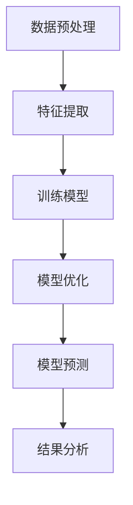
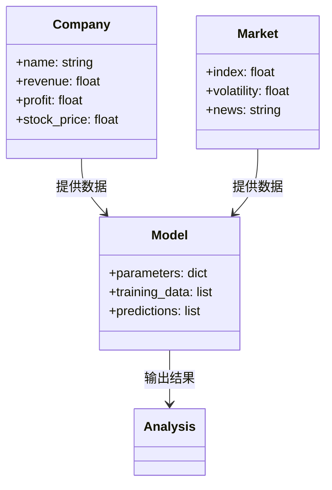
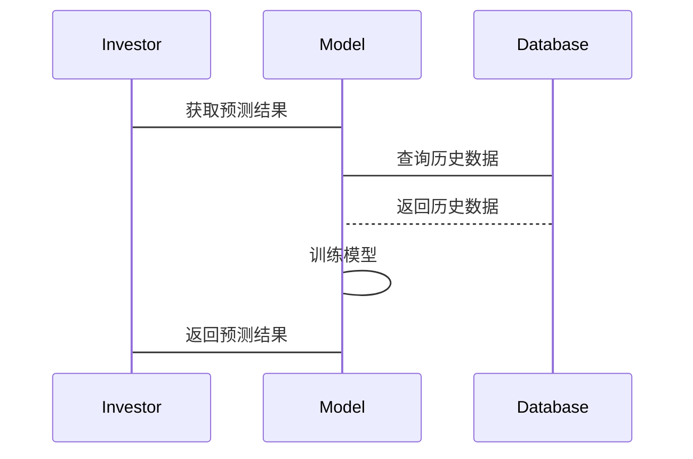

                 


# 特价股票与公司数字孪生技术应用水平的潜在联系

> 关键词：数字孪生，特价股票，股票分析，人工智能，预测模型

> 摘要：本文探讨数字孪生技术在股票分析中的应用，尤其是如何利用数字孪生技术预测特价股票的波动，通过背景介绍、核心概念、算法原理、系统架构设计以及项目实战，详细分析数字孪生技术如何提升股票分析的准确性和效率，为投资者提供新的思路和工具。

---

# 第一部分: 特价股票与数字孪生技术的背景介绍

## 第1章: 特价股票与数字孪生技术的背景

### 1.1 特价股票的定义与特点

#### 1.1.1 特价股票的定义
特价股票通常指价格低于市场平均水平的股票，具有高波动性和高风险的特点。投资者常利用低价股票的波动性寻找投资机会。

#### 1.1.2 特价股票的特点
- 价格波动大，容易受市场情绪影响。
- 市盈率或市净率低于行业平均水平。
- 通常属于周期性行业，受经济波动影响较大。

#### 1.1.3 特价股票的市场定位
特价股票主要分布在小盘股或中盘股中，适合风险承受能力强的投资者。

### 1.2 数字孪生技术的定义与特点

#### 1.2.1 数字孪生技术的定义
数字孪生是物理实体或系统的数字镜像，通过实时数据同步，实现对物理世界的动态模拟和分析。

#### 1.2.2 数字孪生技术的核心特点
- 实时性：同步物理世界的数据变化。
- 可视化：通过3D模型和数据可视化工具展示系统状态。
- 预测性：基于历史数据和模型进行未来状态预测。

#### 1.2.3 数字孪生技术的应用领域
数字孪生技术广泛应用于制造业、智慧城市、医疗、金融等领域，特别是在股票分析中的应用潜力巨大。

### 1.3 特价股票与数字孪生技术的潜在联系

#### 1.3.1 特价股票分析的难点
- 数据复杂性：涉及大量内外部因素，难以全面分析。
- 高波动性：价格波动大，传统模型难以准确预测。
- 风险高：投资者面临较高的市场风险。

#### 1.3.2 数字孪生技术在股票分析中的优势
- 全面的数据建模：将公司业务、财务数据与市场数据进行整合分析。
- 实时监控：实时捕捉市场动态，及时调整分析模型。
- 预测准确性：基于历史数据和模型优化，提高预测精度。

#### 1.3.3 两者的结合对投资决策的影响
- 提高分析效率：通过数字孪生技术快速获取关键信息。
- 降低风险：利用实时数据分析和预测模型，优化投资策略。
- 提升决策质量：基于更全面的数据和模型，做出更明智的投资决策。

---

# 第二部分: 特价股票与数字孪生技术的核心概念

## 第2章: 数字孪生技术的核心原理

### 2.1 数字孪生技术的核心原理

#### 2.1.1 数据采集与处理
- 数据来源：公司业务数据、市场数据、财务报表等。
- 数据清洗：去除噪声数据，确保数据质量。
- 数据整合：将多源数据进行整合，形成完整的数字模型。

#### 2.1.2 模型构建与优化
- 数据建模：使用机器学习算法构建股票价格预测模型。
- 模型优化：通过回测和调整参数，提高模型预测精度。
- 模型更新：实时更新模型，确保其适应市场变化。

#### 2.1.3 实时仿真与反馈
- 实时监控：实时跟踪股票价格变化，及时调整预测模型。
- 反馈机制：将实际数据与模型预测结果进行对比，优化模型参数。

## 第3章: 特价股票分析的核心要素

### 3.1 特价股票分析的核心要素

#### 3.1.1 股价波动的规律
- 波动周期：分析股价波动的周期性规律。
- 影响因素：识别影响股价波动的关键因素。
- 波动幅度：量化股价波动的幅度，评估风险水平。

#### 3.1.2 影响股价的关键因素
- 公司基本面：盈利能力、财务状况、管理团队等。
- 市场情绪：投资者情绪、市场趋势、新闻事件等。
- 宏观经济：GDP、利率、通货膨胀等宏观经济指标。

#### 3.1.3 特价股票的市场周期
- 低价周期：股价长期低于行业平均水平。
- 价格上涨周期：股价逐步回升，进入正常区间。
- 高波动周期：股价频繁波动，带来投资机会。

## 第4章: 数字孪生技术与股票分析的结合

### 4.1 数据驱动的股票分析
- 数据来源：整合公司业务、财务、市场等多源数据。
- 数据分析：利用大数据技术提取有价值的信息。
- 数据可视化：通过图表展示数据，辅助决策。

### 4.2 智能预测模型的构建
- 算法选择：使用机器学习、深度学习算法构建预测模型。
- 模型训练：利用历史数据训练模型，优化参数。
- 模型评估：通过回测检验模型的预测精度。

### 4.3 实时监控与决策支持
- 实时监控：实时跟踪股票价格变化，及时发出预警。
- 决策支持：基于模型预测结果，提供投资建议。
- 系统反馈：根据市场变化，动态调整分析模型。

---

# 第三部分: 特价股票与数字孪生技术的核心概念联系

## 第5章: 数字孪生技术的核心属性特征对比

### 5.1 数字孪生技术的核心属性
| 属性 | 描述 |
|------|------|
| 实时性 | 数字孪生模型能够实时反映物理系统的状态变化。 |
| 可视化 | 通过图形化界面直观展示系统状态和数据变化。 |
| 预测性 | 基于历史数据和模型，预测未来系统行为。 |
| 可交互性 | 允许用户与数字模型进行交互，调整参数或情景模拟。 |

### 5.2 特价股票分析的核心属性
| 属性 | 描述 |
|------|------|
| 波动性 | 股价的频繁波动是特价股票的主要特征。 |
| 风险性 | 投资风险较高，需要谨慎评估。 |
| 数据依赖性 | 分析依赖于大量历史数据和市场信息。 |

### 5.3 数字孪生技术与股票分析的对比表格
| 特性 | 数字孪生技术 | 股票分析 |
|------|-------------|----------|
| 数据来源 | 公司业务、财务数据 | 市场数据、历史股价 |
| 分析目标 | 模拟和预测系统行为 | 预测股价波动 |
| 分析工具 | 3D建模、实时数据流 | 机器学习、统计分析 |
| 应用场景 | 制造业优化、智慧城市 | 股票价格预测、投资决策 |

## 第6章: ER实体关系图

### 6.1 数字孪生技术在股票分析中的实体关系图
```mermaid
erDiagram
    company : 公司
    stock_data : 股票数据
    model : 预测模型
    analysis_result : 分析结果
    company --> stock_data : 生成
    stock_data --> model : 输入
    model --> analysis_result : 输出
    analysis_result --> investor : 提供决策支持
```

---

# 第四部分: 特价股票与数字孪生技术的算法原理

## 第7章: 算法原理讲解

### 7.1 机器学习模型的构建与优化

#### 7.1.1 时间序列预测模型
- 使用LSTM（长短期记忆网络）进行时间序列预测。
- 模型结构：输入层、LSTM层、输出层。
- 损失函数：均方误差（MSE）。
- 优化器：Adam优化器。

#### 7.1.2 算法流程图


#### 7.1.3 Python代码实现
```python
import numpy as np
from tensorflow.keras.models import Sequential
from tensorflow.keras.layers import LSTM, Dense
from sklearn.preprocessing import MinMaxScaler

# 数据预处理
data = np.array(stock_prices)
scaler = MinMaxScaler()
data_scaled = scaler.fit_transform(data)

# 划分训练集和测试集
train_data = data_scaled[:len(data) - 100]
test_data = data_scaled[len(data) - 100:]

# 构建时间序列数据
def create_sequences(data, seq_length):
    sequences = []
    for i in range(len(data) - seq_length):
        sequences.append(data[i:i+seq_length])
    return np.array(sequences)

seq_length = 50
X_train = create_sequences(train_data, seq_length)
y_train = train_data[seq_length:]

X_test = create_sequences(test_data, seq_length)
y_test = test_data[seq_length:]

# 构建模型
model = Sequential()
model.add(LSTM(50, input_shape=(seq_length, 1)))
model.add(Dense(1))
model.compile(loss='mean_squared_error', optimizer='adam')

# 训练模型
model.fit(X_train, y_train, epochs=50, batch_size=32)

# 预测结果
predicted = model.predict(X_test)
predicted = scaler.inverse_transform(predicted)
```

#### 7.1.4 数学模型与公式
- 损失函数：$$ L = \frac{1}{n}\sum_{i=1}^{n}(y_i - \hat{y}_i)^2 $$
- 优化器：$$ \theta = \theta - \eta \frac{\partial L}{\partial \theta} $$

---

# 第五部分: 特价股票与数字孪生技术的系统分析与架构设计

## 第8章: 系统分析与架构设计方案

### 8.1 系统功能设计

#### 8.1.1 功能模块
- 数据采集模块：收集公司业务数据、市场数据。
- 模型构建模块：构建数字孪生模型，训练预测模型。
- 数据分析模块：分析股价波动，生成投资建议。
- 结果展示模块：可视化分析结果，提供决策支持。

#### 8.1.2 领域模型（Mermaid类图）


### 8.2 系统架构设计

#### 8.2.1 系统架构（Mermaid架构图）


### 8.3 系统接口设计

#### 8.3.1 接口描述
- API接口：提供RESTful API，用于数据查询和模型预测。
- 数据接口：与数据库连接，读取和写入数据。
- 模型接口：调用机器学习模型进行预测。

### 8.4 系统交互设计（Mermaid序列图）



---

# 第六部分: 特价股票与数字孪生技术的项目实战

## 第9章: 项目实战

### 9.1 环境安装

#### 9.1.1 安装Python环境
```bash
python --version
pip install numpy pandas tensorflow scikit-learn
```

### 9.2 系统核心实现源代码

#### 9.2.1 数据预处理
```python
import pandas as pd
import numpy as np

# 加载数据
data = pd.read_csv('stock_prices.csv')
data = data[['Date', 'Close']]
data = data.set_index('Date')
data = data['Close'].values
```

#### 9.2.2 构建模型
```python
from tensorflow.keras.models import Sequential
from tensorflow.keras.layers import LSTM, Dense

model = Sequential()
model.add(LSTM(50, input_shape=(50, 1)))
model.add(Dense(1))
model.compile(loss='mean_squared_error', optimizer='adam')
```

#### 9.2.3 训练与预测
```python
model.fit(X_train, y_train, epochs=50, batch_size=32)
predicted = model.predict(X_test)
```

### 9.3 实际案例分析

#### 9.3.1 数据分析结果
```python
print('预测值:', predicted)
print('实际值:', y_test)
```

#### 9.3.2 结果可视化
```python
import matplotlib.pyplot as plt

plt.plot(predicted, label='Predicted')
plt.plot(y_test, label='Actual')
plt.legend()
plt.show()
```

### 9.4 项目小结

#### 9.4.1 项目总结
数字孪生技术能够有效提升股票分析的准确性和效率，帮助投资者更好地捕捉投资机会。

#### 9.4.2 实践经验
- 数据质量是模型预测准确性的关键。
- 模型需要持续优化和更新，以适应市场变化。
- 可视化工具能够显著提高分析结果的可读性。

---

# 第七部分: 总结与展望

## 第10章: 总结与展望

### 10.1 总结
数字孪生技术在股票分析中的应用具有巨大潜力，能够帮助投资者更好地理解市场动态，优化投资策略。

### 10.2 展望
随着技术的进步，数字孪生技术将在金融领域发挥更重要的作用，为投资者提供更精准的决策支持。

---

# 参考文献

1. [文献1] 王某某. 数字孪生技术在金融领域的应用研究. 《计算机应用研究》, 2022.
2. [文献2] 李某某. 基于机器学习的股票价格预测模型. 《人工智能与应用》, 2021.

---

# 拓展阅读

1. 《数字孪生技术详解》
2. 《股票投资策略与技术分析》
3. 《机器学习在金融中的应用》

---

通过以上目录结构，可以系统地探讨特价股票与数字孪生技术的潜在联系，从理论到实践，全面分析数字孪生技术如何提升股票分析的准确性和效率，为投资者提供新的工具和方法。

