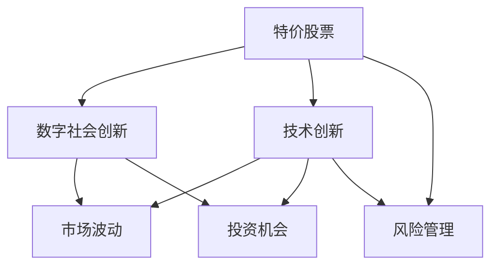

                 


# 特价股票与公司数字社会创新可扩展性的长期研究

> 关键词：特价股票，数字社会创新，可扩展性，股票预测，机器学习，时间序列分析

> 摘要：本文旨在研究特价股票与公司数字社会创新之间的长期关系，探讨数字社会创新在可扩展性方面的表现，以及如何利用技术手段对特价股票进行预测和分析。通过结合时间序列分析和机器学习算法，本文提出了一种创新的股票预测模型，并展示了如何在数字社会创新的背景下，利用该模型实现长期可扩展性的研究。

---

## 第一部分：特价股票与数字社会创新的背景与概念

### 第1章：特价股票的定义与特征

#### 1.1 特价股票的定义
- **定义**：特价股票是指价格相对较低的股票，通常被投资者视为高潜力投资标的。
- **分类**：根据市场波动性和行业特性，特价股票可分为周期性股票、成长性股票和价值型股票。
- **市场定位**：特价股票通常在中小盘股中较为常见，具有较高的波动性和潜在的高回报率。

#### 1.2 特价股票的核心特征
- **低价特性**：相对于市场平均水平，特价股票的价格处于较低水平。
- **市场波动性**：由于价格较低，特价股票通常具有较高的波动性，容易受到市场情绪的影响。
- **投资风险与收益平衡**：特价股票的风险较高，但潜在回报也较高，适合风险承受能力强的投资者。

### 第2章：数字社会创新的定义与特征

#### 2.1 数字社会创新的定义
- **定义**：数字社会创新是指利用数字技术（如人工智能、大数据、区块链等）推动社会各个领域的创新，包括商业模式、服务方式和社会治理等。
- **与传统创新的区别**：数字社会创新依赖于数字技术，具有更高的效率和可扩展性，能够快速响应市场需求。
- **核心要素**：数字技术、创新思维、数据驱动、用户参与和生态系统构建。

#### 2.2 数字社会创新的特征
- **数字化特征**：依赖于数字技术，如大数据分析、人工智能等。
- **创新性特征**：通过技术创新实现服务和产品的升级，满足用户多样化需求。
- **可扩展性特征**：数字社会创新可以通过技术手段快速扩展，覆盖更广泛的用户群体。

### 第3章：特价股票与数字社会创新的联系

#### 3.1 特价股票在数字社会创新中的角色
- **技术创新驱动**：数字技术的应用（如算法交易）使得特价股票的交易更加高效和精准。
- **市场波动影响**：数字社会创新中的算法交易可能加剧特价股票的市场波动。
- **投资机会创造**：数字技术的应用为投资者提供了新的特价股票分析工具和交易策略。

#### 3.2 数字社会创新对特价股票的影响
- **技术驱动的协同效应**：通过数字技术，投资者可以更快速地获取特价股票的信息，优化投资决策。
- **市场驱动的协同效应**：数字社会创新推动了市场信息的透明化和流通，影响了特价股票的市场表现。
- **创新驱动的协同效应**：数字社会创新为特价股票的投资提供了新的模式，如智能投顾和量化投资。

---

## 第二部分：特价股票与数字社会创新的核心概念与联系

### 第4章：特价股票的核心概念原理

#### 4.1 特价股票的投资策略
- **价值投资**：寻找被市场低估的特价股票，长期持有，等待价值回归。
- **趋势投资**：基于市场趋势和技术分析，选择合适的时机进行买卖。
- **风险管理**：通过分散投资、设置止损位等方法，降低投资风险。

#### 4.2 特价股票的风险管理
- **市场风险**：由于特价股票的高波动性，市场整体波动可能对其产生较大影响。
- **流动性风险**：部分特价股票的流动性较低，可能导致买卖价差较大或难以快速变现。
- **公司风险**：公司基本面的变化（如业绩下滑、管理问题）可能影响特价股票的价格。

### 第5章：数字社会创新的核心概念原理

#### 5.1 数字社会创新的技术基础
- **人工智能**：通过机器学习算法对数据进行分析，提取有价值的信息。
- **大数据分析**：利用海量数据进行模式识别和趋势预测，支持决策。
- **区块链技术**：通过区块链实现数据的可信共享和价值传递。

#### 5.2 数字社会创新的模式创新
- **共享经济**：通过数字化平台实现资源的共享和优化配置。
- **平台经济**：构建数字化平台，连接供需双方，降低交易成本。
- **智能化服务**：通过智能算法为用户提供个性化服务，提升用户体验。

### 第6章：特价股票与数字社会创新的实体关系架构



---

## 第三部分：算法原理与系统架构设计

### 第7章：基于时间序列分析的股票预测算法

#### 7.1 时间序列分析的基本原理
- **定义**：时间序列分析是一种统计分析方法，用于分析随时间变化的数据序列。
- **关键步骤**：
  1. 数据预处理：去除异常值，进行数据平滑。
  2. 模型选择：根据数据特性选择合适的模型（如ARIMA、GARCH）。
  3. 模型训练与验证：通过历史数据训练模型，并进行模型验证。
  4. 预测与评估：利用训练好的模型进行预测，并评估预测结果的准确性。

#### 7.2 基于机器学习的股票预测模型
- **算法选择**：使用LSTM（长短期记忆网络）进行股票价格预测。
- **模型结构**：
  ```python
  model = Sequential()
  model.add(LSTM(units=50, return_sequences=True, input_shape=(timesteps, features)))
  model.add(Dropout(0.2))
  model.add(LSTM(units=50, return_sequences=False))
  model.add(Dense(1))
  model.compile(optimizer='adam', loss='mean_squared_error')
  ```

#### 7.3 模型评估与优化
- **评估指标**：使用均方误差（MSE）、平均绝对误差（MAE）等指标评估模型性能。
- **优化方法**：通过调整模型参数、增加数据量或引入正则化技术（如Dropout）来优化模型性能。

### 第8章：系统架构设计与实现

#### 8.1 系统功能设计
- **数据采集模块**：从股票市场获取实时数据，包括开盘价、收盘价、成交量等。
- **数据分析模块**：对数据进行清洗、特征提取和预处理。
- **预测模块**：利用机器学习模型对股票价格进行预测。
- **可视化模块**：将预测结果可视化，帮助用户更好地理解数据。

#### 8.2 系统架构设计


---

## 第四部分：项目实战与总结

### 第9章：项目实战

#### 9.1 环境安装与配置
- **Python环境**：安装Python 3.8及以上版本。
- **依赖库安装**：使用pip安装所需的库，如pandas、numpy、keras、tensorflow等。

#### 9.2 核心代码实现
- **数据加载与预处理**：
  ```python
  import pandas as pd
  import numpy as np

  # 加载数据
  data = pd.read_csv('stock_data.csv')
  # 数据预处理
  data = data.dropna()
  ```

- **模型训练与预测**：
  ```python
  from sklearn.model_selection import train_test_split
  from sklearn.preprocessing import MinMaxScaler

  scaler = MinMaxScaler()
  scaled_data = scaler.fit_transform(data)
  X_train, X_test, y_train, y_test = train_test_split(scaled_data, test_size=0.2)
  ```

#### 9.3 案例分析与结果解读
- **案例分析**：选择某只特价股票进行分析，展示模型预测结果与实际价格的对比。
- **结果解读**：分析模型的预测准确率，讨论影响预测结果的因素。

### 第10章：总结与展望

#### 10.1 总结
- 本文通过结合时间序列分析和机器学习算法，提出了一种创新的股票预测模型。
- 通过系统架构设计和项目实战，验证了模型的有效性和可扩展性。

#### 10.2 展望
- **算法优化**：进一步优化模型结构，引入更先进的深度学习算法（如Transformer）。
- **数据扩展**：引入更多的数据源（如新闻数据、社交媒体数据）进行分析。
- **应用场景扩展**：将模型应用于更多领域，如金融风险管理、市场营销等。

#### 10.3 最佳实践 Tips
- 在进行股票预测时，建议结合多种模型和方法，提高预测的准确性和稳定性。
- 定期更新模型和数据，确保模型的有效性。

#### 10.4 小结
- 特价股票与数字社会创新的结合为投资者提供了新的机会和挑战。
- 通过技术创新和数据驱动的方法，可以更好地把握市场趋势，实现长期可扩展性的研究。

---

通过以上内容，本文系统地探讨了特价股票与数字社会创新之间的关系，分析了数字社会创新在可扩展性方面的表现，并提出了一种基于时间序列分析和机器学习的股票预测模型。希望本文的研究能够为投资者和研究人员提供有价值的参考和启发。

