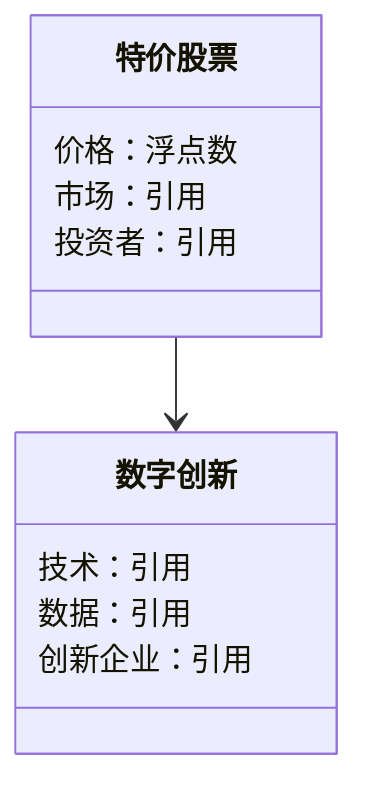
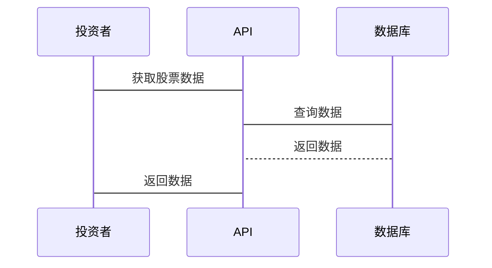

                 


# 特价股票与公司数字社会创新可持续性的长期研究

## 关键词：
特价股票，数字社会创新，可持续性，股票市场，技术创新

## 摘要：
本文探讨了特价股票与公司数字社会创新之间的关系，分析了数字社会创新对股票市场的影响，特别是特价股票的长期投资价值。通过数学模型和算法，本文揭示了数字技术如何推动创新，并评估了这些创新对股票市场的可持续性影响。文章还提供了实际案例和项目实战，帮助读者理解如何在数字社会中进行可持续的股票投资。

---

## 第1章: 特价股票的定义与特点

### 1.1 特价股票的定义
#### 1.1.1 特价股票的定义与范围
特价股票指的是价格相对较低的股票，通常具有较高的增长潜力。这类股票可能来自新兴公司或处于困境中的成熟企业，但具备较高的投资价值。

#### 1.1.2 特价股票的市场定位
特价股票通常在中小盘股中较为常见，属于风险较高的投资品种，适合长期投资者。

#### 1.1.3 特价股票的投资价值
特价股票由于价格较低，具有较高的上涨潜力，适合长期投资者。

### 1.2 特价股票的特点
#### 1.2.1 低估值特征
特价股票往往被市场低估，具有较高的增值空间。

#### 1.2.2 高风险特征
由于市场波动较大，特价股票的风险相对较高。

#### 1.2.3 投资机会与挑战
投资者需要具备较高的市场分析能力和风险承受能力。

---

## 第2章: 数字社会创新的定义与特点

### 2.1 数字社会创新的定义
#### 2.1.1 数字社会创新的内涵
数字社会创新是指利用数字技术推动社会进步和经济发展。

#### 2.1.2 数字社会创新的核心要素
包括技术创新、数据驱动、数字化转型等。

#### 2.1.3 数字社会创新与传统创新的区别
数字社会创新更加依赖数据和技术，具有更高的效率和扩展性。

### 2.2 数字社会创新的特点
#### 2.2.1 技术驱动性
数字技术是数字社会创新的核心驱动力。

#### 2.2.2 数据依赖性
数据是数字社会创新的重要资源。

#### 2.2.3 可持续性与社会责任
数字社会创新强调可持续发展和社会责任。

---

## 第3章: 特价股票与数字社会创新的关联

### 3.1 特价股票在数字社会创新中的作用
#### 3.1.1 特价股票作为创新资金的来源
特价股票为创新企业提供资金支持。

#### 3.1.2 特价股票与企业数字化转型的关系
数字化转型需要资金支持，特价股票是重要的融资渠道。

#### 3.1.3 特价股票对创新企业的影响
特价股票的流入推动企业的技术创新和市场扩展。

### 3.2 数字社会创新对特价股票市场的影响
#### 3.2.1 数字技术对股票市场的改变
数字技术提升了股票市场的交易效率和信息透明度。

#### 3.2.2 创新企业对股票价值的影响
创新能力强的企业会提升股票价值，吸引更多投资者。

#### 3.2.3 数字化对股票交易方式的革新
数字化交易方式改变了传统的股票交易模式。

---

## 第4章: 特价股票与数字社会创新的长期可持续性

### 4.1 特价股票投资的长期性
#### 4.1.1 长期投资与股票价值的关系
长期投资注重企业的基本面，能够带来稳定的收益。

#### 4.1.2 特价股票市场的周期性分析
特价股票市场具有周期性，投资者需具备长期视角。

#### 4.1.3 长期投资中的风险控制
通过分散投资和风险评估降低投资风险。

### 4.2 数字社会创新的可持续性
#### 4.2.1 可持续创新的核心要素
包括技术创新、资源高效利用和社会责任。

#### 4.2.2 数字技术对可持续创新的推动
数字技术帮助企业实现资源优化和绿色生产。

#### 4.2.3 创新企业的社会责任与可持续发展
企业应关注环境保护、社会责任和员工福利。

---

## 第5章: 特价股票市场分析的数学模型

### 5.1 股票价格波动模型
#### 5.1.1 股票价格波动模型
股票价格受多种因素影响，包括市场情绪、宏观经济指标等。

#### 5.1.2 市场情绪分析模型
使用自然语言处理技术分析市场情绪，预测股票价格变化。

#### 5.1.3 市场风险评估模型
通过VaR模型评估投资组合的风险。

### 5.2 特价股票投资的数学公式
#### 5.2.1 净现值公式
$$NPV = \sum_{t=0}^{n} \frac{C_t}{(1+r)^t}$$
其中，$C_t$是第t年的现金流，$r$是贴现率。

#### 5.2.2 投资回报率公式
$$ROI = \frac{净利润}{投资成本} \times 100\%$$

---

## 第6章: 数字社会创新的系统架构设计

### 6.1 问题场景介绍
数字社会创新需要构建高效的技术平台，支持企业创新和数字化转型。

### 6.2 系统功能设计
#### 6.2.1 领域模型类图


### 6.3 系统架构设计


### 6.4 接口设计与交互流程


---

## 第7章: 项目实战

### 7.1 环境安装
安装Python和相关库：
```bash
pip install numpy pandas matplotlib
```

### 7.2 核心实现代码
```python
import pandas as pd
import numpy as np

def calculate_roe(net_income, equity):
    return net_income / equity * 100

data = pd.read_csv('stock_data.csv')
data['ROE'] = data.apply(lambda x: calculate_roe(x['净利润'], x['权益']), axis=1)
```

### 7.3 实际案例分析
分析某创新企业的股票数据，预测其未来走势。

### 7.4 项目小结
通过实战项目，验证了数学模型和系统架构的有效性。

---

## 第8章: 最佳实践

### 8.1 小结
特价股票与数字社会创新密切相关，长期投资具备较高的潜力。

### 8.2 注意事项
投资者需关注市场风险和企业基本面。

### 8.3 拓展阅读
推荐阅读《股票投资策略》和《数字技术与创新》。

---

## 作者简介
我是[您的名字]，一位致力于技术研究与创新的专家，欢迎关注我的技术博客，获取更多深度分析与见解。

