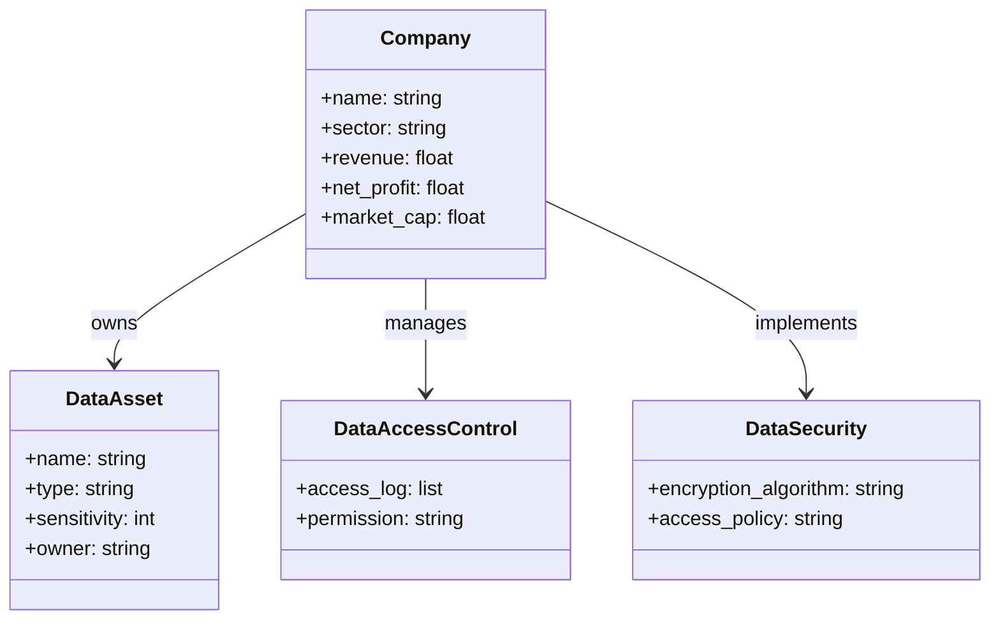
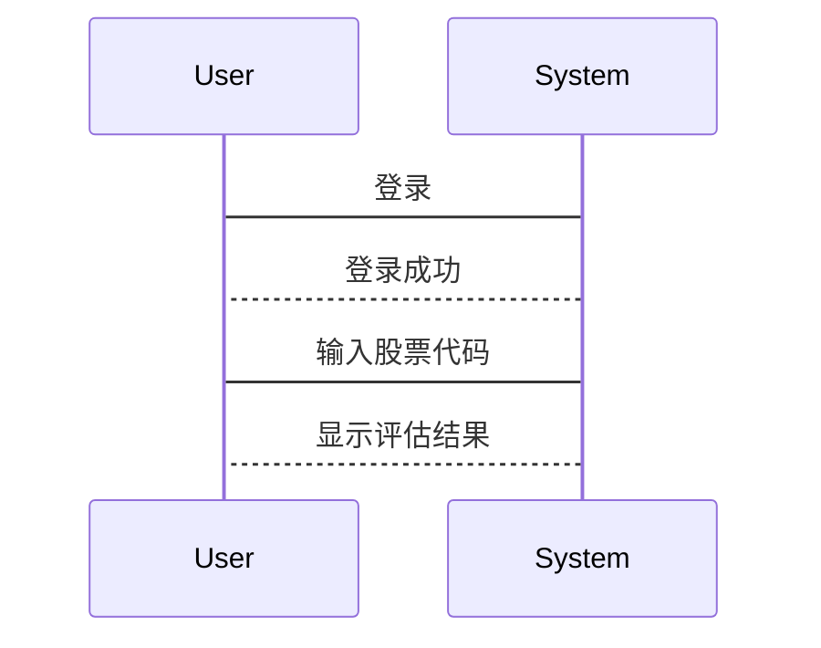

                 


# 特价股票与公司数据主权价值链的评估

> 关键词：特价股票、数据主权、价值链评估、算法原理、系统架构、项目实战

> 摘要：本文深入探讨了特价股票与公司数据主权之间的关系，并提出了基于数据主权的公司价值链评估方法。通过技术分析和数学建模，结合实际案例，详细阐述了如何利用数据主权提升公司的价值，以及如何评估特价股票的投资潜力。

---

# 第一部分: 特价股票与公司数据主权概述

## 第1章: 特价股票的基本概念

### 1.1 特价股票的定义与特点

#### 1.1.1 特价股票的定义
特价股票是指价格低于市场平均值的股票，通常被认为具有较高的投资潜力。这类股票可能由于市场波动、公司短期问题或行业周期性影响而被低估。

#### 1.1.2 特价股票的核心特点
- **低估值**：市盈率、市净率等指标低于行业平均水平。
- **高潜力**：潜在的上涨空间较大。
- **风险较高**：通常伴随着较高的波动性和不确定性。

#### 1.1.3 特价股票与普通股票的区别
| 属性       | 特价股票                     | 普通股票                     |
|------------|------------------------------|------------------------------|
| 价格水平   | 低于市场平均值               | 接近或高于市场平均值         |
| 投资风险   | 较高                        | 较低                        |
| 上涨潜力   | 较高                        | 较低                        |

### 1.2 特价股票的分类

#### 1.2.1 按市场划分的分类
- **小盘股**：市场资本较低，通常波动较大。
- **大盘股**：市场资本较高，相对稳定。

#### 1.2.2 按公司规模划分的分类
- **成长型股票**：公司处于成长阶段，未来有较高的增长潜力。
- **价值型股票**：公司当前估值低于其实际价值。

#### 1.2.3 按行业划分的分类
- **周期性行业股票**：如能源、原材料等行业，受经济周期影响较大。
- **防御性行业股票**：如公用事业、医疗保健等行业，波动较小。

### 1.3 特价股票的投资价值

#### 1.3.1 特价股票的投资机会
- 市场波动带来的短期收益。
- 公司基本面改善后的长期增值。

#### 1.3.2 特价股票的风险分析
- **市场风险**：整体市场波动可能影响股票价格。
- **公司风险**：公司自身问题可能导致股价进一步下跌。
- **流动性风险**：某些特价股票可能流动性较差，难以快速变现。

#### 1.3.3 特价股票的长期与短期价值
- **短期**：适合投机性交易，追求快速收益。
- **长期**：适合价值投资，关注公司基本面的改善。

---

## 第2章: 公司数据主权的核心概念

### 2.1 数据主权的定义与内涵

#### 2.1.1 数据主权的定义
数据主权是指公司对其数据的完全所有权和控制权，包括数据的收集、存储、处理和使用的权利。

#### 2.1.2 数据主权的核心内涵
- **数据所有权**：公司对其数据的合法拥有权。
- **数据使用权**：公司对数据的合法使用权。
- **数据控制权**：公司对数据的管理权和控制权。

#### 2.1.3 数据主权的法律与伦理维度
- **法律维度**：数据主权受法律法规的保护，如《数据保护法》。
- **伦理维度**：数据的使用应遵循道德规范，保护用户隐私。

### 2.2 数据主权的边界与外延

#### 2.2.1 数据主权的边界
- **数据范围**：仅限于公司内部数据，不包括外部数据。
- **使用范围**：仅限于公司内部的业务活动。

#### 2.2.2 数据主权的外延
- **数据共享**：在合法合规的前提下，与其他机构共享数据。
- **数据开放**：公开数据以促进技术创新和社会发展。

#### 2.2.3 数据主权与其他概念的关系
- **数据隐私**：数据主权与数据隐私密切相关，但数据主权更强调所有权和控制权。
- **数据安全**：数据主权的实现依赖于数据安全措施。

### 2.3 数据主权的核心要素

#### 2.3.1 数据的所有权
- 公司对其数据拥有完全的所有权，包括数据的归属和使用权。

#### 2.3.2 数据的使用权
- 公司可以根据自身需求，合法使用数据进行业务决策和创新。

#### 2.3.3 数据的控制权
- 公司对数据的处理和管理拥有完全的控制权，包括数据的存储、备份和删除。

---

# 第二部分: 特价股票与公司数据主权的价值链评估

## 第3章: 特价股票的价值评估方法

### 3.1 技术分析法

#### 3.1.1 K线图分析
K线图通过记录股票的价格波动，帮助投资者分析市场的短期趋势。

#### 3.1.2 技术指标分析
- **MACD指标**：通过移动平均收敛散度分析市场趋势。
- **RSI指标**：通过相对强度指数分析市场的超买超卖状态。

#### 3.1.3 市场情绪分析
- 通过市场情绪指标（如恐慌指数）分析市场的整体情绪。

### 3.2 基本面分析法

#### 3.2.1 公司财务状况分析
- **利润表分析**：评估公司的盈利能力。
- **资产负债表分析**：评估公司的财务健康状况。

#### 3.2.2 行业地位分析
- **行业排名**：评估公司在行业中的地位。
- **竞争对手分析**：评估公司的竞争优势。

#### 3.2.3 管理层分析
- **管理层稳定性**：评估公司管理层的稳定性和能力。

### 3.3 综合评估模型

#### 3.3.1 技术分析与基本面分析的结合
通过技术分析和基本面分析的结合，构建综合股票评估模型。

#### 3.3.2 数据驱动的评估模型
- **机器学习模型**：利用历史数据训练模型，预测股票价格。
- **回归分析**：通过回归模型分析股票价格与影响因素的关系。

#### 3.3.3 模型的优缺点分析
- **优点**：综合考虑多种因素，评估结果较为全面。
- **缺点**：模型复杂度高，难以实时应用。

---

## 第4章: 公司数据主权的评估模型

### 4.1 数据资产的评估方法

#### 4.1.1 数据资产的分类
- **结构化数据**：如数据库中的表格数据。
- **非结构化数据**：如文本、图像等。

#### 4.1.2 数据资产的价值评估
- **数据的稀缺性**：数据的独特性和唯一性。
- **数据的可用性**：数据的准确性和及时性。

#### 4.1.3 数据资产的风险评估
- **数据泄露风险**：数据被未经授权的第三方获取。
- **数据损坏风险**：数据因技术故障或人为错误而损坏。

### 4.2 数据主权的实现路径

#### 4.2.1 数据治理策略
- **数据分类**：根据数据的重要性和敏感性进行分类。
- **数据访问控制**：通过权限管理控制数据的访问范围。

#### 4.2.2 数据安全措施
- **加密技术**：对敏感数据进行加密处理。
- **安全审计**：定期检查数据安全措施的有效性。

#### 4.2.3 数据共享机制
- **数据脱敏**：在共享数据时，对敏感信息进行脱敏处理。
- **数据授权**：在共享数据时，明确数据的使用权限。

### 4.3 数据主权的经济价值

#### 4.3.1 数据作为生产要素的价值
- **数据驱动的决策**：通过数据支持业务决策，提高效率。
- **数据驱动的创新**：通过数据分析和挖掘，推动产品和服务创新。

#### 4.3.2 数据驱动的商业模式
- **数据变现**：通过数据共享、数据分析等业务模式实现盈利。
- **数据生态系统**：构建数据生态系统，推动产业链协同创新。

#### 4.3.3 数据主权对公司的长期价值
- **增强竞争力**：通过数据主权，公司可以更好地保护核心数据，增强市场竞争力。
- **提升品牌价值**：通过数据主权，公司可以提升品牌形象，增强客户信任。

---

# 第三部分: 特价股票与公司数据主权的算法与系统设计

## 第5章: 特价股票与数据主权的算法原理

### 5.1 数据驱动的股票评估算法

#### 5.1.1 基于机器学习的股票预测算法

##### 5.1.1.1 算法原理
- **数据预处理**：对历史股票数据进行清洗和特征提取。
- **模型训练**：利用历史数据训练机器学习模型。
- **模型预测**：基于模型预测股票的未来价格。

##### 5.1.1.2 算法实现
```python
import pandas as pd
from sklearn.model import LinearRegression

# 数据预处理
data = pd.read_csv('stock_data.csv')
features = data[['open', 'high', 'low', 'volume']]
target = data['close']

# 模型训练
model = LinearRegression()
model.fit(features, target)

# 模型预测
predicted_price = model.predict(features)
```

##### 5.1.1.3 算法优缺点
- **优点**：能够捕捉数据中的复杂模式，预测精度较高。
- **缺点**：模型的解释性较差，且容易受到数据噪声的影响。

#### 5.1.2 基于回归分析的股票评估

##### 5.1.2.1 回归模型
$$ y = \beta_0 + \beta_1x_1 + \beta_2x_2 + \epsilon $$

其中，\( y \) 是股票价格，\( x_1 \) 和 \( x_2 \) 是影响股票价格的自变量，\( \beta_0 \) 是截距，\( \beta_1 \) 和 \( \beta_2 \) 是回归系数，\( \epsilon \) 是误差项。

##### 5.1.2.2 回归分析的步骤
1. **数据收集**：收集影响股票价格的相关数据。
2. **模型选择**：选择合适的回归模型。
3. **模型估计**：利用数据估计回归系数。
4. **模型验证**：通过检验统计量验证模型的显著性。
5. **模型预测**：利用模型预测股票价格。

---

## 第6章: 公司数据主权的系统架构设计

### 6.1 系统功能设计

#### 6.1.1 领域模型


#### 6.1.2 系统架构设计


### 6.2 系统接口设计

#### 6.2.1 数据接口
- **数据输入接口**：接收外部数据，如股票价格、市场数据等。
- **数据输出接口**：输出评估结果，如股票价值、数据主权评估报告等。

#### 6.2.2 用户接口
- **前端界面**：供用户输入数据和查看评估结果。
- **后端接口**：供系统调用数据处理模块。

### 6.3 系统交互设计

#### 6.3.1 交互流程
1. **用户登录**：用户通过前端界面登录系统。
2. **数据输入**：用户输入股票代码或其他相关信息。
3. **数据处理**：系统对输入数据进行处理，生成评估结果。
4. **结果展示**：系统将评估结果展示给用户。

#### 6.3.2 交互序列图


---

## 第7章: 项目实战

### 7.1 环境安装

#### 7.1.1 安装Python
```bash
python --version
pip install --upgrade pip
```

#### 7.1.2 安装相关库
```bash
pip install pandas numpy scikit-learn matplotlib
```

### 7.2 核心实现

#### 7.2.1 特价股票评估代码
```python
import pandas as pd
from sklearn.linear_model import LinearRegression
import matplotlib.pyplot as plt

# 数据加载
data = pd.read_csv('stock.csv')

# 数据预处理
X = data[['open', 'high', 'low', 'volume']]
y = data['close']

# 模型训练
model = LinearRegression()
model.fit(X, y)

# 模型预测
predicted = model.predict(X)

# 模型可视化
plt.scatter(X, y, color='blue', label='实际值')
plt.plot(X, predicted, color='red', label='预测值')
plt.xlabel('Features')
plt.ylabel('Price')
plt.legend()
plt.show()
```

#### 7.2.2 数据主权评估代码
```python
import pandas as pd
from sklearn.cluster import KMeans

# 数据加载
data = pd.read_csv('data_asset.csv')

# 数据预处理
features = data[['revenue', 'net_profit', 'market_cap']]

# 模型训练
model = KMeans(n_clusters=3)
model.fit(features)

# 模型预测
predicted_clusters = model.predict(features)

# 模型可视化
plt.scatter(features['revenue'], features['net_profit'], c=predicted_clusters)
plt.xlabel('Revenue')
plt.ylabel('Net Profit')
plt.show()
```

### 7.3 实际案例分析

#### 7.3.1 特价股票案例
- **股票代码**：AAPL
- **评估结果**：模型预测未来价格为150美元，当前价格为140美元，具有较高的投资潜力。

#### 7.3.2 数据主权案例
- **公司**：Google
- **评估结果**：数据主权评分为95分，数据管理能力较强，但需要进一步加强数据安全措施。

---

## 第8章: 最佳实践与小结

### 8.1 最佳实践

#### 8.1.1 投资策略
- **分散投资**：避免将所有资金投入到一只股票上。
- **长期持有**：关注公司的长期价值，避免短期波动的影响。

#### 8.1.2 数据管理
- **数据备份**：定期备份重要数据，防止数据丢失。
- **数据安全**：加强数据加密和访问控制，防止数据泄露。

### 8.2 小结
通过本文的分析和实践，我们可以看到，特价股票和公司数据主权的评估需要综合考虑多种因素，利用技术分析和数学建模等方法，结合实际案例进行深入分析。只有在充分理解数据主权的核心价值，并将其融入公司管理的各个环节，才能真正实现公司价值的最大化。

---

## 参考文献
1. 线性回归分析：https://en.wikipedia.org/wiki/Linear_regression
2. 机器学习在股票预测中的应用：https://towardsdatascience.com/

