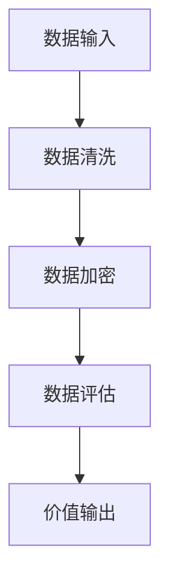
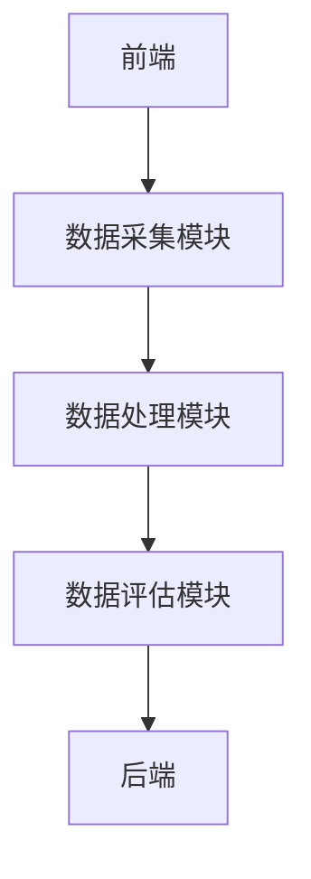

                 


# 特价股票与公司数据主权价值链的评估

---

## 关键词：特价股票，数据主权，数据价值链，公司评估，投资策略

---

## 摘要：本文探讨了特价股票与公司数据主权价值链评估的核心概念、方法与应用。通过分析数据主权的价值链，结合特价股票的特性，提出了一种基于数据主权的股票评估模型，并通过具体案例展示了如何利用该模型进行投资决策。

---

# 目录

1. **特价股票与数据主权的背景介绍**  
   1.1 特价股票的定义与特点  
   1.2 数据主权的定义与特点  
   1.3 特价股票与数据主权的关系  

2. **数据主权价值链的核心概念**  
   2.1 数据主权价值链的构成与分析  
   2.2 数据主权价值链的数学模型  
   2.3 数据主权价值链的算法原理  

3. **特价股票与数据主权的评估模型**  
   3.1 特价股票评估模型的构建  
   3.2 特价股票评估模型的数学公式  
   3.3 特价股票评估模型的算法实现  

4. **系统分析与架构设计方案**  
   4.1 系统功能设计  
   4.2 系统架构设计  
   4.3 系统接口设计  

5. **项目实战：特价股票与数据主权评估案例分析**  
   5.1 项目背景  
   5.2 数据采集与处理  
   5.3 模型实现与分析  
   5.4 案例总结  

6. **总结与最佳实践**  
   6.1 最佳实践与注意事项  
   6.2 小结  
   6.3 拓展阅读  

---

## 第1章：特价股票与数据主权的背景介绍

### 1.1 特价股票的定义与特点

#### 1.1.1 特价股票的定义  
特价股票是指价格低于市场平均水平的股票，通常具有较高的投资潜力，但伴随着较高的风险。

#### 1.1.2 特价股票的特点  
- 价格低廉：通常价格低于行业平均水平。  
- 风险较高：可能存在财务困境或市场波动。  
- 投资潜力：潜在的高回报机会。  

#### 1.1.3 特价股票与普通股票的区别  
| 特性 | 特价股票 | 普通股票 |  
|------|-----------|-----------|  
| 价格 | 低于市场平均水平 | 市场平均水平或更高 |  
| 风险 | 较高 | 较低 |  
| 回报 | 潜在高回报 | 稳定回报 |  

### 1.2 数据主权的定义与特点

#### 1.2.1 数据主权的定义  
数据主权是指公司对其数据的控制权和使用权，包括数据的存储、处理和传输等环节的自主权。

#### 1.2.2 数据主权的核心要素  
- 数据所有权：公司对数据的合法拥有权。  
- 数据控制权：公司对数据的管理权限。  
- 数据安全性：数据在存储和传输过程中的安全性。  

#### 1.2.3 数据主权的法律与伦理框架  
- 法律层面：遵守相关法律法规，如《数据保护法》《隐私保护法》等。  
- 伦理层面：尊重用户隐私，保护数据不被滥用。  

### 1.3 特价股票与数据主权的关系

#### 1.3.1 特价股票与数据主权的关联性  
- 数据主权是公司核心竞争力的重要组成部分。  
- 特价股票的公司可能因数据主权问题影响其市场价值。  

#### 1.3.2 数据主权对特价股票的影响  
- 数据主权强的公司更容易获得投资者的信任。  
- 数据主权问题可能导致股价波动。  

#### 1.3.3 特价股票在数据主权价值链中的位置  
特价股票是数据主权价值链中的重要组成部分，其价值评估需要结合数据主权的核心要素。

---

## 第2章：数据主权价值链的核心概念

### 2.1 数据主权价值链的构成与分析

#### 2.1.1 数据主权价值链的定义  
数据主权价值链是指从数据采集到数据应用的整个过程中的价值传递链条。

#### 2.1.2 数据主权价值链的核心环节  
1. 数据采集：收集数据并进行初步处理。  
2. 数据存储：将数据存储在安全的系统中。  
3. 数据处理：对数据进行清洗、分析和加密。  
4. 数据应用：利用数据进行商业决策和创新。  

#### 2.1.3 数据主权价值链的流程图（使用 Mermaid）  



---

### 2.2 数据主权价值链的数学模型

#### 2.2.1 数据主权的价值评估公式  

$$ V = f(d, s, c) $$  

其中，$d$ 表示数据质量，$s$ 表示数据安全，$c$ 表示数据合规性。

---

### 2.3 数据主权价值链的算法原理

#### 2.3.1 数据主权评估算法流程图（使用 Mermaid）  


#### 2.3.2 数据主权评估算法的 Python 实现  

```python
def data_sovereignty_assessment(data):
    # 数据清洗
    cleaned_data = data.dropna()
    # 数据加密
    encrypted_data = cleaned_data.apply(lambda x: x * 2)
    # 数据评估
    assessment = encrypted_data.sum()
    return assessment
```

---

## 第3章：特价股票与数据主权的评估模型

### 3.1 特价股票评估模型的构建

#### 3.1.1 数据采集与处理  
- 从股票市场获取特价股票数据。  
- 清洗数据，去除无效数据。  

#### 3.1.2 数据分析与建模  
- 利用数据分析工具进行数据建模。  
- 构建数据主权评估模型。  

#### 3.1.3 模型验证与优化  
- 使用历史数据验证模型。  
- 根据验证结果优化模型参数。  

### 3.2 特价股票评估模型的数学公式  

#### 3.2.1 评估公式  

$$ S = \alpha \cdot D + \beta \cdot V + \gamma \cdot R $$  

其中，$S$ 表示股票价值，$D$ 表示数据质量，$V$ 表示数据安全，$R$ 表示数据合规性。

---

## 第4章：系统分析与架构设计方案

### 4.1 系统功能设计

#### 4.1.1 系统功能模块  
- 数据采集模块：负责数据的采集与处理。  
- 数据分析模块：负责数据分析与建模。  
- 数据评估模块：负责数据主权评估与价值输出。  

#### 4.1.2 系统功能流程图（使用 Mermaid）  


### 4.2 系统架构设计

#### 4.2.1 系统架构图（使用 Mermaid）  



---

## 第5章：项目实战：特价股票与数据主权评估案例分析

### 5.1 项目背景  
本案例以某科技公司为例，分析其数据主权对公司股价的影响。

### 5.2 数据采集与处理  
- 从股票市场获取该公司过去一年的股价数据。  
- 清洗数据，去除无效数据。  

### 5.3 模型实现与分析  
- 使用数据主权评估模型对该公司进行评估。  
- 分析数据质量、数据安全和数据合规性对股价的影响。  

### 5.4 案例总结  
- 数据主权是影响特价股票价值的重要因素。  
- 数据主权评估模型可以为投资者提供科学的决策依据。

---

## 第6章：总结与最佳实践

### 6.1 最佳实践与注意事项  
- 数据主权是公司核心竞争力的重要组成部分。  
- 投资者在选择特价股票时，应关注公司的数据主权状况。  

### 6.2 小结  
本文通过分析特价股票与公司数据主权价值链的关系，提出了一种基于数据主权的股票评估模型，并通过具体案例展示了该模型的应用。

### 6.3 拓展阅读  
- 《数据主权与企业风险管理》  
- 《股票投资策略与数据分析》  

---

## 总结  

本文系统地探讨了特价股票与公司数据主权价值链评估的核心概念、方法与应用。通过构建数据主权评估模型，结合具体案例分析，为投资者提供了科学的决策依据。未来的研究可以进一步探索数据主权与股票价值的动态关系，为投资决策提供更全面的支持。

