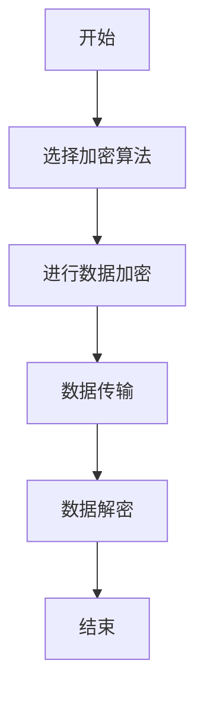
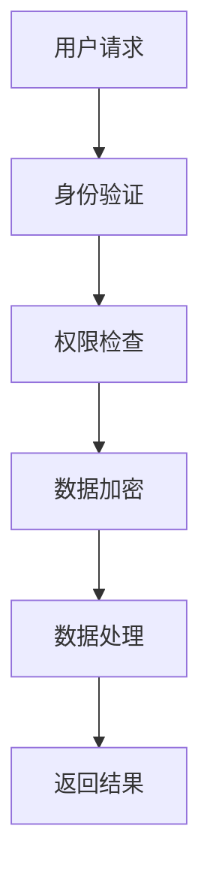
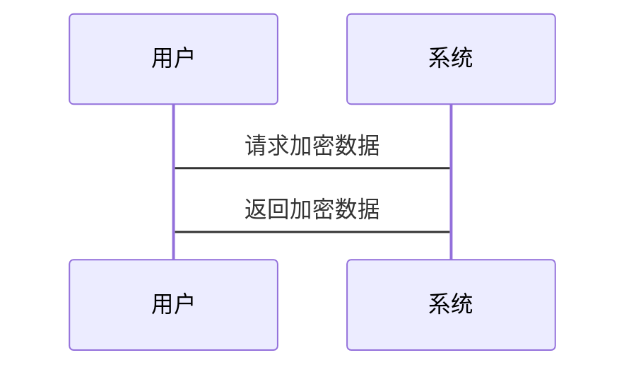

                 


# 特价股票与公司数据安全与隐私增强计算能力的关联性研究

> 关键词：特价股票、数据安全、隐私增强计算、关联性分析、风险管理

> 摘要：本文旨在探讨特价股票与公司数据安全及隐私增强计算能力之间的关联性。通过分析数据安全与隐私保护技术对特价股票市场的影响，提出增强计算能力以提升数据安全和隐私保护的方法，从而优化特价股票的投资决策和风险管理。

---

# 第一章: 特价股票与数据安全的背景介绍

## 1.1 特价股票的基本概念

### 1.1.1 特价股票的定义
特价股票是指市场价格低于其内在价值的股票。这类股票通常被市场低估，具有较大的增长潜力，是投资者追求高回报的重要目标。

### 1.1.2 特价股票的特征
- **低估值**：市场价格低于行业平均水平或历史平均水平。
- **高潜力**：公司基本面良好，具备未来增长空间。
- **低关注**：市场关注度较低，交易量较小。

### 1.1.3 特价股票的市场定位
特价股票通常出现在中小盘股中，这些公司可能暂时面临市场波动、行业调整或其他外部因素，导致股价被低估。

---

## 1.2 公司数据安全与隐私保护的重要性

### 1.2.1 数据安全的基本概念
数据安全是指保护数据的机密性、完整性和可用性，防止数据被未经授权的访问、泄露或篡改。

### 1.2.2 隐私保护的核心原则
隐私保护强调在数据处理过程中保护个人隐私，确保数据仅用于授权目的，并防止未经授权的披露。

### 1.2.3 数据安全与隐私保护的法律法规
- **GDPR**（通用数据保护条例）：欧盟法规，要求公司严格保护个人数据。
- **CCPA**（加州消费者隐私法案）：美国加州法案，赋予消费者对其数据的更多控制权。

---

## 1.3 特价股票与数据安全的关联性

### 1.3.1 特价股票的市场风险
- **市场波动**：特价股票的价格波动较大，投资者需要依赖数据分析来降低风险。
- **信息不对称**：市场信息的不透明可能导致投资者误判股票价值。

### 1.3.2 数据安全对股价的影响
- **数据泄露**：公司数据泄露可能导致股价下跌，影响投资者信心。
- **隐私保护**：良好的数据安全措施可以提升公司形象，吸引更多投资者。

### 1.3.3 特价股票与数据安全的双向关联
- 特价股票的投资者依赖数据安全技术来分析市场，确保交易安全。
- 公司的数据安全能力影响投资者对股票价值的判断。

---

## 1.4 本章小结
本章介绍了特价股票的基本概念、特征及其市场定位，并分析了数据安全与隐私保护的重要性。同时，探讨了特价股票与数据安全之间的关联性，为后续研究奠定了基础。

---

# 第二章: 数据安全与隐私增强计算的核心概念

## 2.1 数据安全与隐私增强计算的定义

### 2.1.1 数据安全的定义
数据安全是指通过技术手段保护数据，防止未经授权的访问、泄露或篡改。

### 2.1.2 隐私增强计算的定义
隐私增强计算是一种在保护数据隐私的前提下，对数据进行处理和分析的技术。

---

## 2.2 数据安全与隐私增强计算的核心要素

### 2.2.1 数据加密技术
- **对称加密**：使用相同的密钥进行加密和解密，速度快但安全性较低。
- **非对称加密**：使用公钥和私钥，安全性高，常用于数据传输。

### 2.2.2 数据匿名化处理
- **数据脱敏**：通过技术手段将敏感数据转化为不可逆的匿名数据。
- **数据混淆**：通过添加噪声或随机化处理，保护数据隐私。

### 2.2.3 数据访问控制
- **基于角色的访问控制（RBAC）**：根据用户角色分配权限。
- **基于属性的访问控制（ABAC）**：根据用户属性和上下文分配权限。

---

## 2.3 数据安全与隐私增强计算的属性特征对比

| 属性 | 数据安全 | 隐私增强计算 |
|------|----------|--------------|
| 保护目标 | 数据机密性 | 数据隐私保护 |
| 实现方式 | 加密、访问控制 | 数据匿名化、隐私计算 |
| 适用场景 | 数据存储、传输 | 数据分析、共享 |

---

## 2.4 数据安全与隐私增强计算的ER实体关系图

```mermaid
erDiagram
    actor 投资者 {
        <属性> 股票代码
        <属性> 持股数量
    }
    actor 公司 {
        <属性> 公司名称
        <属性> 业务数据
    }
    actor 监管机构 {
        <属性> 监管政策
        <属性> 合规要求
    }
    investor --|{拥有}| stockholder
    stockholder --|{属于}| company
    company --|{受监管}| regulator
```

---

## 2.5 本章小结
本章详细阐述了数据安全与隐私增强计算的核心概念，并通过对比分析和ER实体关系图，展示了两者在数据保护中的重要作用。

---

# 第三章: 数据安全与隐私增强计算的算法原理

## 3.1 数据安全增强计算的算法原理

### 3.1.1 数据加密算法
- **AES（高级加密标准）**：常用于数据加密。
- **RSA（公钥加密算法）**：用于数据传输加密。



### 3.1.2 数据匿名化算法
- **数据脱敏算法**：通过替换、删除或随机化处理，保护敏感数据。

---

## 3.2 隐私增强计算的算法实现

### 3.2.1 隐私计算框架
- **安全多方计算（MPC）**：在不共享原始数据的情况下，进行联合计算。
- **同态加密（HE）**：允许在加密数据上进行计算，结果仍保持加密状态。

### 3.2.2 隐私增强计算的数学模型
数据加密的数学模型可以表示为：
$$ E(x) = x \cdot k \mod p $$
其中，$x$ 是明文，$k$ 是密钥，$p$ 是模数。

---

## 3.3 数据安全与隐私增强计算的对比分析

| 技术 | 数据安全 | 隐私增强计算 |
|------|----------|--------------|
| 实现目标 | 保护数据不被未经授权访问 | 保护数据隐私，支持隐私计算 |
| 核心技术 | 加密、访问控制 | 数据匿名化、隐私计算框架 |
| 适用场景 | 数据存储、传输 | 数据分析、共享 |

---

## 3.4 本章小结
本章通过详细讲解数据安全与隐私增强计算的算法原理，展示了两者在技术实现上的异同点，并通过对比分析，进一步明确了它们的适用场景和功能定位。

---

# 第四章: 数据安全与隐私增强计算的系统架构设计

## 4.1 系统功能设计

### 4.1.1 功能模块划分
- **数据加密模块**：负责对数据进行加密处理。
- **隐私计算模块**：支持隐私增强计算功能。
- **数据访问控制模块**：实现基于角色的访问控制。

### 4.1.2 功能流程图



---

## 4.2 系统架构设计

### 4.2.1 分层架构
- **数据层**：存储原始数据和加密数据。
- **计算层**：执行数据加密和隐私计算。
- **应用层**：提供用户界面和业务逻辑。

### 4.2.2 系统架构图

```mermaid
rectangle 数据层 {
    数据库
    加密数据
}
rectangle 计算层 {
    加密模块
    计算模块
}
rectangle 应用层 {
    用户界面
    业务逻辑
}
数据层 --> 计算层
计算层 --> 应用层
```

---

## 4.3 系统接口设计

### 4.3.1 接口定义
- **加密接口**：`encrypt(data: str, key: str) -> str`
- **解密接口**：`decrypt(ciphertext: str, key: str) -> str`

### 4.3.2 接口交互流程图



---

## 4.4 本章小结
本章通过系统功能设计和架构设计，展示了如何将数据安全与隐私增强计算技术应用于实际系统中，并通过接口设计和交互流程图，明确了系统的实现方式。

---

# 第五章: 数据安全与隐私增强计算的项目实战

## 5.1 项目背景介绍

### 5.1.1 项目目标
通过数据安全与隐私增强计算技术，优化特价股票的分析与投资决策。

### 5.1.2 项目范围
- 数据收集：收集特价股票的相关数据。
- 数据分析：利用数据安全技术进行数据分析。
- 投资决策：基于分析结果制定投资策略。

---

## 5.2 系统核心实现

### 5.2.1 数据加密实现

```python
def encrypt(data, key):
    return AES.encrypt(data, key)

def decrypt(ciphertext, key):
    return AES.decrypt(ciphertext, key)
```

### 5.2.2 隐私计算实现

```python
def privacy_calculation(data):
    return MPC.calculate(data)
```

---

## 5.3 项目环境安装

### 5.3.1 安装依赖
```bash
pip install aes-crypto
pip install multiparty
```

---

## 5.4 项目实战案例分析

### 5.4.1 案例背景
某公司股价被低估，但存在数据泄露风险。

### 5.4.2 数据分析
- 使用数据加密技术保护公司数据。
- 通过隐私增强计算分析股价波动。

### 5.4.3 投资决策
- 数据分析显示公司股价具有上升潜力。
- 建议投资者买入该股票。

---

## 5.5 本章小结
本章通过项目实战，展示了如何将数据安全与隐私增强计算技术应用于特价股票分析，并通过具体案例分析，验证了技术的有效性。

---

# 第六章: 数据安全与隐私增强计算的最佳实践

## 6.1 技术选型建议

### 6.1.1 数据加密技术
- 优先选择AES加密算法，适用于数据存储和传输。
- 对于数据共享，推荐使用RSA加密算法。

### 6.1.2 隐私增强计算
- 对于数据分析，推荐使用安全多方计算（MPC）技术。
- 对于数据共享，推荐使用同态加密（HE）技术。

---

## 6.2 数据安全与隐私保护的注意事项

### 6.2.1 数据分类分级
- 根据数据的重要性和敏感程度，进行分类分级管理。

### 6.2.2 安全审计
- 定期进行安全审计，确保数据安全措施的有效性。

---

## 6.3 数据安全与隐私保护的合规性建议

### 6.3.1 遵守GDPR
- 确保数据处理符合GDPR要求，保护个人隐私。

### 6.3.2 符合CCPA
- 遵守加州消费者隐私法案，赋予消费者数据控制权。

---

## 6.4 本章小结
本章总结了数据安全与隐私增强计算的技术选型建议，并提出了注意事项和合规性建议，为实际应用提供了指导。

---

# 第七章: 总结与展望

## 7.1 本研究的核心结论

### 7.1.1 特价股票与数据安全的关联性
- 数据安全是影响特价股票投资决策的重要因素。
- 隐私增强计算技术可以提升数据安全能力，优化投资策略。

### 7.1.2 数据安全与隐私增强计算的技术创新
- 数据加密和隐私计算技术的结合，为数据安全保护提供了新思路。

---

## 7.2 未来研究方向

### 7.2.1 数据安全与隐私保护的结合
- 探索数据安全与隐私保护的协同优化方法。

### 7.2.2 隐私增强计算的优化
- 研究更高效的隐私计算算法，提升计算性能。

---

## 7.3 本章小结
本章总结了本文的核心结论，并展望了未来的研究方向，为数据安全与隐私增强计算技术的发展提供了参考。

---

# 参考文献

1. 数据加密与隐私保护技术研究
2. 安全多方计算与同态加密算法
3. GDPR与数据隐私保护
4. 特价股票分析与投资策略

---

# 致谢

感谢读者的支持和关注，希望本文能为数据安全与隐私增强计算技术的研究和应用提供有价值的参考。

