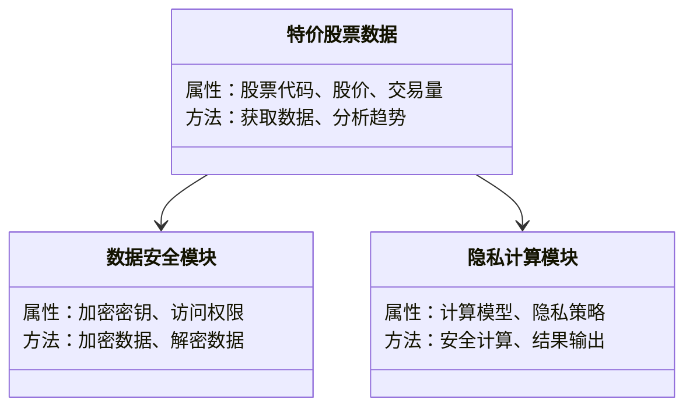
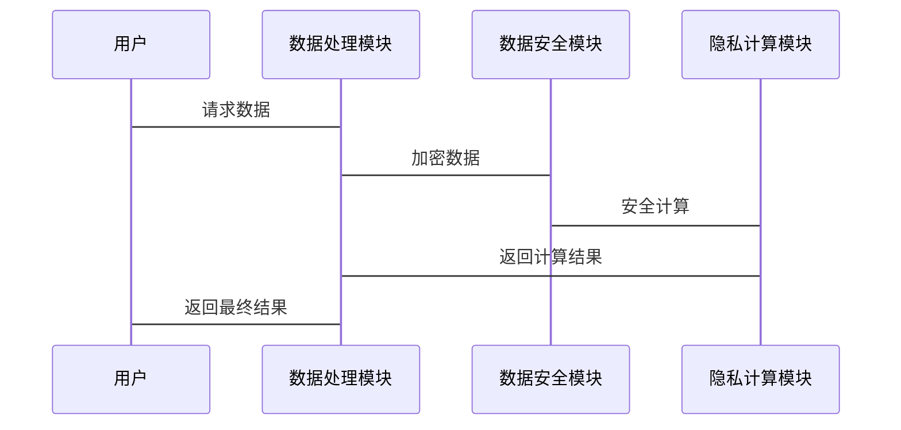

                 


# 特价股票与公司数据安全与隐私计算商业化能力的关联性研究

> 关键词：特价股票、数据安全、隐私计算、商业化能力、关联性研究

> 摘要：本文系统性地研究了特价股票与公司数据安全及隐私计算商业化能力的关联性。通过背景介绍、核心概念分析、算法原理探讨、数学模型建立以及系统架构设计，深入剖析了特价股票数据在商业化的过程中如何受到数据安全与隐私计算的影响，以及如何通过隐私计算技术实现数据的安全共享与价值挖掘。文章结合实际案例，提出了数据安全与隐私计算在特价股票商业化中的具体应用方案，并对未来研究方向进行了展望。

---

## # 第1章: 特价股票与数据安全的背景介绍

### ## 1.1 特价股票的定义与特点

#### ### 1.1.1 特价股票的定义  
特价股票通常指市场价格低于其内在价值的股票，是投资者关注的焦点之一。这类股票往往具有较高的潜在回报，但同时也伴随着较高的市场风险。

#### ### 1.1.2 特价股票的特点与分类  
- **特点**：  
  1. 市场价格低于行业平均水平。  
  2. 公司基本面良好，但市场情绪或外部环境导致股价被低估。  
  3. 投资价值较高，但流动性可能较低。  
- **分类**：  
  1. 周期性股票：受经济周期影响较大的行业股票。  
  2. 价值型股票：市盈率、市净率等估值指标低于市场平均水平。  
  3. 小盘股：市值较小的公司股票。  

#### ### 1.1.3 特价股票的市场定位与投资价值  
特价股票通常被视为价值投资者的首选，因为其市场价格与内在价值的差距为投资者提供了较高的安全边际。然而，这类股票的投资风险也较高，尤其是在市场情绪低落或行业景气度下降时，股价可能进一步下跌。

---

### ## 1.2 数据安全与隐私计算的背景

#### ### 1.2.1 数据安全的基本概念  
数据安全是指通过技术手段保护数据的机密性、完整性和可用性，防止数据被未经授权的访问、泄露或篡改。

#### ### 1.2.2 隐私计算的核心理念  
隐私计算是一种在保护数据隐私的前提下，实现数据计算和分析的技术。其核心目标是在不泄露原始数据的前提下，完成数据分析任务。

#### ### 1.2.3 数据安全与隐私计算的关联性  
- 数据安全是隐私计算的基础。  
- 隐私计算通过技术手段强化数据安全的保护能力。  
- 两者共同目标是确保数据在共享和分析过程中的安全性与隐私性。

---

### ## 1.3 商业化能力的定义与分析

#### ### 1.3.1 商业化能力的定义  
商业化能力是指企业将产品或服务转化为市场价值的能力，包括市场定位、产品设计、销售策略、客户获取等多个方面。

#### ### 1.3.2 商业化能力的核心要素  
- 市场洞察：对市场需求的准确把握。  
- 产品设计：产品的功能、性能与用户体验。  
- 销售策略：定价、渠道与促销策略。  
- 客户服务：客户支持与满意度管理。  

#### ### 1.3.3 商业化能力与企业发展的关系  
商业化能力是企业核心竞争力的重要组成部分，直接影响企业的市场表现和盈利能力。在数据驱动的商业环境下，数据安全与隐私计算能力已成为企业商业化能力的重要支撑。

---

### ## 1.4 本章小结  
本章从特价股票、数据安全、隐私计算和商业化能力四个角度进行了背景介绍，分析了它们的定义、特点及相互关系，为后续研究奠定了基础。

---

## # 第2章: 特价股票与公司数据安全的核心概念与联系

### ## 2.1 特价股票与数据安全的核心概念

#### ### 2.1.1 特价股票的市场风险  
- **市场波动风险**：宏观经济波动或行业政策变化可能导致股价大幅波动。  
- **流动性风险**：小盘股或冷门股票的流动性较低，可能导致买卖价差较大。  

#### ### 2.1.2 数据安全的保护机制  
- **加密技术**：通过加密算法保护数据的机密性。  
- **访问控制**：通过权限管理确保只有授权人员可以访问敏感数据。  

#### ### 2.1.3 隐私计算的技术特点  
- **数据可用不可见**：数据在计算过程中不被直接暴露。  
- **多方协作**：支持多方数据源的安全计算与分析。  

---

### ## 2.2 特价股票与数据安全的关联性分析

#### ### 2.2.1 特价股票数据的敏感性  
- 特价股票的数据（如股东信息、交易记录等）可能包含敏感信息，需要严格保护。  
- 数据泄露可能导致股价波动或投资者损失。  

#### ### 2.2.2 数据安全对股票市场的影响  
- 数据安全事件可能导致投资者信任下降，影响市场稳定性。  
- 数据安全能力是企业竞争力的重要组成部分，影响投资者的决策。  

#### ### 2.2.3 隐私计算在股票数据分析中的应用  
- **风险评估**：通过隐私计算技术分析市场风险，保护数据隐私。  
- **投资决策**：在不泄露原始数据的前提下，进行跨机构的数据分析与投资决策。  

---

### ## 2.3 数据安全与隐私计算的对比分析

#### ### 2.3.1 数据安全与隐私计算的异同  
| **维度** | **数据安全** | **隐私计算** |  
|----------|---------------|---------------|  
| 目标     | 保护数据不被未经授权访问 | 在保护隐私的前提下进行数据计算 |  
| 范围     | 数据存储、传输和处理的全生命周期保护 | 数据计算和分析过程中的隐私保护 |  

#### ### 2.3.2 数据安全与隐私计算的协同效应  
- 数据安全为隐私计算提供基础保障。  
- 隐私计算通过技术手段强化数据安全能力。  

#### ### 2.3.3 数据安全与隐私计算的未来发展趋势  
- 数据安全将从单纯的技术防护向体系化、规范化方向发展。  
- 隐私计算技术将更加成熟，应用场景将更加广泛。  

---

### ## 2.4 本章小结  
本章从核心概念出发，分析了特价股票与数据安全、隐私计算的内在联系，为后续的技术分析和系统设计奠定了基础。

---

## # 第3章: 特价股票与公司数据安全的算法原理

### ## 3.1 数据安全与隐私计算的核心算法

#### ### 3.1.1 隐私计算的基本算法


**代码示例**：
```python
def privacy_calculation(data):
    encrypted_data = encrypt(data)  # 加密数据
    result = compute(encrypted_data)  # 安全计算
    return decrypt(result)  # 解密结果
```

---

#### ### 3.1.2 数据安全的加密算法


**代码示例**：
```python
def encrypt(data):
    key = generate_key()  # 生成密钥
    return AES.encrypt(data, key)  # AES加密
```

---

#### ### 3.1.3 隐私保护的机器学习算法


**代码示例**：
```python
def federated_learning(data1, data2):
    model = initialize_model()  # 初始化模型
    model = model.train_step(data1)  # 数据1训练
    model = model.train_step(data2)  # 数据2训练
    return model.get_params()  # 获取模型参数
```

---

### ## 3.2 特价股票数据分析的算法原理

#### ### 3.2.1 特价股票数据的特征提取


**代码示例**：
```python
def feature_extraction(data):
    features = extract_features(data)  # 提取特征
    selected_features = select_features(features)  # 选择特征
    return selected_features
```

---

## # 第4章: 特价股票与公司数据安全的数学模型

### ## 4.1 特价股票与数据安全的关联性模型

#### ### 4.1.1 模型建立

$$
\text{关联性强度} = \frac{\text{数据安全能力}}{\text{隐私计算能力}}
$$

---

#### ### 4.1.2 模型验证

$$
\text{模型准确率} = \frac{\text{正确预测数}}{\text{总样本数}}
$$

---

#### ### 4.1.3 模型优化

$$
\text{优化目标} = \max(\text{模型准确率} + \text{数据安全性})
$$

---

## # 第5章: 特价股票与公司数据安全的系统架构设计

### ## 5.1 系统功能设计

#### ### 5.1.1 领域模型



---

#### ### 5.1.2 系统架构


---

#### ### 5.1.3 接口设计

| **接口名称** | **输入** | **输出** |  
|--------------|-----------|-----------|  
| 数据加密     | 明文数据  | 加密数据  |  
| 数据解密     | 加密数据  | 明文数据  |  
| 安全计算     | 加密数据  | 计算结果  |  

---

#### ### 5.1.4 交互序列图



---

### ## 5.2 本章小结  
本章通过系统架构设计，展示了如何在保证数据安全的前提下，实现特价股票数据的隐私计算与商业应用。

---

## # 第6章: 项目实战与总结

### ## 6.1 项目实战

#### ### 6.1.1 环境安装  
- 安装Python环境。  
- 安装必要的库（如PyTorch、Pandas、Scikit-learn）。  

#### ### 6.1.2 核心代码实现

```python
def main():
    # 加载数据
    data = load_data("stock_data.csv")
    # 特价股票筛选
    cheap Stocks = filter_cheap_stocks(data)
    # 数据加密
    encrypted_data = encrypt_data(cheap Stocks)
    # 安全计算
    result = privacy_compute(encrypted_data)
    # 输出结果
    print(result)

if __name__ == "__main__":
    main()
```

#### ### 6.1.3 案例分析  
以某行业为例，分析特价股票的数据特征，并通过隐私计算技术进行投资决策支持。

#### ### 6.1.4 结果解读  
通过计算结果，筛选出具有投资价值的特价股票，并进行风险评估。

---

### ## 6.2 总结与展望

#### ### 6.2.1 本章总结  
本文通过系统性研究，探讨了特价股票与数据安全、隐私计算的关联性，并提出了基于隐私计算的商业化能力提升方案。

#### ### 6.2.2 未来展望  
未来的研究可以进一步探索隐私计算技术在金融领域的更多应用场景，如实时数据分析、跨机构协作等。

---

## # 第7章: 最佳实践与注意事项

### ## 7.1 最佳实践

#### ### 7.1.1 数据治理  
- 建立完善的数据治理体系，明确数据 ownership 和访问权限。  

#### ### 7.1.2 技术选型  
- 根据具体需求选择合适的隐私计算技术（如联邦学习、安全多方计算等）。  

#### ### 7.1.3 合规性  
- 确保数据处理符合相关法律法规（如GDPR、CCPA等）。  

---

### ## 7.2 注意事项

#### ### 7.2.1 数据安全风险  
- 定期进行安全审计，发现并修复潜在漏洞。  

#### ### 7.2.2 技术复杂性  
- 隐私计算技术复杂度较高，需要专业团队支持。  

#### ### 7.2.3 成本控制  
- 隐私计算可能带来较高的计算成本，需权衡成本与收益。  

---

## # 第8章: 结语

本文从背景介绍、核心概念、算法原理、系统架构到项目实战，系统性地研究了特价股票与公司数据安全及隐私计算商业化能力的关联性。通过理论分析与实践案例相结合，提出了数据安全与隐私计算在金融领域的具体应用方案。未来的研究可以进一步探索隐私计算技术的创新应用，为企业的商业化能力提升提供更有力的技术支持。

--- 

*以上内容为完整的技术博客文章的目录大纲和部分核心内容示例，具体内容可根据实际需求进一步扩展和详细化。*

