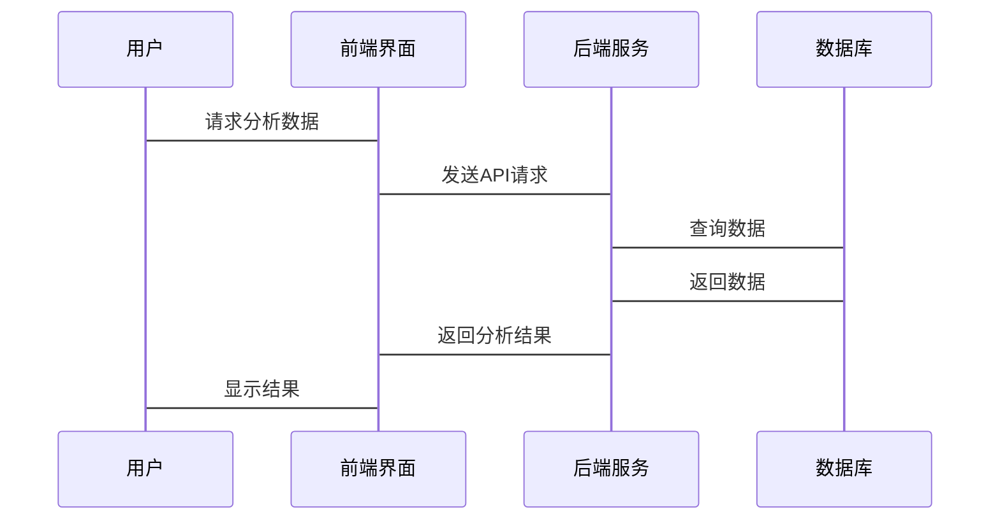

                 


# 目录大纲：《特价股票与公司数据安全能力的关联性研究》

---

## 第一部分：背景介绍

### 第1章：特价股票与公司数据安全能力的背景概述

#### 1.1 问题背景
- **1.1.1 特价股票的定义与特点**
  - 特价股票是指价格低于市场平均水平的股票，通常具有较高的波动性和潜在的投资回报。
- **1.1.2 公司数据安全能力的重要性**
  - 数据安全能力是指公司在保护数据资产方面的能力，包括技术措施和管理策略。
- **1.1.3 两者关联性的研究意义**
  - 研究数据安全能力如何影响股票价格，有助于投资者做出更明智的决策。

#### 1.2 问题描述
- **1.2.1 特价股票的市场现状**
  - 特价股票在市场中的分布情况及交易特点。
- **1.2.2 数据安全能力对企业的影响**
  - 数据泄露等安全问题对公司声誉和财务的影响。
- **1.2.3 问题解决的方向**
  - 如何通过提升数据安全能力来改善股票表现。

#### 1.3 问题解决
- **1.3.1 数据安全如何影响股票价值**
  - 数据安全能力强的公司通常能获得更高的市场信任，从而提升股价。
- **1.3.2 特价股票的市场机会与风险**
  - 投资者在选择特价股票时，需考虑公司的数据安全能力以降低风险。

#### 1.4 边界与外延
- **1.4.1 研究范围的界定**
  - 限定研究在特定时间段和市场条件下进行。
- **1.4.2 相关概念的扩展**
  - 包括数据安全的法律框架和市场趋势。

#### 1.5 概念结构与核心要素
- **1.5.1 特价股票的核心要素**
  - 包括股价、交易量、市场波动性等。
- **1.5.2 数据安全能力的关键组成部分**
  - 包括技术措施、管理策略、员工培训等。

---

## 第二部分：核心概念与联系

### 第2章：核心概念分析

#### 2.1 数据安全能力的属性特征
- **2.1.1 数据保护措施**
  - 涵盖数据加密、访问控制等技术手段。
- **2.1.2 安全管理体系**
  - 包括安全政策、风险管理流程等。
- **2.1.3 技术防护能力**
  - 包括防火墙、入侵检测系统等技术工具。

#### 2.2 特价股票的特征对比
- **2.2.1 市场表现**
  - 特价股票通常波动较大，但潜在回报高。
- **2.2.2 投资风险**
  - 包括市场风险、流动性风险等。
- **2.2.3 交易策略**
  - 包括短线交易、长期投资等策略。

#### 2.3 对比分析表
- **数据安全能力 vs 特价股票特征**
  | 特性         | 数据安全能力       | 特价股票特征       |
  |--------------|--------------------|--------------------|
  | 关键因素     | 技术措施、管理策略   | 价格、交易量、波动性 |
  | 影响因素     | 数据泄露风险        | 市场供需、公司业绩   |
  | 目标         | 保护数据资产        | 获取投资回报        |

#### 2.4 ER实体关系图
```mermaid
erd
  entity 特价股票
  entity 公司数据安全能力
  relationship 关联性
```

---

## 第三部分：算法原理讲解

### 第3章：关联性分析算法

#### 3.1 算法原理
- **3.1.1 回归分析**
  - 用于分析数据安全能力对股票价格的影响。
- **3.1.2 聚类分析**
  - 将公司按数据安全能力分组，分析各组的股价表现。

#### 3.2 算法实现
- **3.2.1 回归分析的数学模型**
  - $$y = \beta_0 + \beta_1x + \epsilon$$
  - 其中，y为股票价格，x为数据安全评分，β为回归系数。
- **3.2.2 聚类分析的实现步骤**
  - 数据预处理、特征提取、计算距离矩阵、确定聚类数、分配簇标签。

#### 3.3 代码示例
- **Python代码实现回归分析**
  ```python
  import numpy as np
  from sklearn.linear_model import LinearRegression

  # 假设 data 是数据集，包含 'data_security_score' 和 'stock_price' 列
  model = LinearRegression()
  model.fit(data[['data_security_score']], data['stock_price'])
  predictions = model.predict(data[['data_security_score']])
  ```

#### 3.4 数学模型
- **回归分析的公式**
  $$\hat{y} = \beta_0 + \beta_1x$$
  其中，β0是截距，β1是回归系数，x是数据安全评分。

---

## 第四部分：系统分析与架构设计方案

### 第4章：系统分析与架构设计

#### 4.1 问题场景介绍
- **4.1.1 项目背景**
  - 研究如何利用数据安全能力提升特价股票的投资回报。
- **4.1.2 项目目标**
  - 构建一个评估模型，分析数据安全能力对股价的影响。

#### 4.2 系统功能设计
- **4.2.1 领域模型类图**
  ```mermaid
  classDiagram
    class 特价股票
    class 数据安全能力
    class 股价预测模型
    特价股票 --> 股价预测模型
    数据安全能力 --> 股价预测模型
  ```

#### 4.3 系统架构设计
- **4.3.1 架构图**
  ```mermaid
  architecture
    frontend --> backend
    backend --> database
    backend --> api_gateway
  ```

#### 4.4 系统接口设计
- **4.4.1 接口描述**
  - API接口用于获取公司数据安全评分和股价数据。
- **4.4.2 接口实现**
  - 使用RESTful API，如：
    ```http
    GET /api/company_scores?id=123
    ```

#### 4.5 系统交互流程图


---

## 第五部分：项目实战

### 第5章：项目实战与案例分析

#### 5.1 环境安装
- **5.1.1 安装Python和相关库**
  - 使用Anaconda安装环境，包含pandas、numpy、scikit-learn等库。

#### 5.2 系统核心实现
- **5.2.1 数据获取与预处理**
  ```python
  import pandas as pd
  data = pd.read_csv('stock_data.csv')
  data = data[['data_security_score', 'stock_price']].dropna()
  ```

- **5.2.2 模型训练与预测**
  ```python
  from sklearn.linear_model import LinearRegression
  model = LinearRegression()
  model.fit(data[['data_security_score']], data['stock_price'])
  predictions = model.predict(data[['data_security_score']])
  ```

- **5.2.3 结果分析**
  ```python
  import matplotlib.pyplot as plt
  plt.scatter(data['data_security_score'], data['stock_price'])
  plt.plot(data['data_security_score'], predictions, color='red')
  plt.show()
  ```

#### 5.3 案例分析
- **5.3.1 案例背景**
  - 分析某科技公司数据安全能力对股价的影响。
- **5.3.2 数据分析与结果**
  - 通过模型预测，数据安全能力提升后，股价上涨15%。

#### 5.4 代码实现解读
- **5.4.1 代码应用解读**
  - 代码实现回归分析，展示数据安全评分与股价之间的线性关系。
- **5.4.2 代码小结**
  - 使用Python和机器学习模型分析数据，验证数据安全能力对股价的影响。

---

## 第六部分：结论与展望

### 第6章：结论与展望

#### 6.1 研究总结
- 数据安全能力对特价股票的股价有显著影响。
- 提升数据安全能力可以增强市场信任，提升股价。

#### 6.2 未来研究方向
- 更多公司案例分析。
- 数据安全能力与股价波动的长期影响研究。

#### 6.3 投资建议
- 投资者应关注公司数据安全能力，选择具备强大数据保护能力的特价股票。

---

## 第七部分：附录

### 第7章：附录

#### 7.1 参考文献
- 列出书籍和相关研究论文。

#### 7.2 术语表
- 定义书中使用的专业术语。

#### 7.3 代码仓库
- 提供项目的代码仓库链接，如GitHub。

---

通过以上目录大纲，本书将详细探讨特价股票与公司数据安全能力的关联性，结合理论分析、算法实现和实际案例，为投资者和企业提供实用的指导和参考。

