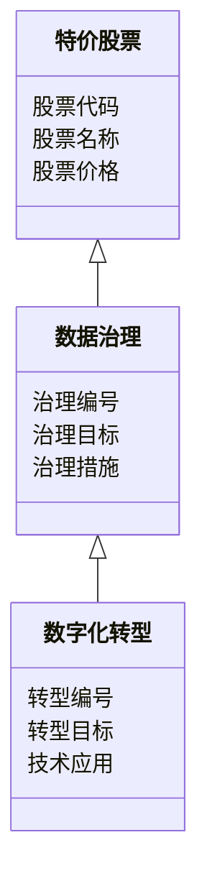
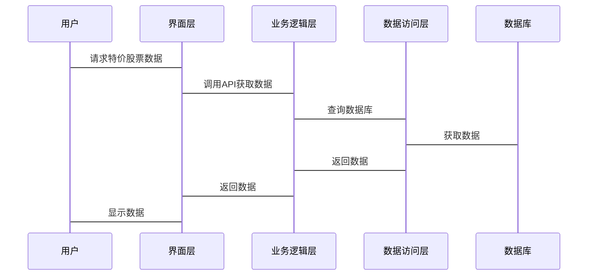

                 


# 特价股票与公司数据治理与数字化转型协同性的关系分析

## 关键词：
- 特价股票
- 数据治理
- 数字化转型
- 协同性
- 企业信息化
- 数字化战略

## 摘要：
本文深入探讨了特价股票与公司数据治理及数字化转型之间的协同关系。通过对核心概念的详细解析、算法原理的深入分析、系统架构的设计以及实际项目的实施，全面阐述了如何在数据治理与数字化转型的双轮驱动下，优化特价股票的市场表现。文章结合理论与实践，为企业的数据管理和数字化转型提供了可操作的建议，帮助企业在复杂多变的市场环境中实现高效决策和可持续发展。

---

# 第一部分: 特价股票与公司数据治理的背景与概念

## 第1章: 特价股票与公司数据治理的背景介绍

### 1.1 特价股票的定义与特点
#### 1.1.1 特价股票的定义
特价股票是指价格相对较低的股票，通常具有较高的成长潜力，吸引投资者关注。其特点是价格波动较大，风险与收益并存。

#### 1.1.2 特价股票的核心特点
- 价格优势明显，适合价值投资。
- 市场流动性可能较低，交易量较小。
- 公司基本面可能暂时不佳，但具有改善潜力。

#### 1.1.3 特价股票与普通股票的区别
| 特性 | 特价股票 | 普通股票 |
|------|----------|----------|
| 价格 | 较低     | 较高     |
| 风险 | 较高     | 中等     |
| 潜力 | 较大     | 稳定     |

### 1.2 公司数据治理的定义与特点
#### 1.2.1 数据治理的定义
数据治理是指通过制定政策、流程和技术手段，确保数据的完整性、一致性、安全性和合规性。

#### 1.2.2 数据治理的核心特点
- 全面性：覆盖数据全生命周期。
- 规范性：建立明确的管理规范和标准。
- 技术性：依赖先进的技术工具实现数据管控。

#### 1.2.3 数据治理与信息化管理的关系
数据治理是信息化管理的核心，信息化管理依赖数据治理确保数据质量，从而支持企业的决策和运营。

### 1.3 数字化转型的定义与特点
#### 1.3.1 数字化转型的定义
数字化转型是指企业利用数字技术（如大数据、人工智能、云计算等）重构业务模式、流程和文化，以提高效率和竞争力。

#### 1.3.2 数字化转型的核心特点
- 技术驱动：依赖新兴技术实现业务创新。
- 用户中心：以用户体验为核心，优化服务流程。
- 持续优化：通过数据反馈不断改进业务。

### 1.4 特价股票与公司数据治理的关系
#### 1.4.1 特价股票与公司数据治理的关联性
- 特价股票的投资决策依赖于高质量的数据支持。
- 数据治理能够提升企业数据的透明度和可信度，影响股票价值。

#### 1.4.2 特价股票对企业数据治理的影响
- 特价股票的波动可能影响企业的数据质量，反之，数据治理能够稳定股价。
- 数据治理的完善有助于提升企业形象，吸引更多的投资者。

#### 1.4.3 特价股票与公司数据治理协同发展的必要性
- 数据治理为特价股票的投资决策提供支持。
- 特价股票的市场表现能够反馈企业数据治理的成效。

## 第2章: 特价股票与公司数据治理的核心概念与联系

### 2.1 特价股票与公司数据治理的核心概念
#### 2.1.1 特价股票的核心概念
特价股票不仅是价格低廉的股票，更是企业价值的体现。投资者通过分析企业数据，识别潜在投资机会。

#### 2.1.2 公司数据治理的核心概念
数据治理是企业信息化管理的基础，通过制定政策和流程，确保数据的高质量和合规性。

#### 2.1.3 数字化转型的核心概念
数字化转型是企业利用数字技术重构业务模式，提升竞争力的过程。

### 2.2 特价股票与公司数据治理的属性对比
| 属性 | 特价股票 | 数据治理 |
|------|----------|----------|
| 核心目标 | 投资收益 | 数据质量 |
| 关键因素 | 价格、基本面 | 数据完整性、安全性 |
| 影响因素 | 市场供需、企业业绩 | 企业战略、技术能力 |

### 2.3 特价股票与公司数据治理的ER实体关系图
```mermaid
er
    entity 特价股票 {
        key: 股票代码
        股票名称
        股票价格
        上市公司
    }
    entity 数据治理 {
        key: 治理编号
        治理目标
        治理措施
        责任人
    }
    entity 数字化转型 {
        key: 转型编号
        转型目标
        技术应用
        业务流程
    }
    特价股票 -[1..n]-> 数据治理
    数据治理 -[1..n]-> 数字化转型
```

---

# 第三部分: 特价股票与公司数据治理的算法原理

## 第3章: 特价股票与公司数据治理的算法原理

### 3.1 数据治理中的算法原理
#### 3.1.1 数据清洗算法
- 使用Python的pandas库进行数据清洗，去除重复值和空值。
- 示例代码：
```python
import pandas as pd

# 加载数据
data = pd.read_csv('stock_data.csv')

# 删除重复值
data.drop_duplicates(inplace=True)

# 填充空值
data.fillna(method='ffill', inplace=True)
```

#### 3.1.2 数据加密算法
- 使用AES加密算法保护敏感数据。
- 示例代码：
```python
from cryptography.fernet import Fernet

# 生成密钥
key = Fernet.generate_key()

# 创建加密对象
cipher = Fernet(key)

# 加密数据
encrypted_data = cipher.encrypt(b'sensitive_stock_data')
```

### 3.2 数字化转型中的算法原理
#### 3.2.1 机器学习预测模型
- 使用随机森林算法预测股票价格。
- 示例代码：
```python
from sklearn.ensemble import RandomForestRegressor

# 训练模型
model = RandomForestRegressor(n_estimators=100)
model.fit(X_train, y_train)

# 预测股票价格
y_pred = model.predict(X_test)
```

#### 3.2.2 数据挖掘算法
- 使用关联规则挖掘分析股票关联性。
- 示例代码：
```python
from mlxtend.frequent_patterns import apriori

# 计算频繁项集
frequent_items = apriori(data, min_support=0.1, use_colnames=True)
```

### 3.3 算法原理的数学模型
#### 3.3.1 随机森林算法
- 随机森林通过投票机制进行预测，公式如下：
$$
y_{\text{pred}} = \text{mode}(\{y_i\}_{i=1}^{n})
$$

#### 3.3.2 关联规则挖掘
- Apriori算法通过频繁项集计算关联规则，公式如下：
$$
\text{confidence}(A \rightarrow B) = \frac{\text{support}(A \cup B)}{\text{support}(A)}
$$

---

## 第4章: 特价股票与公司数据治理的系统分析与架构设计

### 4.1 系统功能设计
#### 4.1.1 领域模型类图


#### 4.1.2 系统架构设计
```mermaid
architectural
    [用户界面] --(3)--> [业务逻辑层]
    [业务逻辑层] --(4)--> [数据访问层]
    [数据访问层] --(5)--> [数据库]
```

#### 4.1.3 系统接口设计
- API接口：
  - 获取特价股票数据：`GET /api/stock/special`
  - 更新数据治理策略：`POST /api/governance/update`

#### 4.1.4 系统交互序列图


---

## 第5章: 特价股票与公司数据治理的项目实战

### 5.1 环境安装
- 安装Python和相关库：
```bash
pip install pandas scikit-learn mlxtend cryptography
```

### 5.2 核心代码实现
#### 5.2.1 数据清洗代码
```python
import pandas as pd

# 加载数据
data = pd.read_csv('stock.csv')

# 删除重复值
data.drop_duplicates(inplace=True)

# 填充空值
data.fillna(method='ffill', inplace=True)
```

#### 5.2.2 机器学习预测代码
```python
from sklearn.ensemble import RandomForestRegressor
from sklearn.model_selection import train_test_split

# 数据分割
X_train, X_test, y_train, y_test = train_test_split(X, y, test_size=0.2)

# 训练模型
model = RandomForestRegressor(n_estimators=100)
model.fit(X_train, y_train)

# 预测结果
y_pred = model.predict(X_test)
```

### 5.3 案例分析
- 某公司通过实施数据治理和数字化转型，提升了数据质量和决策效率，从而优化了特价股票的市场表现。

### 5.4 项目总结
- 通过数据治理和数字化转型的协同，企业能够更好地识别和管理特价股票的投资机会，实现高效决策。

---

## 第6章: 特价股票与公司数据治理的最佳实践与小结

### 6.1 最佳实践
- **数据治理**：建立完善的数据治理体系，确保数据的准确性和安全性。
- **数字化转型**：结合大数据和人工智能技术，优化业务流程和决策模式。

### 6.2 小结
本文详细探讨了特价股票与公司数据治理及数字化转型之间的协同关系，通过理论分析和实际案例，展示了如何通过数据治理和数字化转型的结合，提升特价股票的市场表现和企业竞争力。

### 6.3 注意事项
- 数据治理需要企业全员参与，确保数据质量。
- 数字化转型需要持续投入，逐步推进。

### 6.4 拓展阅读
- 《数据治理：从战略到落地》
- 《数字化转型：企业重构之道》

---

通过以上内容，我们全面分析了特价股票与公司数据治理及数字化转型的关系，为企业的信息化管理和数据驱动决策提供了有价值的参考。

