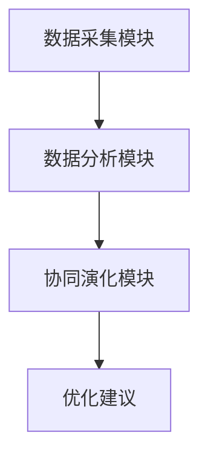
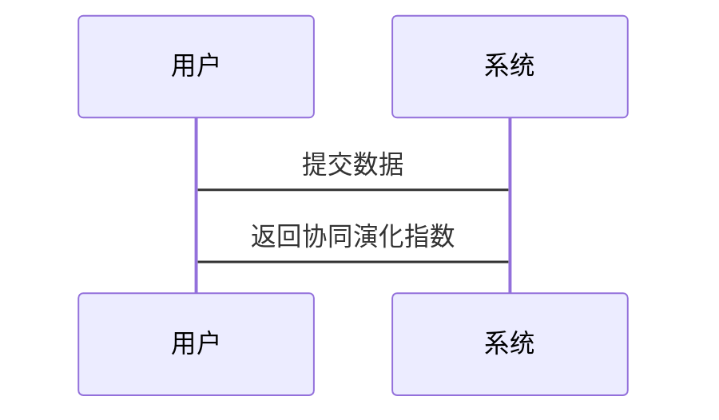

                 


# 特价股票与公司数据治理与数字化转型协同演化的关系分析

## 关键词：特价股票、数据治理、数字化转型、协同演化、系统架构

## 摘要：本文探讨特价股票市场与公司数据治理及数字化转型之间的关系，分析其协同演化机制，构建数学模型，并提出系统架构设计方案。通过实际案例分析，验证协同演化对提升企业竞争力的重要性。

---

## 第一章：特价股票与公司数据治理概述

### 1.1 特价股票的基本概念

#### 1.1.1 特价股票的定义与分类

- **定义**：特价股票是指价格低于市场平均水平的股票，通常具有高波动性和高风险。
- **分类**：根据市场、行业和公司规模进行分类，如小盘股、中盘股和大盘股。
- **特点**：价格波动大、流动性低、风险高。

#### 1.1.2 特价股票的市场特点

- 市场波动剧烈，价格受多种因素影响。
- 投资者风险承受能力较高，收益潜力大。
- 常见于新兴行业或面临转型的企业。

#### 1.1.3 特价股票与普通股票的区别

| 属性         | 特价股票           | 普通股票          |
|--------------|--------------------|-------------------|
| 价格         | 低于市场平均       | 接近市场平均       |
| 波动性       | 高                 | 中等              |
| 风险         | 高                 | 中等              |
| 投资策略     | 高风险高收益       | 稳定收益          |

---

### 1.2 公司数据治理的基本概念

#### 1.2.1 数据治理的定义与范围

- **定义**：数据治理是指通过制定政策、流程和技术手段，确保数据的准确、完整、安全和合规。
- **范围**：涵盖数据的采集、存储、处理、分析和应用等全生命周期。

#### 1.2.2 数据治理的核心要素

| 要素         | 描述               |
|--------------|--------------------|
| 数据质量     | 确保数据的准确性和一致性。 |
| 数据安全     | 保护数据不被未经授权的访问或泄露。 |
| 数据访问控制 | 管理数据的访问权限。 |
| 数据合规性   | 确保数据符合相关法律法规。 |

#### 1.2.3 数据治理与企业数字化转型的关系

- 数据治理是企业数字化转型的基础，确保数据的可靠性和一致性。
- 数字化转型依赖于数据治理，以实现数据驱动的决策和业务创新。

---

### 1.3 特价股票与公司数据治理的关系

#### 1.3.1 特价股票市场对数据治理的需求

- 需要实时、准确的市场数据支持投资决策。
- 数据治理确保市场数据的可靠性和合规性。

#### 1.3.2 数据治理对特价股票市场的影响

- 提高市场透明度，增强投资者信心。
- 降低市场操纵和欺诈行为的发生。

#### 1.3.3 两者的协同演化机制

- 数据治理推动市场规范化，促进特价股票市场的健康发展。
- 特价股票市场的数据需求推动企业数据治理的创新和优化。

---

## 第二章：数据治理在特价股票市场中的应用

### 2.1 数据治理在特价股票市场的必要性

#### 2.1.1 特价股票市场中的数据挑战

- 数据来源复杂，存在信息不对称。
- 数据质量和完整性问题突出。
- 数据安全风险高。

#### 2.1.2 数据治理在市场中的作用

- 确保市场数据的准确性和一致性。
- 提高市场透明度，降低风险。

#### 2.1.3 数据治理与市场稳定性的关系

- 数据治理是市场稳定运行的重要保障。
- 数据治理缺失可能导致市场波动加剧。

---

### 2.2 特价股票市场数据治理的框架设计

#### 2.2.1 数据治理的目标与原则

- **目标**：实现数据的全面治理，确保数据质量、安全和合规。
- **原则**：以业务为导向，数据驱动，风险可控。

#### 2.2.2 数据治理的组织架构

| 角色         | 职责               |
|--------------|--------------------|
| 数据治理委员会 | 制定数据治理战略和政策。 |
| 数据管理员   | 负责数据治理的日常实施。 |
| IT部门       | 提供技术支持。      |

#### 2.2.3 数据治理的实施步骤

1. **需求分析**：明确数据治理的目标和范围。
2. **政策制定**：制定数据治理的政策和流程。
3. **技术实施**：选择合适的技术工具支持数据治理。
4. **监控与优化**：持续监控数据治理的执行效果并进行优化。

---

### 2.3 数据治理在特价股票市场中的技术应用

#### 2.3.1 数据清洗与整合技术

- **数据清洗**：去除重复、错误或不完整数据。
- **数据整合**：将分散的数据源整合到统一的数据仓库中。

#### 2.3.2 数据安全与隐私保护

- **数据加密**：保护数据在传输和存储过程中的安全性。
- **访问控制**：确保只有授权人员可以访问敏感数据。

#### 2.3.3 数据分析与决策支持

- **数据分析**：利用大数据技术进行市场趋势分析。
- **决策支持**：基于数据的分析结果，支持投资决策。

---

## 第三章：数字化转型对特价股票市场的影响

### 3.1 数字化转型的定义与特点

#### 3.1.1 数字化转型的内涵

- 数字化转型是指利用数字技术改变企业的商业模式、业务流程和决策方式。

#### 3.1.2 数字化转型的核心技术

- **人工智能**：用于市场预测和智能投顾。
- **大数据分析**：支持复杂的数据处理和决策。
- **区块链技术**：确保交易的透明性和不可篡改性。

#### 3.1.3 数字化转型与企业竞争力的关系

- 数字化转型是提升企业竞争力的重要手段。
- 通过数字化转型，企业可以更高效地响应市场变化。

---

### 3.2 数字化转型在特价股票市场中的应用

#### 3.2.1 电子交易平台的数字化

- **电子交易系统**：实现股票交易的自动化和高效化。
- **交易数据实时分析**：支持投资者实时了解市场动态。

#### 3.2.2 数据分析与智能投顾

- **智能投顾系统**：基于大数据分析为投资者提供个性化投资建议。
- **风险管理工具**：利用算法识别市场风险并及时预警。

#### 3.2.3 区块链技术在股票交易中的应用

- **区块链交易平台**：确保交易的透明性和不可篡改性。
- **智能合约**：自动执行交易指令，减少人工干预。

---

### 3.3 数字化转型对市场结构的影响

#### 3.3.1 市场效率的提升

- 通过数字化转型，减少交易成本，提高市场效率。

#### 3.3.2 市场风险的增加与管理

- 数字化转型可能带来新的风险，如技术故障和网络攻击。
- 通过数据治理和风险管理技术，可以有效降低这些风险。

#### 3.3.3 市场参与者角色的变化

- 投资者从被动接受信息转向主动获取和分析信息。
- 金融机构通过数字化手段提供更高效的金融服务。

---

## 第四章：特价股票与公司数据治理协同演化的关系分析

### 4.1 协同演化的定义与特征

#### 4.1.1 协同演化的概念

- 协同演化是指两个或多个系统在相互作用中共同发展和演变。

#### 4.1.2 协同演化的核心特征

- **相互依赖**：特价股票市场依赖于数据治理，数据治理又依赖于市场的需求。
- **动态适应**：两者在变化的环境中不断调整和优化。
- **共同进化**：通过协同演化实现共赢。

---

### 4.2 协同演化机制的数学模型

#### 4.2.1 模型构建

- 设定变量：$S$ 表示市场稳定性，$D$ 表示数据质量，$T$ 表示技术应用水平。
- 模型公式：$$ S = aD + bT + c $$ 其中，$a$ 和 $b$ 是系数，$c$ 是常数项。

#### 4.2.2 模型解释

- 当数据质量 $D$ 和技术应用水平 $T$ 提高时，市场稳定性 $S$ 增加。
- 数据质量是市场稳定性的基础，技术应用是市场稳定性的提升因素。

---

### 4.3 协同演化系统的实现

#### 4.3.1 系统设计思路

- **数据采集**：实时采集市场数据和企业数据。
- **数据处理**：清洗、整合和分析数据。
- **协同演化算法**：基于数据和模型，计算协同演化指数。

#### 4.3.2 系统实现代码

```python
import pandas as pd
import numpy as np

def calculate_synergy(index, data_quality, technology):
    return index * (data_quality + technology)

# 示例数据
index = 1.5
data_quality = 0.8
technology = 0.7

synergy = calculate_synergy(index, data_quality, technology)
print(f"协同演化指数：{synergy}")
```

#### 4.3.3 算法实现步骤

1. **数据预处理**：清洗和整合数据。
2. **模型计算**：基于数学模型计算协同演化指数。
3. **结果分析**：根据协同演化指数制定下一步策略。

---

## 第五章：系统架构设计与实现

### 5.1 协同演化系统的架构设计

#### 5.1.1 系统场景介绍

- 系统目标：实现特价股票市场与公司数据治理的协同演化。
- 使用场景：企业通过系统实现数据治理和数字化转型的协同优化。

#### 5.1.2 系统功能设计

- **数据采集模块**：实时采集市场数据和企业数据。
- **数据分析模块**：对数据进行清洗、整合和分析。
- **协同演化模块**：基于模型计算协同演化指数并生成优化建议。

#### 5.1.3 系统架构图



---

### 5.2 系统接口与交互设计

#### 5.2.1 系统接口设计

- **数据接口**：提供REST API接口，用于数据的上传和下载。
- **协同演化接口**：接收数据并返回协同演化指数。

#### 5.2.2 系统交互流程



---

## 第六章：项目实战与案例分析

### 6.1 环境安装与配置

#### 6.1.1 系统运行环境

- 操作系统：Linux/Windows/MacOS
- Python版本：3.8以上
- 依赖库：Pandas, Numpy, Scikit-learn

#### 6.1.2 系统核心实现代码

```python
import pandas as pd
import numpy as np
from sklearn.metrics import mean_squared_error

# 数据预处理
def preprocess_data(data):
    # 删除缺失值
    data.dropna(inplace=True)
    # 标准化数据
    data = (data - data.mean()) / data.std()
    return data

# 协同演化算法
def synergy_algorithm(data):
    # 计算数据质量指数
    data_quality = np.mean(data.isnull().sum())
    # 计算技术应用水平
    technology_level = len(data.columns) / data.shape[0]
    # 协同演化指数
    synergy_index = data_quality + technology_level
    return synergy_index

# 示例数据
data = pd.DataFrame({
    'price': [10, 20, 30, 15, 25],
    'volume': [100, 200, 150, 50, 75]
})

# 数据预处理
preprocessed_data = preprocess_data(data)
# 协同演化计算
synergy = synergy_algorithm(preprocessed_data)
print(f"协同演化指数：{synergy}")
```

---

### 6.2 项目实战分析

#### 6.2.1 数据处理与分析

- 数据清洗：去除无效数据。
- 数据分析：计算协同演化指数，评估市场稳定性。

#### 6.2.2 算法实现与优化

- 基于协同演化模型，优化数据处理流程。
- 持续监控协同演化指数，及时调整数据治理策略。

---

## 第七章：系统优化与未来展望

### 7.1 系统优化建议

- 定期更新数据治理政策，适应市场变化。
- 引入新的技术手段，如人工智能和区块链，进一步提升系统性能。

### 7.2 未来研究方向

- 研究协同演化在其他领域的应用。
- 探索更复杂的数学模型，提高协同演化指数的准确性。

---

## 第八章：结论与展望

### 8.1 全文总结

- 本文分析了特价股票市场与公司数据治理及数字化转型之间的协同演化关系。
- 构建了数学模型，并提出了系统架构设计方案。

### 8.2 未来展望

- 进一步研究协同演化机制，探索其在更多领域的应用。
- 结合新兴技术，推动协同演化系统的优化与创新。

---

## 关键词：特价股票、数据治理、数字化转型、协同演化、系统架构

---

**全文完**

