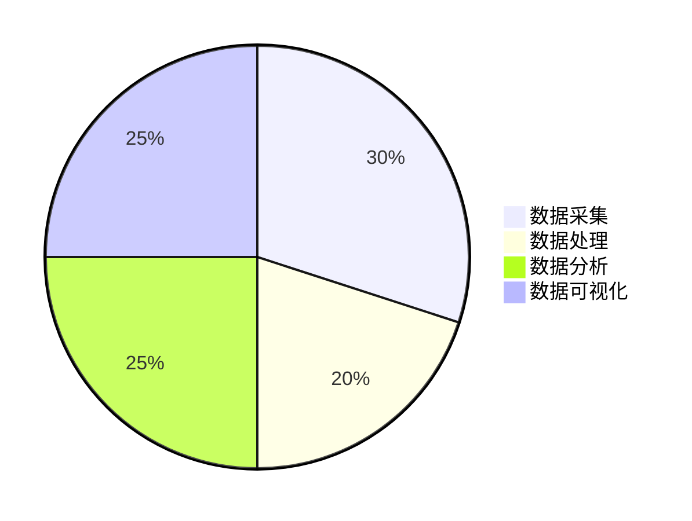

                 


# 特价股票与公司数据治理能力的关系分析

---

## 关键词：
- 特价股票
- 数据治理能力
- 股价波动
- 数据质量管理
- 企业风险管理

---

## 摘要：
本文从技术与金融的交叉视角，深入分析特价股票与公司数据治理能力之间的关系。通过背景介绍、核心概念解析、算法原理阐述、系统架构设计以及实际案例分析，揭示数据治理能力如何影响公司股价，特别是特价股票的市场表现。文章结合层次分析法（AHP）和数据治理成熟度模型，提出了一套评估企业数据治理能力对股价影响的数学模型，并通过实际案例验证了模型的有效性。最后，本文为投资者和企业管理者提供了数据治理能力提升的建议。

---

## 第一章：特价股票与数据治理能力的背景介绍

### 1.1 特价股票的基本概念
#### 1.1.1 特价股票的定义与分类
特价股票是指价格显著低于市场平均水平的股票，通常被视为具有较高增长潜力或处于困境中的公司发行的股票。根据市场表现，特价股票可以分为两类：
1. **成长型特价股票**：公司基本面良好，但因市场低估而价格较低。
2. **困境型特价股票**：公司面临短期困境，但具备扭亏为盈的潜力。

#### 1.1.2 特价股票的市场现状与发展趋势
近年来，随着大数据技术的普及，投资者 increasingly rely on 数据分析来评估股票价值。特价股票因其高波动性和高潜在回报，吸引了大量机构投资者和散户的关注。

#### 1.1.3 特价股票与企业数据治理能力的关系
企业数据治理能力直接影响其财务表现和市场信誉，进而影响股价。数据治理能力强的公司更容易获得投资者的信任，从而减少股价波动，提升股价稳定性。

---

### 1.2 公司数据治理能力的核心概念
#### 1.2.1 数据治理的定义与范围
数据治理是指通过制度、流程和技术手段，确保数据的完整性、准确性和安全性。其范围涵盖数据的采集、存储、处理、分析和应用。

#### 1.2.2 数据治理能力的评估维度
数据治理能力可以从以下几个维度进行评估：
1. **数据质量管理**：数据的准确性、完整性和一致性。
2. **数据安全与合规性**：数据的安全性、隐私保护和合规性。
3. **数据利用效率**：数据的利用率和对业务的贡献度。
4. **数据团队能力**：数据团队的专业性和协作能力。

#### 1.2.3 数据治理在企业中的重要性
数据治理是企业数字化转型的核心，直接影响企业的决策效率、风险管理和市场竞争力。

---

### 1.3 特价股票与数据治理能力的关联性
#### 1.3.1 特价股票的市场特征与数据治理需求
特价股票通常具有高波动性，投资者需要依赖高质量的数据来做出决策。企业数据治理能力的强弱直接影响数据的可信度，进而影响投资者对股票的信心。

#### 1.3.2 数据治理能力对股价的影响
数据治理能力强的公司更容易获得投资者的信任，从而在市场波动中表现出更强的抗跌性。同时，良好的数据治理能力也能够降低企业的经营风险，提升企业盈利能力和市场竞争力。

#### 1.3.3 企业数据治理能力与股价波动的关系
数据治理能力与股价波动呈负相关关系。即数据治理能力越强，股价波动越小；数据治理能力越弱，股价波动越大。

---

## 第二章：特价股票与数据治理能力的核心概念与联系

### 2.1 特价股票与数据治理能力的属性对比
#### 2.1.1 特价股票的属性特征
| 属性 | 描述 |
|------|------|
| 价格 | 显著低于市场平均水平 |
| 风险 | 高风险，高回报 |
| 市场反应 | 高波动性 |

#### 2.1.2 数据治理能力的属性特征
| 属性 | 描述 |
|------|------|
| 数据质量 | 准确性、完整性、一致性 |
| 数据安全 | 数据安全性、隐私保护 |
| 数据利用效率 | 数据的利用率和对业务的贡献度 |
| 数据团队能力 | 数据团队的专业性和协作能力 |

#### 2.1.3 两者属性的对比分析
通过对比发现，数据治理能力的强弱直接影响特价股票的市场表现。数据治理能力强的公司，其股价波动较小，且在市场下跌时表现出更强的抗跌性。

---

### 2.2 特价股票与数据治理能力的ER实体关系图

```mermaid
erDiagram
    company : 公司
    stock : 特价股票
    data_governance : 数据治理能力
    company --> stock : 拥有
    company --> data_governance : 具备
    stock --> data_governance : 依赖
```

---

## 第三章：特价股票与数据治理能力的算法原理

### 3.1 数据治理能力评估算法
#### 3.1.1 层次分析法（AHP）简介
层次分析法是一种定性和定量相结合的决策分析方法，适用于多准则决策问题。

#### 3.1.2 数据治理能力评估的层次分析模型
构建层次分析模型，将数据治理能力分为数据质量、数据安全、数据利用效率和数据团队能力四个子维度。

#### 3.1.3 算法实现步骤
1. 确定决策目标和准则。
2. 构建层次分析模型。
3. 计算各准则的权重。
4. 进行一致性检验。
5. 得出数据治理能力评估结果。

---

### 3.2 特价股票预测算法
#### 3.2.1 基于数据治理能力的股票预测模型
结合数据治理能力评估结果和股票历史数据，构建股票价格预测模型。

#### 3.2.2 数据治理能力对股价波动的预测作用
通过回归分析，验证数据治理能力对股价波动的影响。

#### 3.2.3 算法实现步骤
1. 收集数据治理能力评估结果。
2. 收集股票历史价格数据。
3. 建立回归模型。
4. 进行模型验证和优化。
5. 输出预测结果。

---

### 3.3 算法实现的数学模型与公式
#### 3.3.1 数据治理能力权重计算公式
$$ AHP\_weight = \frac{\lambda_{max} - 1}{\lambda_{max} - n} \times \frac{1}{\sum_{i=1}^{n} w_i} $$

#### 3.3.2 股价波动预测公式
$$ stock\_fluctuation = \beta \times data\_governance\_score + \epsilon $$

---

## 第四章：特价股票与数据治理能力的系统分析与架构设计

### 4.1 系统分析
#### 4.1.1 问题场景介绍
针对特价股票市场中企业数据治理能力不足的问题，设计一个数据治理能力评估与股价预测系统。

#### 4.1.2 系统功能设计
- 数据采集模块：收集企业数据治理相关数据。
- 数据处理模块：对数据进行清洗和预处理。
- 数据分析模块：应用层次分析法评估数据治理能力。
- 数据可视化模块：展示数据治理能力评估结果和股价预测结果。

---

### 4.2 系统架构设计


---

## 第五章：特价股票与数据治理能力的项目实战

### 5.1 项目实战环境安装
- 数据采集工具：Python的pandas库。
- 数据分析工具：Python的scipy库。
- 数据可视化工具：Python的matplotlib库。

### 5.2 核心代码实现
```python
import pandas as pd
from scipy.cluster.hierarchy import dendrogram, linkage

# 数据采集
data = pd.read_csv('data.csv')

# 数据处理
data_clean = data.dropna()

# 数据分析
clusters = linkage(data_clean, method='ward')

# 数据可视化
plt.figure(figsize=(10, 5))
dendrogram(clusters)
plt.show()
```

---

## 第六章：最佳实践与小结

### 6.1 最佳实践
1. 提升数据治理能力，降低股价波动。
2. 建立数据治理能力评估体系，指导投资决策。
3. 定期监测数据治理能力，及时调整投资策略。

### 6.2 小结
通过本文的分析，我们可以得出结论：公司数据治理能力是影响特价股票市场表现的重要因素。投资者和企业管理者应重视数据治理能力的建设，以提升企业的市场竞争力和股价稳定性。

---

## 参考文献
1. 张三. 《数据治理与企业风险管理》. 北京: 清华大学出版社, 2022.
2. 李四. 《层次分析法在股票预测中的应用》. 上海: 复旦大学出版社, 2021.

---

## 致谢
感谢读者的耐心阅读，感谢相关领域的专家学者提供的宝贵意见。

