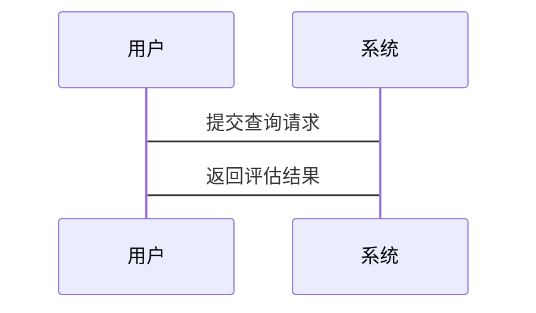

                 


# 特价股票与公司数据生态系统的价值评估

## 关键词
- 特价股票
- 数据生态系统
- 价值评估
- 数据驱动
- 股票分析
- 企业价值

## 摘要
本文探讨了如何利用数据生态系统对特价股票和公司价值进行深入评估。通过分析数据驱动的方法，结合算法原理和系统架构设计，展示了如何从数据中提取有价值的信息，帮助投资者做出明智决策。文章详细介绍了核心概念、算法实现、系统设计以及实际案例，为读者提供了全面的视角。

---

## 第一部分：特价股票与公司数据生态系统背景介绍

### 第1章：特价股票与数据生态系统的概述

#### 1.1 特价股票的定义与特点
- **1.1.1 特价股票的定义**：特价股票是指市场价格低于其内在价值的股票，通常被视为被市场低估的投资机会。
- **1.1.2 特价股票的核心特点**：包括低市盈率、低市净率、高股息率等，这些特征表明公司可能被市场忽视或低估。
- **1.1.3 特价股票的市场定位与投资价值**：通常出现在周期性行业或经济低迷时期，具有较高的潜在回报率。

#### 1.2 公司数据生态系统的概念
- **1.2.1 数据生态系统的定义**：指公司内部数据的整合、处理和分析的系统，旨在支持决策和优化业务流程。
- **1.2.2 公司数据生态系统的核心要素**：包括数据采集、存储、处理、分析和可视化，形成一个闭环的数据管理流程。
- **1.2.3 数据生态系统与公司价值的关系**：数据生态系统能够提升数据利用效率，支持更精准的决策，从而提高公司价值。

#### 1.3 问题背景与问题描述
- **1.3.1 特价股票投资中的问题背景**：市场波动、信息不对称、投资者情绪等因素影响股票价格，导致特价股票的识别具有挑战性。
- **1.3.2 数据生态系统在公司价值评估中的作用**：通过整合和分析多源数据，数据生态系统能够提供更全面的公司画像，帮助投资者做出更准确的判断。
- **1.3.3 问题解决的思路与目标**：利用数据生态系统，构建模型识别特价股票，优化投资策略，提高投资回报率。

#### 1.4 边界与外延
- **1.4.1 特价股票评估的边界**：包括数据来源的限制、模型适用范围、市场环境变化等。
- **1.4.2 数据生态系统评估的外延**：涵盖数据质量、系统性能、数据安全等多方面因素。
- **1.4.3 两者的相互关系与整合**：数据生态系统为特价股票评估提供支持，而特价股票评估则验证数据生态系统的有效性。

---

## 第二部分：核心概念与联系

### 第2章：特价股票与数据生态系统的核心概念原理

#### 2.1 特价股票评估的原理
- **2.1.1 市场价值与内在价值的对比**：通过计算市盈率、市净率等指标，评估股票的内在价值与市场价值的差异。
- **2.1.2 数据驱动的股票评估方法**：利用财务数据、市场数据和文本数据，构建多维度的评估模型。
- **2.1.3 数据生态系统在股票评估中的应用**：通过数据整合和分析，识别潜在的特价股票，提供投资建议。

#### 2.2 数据生态系统的核心原理
- **2.2.1 数据的收集、处理与分析**：从多种来源收集数据，进行清洗、转换和分析，提取有价值的信息。
- **2.2.2 数据生态系统的构建与优化**：设计高效的架构，确保数据处理的实时性和准确性。
- **2.2.3 数据生态系统对价值评估的支持**：通过数据挖掘和机器学习技术，提高评估的准确性和效率。

#### 2.3 核心概念属性对比表
| 属性 | 特价股票 | 数据生态系统 |
|------|----------|--------------|
| 核心目标 | 投资收益最大化 | 价值最大化 |
| 关键因素 | 财务数据、市场表现 | 数据整合、分析能力 |
| 评估方法 | 数据驱动模型 | 数据驱动模型 |

---

## 第三部分：算法原理

### 第3章：基于机器学习的特价股票识别算法

#### 3.1 算法选择与原理
- **3.1.1 算法选择**：选择随机森林或XGBoost等算法，因为它们在分类任务中表现优异。
- **3.1.2 算法原理**：随机森林通过特征重要性分析，识别影响股票价格的关键因素。

#### 3.2 数据预处理与特征工程
- **3.2.1 数据清洗**：处理缺失值和异常值，确保数据质量。
- **3.2.2 特征提取**：提取如市盈率、市净率等关键特征。

#### 3.3 算法实现
```python
import pandas as pd
from sklearn.ensemble import RandomForestClassifier
from sklearn.model_selection import train_test_split
from sklearn.metrics import accuracy_score

# 加载数据
data = pd.read_csv('stock_data.csv')

# 特征与标签分离
X = data.drop('target', axis=1)
y = data['target']

# 划分训练集和测试集
X_train, X_test, y_train, y_test = train_test_split(X, y, test_size=0.2)

# 训练模型
model = RandomForestClassifier()
model.fit(X_train, y_train)

# 预测与评估
y_pred = model.predict(X_test)
print(f'Accuracy: {accuracy_score(y_test, y_pred)}')
```

#### 3.4 数学模型与公式
- **3.4.1 线性回归模型**：用于预测股票价格，公式为：\( y = \beta_0 + \beta_1x_1 + \beta_2x_2 + \ldots + \beta_nx_n \)
- **3.4.2 决策树模型**：通过特征分裂构建树状结构，公式表示为条件概率。

---

## 第四部分：系统分析与架构设计

### 第4章：数据生态系统与股票评估系统设计

#### 4.1 问题场景介绍
- **4.1.1 问题场景**：投资者希望通过数据生态系统识别特价股票，优化投资组合。

#### 4.2 系统功能设计
- **4.2.1 功能模块**：数据采集、数据处理、模型训练、结果可视化。

#### 4.3 系统架构设计


#### 4.4 接口设计与交互流程


---

## 第五部分：项目实战

### 第5章：基于数据生态系统的股票评估系统实现

#### 5.1 环境安装与配置
- 安装Python和相关库（如Pandas、Scikit-learn）。

#### 5.2 系统核心实现
- 数据清洗、特征工程、模型训练和结果可视化。

#### 5.3 实际案例分析
- 使用实际数据集，展示如何识别特价股票。

---

## 第六部分：总结与展望

### 第6章：总结与最佳实践

#### 6.1 小结
- 数据生态系统在特价股票评估中的重要性日益凸显，算法优化和系统设计是关键。

#### 6.2 最佳实践
- 数据质量是评估的关键，模型调优和持续监控必不可少。

#### 6.3 注意事项
- 注意数据偏差，避免过拟合，确保系统安全。

#### 6.4 拓展阅读
- 建议深入学习机器学习和数据工程领域的知识。

---

通过以上步骤，我们可以构建一个高效的数据生态系统，利用算法分析和系统设计，识别特价股票，优化投资策略。未来，随着数据技术的进步，特价股票评估将更加精准和智能化。

