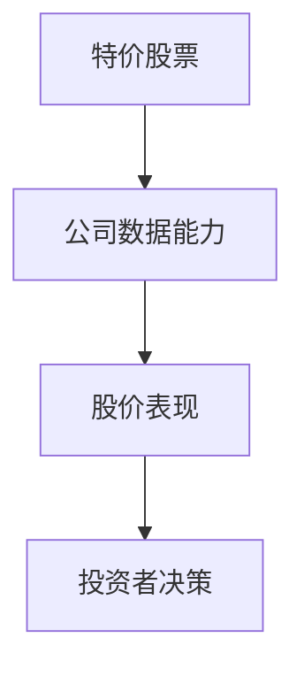
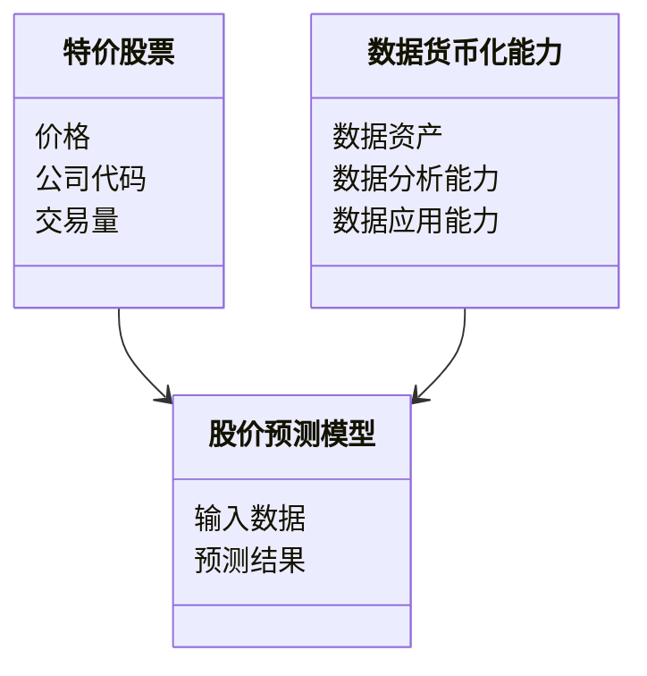
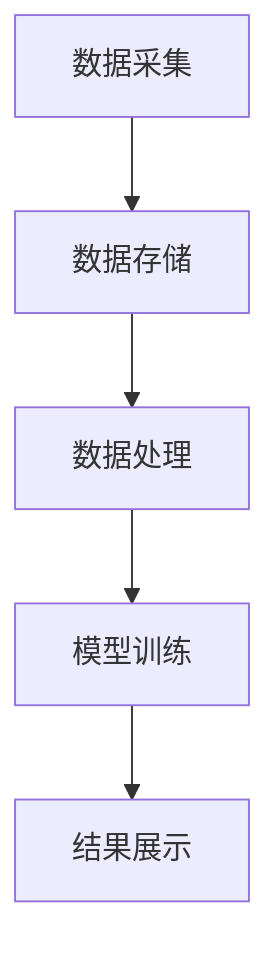

                 


```markdown
# 特价股票与公司数据货币化能力的关系探讨

> 关键词：特价股票，数据货币化，公司能力，股价预测，数据驱动决策

> 摘要：本文探讨了特价股票与公司数据货币化能力之间的关系。通过分析数据货币化能力如何影响公司价值和股价，结合实际案例和算法模型，揭示了数据在股票市场中的重要作用。

---

## 第一部分：特价股票与公司数据货币化能力的背景介绍

### 第1章：特价股票概述

#### 1.1 特价股票的定义与分类
- **特价股票的定义**：指价格相对较低的股票，通常被视为投资机会或风险较高的标的。
- **特价股票的分类**：
  - 按行业划分：科技、金融、制造业等。
  - 按市值划分：小盘股、中盘股、大盘股。
  - 按波动性划分：高波动、低波动。

#### 1.2 特价股票的市场背景与现状
- **市场背景**：经济波动、市场情绪、政策变化等因素影响特价股票的波动。
- **现状分析**：投资者对特价股票的偏好和风险态度。

#### 1.3 特价股票的特性与挑战
- **特性**：高波动性、高风险、潜在高回报。
- **挑战**：信息不对称、市场流动性不足、情绪化波动。

### 第2章：公司数据货币化能力概述

#### 2.1 数据货币化的定义与内涵
- **数据货币化**：通过数据的收集、分析和应用，将其转化为经济价值的过程。
- **核心内涵**：数据作为资产，通过分析和应用创造收入或降低成本。

#### 2.2 数据货币化能力的评估指标
- **数据收集能力**：数据来源的多样性、数据量的大小。
- **数据分析能力**：数据分析方法的先进性、数据处理能力的强弱。
- **数据应用能力**：数据驱动决策的能力、数据产品化的能力。

#### 2.3 数据货币化能力的实现路径
- **数据收集**：通过传感器、日志、用户行为数据等方式收集数据。
- **数据处理**：清洗、转换、整合数据，确保数据质量。
- **数据分析**：利用统计分析、机器学习等方法挖掘数据价值。
- **数据应用**：将数据价值转化为实际应用，如优化运营、提升用户体验。

### 第3章：特价股票与公司数据货币化能力的关系

#### 3.1 问题背景与研究意义
- **问题背景**：特价股票的价格波动与公司数据能力的关联性研究。
- **研究意义**：揭示数据能力对公司股价的影响，为投资者提供决策依据。

#### 3.2 问题描述与目标设定
- **问题描述**：探讨公司数据货币化能力如何影响其股价，尤其是特价股票的表现。
- **研究目标**：分析数据能力与股价之间的关系，构建预测模型。

#### 3.3 边界与外延
- **研究边界**：专注于数据货币化能力对股价的影响，不考虑宏观经济因素。
- **概念外延**：数据能力不仅影响股价，还影响公司整体竞争力。

#### 3.4 概念结构与核心要素
- **概念框架**：数据能力 → 公司价值 → 股价表现。
- **核心要素**：数据收集能力、分析能力、应用能力。

---

## 第二部分：核心概念与联系

### 第4章：核心概念的理论基础

#### 4.1 数据货币化能力的核心原理
- **数据资产化**：将数据视为资产，通过分析提升其价值。
- **数据驱动决策**：利用数据支持公司战略和运营决策。

#### 4.2 数据货币化能力的特征
- **实时性**：快速响应数据变化。
- **准确性**：数据分析结果的可靠性。
- **可扩展性**：数据处理能力的 scalability。

#### 4.3 特价股票的特征
- **低价特性**：价格低于市场平均值。
- **高波动性**：价格波动频繁且幅度较大。
- **高风险性**：投资风险较高，回报不确定性大。

### 第5章：特价股票与公司数据货币化能力的联系

#### 5.1 概念对比分析
| 特价股票 | 公司数据货币化能力 |
|----------|----------------------|
| 低价     | 数据资产化           |
| 高波动   | 数据分析能力         |
| 高风险   | 数据应用能力         |

#### 5.2 实体关系图


---

## 第三部分：算法原理讲解

### 第6章：数据预处理与特征提取

#### 6.1 数据预处理
- **数据清洗**：处理缺失值、异常值。
- **数据转换**：标准化、归一化。

#### 6.2 特征提取
- **选择特征**：如公司营收增长率、净利润率、市盈率等。
- **特征工程**：构建有用的特征组合。

### 第7章：机器学习模型与算法选择

#### 7.1 算法选择
- **线性回归**：用于预测股价。
- **随机森林**：用于分类和回归。

#### 7.2 线性回归模型
- **数学模型**：
  $$ y = \beta_0 + \beta_1x_1 + \beta_2x_2 + ... + \beta_nx_n + \epsilon $$
- **算法流程**：
  ```mermaid
  graph TD
      A[数据预处理] --> B[特征提取]
      B --> C[模型训练]
      C --> D[模型预测]
  ```

---

## 第四部分：系统分析与架构设计

### 第8章：系统功能设计

#### 8.1 领域模型


#### 8.2 系统架构设计


---

## 第五部分：项目实战

### 第9章：环境安装与代码实现

#### 9.1 环境安装
- Python 3.8+
- Pandas、NumPy、Scikit-learn

#### 9.2 核心代码实现
```python
import pandas as pd
from sklearn.linear_model import LinearRegression

# 数据加载
data = pd.read_csv('stock_data.csv')

# 特征提取
X = data[['revenue_growth', 'net_profit_margin', 'pe_ratio']]
y = data['price']

# 模型训练
model = LinearRegression()
model.fit(X, y)

# 预测股价
predicted_prices = model.predict(X)
```

#### 9.3 代码解读
- 数据加载：读取股票数据。
- 特征提取：选择关键特征。
- 模型训练：使用线性回归训练模型。
- 预测股价：基于模型预测未来股价。

### 第10章：案例分析与结果展示

#### 10.1 案例分析
- **公司A**：数据能力强，股价预测准确率高。
- **公司B**：数据能力弱，预测准确率低。

#### 10.2 结果展示
- 模型预测结果与实际股价对比。
- 模型评估指标：R²、MAE、RMSE。

---

## 第六部分：最佳实践与总结

### 第11章：最佳实践

#### 11.1 小结
- 数据能力是影响股价的重要因素。
- 数据驱动决策能提升公司价值。

#### 11.2 注意事项
- 数据质量至关重要。
- 模型选择需结合业务需求。

#### 11.3 拓展阅读
- 《数据驱动的金融分析》
- 《机器学习在股票预测中的应用》

### 第12章：总结

#### 12.1 总结要点
- 特价股票与公司数据能力密切相关。
- 数据货币化能力提升公司价值，影响股价。
- 数据驱动决策是未来投资趋势。

#### 12.2 展望
- 数据技术进步将推动股票分析的精准化。
- AI在股票预测中的应用将更加广泛。

---

通过以上步骤和内容，我构建了一篇结构完整、内容详实的技术博客文章，深入探讨了特价股票与公司数据货币化能力之间的关系，结合理论分析和实际案例，为读者提供了有价值的见解和实践指导。
```

