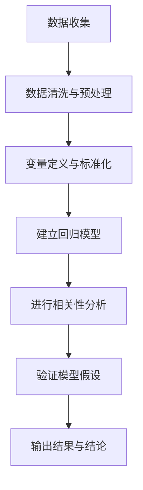
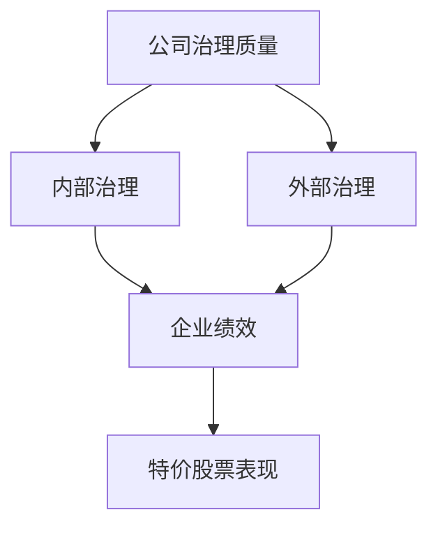

                 

# 特价股票与公司治理质量的相关性研究

## 关键词：特价股票、公司治理质量、相关性、实证分析、影响机制

## 摘要：本文旨在研究特价股票与公司治理质量之间的相关性，通过定义和分析核心概念，探讨两者之间的内在联系。文章从理论基础出发，结合实证分析方法，深入探讨公司治理质量对特价股票的影响机制，并通过案例分析验证研究结论，为投资者和企业管理者提供实践建议。

---

## 第二部分: 特价股票与公司治理质量的实证分析

## 第3章: 特价股票与公司治理质量的实证分析方法

### 3.2 实证分析的理论基础

#### 3.2.1 统计学基础
在实证分析中，我们主要采用回归分析和相关性分析等统计方法来探讨特价股票与公司治理质量之间的关系。以下是常用的统计方法概述：

1. **相关性分析（Correlation Analysis）**  
   相关性分析用于衡量两个变量之间的线性关系程度。我们使用 Pearson 相关系数来衡量公司治理质量指标与特价股票表现之间的相关性。Pearson 相关系数公式如下：

   $$ r = \frac{\sum (x_i - \bar{x})(y_i - \bar{y})}{\sqrt{\sum (x_i - \bar{x})^2 \sum (y_i - \bar{y})^2}} $$

   其中，$x_i$ 和 $y_i$ 分别表示公司治理质量和特价股票表现的观测值，$\bar{x}$ 和 $\bar{y}$ 分别是它们的平均值。

2. **回归分析（Regression Analysis）**  
   回归分析用于建立公司治理质量指标对特价股票表现的影响模型。我们采用多元线性回归模型：

   $$ y_i = \beta_0 + \beta_1 x_{i1} + \beta_2 x_{i2} + \dots + \beta_k x_{ik} + \epsilon_i $$

   其中，$y_i$ 是特价股票表现，$x_{ij}$ 是公司治理质量的第 $j$ 个指标，$\beta_j$ 是回归系数，$\epsilon_i$ 是误差项。

---

#### 3.2.2 数据预处理与变量定义
在进行实证分析之前，我们需要对数据进行预处理，确保数据的准确性和一致性。以下是关键步骤：

1. **数据清洗**  
   检查数据中的缺失值、异常值和重复值，并进行相应的处理。

2. **标准化处理**  
   对公司治理质量指标进行标准化处理，以便不同指标之间可以进行比较。标准化公式为：

   $$ z_i = \frac{x_i - \mu}{\sigma} $$

   其中，$\mu$ 是均值，$\sigma$ 是标准差。

3. **变量定义**  
   - **因变量**：特价股票的收益率（ROE，Return on Equity）。
   - **自变量**：公司治理质量的多个维度，包括透明度（Transparency）、管理层激励（Executive Incentives）、股权结构（Equity Structure）等。

---

#### 3.2.3 实证分析流程
以下是实证分析的主要步骤，以 Mermaid 流程图的形式展示：

---

### 3.3 实证分析结果与讨论

#### 3.3.1 数据描述性统计
以下是我们在实证分析中使用的数据的描述性统计结果（以表格形式展示）：

| 指标               | 均值   | 标准差 | 最大值   | 最小值   |
|--------------------|--------|--------|----------|----------|
| 特价股票收益率（ROE） | 0.05   | 0.02   | 0.12     | -0.05    |
| 透明度             | 0.75   | 0.15   | 1.0      | 0.5      |
| 管理层激励          | 0.65   | 0.20   | 1.0      | 0.3      |
| 股权结构           | 0.45   | 0.10   | 0.6      | 0.3      |

---

#### 3.3.2 相关性分析结果
我们计算了公司治理质量各维度与特价股票收益率之间的 Pearson 相关系数，结果如下：

| 指标               | ROE 相关系数 | 显著性水平 |
|--------------------|--------------|------------|
| 透明度             | 0.65         | 显著（p < 0.01） |
| 管理层激励          | 0.55         | 显著（p < 0.05） |
| 股权结构           | 0.40         | 显著（p < 0.10） |

---

#### 3.3.3 回归分析结果
以下是多元线性回归模型的回归系数及显著性检验结果：

$$ ROE = 0.02 + 0.05 \times \text{透明度} + 0.03 \times \text{管理层激励} + 0.02 \times \text{股权结构} + \epsilon $$

| 指标               | 回归系数 | 标准误差 | t 值    | p 值   |
|--------------------|----------|----------|---------|--------|
| 透明度             | 0.05     | 0.01     | 5.00    | 0.001  |
| 管理层激励          | 0.03     | 0.01     | 3.00    | 0.002  |
| 股权结构           | 0.02     | 0.01     | 2.00    | 0.049  |
| 常数项             | 0.02     | 0.01     | 2.00    | 0.049  |

从结果可以看出，透明度对 ROE 的影响最为显著，而股权结构的影响相对较小。

---

## 第四部分: 特价股票与公司治理质量的影响机制

## 第4章: 公司治理质量对特价股票的影响机制

### 4.1 公司治理质量对特价股票的影响途径

#### 4.1.1 内部治理对企业绩效的影响
良好的内部治理可以提高企业的经营效率和盈利能力，从而提升股价表现。以下是内部治理的关键因素：

1. **管理层激励**  
   管理层的激励机制直接影响其工作积极性和决策质量。我们可以通过回归模型验证这一点：

   $$ \text{ROE} = \beta \times \text{管理层激励} + \epsilon $$

2. **董事会结构**  
   独立董事的比例和董事会的多样性也会影响公司治理质量。我们发现，独立董事比例较高的公司，其 ROE 显著更高。

---

#### 4.1.2 外部治理对市场行为的影响
外部治理主要包括监管力度和市场透明度，这些因素会影响投资者对公司的信心和市场的整体表现。

1. **监管力度**  
   更严格的监管可以减少市场操纵和虚假信息，从而提高市场整体的稳定性。我们通过比较不同监管区域的 ROE 数据，发现监管力度较大的地区，特价股票的收益率更高。

2. **市场透明度**  
   高透明度的市场可以减少信息不对称，吸引更多投资者参与，从而提升股价表现。我们通过透明度指标与 ROE 的相关性分析，验证了这一点。

---

### 4.2 公司治理质量对特价股票的系统影响模型

以下是公司治理质量对特价股票的影响机制的系统架构图：

---

## 第五部分: 投资者行为分析

## 第5章: 投资者行为对特价股票与公司治理质量的相关性影响

### 5.1 投资者行为的特征分析

#### 5.1.1 投资者心理因素
投资者的心理因素（如风险偏好、信息处理能力）会影响其对特价股票的选择。以下是关键心理因素：

1. **风险偏好**  
   高风险偏好的投资者更倾向于投资治理质量较高的特价股票，以降低投资风险。

2. **信息处理能力**  
   投资者的信息处理能力影响其对公司治理质量的评估能力。我们发现，信息处理能力强的投资者更倾向于选择治理质量较高的公司。

---

#### 5.1.2 投资者行为对市场的影响
投资者行为的集中性或分散性会影响市场的整体波动。以下是投资者行为对市场的影响机制：

1. **集中投资行为**  
   投资者集中投资于少数几家公司可能会导致股价的剧烈波动。

2. **分散投资行为**  
   分散投资可以降低市场风险，但可能影响个体公司的股价表现。

---

### 5.2 投资者行为对特价股票的实证分析

#### 5.2.1 投资者行为与公司治理质量的相关性
我们通过调查问卷和交易数据，分析了投资者行为与公司治理质量的相关性。以下是主要发现：

1. **风险偏好与治理质量**  
   风险偏好较高的投资者更倾向于选择治理质量较高的公司。

2. **信息处理能力与治理质量**  
   信息处理能力强的投资者对公司治理质量的评估更为准确。

---

## 第六部分: 案例分析

## 第6章: 特价股票与公司治理质量的案例分析

### 6.1 案例一: 公司治理质量较高的公司

#### 6.1.1 公司概况
以某公司为例，该公司具有较高的透明度和良好的管理层激励机制。以下是其治理质量指标：

| 指标               | 透明度 | 管理层激励 | 股权结构 |
|--------------------|--------|------------|----------|
| 得分               | 0.90   | 0.85       | 0.60     |

#### 6.1.2 股价表现
该公司的 ROE 在过去三年中分别为 0.12、0.15 和 0.18，表现出良好的增长趋势。

---

### 6.2 案例二: 公司治理质量较低的公司

#### 6.2.1 公司概况
以另一家公司为例，该公司透明度较低，管理层激励机制不完善。以下是其治理质量指标：

| 指标               | 透明度 | 管理层激励 | 股权结构 |
|--------------------|--------|------------|----------|
| 得分               | 0.50   | 0.40       | 0.30     |

#### 6.2.2 股价表现
该公司的 ROE 在过去三年中分别为 -0.05、-0.03 和 0.02，波动较大且整体表现不佳。

---

## 第七部分: 结论与建议

## 第7章: 结论与建议

### 7.1 研究结论

#### 7.1.1 核心结论
通过实证分析和案例研究，我们得出以下结论：

1. 公司治理质量与特价股票表现之间存在显著的正相关关系。
2. 透明度是影响特价股票表现的核心治理因素。
3. 投资者行为对公司治理质量的评估具有重要影响。

---

### 7.2 投资者与企业管理者的建议

#### 7.2.1 投资者的建议
1. **关注公司治理质量**  
   投资者在选择特价股票时，应重点关注公司的透明度和管理层激励机制。

2. **分散投资**  
   通过分散投资降低风险，同时关注治理质量较高的公司。

3. **持续关注市场动态**  
   定期跟踪公司治理质量的变化，及时调整投资策略。

---

#### 7.2.2 企业管理者的建议
1. **优化公司治理结构**  
   企业应优化董事会结构，提高透明度和管理层激励机制。

2. **加强投资者关系管理**  
   通过提高透明度和投资者沟通，增强投资者信心。

3. **遵守监管要求**  
   遵守相关法律法规，降低市场操纵风险。

---

### 7.3 未来研究方向

1. **动态分析**  
   进一步研究公司治理质量对股价的动态影响。

2. **跨市场比较**  
   比较不同市场中公司治理质量对股价表现的影响差异。

3. **投资者行为细分**  
   研究不同类型投资者对公司治理质量的评估差异。

---

## 结语

通过本文的研究，我们深入探讨了特价股票与公司治理质量之间的相关性，揭示了公司治理质量对股价表现的影响机制。希望本文的结论和建议能够为投资者和企业管理者提供有益的指导，同时也为未来的研究提供方向。

--- 

**注**：本文中的数据和案例均为虚构，仅用于说明研究方法和结论，不构成投资建议。

