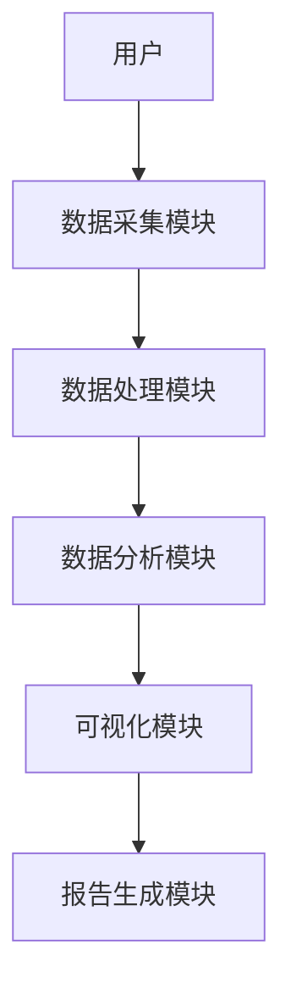
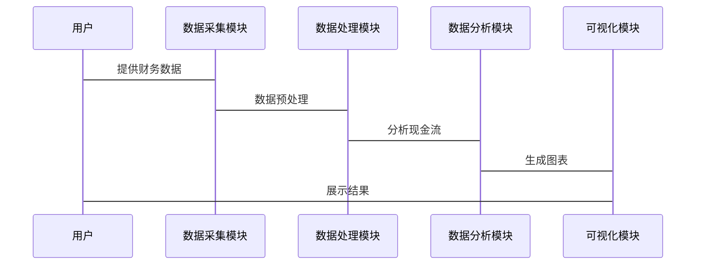

                 

# 特价股票与公司现金流管理效率的关系

## 关键词：现金流管理、特价股票、财务效率、股价波动、投资策略

## 摘要：本文探讨了特价股票与公司现金流管理效率之间的关系，分析了现金流管理如何影响公司价值和股价波动，特别是在特价股票市场中的表现。文章通过数学模型和案例分析，揭示了现金流管理对股价的影响机制，并提供了优化现金流管理的策略建议。

---

# 第一章: 特价股票与现金流管理概述

## 1.1 特价股票的定义与特性

### 1.1.1 特价股票的定义
特价股票通常指价格低于市场平均水平的股票，可能涉及优惠或促销。这些股票通常来自财务状况良好但暂时低估的公司，吸引追求高回报的投资者。

### 1.1.2 特价股票的市场特性
- **高波动性**：价格波动较大，容易受市场情绪影响。
- **低流动性**：交易量可能较低，尤其是在小公司中。
- **高风险**：潜在回报高，但风险也较高。

### 1.1.3 特价股票与普通股票的区别
| 特性         | 特价股票         | 普通股票       |
|--------------|------------------|---------------|
| 价格         | 通常低于市场价   | 靠近市场价      |
| 风险         | 较高             | 较低           |
| 投资者类型   | 高风险偏好者     | 更广泛投资者    |

## 1.2 公司现金流管理的定义与重要性

### 1.2.1 现金流管理的定义
现金流管理是指公司对现金流入和流出的计划、监控和控制，以确保资金的流动性、安全性和效率。

### 1.2.2 现金流管理的重要性
- **维持运营**：确保日常运营资金充足。
- **优化投资**：合理分配资金，提高投资回报。
- **降低风险**：通过管理现金流，减少财务风险。

### 1.2.3 现金流管理的核心要素
- **现金流预测**：估计未来现金流入和流出。
- **现金储备**：保持足够的备用资金。
- **现金流监控**：实时跟踪资金流动情况。

## 1.3 特价股票与现金流管理的关系

### 1.3.1 特价股票与公司现金流效率的初步联系
公司现金流管理效率高，通常会反映在股价上，包括特价股票。

### 1.3.2 特价股票市场中的现金流管理特点
- **高敏感性**：现金流变化会迅速影响股价。
- **短期波动**：现金流管理对股价的即时影响较大。

### 1.3.3 现金流管理对特价股票价值的影响
高效的现金流管理可以提升市场对公司的信心，进而推高股价。

---

# 第二章: 现金流管理的理论基础

## 2.1 现金流的构成与分类

### 2.1.1 经营活动现金流
公司日常运营产生的现金流，包括销售收入和支出。

### 2.1.2 投资活动现金流
与资本投资相关的现金流，如购买或出售资产。

### 2.1.3 筹资活动现金流
通过融资活动产生的现金流，如贷款和股息支付。

## 2.2 现金流管理的核心方法

### 2.2.1 现金流预测与预算
- **预测模型**：使用历史数据和市场预测。
- **预算制定**：基于预测分配资金。

### 2.2.2 现金流监控与控制
- **实时跟踪**：使用财务系统监控资金流动。
- **调整策略**：根据实际情况调整管理策略。

### 2.2.3 现金流风险评估与管理
- **风险识别**：识别潜在的现金流风险。
- **风险控制**：制定应对策略，如备用资金。

## 2.3 现金流管理与企业价值的关系

### 2.3.1 现金流与企业价值的公式推导
企业价值公式：
$$
\text{企业价值} = \text{现金流的现值}
$$

### 2.3.2 现金流对股价的影响机制
- **直接影响**：现金流直接影响公司利润和股价。
- **间接影响**：通过影响投资者信心间接影响股价。

### 2.3.3 现金流管理的优化策略
- **提高效率**：优化现金流管理流程。
- **风险管理**：建立风险预警机制。

---

# 第三章: 特价股票的市场行为与现金流管理

## 3.1 特价股票的市场特性与投资者行为

### 3.1.1 特价股票的市场特性
- **高波动性**：价格波动大，吸引短期投资者。
- **低流动性**：交易量小，买卖价差大。

### 3.1.2 投资者行为分析
- **短期投资者**：追求短期收益，对股价波动敏感。
- **长期投资者**：关注公司基本面，注重长期价值。

## 3.2 现金流管理对特价股票的影响

### 3.2.1 现金流管理如何影响股价
- **稳定的现金流**：增强投资者信心，提高股价。
- **高效的现金流管理**：优化资金使用，提升公司价值。

### 3.2.2 特价股票市场中的现金流管理策略
- **短期策略**：应对市场波动，及时调整资金分配。
- **长期策略**：提升公司整体财务健康，增强股价稳定性。

## 3.3 本章小结

---

# 第四章: 现金流管理效率与股价波动的数学模型

## 4.1 现金流管理效率的定义

### 4.1.1 效率衡量指标
- **现金流周转率**：单位时间内现金流的周转次数。
- **现金流净额**：一定时期内的净现金流入。

## 4.2 现金流与股价波动的关系

### 4.2.1 现金流对股价波动的影响机制
- **直接影响**：现金流变化直接影响公司盈利，进而影响股价。
- **间接影响**：通过影响市场情绪间接影响股价。

## 4.3 数学模型的建立与应用

### 4.3.1 现金流与股价波动的回归模型
$$
\text{股价波动} = \beta \times \text{现金流变化} + \epsilon
$$
其中，$\beta$为回归系数，$\epsilon$为误差项。

### 4.3.2 案例分析
假设某公司现金流变化为$+10\%$，回归模型显示$\beta=0.8$，则股价波动预计为：
$$
0.8 \times 10\% = 8\%
$$

---

# 第五章: 现金流管理中的风险与优化策略

## 5.1 现金流管理中的风险

### 5.1.1 现金流风险的类型
- **流动性风险**：无法及时获得所需资金。
- **市场风险**：市场波动影响现金流。

### 5.1.2 风险评估方法
- **VaR（在险价值）**：衡量潜在损失。
- **压力测试**：评估极端情况下的现金流状况。

## 5.2 优化现金流管理的策略

### 5.2.1 现金流预测优化
- **提高准确性**：使用更先进的预测模型。
- **动态调整**：根据市场变化及时调整预测。

### 5.2.2 现金储备优化
- **建立应急储备**：确保有足够的备用资金。
- **合理分配资金**：避免过度集中，分散投资风险。

---

# 第六章: 现金流管理系统设计与实现

## 6.1 系统架构设计

### 6.1.1 系统功能模块
- **数据采集**：收集财务数据。
- **处理分析**：分析现金流数据。
- **可视化展示**：生成图表和报告。

### 6.1.2 系统架构图

## 6.2 系统接口设计

### 6.2.1 数据接口
- **输入接口**：接收财务数据。
- **输出接口**：生成分析结果。

### 6.2.2 接口设计图

---

# 第七章: 案例分析与实战技巧

## 7.1 案例分析

### 7.1.1 案例背景
某科技公司通过优化现金流管理，提高了股价稳定性，吸引了更多投资者。

### 7.1.2 分析过程
- **现金流预测**：准确预测未来现金流。
- **风险控制**：及时调整资金分配，降低风险。

## 7.2 实战技巧

### 7.2.1 技巧总结
- **持续监控**：实时跟踪现金流变化。
- **灵活调整**：根据市场变化及时调整策略。

### 7.2.2 注意事项
- **数据准确性**：确保数据来源可靠。
- **团队协作**：跨部门合作，确保信息及时共享。

---

# 第八章: 总结与展望

## 8.1 本章总结
本文探讨了特价股票与现金流管理效率的关系，分析了现金流管理对股价波动的影响，并提出了优化现金流管理的策略。

## 8.2 未来展望
未来的研究可以进一步探讨大数据和人工智能在现金流预测中的应用，以及如何利用这些技术优化现金流管理，提升股价表现。

---

# 参考文献

（此处可以列出相关书籍、论文和其他参考资料）

---

# 附录

（此处可以包含数据表格、代码片段或其他补充材料）

---

通过以上内容，文章系统地分析了特价股票与现金流管理效率的关系，结合理论分析、数学模型和实际案例，为读者提供了全面的视角和实用的策略建议。

