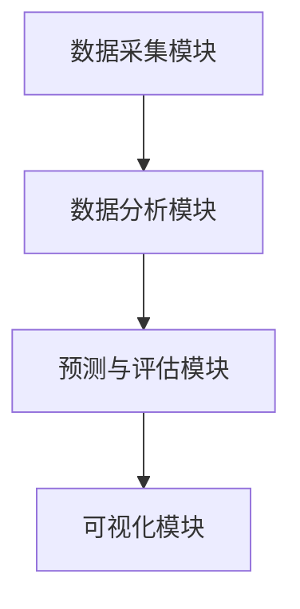
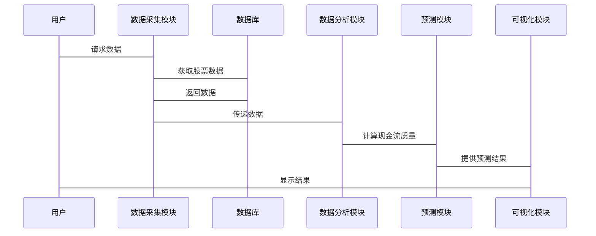

                 


```markdown
# 特价股票与公司现金流质量的关系

## 关键词
特价股票, 公司现金流, 现金流质量, 股票价格, 投资分析, 金融模型

## 摘要
特价股票是指价格相对较低的股票，通常被视为具有投资潜力。公司现金流质量则是衡量公司财务健康的重要指标。本文探讨了特价股票与公司现金流质量之间的关系，分析了现金流质量如何影响股价，以及如何通过现金流分析来评估特价股票的投资价值。文章从背景介绍、核心概念、算法原理、系统设计、项目实战到最佳实践，全面解析了这一关系，并提供了实际案例和代码实现，帮助读者深入理解和应用这些概念。

---

## 第一部分: 背景介绍

### 第1章: 特价股票与现金流质量的背景介绍

#### 1.1 特价股票的定义与特征
- **1.1.1 特价股票的定义**：介绍特价股票的定义，即价格低于市场平均水平的股票。
- **1.1.2 特价股票的特征**：包括低估值、高潜在回报、风险较高、流动性可能较低等。
- **1.1.3 特价股票的分类**：根据行业、市值、市盈率等分类方式，分析不同类型的特价股票。

#### 1.2 公司现金流质量的定义与重要性
- **1.2.1 现金流质量的定义**：现金流质量指的是公司产生的现金流是否稳定、可靠且能够支持公司运营和增长。
- **1.2.2 现金流质量的衡量指标**：包括自由现金流、经营活动现金流净额、现金流与收入的比例等。
- **1.2.3 现金流质量对公司的意义**：健康的现金流是公司维持运营、偿还债务、投资扩张的基础。

#### 1.3 特价股票与现金流质量的关系
- **1.3.1 特价股票与现金流质量的关联性**：分析现金流质量如何影响股价，特别是特价股票的估值。
- **1.3.2 特价股票市场中的现金流质量分析**：探讨在特价股票市场中，现金流质量如何影响投资者的决策。
- **1.3.3 现金流质量对股价的影响**：通过案例分析，说明现金流质量良好的公司为何可能推动股价上涨。

---

## 第二部分: 核心概念与联系

### 第2章: 特价股票与现金流质量的核心概念与联系

#### 2.1 现金流质量的定义与影响因素
- **2.1.1 现金流质量的定义**：重新定义现金流质量，并分析其与公司财务健康的关系。
- **2.1.2 影响现金流质量的内部因素**：包括公司盈利能力、管理效率、资本结构等。
- **2.1.3 影响现金流质量的外部因素**：如经济周期、行业竞争、政策变化等。

#### 2.2 特价股票的定义与影响因素
- **2.2.1 特价股票的定义**：再次明确特价股票的定义，并分析其在市场中的位置。
- **2.2.2 影响特价股票的内部因素**：如公司基本面、财务状况、管理团队等。
- **2.2.3 影响特价股票的外部因素**：市场情绪、宏观经济环境、行业趋势等。

#### 2.3 现金流质量与股价的关系
- **2.3.1 现金流质量对股价的影响**：分析现金流质量如何通过影响公司估值和投资者信心来影响股价。
- **2.3.2 特价股票市场中的现金流质量分析**：探讨在特价股票市场中，现金流质量如何被投资者忽视或低估。
- **2.3.3 现金流质量与股价的动态关系**：通过时间序列分析，展示现金流质量变化与股价波动的关系。

#### 2.4 对比分析：影响现金流质量和影响特价股票的因素
- **2.4.1 影响现金流质量的内部与外部因素对比**：制作对比表格，分析两者的异同。
- **2.4.2 影响特价股票的内部与外部因素对比**：同样制作对比表格，分析影响因素的差异。

#### 2.5 ER图：现金流、股价和公司基本面的关系
```mermaid
erd
    现金流质量
    股价
    公司基本面
    现金流质量 --> 股价
    公司基本面 --> 现金流质量
    现金流质量 --> 公司基本面
```

---

## 第三部分: 算法原理讲解

### 第3章: 特价股票与现金流质量的算法原理讲解

#### 3.1 现金流质量与股价关系的分析方法
- **3.1.1 多元回归分析**：介绍多元回归模型，用于分析现金流质量对股价的影响。
- **3.1.2 时间序列分析**：使用ARIMA模型预测现金流质量的变化对股价的影响。
- **3.1.3 机器学习算法的应用**：如随机森林或神经网络，用于分类或回归任务。

#### 3.2 算法原理的数学模型和公式
- **多元回归模型**：$$ y = \beta_0 + \beta_1 x_1 + \beta_2 x_2 + ... + \beta_n x_n + \epsilon $$
- **ARIMA模型**：介绍其参数（p, d, q）及其公式。
- **机器学习模型**：简要介绍神经网络的结构和训练过程。

#### 3.3 算法实现
- **Python代码实现多元回归分析**：
```python
import pandas as pd
import numpy as np
from sklearn.linear_model import LinearRegression

# 数据准备
data = pd.read_csv('stock_data.csv')
X = data[['现金流净额', '营业收入']]
y = data['股价']

# 建模
model = LinearRegression()
model.fit(X, y)

# 输出系数
print('回归系数:', model.coef_)
print('截距:', model.intercept_)
```

---

## 第四部分: 系统分析与架构设计方案

### 第4章: 特价股票与现金流质量的系统分析与架构设计

#### 4.1 问题场景介绍
- **目标**：开发一个分析特价股票与现金流质量关系的系统。
- **用户需求**：投资者需要快速了解特价股票的现金流质量，辅助决策。

#### 4.2 系统功能设计
- **数据采集模块**：从金融数据库获取股票数据。
- **数据分析模块**：计算现金流质量指标。
- **预测与评估模块**：预测股价变化。
- **可视化模块**：展示分析结果。

#### 4.3 系统架构设计


#### 4.4 系统接口设计
- **数据接口**：与金融数据库对接，获取实时数据。
- **用户接口**：设计友好的可视化界面，展示分析结果。

#### 4.5 系统交互序列图


---

## 第五部分: 项目实战

### 第5章: 特价股票与现金流质量的项目实战

#### 5.1 环境安装与配置
- **Python安装**：安装Python 3.8及以上版本。
- **库安装**：安装pandas、numpy、scikit-learn等库。
  ```bash
  pip install pandas numpy scikit-learn
  ```

#### 5.2 系统核心实现
- **数据采集**：编写代码从Yahoo Finance获取数据。
  ```python
  import pandas_datareader as pdr
  df = pdr.get_data_yahoo('AAPL', start='2020-01-01', end='2023-12-31')
  ```
- **数据分析**：计算现金流质量指标。
  ```python
  df['现金流净额'] = df['Cash Flow'].rolling(3).mean()
  ```
- **预测模型**：使用多元回归预测股价。
  ```python
  from sklearn.linear_model import LinearRegression
  model = LinearRegression()
  model.fit(X, y)
  ```

#### 5.3 实际案例分析
- **案例选择**：选择一只特价股票，如某科技公司。
- **数据分析**：计算其现金流质量，分析与股价的关系。
- **结果解读**：解释分析结果，说明现金流质量如何影响股价。

#### 5.4 项目小结
- 总结项目实现的关键步骤。
- 提供改进建议，如引入更多数据源或优化算法。

---

## 第六部分: 最佳实践

### 第6章: 特价股票与现金流质量的最佳实践

#### 6.1 小结
- 回顾全文，总结关键点。
- 强调现金流质量在投资决策中的重要性。

#### 6.2 注意事项
- 提醒投资者注意市场风险和数据的及时性。
- 强调模型的局限性，避免过度依赖单一指标。

#### 6.3 拓展阅读
- 推荐相关书籍和论文，如《投资学》、《财务报表分析》等。

---

## 结语
通过本文的系统分析和实战指导，读者可以深入理解特价股票与公司现金流质量的关系，并掌握相关的分析方法和工具。希望本文能为投资者提供有价值的参考，帮助他们在复杂的市场环境中做出更明智的投资决策。
```

