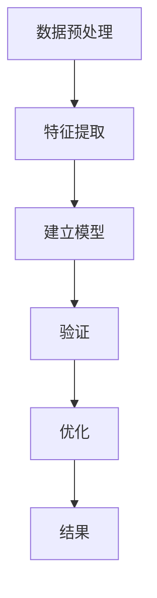
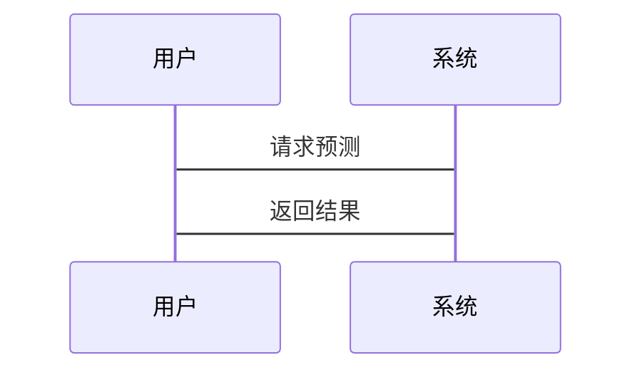

                 


# 特价股票与公司盈利能力的长期关系

## 关键词：特价股票、公司盈利能力、长期关系、算法原理、数学模型、系统架构

## 摘要：本文探讨特价股票与公司盈利能力之间的长期关系，通过背景分析、数学建模和系统设计，揭示特价股票对公司盈利能力的影响机制，并提供实证分析和实践建议。

---

## 第一部分：背景介绍

### 第1章：特价股票与公司盈利能力的概述

#### 1.1 特价股票的定义与特点
- 特价股票指的是以低于市场价发行的股票，通常用于吸引投资者或筹集资金。
- 特点包括低发行价、高流通性、潜在增值空间。

#### 1.2 公司盈利能力的定义与指标
- 盈利能力指公司在一定时期内赚取利润的能力。
- 关键指标：净利润率、ROE、毛利率。

#### 1.3 特价股票与公司盈利能力的关系
- 特价股票可能通过增加流动资金间接提升盈利能力。
- 长期关系涉及市场反应、股东结构变化和公司治理优化。

---

## 第二部分：核心概念与联系

### 第2章：特价股票与公司盈利能力的核心概念

#### 2.1 特价股票与盈利能力的原理
- 特价股票可能稀释现有股东权益，短期内可能降低每股收益。
- 长期来看，若公司利用资金改善运营，可能提升盈利能力。

#### 2.2 属性特征对比分析
| 特性 | 特价股票 | 高价股票 |
|------|----------|----------|
| 发行价 | 低于市场价 | 高于市场价 |
| 流动性 | 高 | 中 |
| 投资门槛 | 低 | 高 |

#### 2.3 ER实体关系图
```mermaid
er
actor: 特价股票持有者
actor: 公司
actor: 投资者
```

---

## 第三部分：算法原理与数学模型

### 第3章：算法原理讲解

#### 3.1 算法概述
- 数据预处理：清洗和标准化。
- 关联分析：识别特价股票与盈利能力的关联因素。
- 预测模型：建立线性回归模型。

#### 3.2 mermaid流程图


#### 3.3 Python代码实现
```python
import pandas as pd
from sklearn.linear_model import LinearRegression

# 数据加载
data = pd.read_csv('stock_profit.csv')

# 特征提取
X = data[['price', 'volume']]
y = data['profitability']

# 建立模型
model = LinearRegression()
model.fit(X, y)

# 预测
y_pred = model.predict(X)
```

### 第4章：数学模型与公式

#### 4.1 盈利能力预测模型
- 线性回归模型：
  $$ \text{Profitability} = \beta_0 + \beta_1 \times \text{Price} + \beta_2 \times \text{Volume} + \epsilon $$
  
- 通过数据拟合，计算各系数，预测盈利能力。

---

## 第四部分：系统分析与架构设计方案

### 第5章：系统设计

#### 5.1 系统架构设计


#### 5.2 接口设计
- 数据接口：REST API。
- 输入：股票数据。
- 输出：预测结果。

#### 5.3 交互设计


---

## 第五部分：项目实战

### 第6章：项目实现

#### 6.1 环境安装
- 安装Python、pandas、scikit-learn。

#### 6.2 核心代码实现
```python
# 环境配置
import pandas as pd
from sklearn.metrics import r2_score

# 数据加载
data = pd.read_csv('stock.csv')

# 特征选择
features = data[['price', 'volume']]
target = data['profitability']

# 训练模型
model = LinearRegression()
model.fit(features, target)

# 评估
score = model.score(features, target)
print(f"R²: {score}")
```

#### 6.3 实例分析
- 使用实际数据，展示模型预测结果与实际值的对比。

#### 6.4 项目总结
- 讨论模型的优点和局限性，提出改进建议。

---

## 第六部分：最佳实践与注意事项

### 第7章：总结与建议

#### 7.1 最佳实践
- 定期更新模型，确保数据及时性。
- 结合多种指标进行综合分析。

#### 7.2 注意事项
- 数据质量影响结果，需谨慎处理。
- 模型结果仅供参考，需结合市场实际情况。

#### 7.3 拓展阅读
- 推荐相关书籍和论文，供深入学习。

---

# 结语
通过系统的分析和建模，我们揭示了特价股票与公司盈利能力之间的复杂关系，为投资者和企业管理者提供了有价值的参考。希望本文能为相关研究和实践提供有益的指导。

