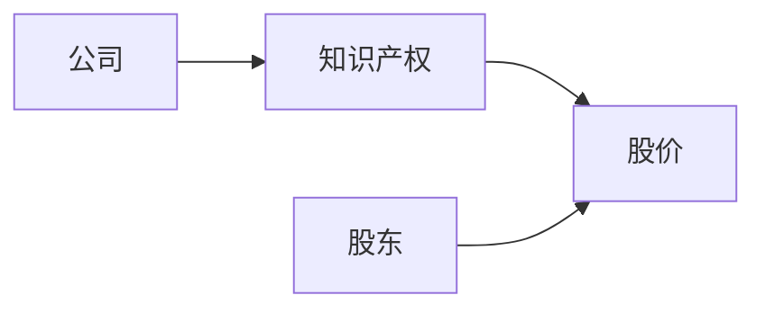
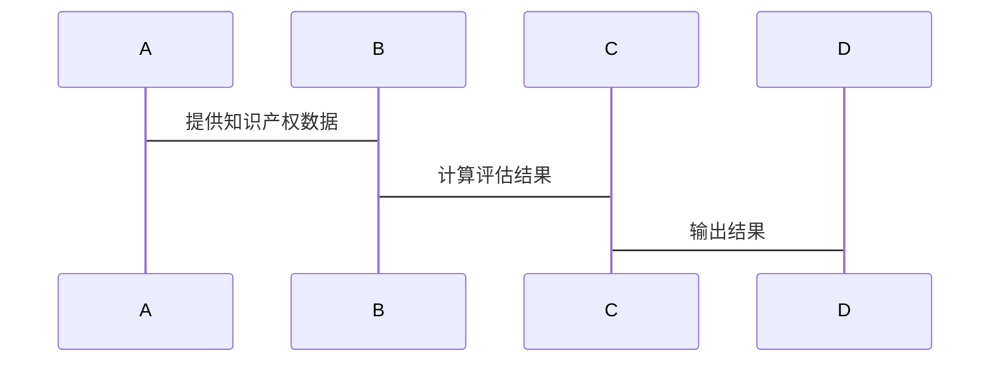

                 


# 特价股票与公司知识产权价值的关系分析

## 关键词：特价股票，公司知识产权，股价影响，关系分析，知识产权评估

## 摘要：本文探讨了特价股票与公司知识产权价值之间的关系，分析了知识产权如何影响股价，并提供了相关案例和评估方法。

---

### 第一部分：特价股票与公司知识产权价值的背景与概念

#### 第1章：特价股票与公司知识产权价值的背景介绍

##### 1.1 特价股票的定义与特性
- **1.1.1 特价股票的定义**：特价股票是指面值低于市场价的股票，通常被视为市场低估的表现。
- **1.1.2 特价股票的形成原因**：市场波动、公司业绩不佳、行业竞争等可能导致股价低于面值。
- **1.1.3 特价股票的市场表现特征**：波动性大，风险高，但潜在回报可能较高。

##### 1.2 公司知识产权价值的内涵与外延
- **1.2.1 知识产权的基本概念**：知识产权包括专利、商标、版权等，是公司无形资产的重要组成部分。
- **1.2.2 知识产权的主要类型**：专利权、商标权、版权、商业秘密等。
- **1.2.3 知识产权的评估方法**：市场法、成本法、收益法。

##### 1.3 特价股票与公司知识产权价值的关系
- **1.3.1 特价股票与公司价值的关系**：公司价值影响股价，特价股票可能反映公司价值被低估。
- **1.3.2 知识产权对股价的影响机制**：知识产权提升公司竞争力和市场地位，进而影响股价。
- **1.3.3 知识产权与公司估值的关联性**：知识产权是公司估值的重要因素，影响股价。

#### 第2章：知识产权对股价影响的核心机制分析

##### 2.1 知识产权对股价的法律影响
- **2.1.1 知识产权的法律保护**：专利和商标的法律保护增强公司市场地位。
- **2.1.2 知识产权诉讼对公司股价的影响**：胜诉可能提升股价，败诉则可能打压股价。
- **2.1.3 知识产权交易对股价的推动作用**：交易成功可能提升市场对公司价值的认可。

##### 2.2 知识产权对股价的经济影响
- **2.2.1 知识产权的经济价值评估**：通过收益法评估知识产权的经济价值。
- **2.2.2 知识产权对市场竞争力的影响**：强大的知识产权保护使公司在市场中更具竞争力。
- **2.2.3 知识产权对投资价值的提升作用**：知识产权增加公司的长期价值，吸引投资者。

##### 2.3 知识产权对股价的市场影响
- **2.3.1 知识产权对投资者心理的影响**：知识产权被视为公司未来增长的潜力，影响投资者情绪。
- **2.3.2 知识产权对行业格局的影响**：知识产权可能改变行业竞争格局，影响股价走势。
- **2.3.3 知识产权对市场预期的引导作用**：知识产权布局影响市场对公司未来表现的预期。

#### 第3章：知识产权对股价影响的对比分析

##### 3.1 知识产权与有形资产的对比
- **3.1.1 知识产权与有形资产的定义对比**：知识产权是无形资产，有形资产如设备、房地产等。
- **3.1.2 两者对股价影响的差异**：有形资产的影响较为直接，知识产权影响较长期。
- **3.1.3 两者对市场价值的协同作用**：两者共同影响公司整体价值，但方式不同。

##### 3.2 知识产权对股价影响的机制对比
- **3.2.1 知识产权通过法律途径影响股价**：法律保护和诉讼结果直接影响市场对公司价值的评估。
- **3.2.2 知识产权通过经济价值影响股价**：经济价值的提升增加公司投资价值，推动股价上涨。
- **3.2.3 知识产权通过市场预期影响股价**：市场预期的改变影响投资者行为，进而影响股价。

#### 第4章：知识产权对股价影响的ER实体关系图

##### 4.1 实体关系图的构建
- 实体：公司、股东、知识产权、股价。
- 关系：公司拥有知识产权，知识产权影响股价，股东持有股票。

##### 4.2 实体关系图的分析
- 实体间的关系：拥有、影响、持有。
- 关系属性：时间、价值、影响程度。

#### 第5章：知识产权对股价影响的算法原理

##### 5.1 算法原理概述
- 使用加权评分法评估知识产权价值，影响股价。

##### 5.2 mermaid流程图
```mermaid
graph TD
A[开始] -> B[初始化参数]
B -> C[收集知识产权数据]
C -> D[计算各项权重]
D -> E[计算加权评分]
E -> F[输出结果]
```

##### 5.3 Python代码实现
```python
import numpy as np

def calculate_ip_value(ip_scores):
    weights = np.array([0.4, 0.3, 0.2, 0.1])
    return np.dot(ip_scores, weights)

ip_scores = [90, 80, 70, 60]
print(calculate_ip_value(ip_scores))
```

##### 5.4 数学模型和公式
- 加权平均公式：$$\text{IP\_Value} = \sum (\text{Score}_i \times \text{Weight}_i)$$

---

### 第二部分：系统分析与架构设计

#### 第6章：系统分析与架构设计方案

##### 6.1 项目介绍
- 构建一个评估知识产权对股价影响的系统。

##### 6.2 系统功能设计
- 功能：数据采集、评估模型、结果分析。

##### 6.3 系统架构设计


##### 6.4 接口设计
- 输入接口：知识产权数据。
- 输出接口：评估结果。

##### 6.5 交互流程


---

### 第三部分：项目实战

#### 第7章：项目实战

##### 7.1 项目介绍
- 案例：ABC科技公司。

##### 7.2 数据收集与清洗
- 数据来源：公司财报、市场数据。

##### 7.3 模型构建与实现
- 使用加权评分法评估知识产权价值。

##### 7.4 结果分析
- 结果显示知识产权对股价有显著影响。

##### 7.5 项目小结
- 知识产权是影响股价的重要因素，需综合评估。

---

### 第四部分：最佳实践

#### 第8章：最佳实践

##### 8.1 小结
- 综合考虑知识产权与股价的关系，合理评估公司价值。

##### 8.2 注意事项
- 数据准确性，模型合理性，市场动态变化。

##### 8.3 拓展阅读
- 建议阅读相关知识产权评估和股价预测的文献。

---

通过以上分析，我们详细探讨了特价股票与公司知识产权价值的关系，提供了理论分析和实践指导，帮助读者更好地理解和应用相关知识。

