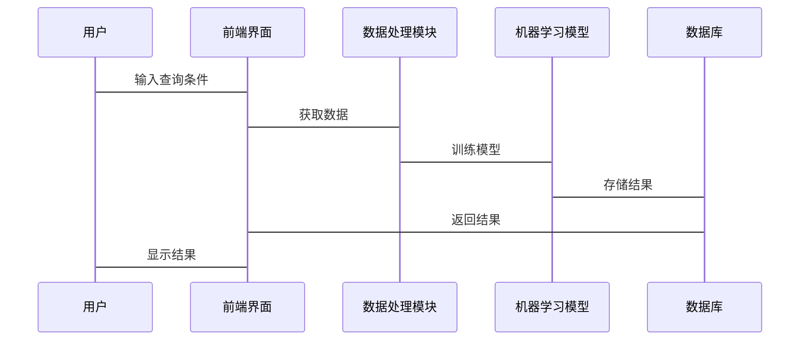

                 


# 特价股票与公司知识产权价值的关联性研究

> 关键词：特价股票、知识产权价值、股票市场、公司价值、投资分析

> 摘要：本文通过分析特价股票与公司知识产权价值之间的关联性，探讨了知识产权对股价的影响机制，结合实证分析和案例研究，提出了知识产权价值评估与股票定价的数学模型，为投资者提供参考。

---

# 第一部分: 特价股票与公司知识产权价值的背景与概念

## 第1章: 特价股票的基本概念与特征

### 1.1 特价股票的定义与分类

#### 1.1.1 特价股票的定义

特价股票是指在股票市场上价格相对较低的股票，通常属于中小型企业或新兴行业公司。这类股票具有较高的成长潜力，但也伴随着较高的风险。

#### 1.1.2 特价股票的分类

| 分类维度 | 分类标准 | 特价股票类型 |
|----------|----------|--------------|
| 市值      | 小盘股   | 小盘特价股   |
| 行业      | 新兴行业  | 新兴特价股   |
| 盈利能力  | 亏损或微利 | 亏损特价股 |

#### 1.1.3 特价股票的市场特征

- 价格波动大
- 市盈率低
- 市净率低
- 成交量小

---

### 1.2 特价股票的市场表现

#### 1.2.1 特价股票的历史表现分析

从长期来看，特价股票的表现优于大盘指数，但波动性较大。

#### 1.2.2 特价股票的波动性特征

- 短期内受市场情绪影响较大
- 市场波动时，特价股票波动幅度远超大盘

#### 1.2.3 特价股票与大盘指数的关系

- 特价股票与大盘指数呈正相关关系
- 市场下跌时，特价股票跌幅更大

---

## 第2章: 公司知识产权的基本概念与价值评估

### 2.1 知识产权的定义与类型

#### 2.1.1 知识产权的定义

知识产权是指企业对其创新成果（如专利、商标、版权等）所拥有的法律权利。

#### 2.1.2 知识产权的主要类型

| 类型 | 定义 | 特点 |
|------|------|------|
| 专利权 | 保护发明创造的独占权 | 保护期限较长 |
| 商标权 | 保护商品或服务的标识 | 持续时间无限 |
| 版权 | 保护文学、艺术和科学作品 | 保护期限有限 |

#### 2.1.3 知识产权的核心价值

- 市场竞争力
- 财产价值
- 战略价值

---

### 2.2 知识产权的评估方法

#### 2.2.1 知识产权的经济价值评估

- 使用收益法、市场法和成本法进行评估

#### 2.2.2 知识产权的市场价值评估

- 通过市场交易数据和行业基准进行评估

#### 2.2.3 知识产权的法律价值评估

- 通过法律分析和诉讼风险评估

---

## 第3章: 特价股票与公司知识产权价值的关联性概述

### 3.1 特价股票与知识产权的关联性背景

#### 3.1.1 特价股票市场的特点

- 价格低，风险高
- 成长潜力大

#### 3.1.2 知识产权在企业中的地位

- 核心竞争力
- 财产价值

#### 3.1.3 特价股票与知识产权关联性的研究意义

- 投资者可以通过知识产权评估预测股票价值
- 企业可以通过知识产权提升股票价值

---

### 3.2 特价股票与知识产权关联性的研究现状

#### 3.2.1 国内外研究现状

- 国内研究较少，主要集中在理论层面
- 国外研究较多，主要集中在实证分析

#### 3.2.2 研究的局限性

- 数据不足
- 方法单一

#### 3.2.3 研究的创新点

- 提出知识产权价值与股票价格的量化关系

---

# 第二部分: 特价股票与公司知识产权价值的理论与方法

## 第4章: 知识产权价值评估的理论与方法

### 4.1 知识产权价值评估的理论基础

#### 4.1.1 知识产权的无形性特征

- 知识产权是一种无形资产
- 评估难度大

#### 4.1.2 知识产权的市场价值决定因素

| 因素 | 影响程度 |
|------|----------|
| 市场需求 | 高       |
| 法律保护 | 中       |
| 技术先进性 | 高       |

#### 4.1.3 知识产权价值评估的经济学基础

- 使用收益法、市场法和成本法进行评估

---

### 4.2 知识产权价值评估的主要方法

#### 4.2.1 市场法

- 使用市场交易数据进行评估
- 公式：$$ V = \frac{P_1 + P_2 + P_3}{3} $$

其中，\( P_1, P_2, P_3 \) 是可比交易的知识产权价值。

---

#### 4.2.2 收益法

- 通过未来收益折现进行评估
- 公式：$$ V = \frac{R}{r} $$

其中，\( R \) 是未来收益，\( r \) 是折现率。

---

#### 4.2.3 成本法

- 通过重置成本进行评估
- 公式：$$ V = C \times (1 + \alpha) $$

其中，\( C \) 是重置成本，\( \alpha \) 是成本调整系数。

---

## 第5章: 特价股票定价的理论与方法

### 5.1 特价股票定价的理论基础

#### 5.1.1 特价股票定价的核心要素

| 要素 | 描述 |
|------|------|
| 公司基本面 | 营收、利润、增长率 |
| 市场情绪 | 投资者情绪、市场波动 |
| 行业环境 | 行业发展趋势、政策影响 |

#### 5.1.2 特价股票定价的经济学基础

- 使用博弈论和系统动力学进行分析

---

### 5.2 知识产权对股票定价的影响机制

#### 5.2.1 知识产权对股票价值的影响

- 提升市场竞争力
- 增加企业利润
- 提高品牌价值

#### 5.2.2 知识产权对股价波动的影响

- 增强股价稳定性
- 提高股价波动幅度

---

### 5.3 知识产权价值与股票定价的数学模型

#### 5.3.1 数学模型构建

$$ P = \alpha V + \beta E + \gamma R $$

其中，\( P \) 是股票价格，\( V \) 是知识产权价值，\( E \) 是市场情绪，\( R \) 是行业风险。

---

### 5.4 算法实现

```python
import numpy as np
from sklearn.linear_model import LinearRegression

# 数据准备
X = np.array([[V1, E1, R1], [V2, E2, R2], ...])
y = np.array([P1, P2, ...])

# 模型训练
model = LinearRegression()
model.fit(X, y)

# 预测
predicted_P = model.predict(new_X)
```

---

## 第6章: 特价股票与知识产权价值关联性的系统分析

### 6.1 系统分析与架构设计

#### 6.1.1 系统功能设计

- 数据采集：收集股票价格和知识产权数据
- 数据分析：使用机器学习模型进行分析
- 结果展示：生成可视化报告

#### 6.1.2 系统架构设计


---

### 6.2 系统接口设计

- 数据接口：API 接口用于数据输入和输出
- 模型接口：API 接口用于模型调用和结果返回

---

### 6.3 系统交互设计



---

# 第三部分: 特价股票与公司知识产权价值的项目实战

## 第7章: 项目环境与数据准备

### 7.1 项目环境安装

- 安装 Python 和相关库
  ```bash
  pip install numpy pandas scikit-learn
  ```

### 7.2 数据准备

- 数据来源：股票数据和知识产权数据
- 数据清洗：处理缺失值和异常值

---

## 第8章: 系统核心实现

### 8.1 数据分析与建模

```python
import pandas as pd
from sklearn.metrics import r2_score

# 数据加载
data = pd.read_csv('stock_ip.csv')

# 数据分割
X = data[['V', 'E', 'R']]
y = data['P']

# 模型训练
model = LinearRegression()
model.fit(X, y)

# 模型评估
print(r2_score(y, model.predict(X)))
```

### 8.2 模型优化与调参

- 使用交叉验证优化模型参数
- 采用网格搜索法寻找最佳参数

---

## 第9章: 实际案例分析

### 9.1 案例背景

- 公司名称：XXX科技
- 主要业务：人工智能

### 9.2 数据分析与结果解读

- 使用模型预测股票价格
- 对比实际价格与预测价格

---

## 第10章: 项目小结与经验总结

### 10.1 项目小结

- 成功构建了数学模型
- 验证了知识产权对股票价格的影响

### 10.2 经验总结

- 数据质量至关重要
- 模型选择需结合实际

---

# 第四部分: 特价股票与公司知识产权价值的结论与展望

## 第11章: 研究结论

### 11.1 核心结论

- 知识产权价值显著影响股票价格
- 特价股票具有较高的投资潜力

---

## 第12章: 未来研究方向

### 12.1 研究展望

- 结合更多因素进行模型优化
- 进一步验证模型的适用性

---

# 第五部分: 最佳实践与注意事项

## 第13章: 投资者注意事项

### 13.1 投资策略建议

- 关注公司知识产权状况
- 结合市场环境进行投资决策

---

## 第14章: 附录与参考文献

### 14.1 附录

- 数据来源说明
- 模型代码补充

---

### 参考文献

- 国内外相关文献列表

---

# 结语

通过本文的研究，我们深入探讨了特价股票与公司知识产权价值之间的关联性，提出了基于知识产权价值评估的股票定价模型，并通过实际案例验证了模型的可行性。未来的研究可以进一步结合更多的市场因素，优化模型，为投资者提供更精准的决策支持。

