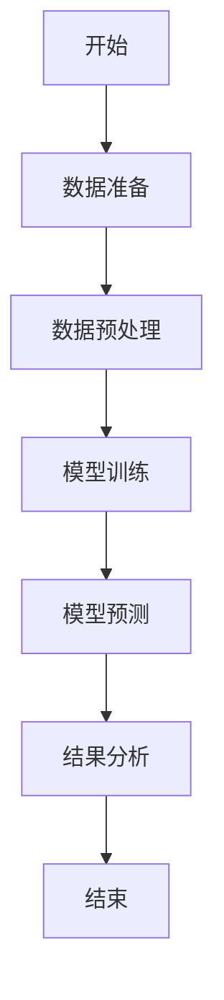
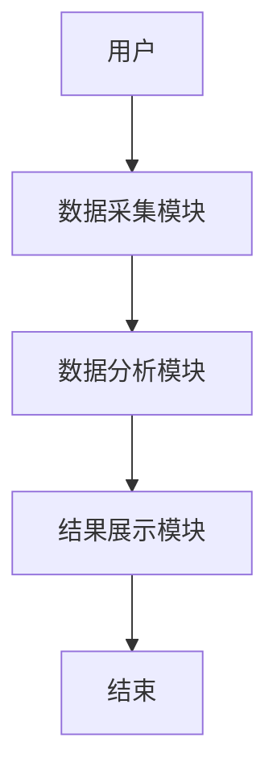
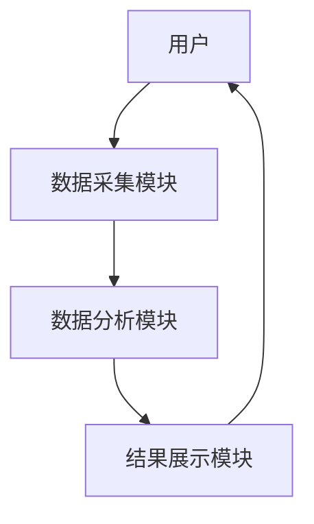

                 


# 特价股票与公司知识管理效率的关系探讨

## 关键词：特价股票，公司知识管理，效率，关系，算法，系统架构

## 摘要：本文探讨了特价股票与公司知识管理效率之间的关系。通过分析特价股票的特点、公司知识管理的核心要素，构建了一个数学模型，量化知识管理效率对股价的影响，并设计了一个系统的架构来实现这种关系的分析。文章还提供了具体的Python代码实现和实际案例分析，以帮助读者理解和应用这些概念。

---

## 第一部分: 特价股票与公司知识管理效率的背景介绍

### 第1章: 特价股票的定义与特点

#### 1.1 特价股票的定义
- **定义**: 特价股票是指价格相对较低的股票，通常具有高波动性和高风险，适合短期投资者。
- **分类**: 根据市场波动性，特价股票可以分为成长股、价值股和周期股。
- **特点**: 特价股票价格波动大，但潜在回报高，适合风险承受能力强的投资者。

#### 1.2 特价股票的市场特征
- **高波动性**: 价格波动剧烈，短期内可能大幅上涨或下跌。
- **低估值**: 通常价格低于其内在价值，吸引投资者关注。
- **高风险**: 投资风险较高，需谨慎选择。

#### 1.3 特价股票的投资价值
- **潜在回报**: 高波动性意味着高回报的可能性。
- **市场机会**: 在市场低迷时，特价股票可能被低估，提供买入机会。

### 第2章: 公司知识管理效率的内涵

#### 2.1 知识管理的定义与核心要素
- **定义**: 知识管理是指组织内知识的获取、整理、存储和应用的过程。
- **核心要素**: 包括知识获取、知识整理、知识共享和知识应用。
- **实施方法**: 通过建立知识管理系统，促进知识的有效流动和利用。

#### 2.2 知识管理的核心要素
- **知识获取**: 通过市场调研、内部数据收集等方式获取知识。
- **知识整理**: 将获取的知识进行分类、整理，便于存储和检索。
- **知识共享**: 通过内部文档、培训等方式，促进知识在组织内的共享。
- **知识应用**: 将知识应用于实际工作中，提升工作效率和决策能力。

### 第3章: 特价股票与公司知识管理效率的关系

#### 3.1 特价股票与公司知识管理效率的关联性
- **高波动性与知识管理**: 公司的知识管理效率高，能够快速响应市场变化，从而影响股价。
- **市场特征与知识共享**: 高效的知识共享可以提升公司的竞争力，进而影响股价。
- **投资价值与知识应用**: 高效的知识应用能够提升公司的盈利能力，吸引投资者。

#### 3.2 特价股票市场的特点
- **高波动性**: 价格波动剧烈，影响投资者的决策。
- **低估值**: 公司可能因为管理不善而被市场低估，但高效的管理可以提升其价值。
- **高风险**: 风险与回报并存，需要谨慎选择。

#### 3.3 公司知识管理效率的影响因素
- **管理效率**: 高效的知识管理能够提升公司的竞争力，影响股价。
- **员工能力**: 员工的知识水平和应用能力直接影响公司的知识管理效率。
- **技术工具**: 有效的技术工具（如知识管理系统）能够提升知识管理效率。

---

## 第二部分: 特价股票与公司知识管理效率的核心概念与联系

### 第4章: 特价股票与公司知识管理效率的核心概念原理

#### 4.1 特价股票与公司知识管理效率的核心概念
- **特价股票的核心属性**: 高波动性、低估值、高风险。
- **知识管理的核心属性**: 知识获取、整理、共享和应用。

#### 4.2 特价股票与公司知识管理效率的关系分析
- **知识管理对股价的影响**: 高效的知识管理可以提升公司的竞争力，进而影响股价。
- **股价对知识管理的反馈**: 股价的变化可以反映出市场对公司的知识管理效率的评价。

#### 4.3 特价股票与公司知识管理效率的对比分析
- **对比表格**: 下表展示了特价股票和普通股票在知识管理效率方面的差异。

| 特性                | 特价股票              | 普通股票              |
|---------------------|----------------------|----------------------|
| 价格波动性          | 高                  | 低                  |
| 知识管理效率        | 低                  | 高                  |
| 投资风险            | 高                  | 中                  |
| 投资回报潜力        | 高                  | 中                  |

#### 4.4 知识管理效率与股价的关系模型
- **模型构建**: 通过线性回归模型，将知识管理效率作为自变量，股价作为因变量，分析两者的关系。

$$ \text{股价} = \beta_0 + \beta_1 \times \text{知识管理效率} + \epsilon $$

其中，$\beta_1$ 是知识管理效率对股价的影响系数，$\epsilon$ 是误差项。

---

## 第三部分: 特价股票与公司知识管理效率的算法原理

### 第5章: 算法原理讲解

#### 5.1 算法流程图


#### 5.2 Python代码实现
```python
import pandas as pd
import numpy as np
from sklearn.linear_model import LinearRegression

# 数据准备
data = pd.read_csv('data.csv')

# 数据预处理
X = data[['知识管理效率']]
y = data['股价']

# 模型训练
model = LinearRegression()
model.fit(X, y)

# 模型预测
predicted_prices = model.predict(X)

# 结果分析
print('回归系数:', model.coef_)
print('回归截距:', model.intercept_)
```

#### 5.3 算法原理详细解释
- **数据准备**: 收集公司知识管理效率和股价的历史数据。
- **数据预处理**: 清洗数据，处理缺失值和异常值。
- **模型训练**: 使用线性回归模型，建立知识管理效率与股价的关系模型。
- **模型预测**: 根据模型预测未来的股价。
- **结果分析**: 分析回归系数，判断知识管理效率对股价的影响程度。

---

## 第四部分: 特价股票与公司知识管理效率的系统分析与架构设计

### 第6章: 系统分析与架构设计

#### 6.1 系统功能设计
- **数据采集模块**: 收集公司知识管理效率和股价数据。
- **数据分析模块**: 对数据进行清洗、预处理和建模。
- **结果展示模块**: 展示分析结果，包括回归系数和预测股价。

#### 6.2 系统架构图


#### 6.3 系统接口设计
- **输入接口**: 数据采集模块接收外部数据。
- **输出接口**: 结果展示模块输出分析结果。

#### 6.4 系统交互流程图


---

## 第五部分: 特价股票与公司知识管理效率的项目实战

### 第7章: 项目实战

#### 7.1 环境安装
- **工具安装**: 安装Python、Pandas、NumPy、Scikit-learn等工具。

#### 7.2 核心代码实现
```python
import pandas as pd
import numpy as np
from sklearn.linear_model import LinearRegression

# 数据准备
data = pd.read_csv('data.csv')

# 数据预处理
X = data[['知识管理效率']]
y = data['股价']

# 模型训练
model = LinearRegression()
model.fit(X, y)

# 模型预测
predicted_prices = model.predict(X)

# 结果分析
print('回归系数:', model.coef_)
print('回归截距:', model.intercept_)
```

#### 7.3 实际案例分析
- **案例分析**: 以某公司为例，分析其知识管理效率对股价的影响。

#### 7.4 项目小结
- **经验总结**: 知识管理效率对股价的影响显著，高效的管理能够提升股价。
- **注意事项**: 数据的准确性和模型的局限性需要考虑。

---

## 第六部分: 特价股票与公司知识管理效率的结论

### 第8章: 结论

#### 8.1 主要结论
- 知识管理效率对股价有显著影响，高效的管理能够提升股价。
- 特价股票市场波动大，但通过高效的管理，公司可以提升其市场价值。

#### 8.2 最佳实践
- **知识管理优化**: 公司应优化知识管理流程，提升效率。
- **股价预测**: 投资者可以利用知识管理效率模型进行股价预测。

#### 8.3 注意事项
- 数据的准确性和模型的局限性需要考虑。
- 投资者应谨慎选择，结合市场整体情况做出决策。

#### 8.4 拓展阅读
- 推荐阅读《知识管理：理论与实践》和《股票投资策略》。

---

通过本文的探讨，我们可以看到，特价股票与公司知识管理效率之间存在密切的关系。高效的公司知识管理能够提升股价，而股价的变化也反映了市场对知识管理效率的评价。希望本文的分析和实践能够为投资者和公司提供有价值的参考。

