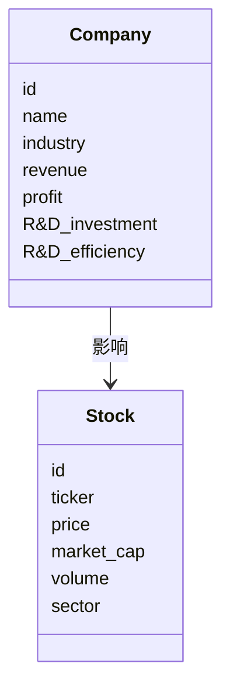
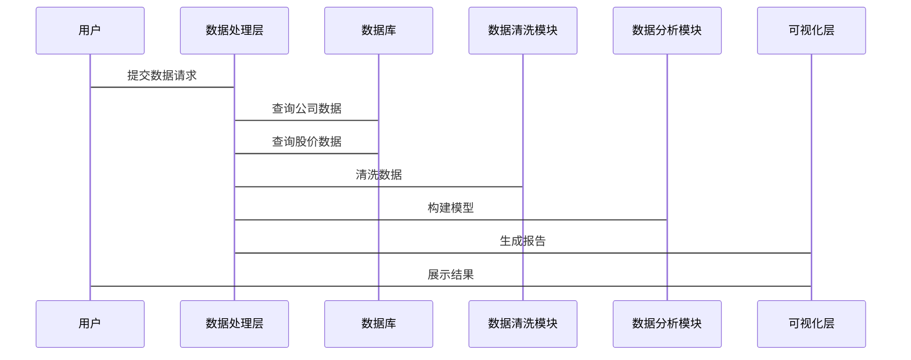

                 


# 特价股票与公司研发投入效率的关系分析

## 关键词：特价股票、研发投入效率、市场反应、投资策略、数据分析、算法模型

## 摘要：  
本文探讨了特价股票与公司研发投入效率之间的关系，分析了影响公司研发投入效率的关键因素，揭示了特价股票背后的市场反应机制，提出了基于数据分析的投资策略。文章通过系统分析和算法模型，深入研究了两者的相互作用，为投资者和企业管理者提供了有价值的参考。

---

# 第一部分: 特价股票与公司研发投入效率的背景介绍

## 第1章: 特价股票与公司研发投入效率的核心概念

### 1.1 特价股票的定义与特点  
#### 1.1.1 特价股票的定义  
特价股票指的是价格低于行业平均水平或历史平均水平的股票，通常被认为是被市场低估的投资标的。  

#### 1.1.2 特价股票的核心特点  
- 低估值：市盈率、市净率等估值指标低于行业平均水平。  
- 市场情绪：投资者对公司的未来预期较低，导致股价被压制。  
- 投资机会：低价股票可能蕴含较大的上涨空间。  

#### 1.1.3 特价股票的分类与属性对比  
- 按行业分类：如科技、金融、制造等行业的特价股票。  
- 按市值分类：如小盘股、中盘股、大盘股中的特价股票。  

### 1.2 公司研发投入效率的定义与特点  
#### 1.2.1 公司研发投入效率的定义  
研发投入效率是指公司在研发支出与实际产出之间的比率，衡量公司将资金转化为创新成果的能力。  

#### 1.2.2 公司研发投入效率的核心特点  
- 投资回报：高研发投入效率意味着单位研发投入能产生更高的收益。  
- 创新能力：高效的研发投入通常与公司的技术领先性和市场竞争力密切相关。  
- 财务表现：高研发投入效率通常与公司盈利能力提升、股价上涨相关联。  

#### 1.2.3 公司研发投入效率的分类与属性对比  
- 按行业分类：不同行业的研发投入效率差异显著。  
- 按公司规模分类：中小型企业可能更注重研发投入效率，而大型企业可能更注重研发规模。  

### 1.3 特价股票与公司研发投入效率的关系背景  
#### 1.3.1 问题背景与问题描述  
- 特价股票通常被认为具有投资价值，但其背后的逻辑是否与公司研发投入效率有关？  
- 投资者是否可以通过分析公司研发投入效率来筛选出真正的“低估”股票？  

#### 1.3.2 问题解决的思路与方法  
- 从数据分析的角度，研究公司研发投入效率与股价之间的关系。  
- 通过算法模型，筛选出具有高研发投入效率的特价股票。  

#### 1.3.3 问题的边界与外延  
- 研究范围：仅限于上市公司，不包括未上市企业。  
- 数据范围：以公开财务数据和股价数据为基础。  

#### 1.3.4 核心概念结构与要素组成  
- 核心要素：公司研发投入效率、股价、估值指标（市盈率、市净率）。  

---

## 第2章: 特价股票与公司研发投入效率的核心概念联系  

### 2.1 核心概念原理  
#### 2.1.1 特价股票与公司研发投入效率的内在联系  
- 高研发投入效率的公司可能因为市场对其未来增长潜力的低估，导致股价被压制，形成特价股票。  
- 投资者可以通过分析公司研发投入效率，筛选出具有长期增长潜力的特价股票。  

#### 2.1.2 特价股票与公司研发投入效率的相互作用机制  
- 公司研发投入效率高：市场可能重新评估公司价值，推动股价上涨，溢价效应出现。  
- 特价股票：投资者可能因为公司研发投入效率高而重新评估其价值，推动股价上涨。  

### 2.2 概念属性特征对比  
#### 2.2.1 特价股票与公司研发投入效率的属性对比表格  

| 属性              | 特价股票                          | 公司研发投入效率                  |
|-------------------|----------------------------------|------------------------------------|
| 核心特征          | 低估值、市场情绪低               | 投资回报高、创新能力高            |
| 数据来源          | 股价、估值指标（市盈率、市净率） | 研发支出、销售收入、净利润        |
| 分析目的          | 寻找被低估的投资机会             | 评估公司的创新能力和投资价值      |

#### 2.2.2 通过 Mermaid 绘制的 ER 实体关系图  

```mermaid
erDiagram
    company {
        id
        name
        industry
        revenue
        profit
        R&D_investment
        R&D_efficiency
    }
    stock {
        id
        ticker
        price
        market_cap
        volume
        sector
    }
    company ~{n} stock
```

---

## 第3章: 特价股票与公司研发投入效率的算法原理  

### 3.1 算法原理概述  
#### 3.1.1 数据分析方法与流程  
1. 数据收集：收集公司财务数据（研发支出、销售收入、净利润）和股价数据（市盈率、市净率、股价）。  
2. 数据预处理：清洗数据，处理缺失值和异常值。  
3. 数据分析：使用回归分析、聚类分析等方法，研究研发投入效率与股价之间的关系。  
4. 模型构建：建立数学模型，预测股价与研发投入效率的关系。  

#### 3.1.2 算法选择与优化策略  
- 线性回归：用于分析研发投入效率与股价之间的线性关系。  
- 聚类分析：用于将公司按照研发投入效率和股价进行分类。  

### 3.2 算法实现流程  
#### 3.2.1 数据收集与预处理  
```python
import pandas as pd

# 数据收集
df_company = pd.read_csv('company_data.csv')
df_stock = pd.read_csv('stock_data.csv')

# 数据预处理
df = pd.merge(df_company, df_stock, on='id')
df = df.dropna()
df = df[df['price'] < df['price'].quantile(0.25)]  # 筛选特价股票
```

#### 3.2.2 数据分析与建模  
```python
from sklearn.linear_model import LinearRegression

# 线性回归模型
model = LinearRegression()
X = df[['R&D_investment', 'R&D_efficiency']]
y = df['price']

model.fit(X, y)
print('回归系数：', model.coef_)
print('回归截距：', model.intercept_)
```

#### 3.2.3 模型验证与优化  
```python
import matplotlib.pyplot as plt

# 模型预测与可视化
y_pred = model.predict(X)
plt.scatter(y, y_pred)
plt.xlabel('实际股价')
plt.ylabel('预测股价')
plt.title('线性回归模型预测结果')
plt.show()
```

### 3.3 算法原理的数学模型与公式  
#### 3.3.1 线性回归模型  
$$ y = \beta_0 + \beta_1x_1 + \beta_2x_2 + \epsilon $$  
其中，$y$ 表示股价，$x_1$ 表示研发支出，$x_2$ 表示研发投入效率，$\epsilon$ 为误差项。  

#### 3.3.2 聚类分析模型  
$$ d(x, y) = \sqrt{(x_1 - y_1)^2 + (x_2 - y_2)^2} $$  
其中，$d$ 表示公司之间的距离，用于聚类分析。  

---

## 第4章: 特价股票与公司研发投入效率的系统分析与架构设计  

### 4.1 问题场景介绍  
#### 4.1.1 特价股票与公司研发投入效率的分析目标  
- 研究公司研发投入效率与股价之间的关系。  
- 筛选出具有高研发投入效率的特价股票。  

### 4.2 系统功能设计  
#### 4.2.1 领域模型  


#### 4.2.2 系统架构设计  
```mermaid
containerDiagram
    Container 数据库 {
        Company 表
        Stock 表
    }
    Container 数据处理层 {
        数据清洗模块
        数据分析模块
        模型构建模块
    }
    Container 可视化层 {
        图表展示模块
        结果报告模块
    }
```

### 4.3 系统交互设计  


---

## 第5章: 项目实战  

### 5.1 环境安装  
```bash
pip install pandas scikit-learn matplotlib
```

### 5.2 核心实现代码  
```python
import pandas as pd
from sklearn.linear_model import LinearRegression
import matplotlib.pyplot as plt

# 数据加载
df_company = pd.read_csv('company_data.csv')
df_stock = pd.read_csv('stock_data.csv')

# 数据合并与预处理
df = pd.merge(df_company, df_stock, on='id')
df = df.dropna()
df = df[df['price'] < df['price'].quantile(0.25)]

# 线性回归模型
model = LinearRegression()
X = df[['R&D_investment', 'R&D_efficiency']]
y = df['price']

model.fit(X, y)
print('回归系数：', model.coef_)
print('回归截距：', model.intercept_)

# 模型预测与可视化
y_pred = model.predict(X)
plt.scatter(y, y_pred)
plt.xlabel('实际股价')
plt.ylabel('预测股价')
plt.title('线性回归模型预测结果')
plt.show()
```

### 5.3 实际案例分析  
以某科技公司为例，分析其研发投入效率与股价之间的关系。假设该公司研发投入效率较高，但股价被市场低估，最终股价因市场重新评估而上涨。

---

## 第6章: 总结与展望  

### 6.1 小结  
- 特价股票与公司研发投入效率之间存在密切关系。  
- 高研发投入效率的公司可能因为市场低估而形成特价股票。  
- 投资者可以通过数据分析和算法模型筛选出具有长期增长潜力的特价股票。  

### 6.2 注意事项  
- 数据分析结果仅供参考，投资需谨慎。  
- 算法模型需要结合实际情况进行调整和优化。  

### 6.3 拓展阅读  
- 《投资学基础》  
- 《数据挖掘与机器学习实战》  

---

**全文完**

