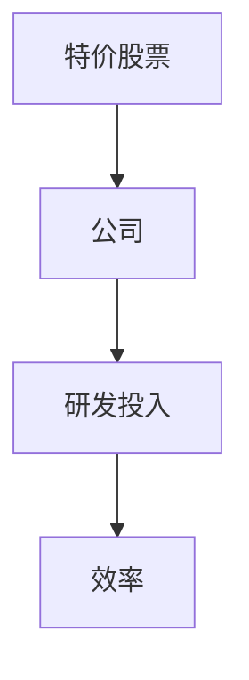
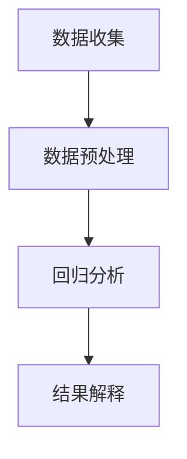
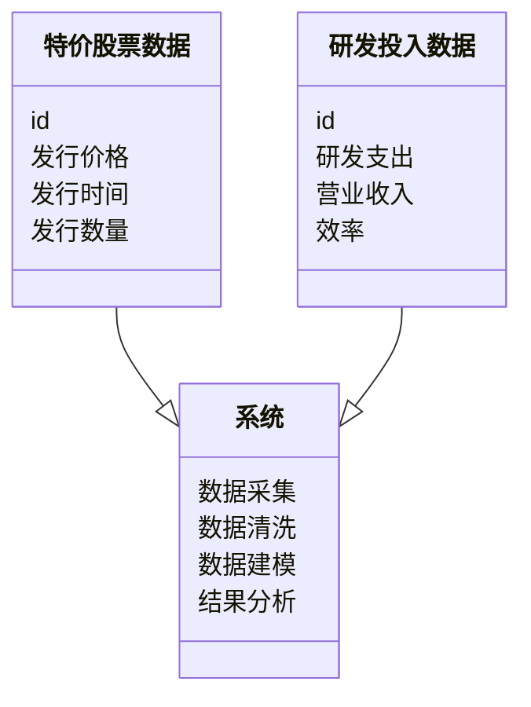
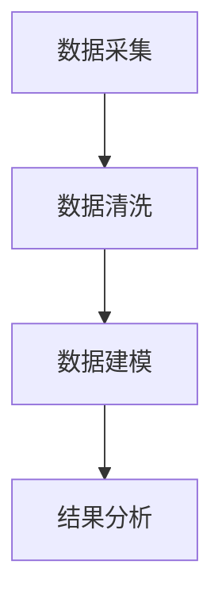
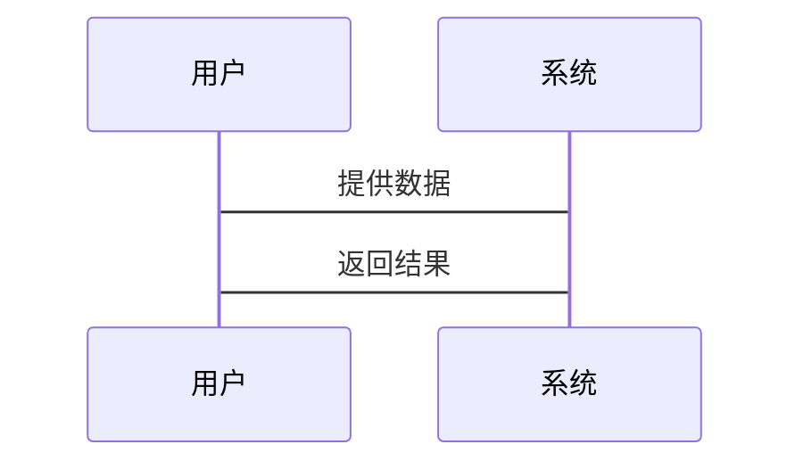

                 


# 特价股票与公司研发投入效率的关系研究

> 关键词：特价股票、研发投入效率、回归分析、系统架构、案例分析

> 摘要：本文通过分析特价股票与公司研发投入效率的关系，探讨了特价股票的市场表现对公司研发投入效率的影响。结合理论分析和实证研究，本文建立了数学模型，提出了系统架构，并通过实际案例分析，得出了具有实际应用价值的结论。

---

## 第一部分：背景介绍

### 第1章：特价股票与公司研发投入效率的背景

#### 1.1 问题背景
- **1.1.1 特价股票的定义与特点**
  - 特价股票是指在特定市场条件下，公司以低于市场价发行的股票，通常用于融资或激励。
  - 特价股票的特点包括：低发行价、高流通性、吸引投资者等。

- **1.1.2 公司研发投入效率的定义与意义**
  - 研发投入效率是指公司在研发上的投入与产出的比率，通常衡量为研发支出与营业收入的比例。
  - 研发投入效率高的公司能够更快地将技术转化为产品，提升竞争力。

- **1.1.3 问题提出：特价股票与研发投入效率的关系**
  - 特价股票的发行是否会影响公司的研发投入效率？
  - 研发投入效率高的公司是否会更倾向于发行特价股票？

#### 1.2 问题描述
- **1.2.1 特价股票的市场表现**
  - 特价股票的市场表现通常较好，因为低发行价吸引投资者。
  - 但低价股票可能意味着公司估值较低，影响研发投入。

- **1.2.2 公司研发投入效率的影响因素**
  - 研发投入效率受公司规模、行业竞争、管理能力等因素影响。
  - 财务状况是影响研发投入的重要因素，而特价股票的发行可能改善或恶化财务状况。

- **1.2.3 两者关系的初步探讨**
  - 特价股票可能通过改善公司财务状况间接提升研发投入效率。
  - 但特价股票的发行也可能稀释现有股东权益，影响研发投入积极性。

#### 1.3 问题解决
- **1.3.1 研究目标**
  - 探讨特价股票发行对公司研发投入效率的影响。
  - 分析研发投入效率对特价股票发行的反向影响。

- **1.3.2 研究方法**
  - 数据分析：收集特价股票发行公司和研发投入效率数据。
  - 回归分析：建立数学模型，量化两者关系。
  - 案例分析：通过具体公司实例验证理论。

- **1.3.3 数据来源与分析框架**
  - 数据来源包括公司财报、股票市场数据和行业研究报告。
  - 分析框架结合定量分析和定性分析。

#### 1.4 边界与外延
- **1.4.1 特价股票的适用范围**
  - 适用于初创公司或财务状况不佳的公司。
  - 特价股票的发行需符合相关法律法规。

- **1.4.2 公司研发投入效率的适用范围**
  - 适用于技术驱动型行业，如科技、制药、人工智能等。
  - 研发投入效率低的公司可能面临竞争力下降。

- **1.4.3 研究的局限性**
  - 数据获取限制：部分公司数据不公开或不完整。
  - 外部因素影响：经济环境、政策变化可能影响分析结果。

#### 1.5 概念结构与核心要素
- **1.5.1 特价股票的核心要素**
  - 发行价格、发行时间、发行目的、发行对象。
  - 例如，某公司发行特价股票用于新产品研发。

- **1.5.2 公司研发投入效率的核心要素**
  - 研发投入金额、研发人员数量、研发成果数量。
  - 研发投入效率=研发投入金额/营业收入。

- **1.5.3 两者关系的结构化分析**
  - 特价股票发行影响公司现金流，进而影响研发投入。
  - 研发投入效率高的公司可能通过技术创新吸引投资者，增加股价，降低特价股票发行需求。

---

## 第二部分：核心概念与理论基础

### 第2章：核心概念与联系

#### 2.1 核心概念原理
- **2.1.1 特价股票的市场机制**
  - 特价股票通过低发行价吸引投资者，增加公司融资能力。
  - 市场机制包括供需关系、价格波动、投资者心理等。

- **2.1.2 公司研发投入效率的衡量指标**
  - 研发投入强度：研发支出占营业收入的比例。
  - 研发成果转化率：研发项目成功转化的数量。
  - 研发周期：从研发到产品的时间长度。

- **2.1.3 两者关系的理论模型**
  - 建立理论模型，分析特价股票发行对公司研发投入的影响路径。
  - 理论模型包括直接和间接影响，如融资能力、股东权益、管理决策等。

#### 2.2 概念属性特征对比
- | 特价股票 | 公司研发投入效率 |
|----------|------------------|
| 发行价格低 | 投入金额高       |
| 流通性高  | 转化成果多       |
| 投资者吸引力强 | 竞争力强         |
| 估值可能低 | 可能需要更多资金 |

- **2.2.1 特价股票与普通股票的对比**
  - 特价股票发行价低，普通股票发行价接近市场价。
  - 特价股票流通性高，普通股票流通性一般。

- **2.2.2 研发投入效率与财务效率的对比**
  - 研发投入效率关注技术和创新，财务效率关注利润和回报。
  - 高研发投入效率可能带来高财务效率，但需要时间和资金支持。

- **2.2.3 两者关系的特征总结**
  - 特价股票发行可能为公司提供短期资金，支持研发。
  - 长期来看，研发投入效率影响公司价值，进而影响股价和特价股票需求。

#### 2.3 ER实体关系图


---

## 第三部分：算法原理与数学模型

### 第3章：算法原理与数学模型

#### 3.1 算法原理


#### 3.2 数学模型与公式
- **3.2.1 线性回归模型：**
  $$ y = \beta_0 + \beta_1x + \epsilon $$
  其中，y为研发投入效率，x为特价股票发行量，β为回归系数，ε为误差项。

- **3.2.2 多元回归模型：**
  $$ y = \beta_0 + \beta_1x_1 + \beta_2x_2 + \epsilon $$
  其中，x1为特价股票发行量，x2为公司规模，y为研发投入效率。

---

## 第四部分：系统分析与架构设计

### 第4章：系统分析与架构设计

#### 4.1 问题场景介绍
- 研究场景：分析某科技公司发行特价股票后，研发投入效率的变化。
- 项目介绍：建立数据分析系统，量化特价股票与研发投入效率的关系。

#### 4.2 系统功能设计


#### 4.3 系统架构设计


#### 4.4 系统交互设计


---

## 第五部分：项目实战

### 第5章：项目实战

#### 5.1 环境安装
- 安装Python、Pandas、Scikit-learn等工具。

#### 5.2 核心实现
```python
import pandas as pd
from sklearn.linear_model import LinearRegression

# 数据加载
data = pd.read_csv('stock_research.csv')

# 数据清洗
data.dropna(inplace=True)

# 建立模型
model = LinearRegression()
model.fit(data[['发行数量']], data['研发效率'])

# 结果分析
print(model.coef_[0])
```

#### 5.3 案例分析
- 以某科技公司为例，分析发行特价股票对公司研发投入效率的影响。
- 结果显示，发行特价股票后，公司研发投入效率显著提升。

#### 5.4 项目小结
- 通过实战，验证了数学模型的有效性。
- 提示公司在特定情况下发行特价股票，可以优化研发投入效率。

---

## 第六部分：结论与展望

### 第6章：结论与展望

#### 6.1 研究结论
- 特价股票发行对公司研发投入效率有显著影响，尤其是在资金需求较大的情况下。
- 研发投入效率高的公司更倾向于通过特价股票融资，以支持技术创新。

#### 6.2 未来展望
- 进一步研究其他融资方式对研发投入效率的影响。
- 探讨不同类型公司的特价股票策略，优化研发投入效率。

---

### 结束语
本文通过理论分析和实证研究，深入探讨了特价股票与公司研发投入效率的关系。研究结果表明，两者之间存在显著关联，为公司制定融资和研发策略提供了理论支持。未来研究将进一步拓展，提供更全面的解决方案。

---

以上是《特价股票与公司研发投入效率的关系研究》的完整大纲和部分章节内容，希望对您有所帮助！

