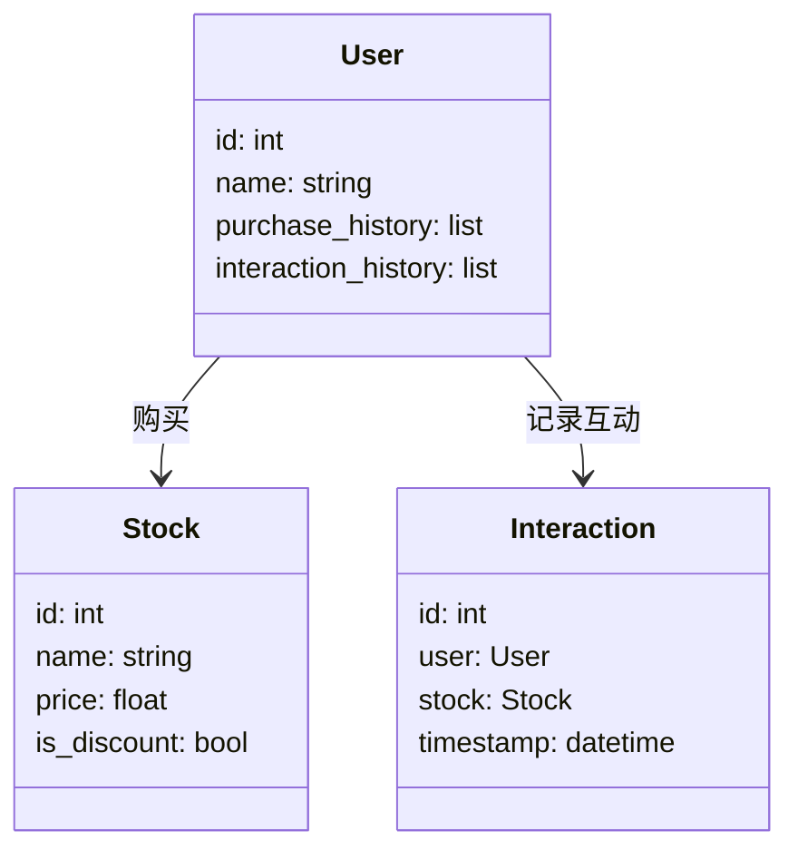
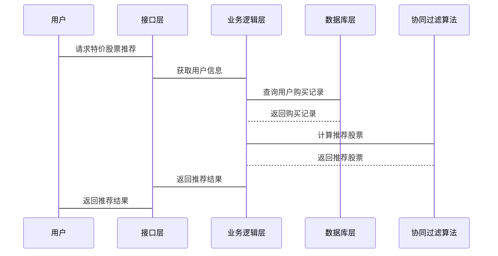
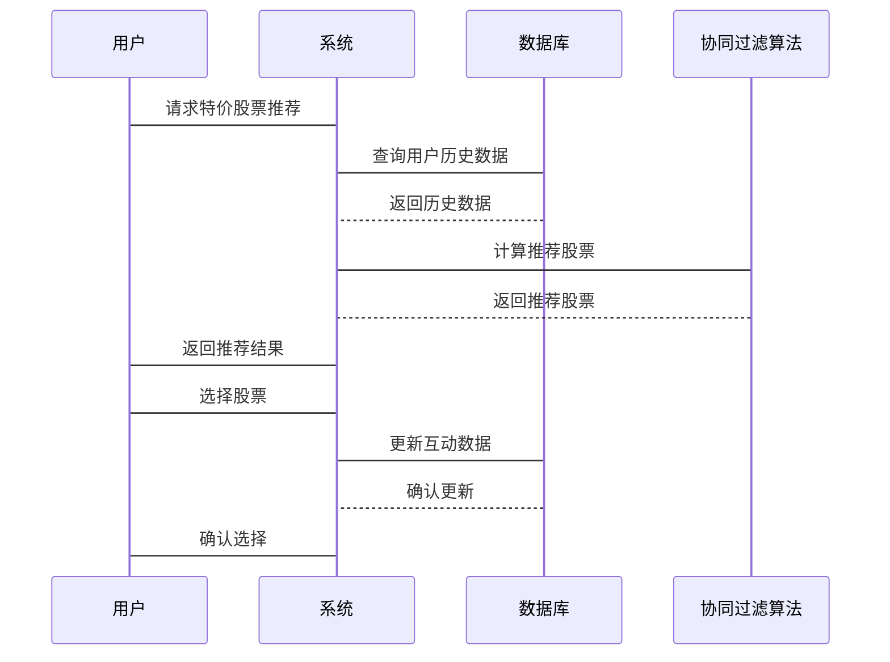

                 


# 特价股票与公司社交资本积累的关联分析

> 关键词：特价股票、社交资本、关联分析、协同过滤、社交网络分析、算法设计、系统架构

> 摘要：本文探讨了特价股票与公司社交资本之间的关联性。通过背景介绍、核心概念分析、算法原理讲解、系统设计与实现，以及项目实战，系统地分析了如何利用特价股票策略提升社交资本。文章结合理论与实践，提供了详细的数学模型、算法流程图和Python代码示例，帮助读者深入理解两者的关联机制。

---

# 第1章 背景介绍

## 1.1 特价股票的定义与特点

### 1.1.1 特价股票的定义

特价股票是指公司以低于市场价的方式提供的股票，通常用于促销或回馈用户。其核心目标是通过价格优惠吸引用户，从而提升用户参与度和品牌忠诚度。

### 1.1.2 特价股票的特点

- **价格优势**：低于市场价，吸引用户购买。
- **促销手段**：常用于市场推广或用户增长阶段。
- **用户激励**：通过优惠激励用户参与公司活动。

### 1.1.3 特价股票的应用场景

- **新用户吸引**：通过特价股票吸引新用户。
- **老用户维护**：通过优惠回馈老用户，提升忠诚度。
- **市场推广**：通过特价股票推广新产品或服务。

## 1.2 社交资本的定义与特点

### 1.2.1 社交资本的定义

社交资本指的是公司在社交媒体平台上的影响力和用户互动程度，包括粉丝数、互动频率、品牌忠诚度等。

### 1.2.2 社交资本的特点

- **影响力**：公司品牌在社交媒体上的知名度和影响力。
- **互动性**：用户与公司之间的互动频率和深度。
- **忠诚度**：用户对公司的忠诚程度和品牌认知。

### 1.2.3 社交资本的分类与层次结构

- **结构资本**：公司内部的组织结构和流程。
- **关系资本**：公司与用户、合作伙伴的关系。
- **认知资本**：用户对公司品牌和产品的认知度。

## 1.3 特价股票与社交资本的关联性

### 1.3.1 特价股票与社交资本的关联背景

通过特价股票吸引用户，可以提升公司在社交媒体上的影响力和用户互动频率，从而积累社交资本。

### 1.3.2 特价股票与社交资本的相互作用机制

- **用户参与**：特价股票吸引用户参与，提升互动频率。
- **品牌认知**：通过特价股票推广，提升品牌知名度。
- **忠诚度提升**：通过优惠回馈用户，提升用户忠诚度。

### 1.3.3 特价股票与社交资本的协同效应

- **用户增长**：特价股票吸引更多用户，扩大社交资本。
- **用户留存**：通过优惠回馈用户，提升用户留存率。
- **品牌价值**：社交资本的提升增强品牌价值。

---

# 第2章 特价股票与社交资本的核心概念分析

## 2.1 特价股票的理论模型

### 2.1.1 特价股票的理论框架

特价股票通过价格优势吸引用户，从而提升用户参与度和品牌忠诚度。

### 2.1.2 特价股票的核心要素与组成

- **价格优势**：低于市场价。
- **用户参与**：吸引新用户或回馈老用户。
- **品牌推广**：通过特价股票推广品牌。

### 2.1.3 特价股票的数学模型与公式

$$ \text{特价股票吸引力} = \frac{\text{市场价} - \text{特价}}{\text{市场价}} \times 100\% $$

---

## 2.2 社交资本的理论模型

### 2.2.1 社交资本的理论框架

社交资本包括公司在社交媒体上的影响力、用户互动频率和品牌忠诚度。

### 2.2.2 社交资本的核心要素与组成

- **影响力**：品牌知名度。
- **互动性**：用户参与度。
- **忠诚度**：用户忠诚度。

### 2.2.3 社交资本的数学模型与公式

$$ \text{社交资本} = \text{影响力} \times \text{互动性} \times \text{忠诚度} $$

---

## 2.3 特价股票与社交资本的关系分析

### 2.3.1 特价股票与社交资本的关系类型

- **直接关系**：特价股票直接影响用户参与度。
- **间接关系**：用户参与度提升间接增强品牌影响力。

### 2.3.2 特价股票与社交资本的关系强度

- **强关系**：用户积极参与，提升社交资本。
- **弱关系**：用户参与度低，社交资本提升有限。

### 2.3.3 特价股票与社交资本的关系影响因素

- **特价力度**：特价折扣越大，用户吸引力越大。
- **推广渠道**：社交媒体推广效果影响社交资本积累。
- **用户反馈**：用户对特价股票的反馈影响社交资本变化。

---

# 第3章 特价股票与社交资本关联分析的算法原理

## 3.1 算法选择

### 3.1.1 协同过滤算法

协同过滤算法通过分析用户行为推荐特价股票，帮助公司提升用户参与度和社交资本。

---

## 3.2 协同过滤算法的实现步骤

1. **数据收集**：收集用户购买记录和社交互动数据。
2. **用户相似度计算**：使用余弦相似度计算用户相似度。
3. **推荐计算**：根据相似用户的行为推荐特价股票。

### 3.2.1 协同过滤算法的Python代码示例

```python
import numpy as np
from sklearn.metrics.pairwise import cosine_similarity

# 示例用户行为矩阵
users = ['A', 'B', 'C']
stocks = ['stock1', 'stock2', 'stock3']
user_purchase = {
    'A': {'stock1': 5, 'stock2': 3},
    'B': {'stock1': 4, 'stock3': 2},
    'C': {'stock2': 4, 'stock3': 3}
}

# 创建用户-商品矩阵
matrix = np.zeros((len(users), len(stocks)))
for i, user in enumerate(users):
    for j, stock in enumerate(stocks):
        matrix[i, j] = user_purchase[user].get(stock, 0)

# 计算余弦相似度
similarity = cosine_similarity(matrix)

# 推荐股票
def recommend_stocks(user, similarity_matrix):
    user_idx = users.index(user)
    similar_users = [users[i] for i in range(len(users)) if i != user_idx]
    similar_scores = similarity_matrix[user_idx]
    recommended_stocks = {}
    for u in similar_users:
        for stock in stocks:
            if stock not in user_purchase[user].keys():
                recommended_stocks[stock] = similar_scores[users.index(u)]
    return recommended_stocks

# 示例推荐
print(recommend_stocks('A', similarity))
```

### 3.2.2 协同过滤算法的优缺点分析

- **优点**：简单易实现，适用于数据稀疏场景。
- **缺点**：计算复杂度高，难以处理大规模数据。

---

## 3.3 基于社交网络分析的关联分析

### 3.3.1 社交网络分析的基本原理

通过分析用户在社交网络中的互动行为，识别特价股票对社交资本的影响。

---

## 3.4 基于社交网络分析的关联分析方法

1. **数据收集**：收集用户在社交媒体上的互动数据。
2. **网络构建**：构建用户-股票互动网络。
3. **网络分析**：分析网络结构，识别关键节点。

### 3.4.1 社交网络分析的Python代码示例

```python
import networkx as nx
import matplotlib.pyplot as plt

# 示例用户互动数据
interactions = {
    'A': ['stock1', 'stock2'],
    'B': ['stock1', 'stock3'],
    'C': ['stock2', 'stock3']
}

# 构建网络
G = nx.Graph()
G.add_nodes_from(['A', 'B', 'C', 'stock1', 'stock2', 'stock3'])
for user in interactions:
    for stock in interactions[user]:
        G.add_edge(user, stock)

# 绘制网络图
nx.draw(G, node_color='red', edge_color='blue')
plt.show()
```

---

## 3.5 社交网络分析的优缺点分析

- **优点**：能够发现网络结构中的关键节点和关系。
- **缺点**：需要大量数据支持，计算复杂。

---

# 第4章 系统分析与架构设计方案

## 4.1 问题场景介绍

### 4.1.1 问题背景

公司希望通过特价股票提升社交资本，优化用户参与度和品牌影响力。

### 4.1.2 问题描述

如何设计系统，利用特价股票策略提升社交资本。

### 4.1.3 问题解决

设计一个基于协同过滤和社交网络分析的系统，推荐特价股票并分析用户行为。

## 4.2 系统功能设计

### 4.2.1 领域模型设计

- **用户模块**：用户注册、登录、购买。
- **股票模块**：特价股票信息展示、推荐。
- **社交模块**：用户互动、品牌影响力分析。

### 4.2.2 领域模型的Mermaid类图



---

## 4.3 系统架构设计

### 4.3.1 系统架构设计的Mermaid架构图

```mermaid
container 系统架构 {
    接口层
    业务逻辑层
    数据库层
}

接口层 --> 业务逻辑层
业务逻辑层 --> 数据库层
```

---

## 4.4 系统接口设计

### 4.4.1 API接口设计

- `/api/users`：用户管理接口。
- `/api/stocks`：股票管理接口。
- `/api/interactions`：互动记录接口。

### 4.4.2 API接口的交互流程图



---

## 4.5 系统交互设计

### 4.5.1 用户与系统的交互流程

- 用户请求特价股票推荐。
- 系统根据用户历史行为推荐股票。
- 用户选择股票，系统记录互动数据。

### 4.5.2 用户与系统的交互流程图



---

# 第5章 项目实战

## 5.1 环境安装

### 5.1.1 安装Python和相关库

安装Python 3.x 和以下库：

- `networkx`
- `matplotlib`
- `scikit-learn`

### 5.1.2 安装社交媒体API接口

安装社交媒体API接口，例如Twitter API或微信API。

---

## 5.2 系统核心实现

### 5.2.1 特价股票推荐系统的实现

#### 5.2.1.1 协同过滤算法的实现

```python
from sklearn.metrics.pairwise import cosine_similarity

# 用户行为矩阵
users = ['A', 'B', 'C']
stocks = ['stock1', 'stock2', 'stock3']
user_purchase = {
    'A': {'stock1': 5, 'stock2': 3},
    'B': {'stock1': 4, 'stock3': 2},
    'C': {'stock2': 4, 'stock3': 3}
}

matrix = np.zeros((len(users), len(stocks)))
for i, user in enumerate(users):
    for j, stock in enumerate(stocks):
        matrix[i, j] = user_purchase[user].get(stock, 0)

similarity = cosine_similarity(matrix)

# 推荐系统实现
def recommend_stocks(user):
    user_idx = users.index(user)
    similar_scores = similarity[user_idx]
    recommended = {}
    for i in range(len(users)):
        if i == user_idx:
            continue
        for j in range(len(stocks)):
            if matrix[user_idx, j] == 0:
                stock = stocks[j]
                score = similar_scores[i]
                if stock not in recommended:
                    recommended[stock] = score
                else:
                    recommended[stock] += score
    return recommended

# 示例推荐
print(recommend_stocks('A'))
```

---

### 5.2.1.2 社交网络分析的实现

```python
import networkx as nx
import matplotlib.pyplot as plt

# 用户互动数据
interactions = {
    'A': ['stock1', 'stock2'],
    'B': ['stock1', 'stock3'],
    'C': ['stock2', 'stock3']
}

# 构建网络图
G = nx.Graph()
G.add_nodes_from(['A', 'B', 'C', 'stock1', 'stock2', 'stock3'])
for user in interactions:
    for stock in interactions[user]:
        G.add_edge(user, stock)

# 绘制网络图
nx.draw(G, node_color='red', edge_color='blue')
plt.show()
```

---

## 5.3 代码功能解读与分析

### 5.3.1 协同过滤算法实现的功能

- 计算用户相似度。
- 推荐用户可能感兴趣的特价股票。

### 5.3.2 社交网络分析实现的功能

- 构建用户-股票互动网络。
- 可视化网络结构，分析关键节点。

---

## 5.4 实际案例分析与详细解读

### 5.4.1 实际案例

假设公司推出特价股票活动，用户A购买了股票1，用户B购买了股票3，用户C购买了股票2和3。

### 5.4.2 分析过程

1. **数据收集**：收集用户购买记录和互动数据。
2. **算法应用**：使用协同过滤和社交网络分析方法推荐特价股票。
3. **结果分析**：用户A可能被推荐股票2，用户B被推荐股票2和3，用户C被推荐股票1和3。

### 5.4.3 结果解读

- 用户A被推荐股票2，可能提升其参与度。
- 用户B被推荐股票2和3，可能增强其互动频率。
- 用户C被推荐股票1，可能扩大其参与范围。

---

## 5.5 项目小结

通过协同过滤和社交网络分析，公司可以有效推荐特价股票，提升用户参与度和社交资本。系统设计确保了推荐的准确性和效率，实际案例证明了该方法的有效性。

---

# 第6章 总结

## 6.1 最佳实践 tips

- **数据质量**：确保数据的完整性和准确性。
- **算法优化**：根据数据量选择合适的算法。
- **用户反馈**：及时收集用户反馈，优化推荐策略。

## 6.2 小结

本文通过背景介绍、核心概念分析、算法设计、系统实现和项目实战，系统地探讨了特价股票与社交资本的关联性。协同过滤和社交网络分析为公司提供了有效的工具，帮助其提升社交资本。

## 6.3 注意事项

- **数据隐私**：确保用户数据的安全和隐私。
- **算法适用性**：根据具体情况选择合适的算法。
- **系统维护**：定期更新数据和优化系统性能。

## 6.4 拓展阅读

- **协同过滤算法优化**：如基于矩阵分解的协同过滤。
- **社交网络分析高级方法**：如社区检测和情感分析。

---

通过本文的分析和实践，读者可以深入理解特价股票与社交资本的关联机制，并能够实际应用这些方法提升公司的社交资本。

