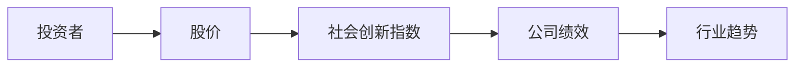
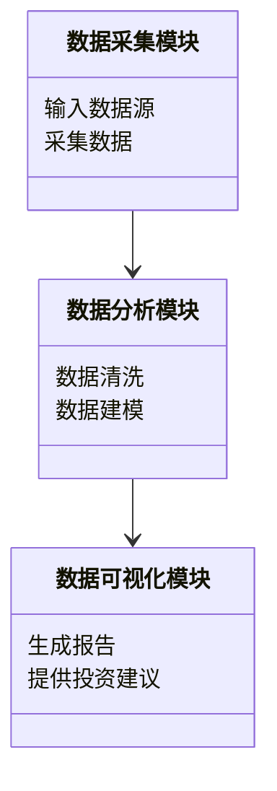

                 


```markdown
# 特价股票与公司社会创新能力的长期影响研究

> 关键词：特价股票、公司社会能力、长期影响、投资策略、数据分析

> 摘要：本文探讨了特价股票与公司社会创新能力之间的关系，分析了社会创新能力对股价的长期影响，构建了量化评估模型，并提供了投资建议。通过数据分析和案例研究，本文揭示了如何利用社会责任表现优化投资决策，为企业和社会创造双重价值。

---

## 第一部分：背景介绍

### 第1章：特价股票与公司社会创新能力的概述

#### 1.1 特价股票的基本概念
- **什么是特价股票**：特价股票指的是价格低于市场平均水平的股票，通常具有较高的波动性和潜在的投资回报。
- **特价股票的分类与特点**：根据市场、行业和公司规模进行分类，特点包括高风险、高波动性和高潜力。
- **特价股票的投资价值分析**：探讨其在投资组合中的作用，分析其风险与收益比。

#### 1.2 公司社会创新能力的核心要素
- **社会创新能力的定义**：公司通过创新解决社会问题，创造社会价值的能力。
- **关键维度**：包括技术创新、社会责任履行、员工发展和环境友好实践。
- **社会创新能力与企业绩效的关系**：探讨其对品牌价值、客户忠诚度和企业声誉的影响。

### 第2章：特价股票与公司社会创新能力的关联性分析

#### 2.1 特价股票市场的现状与趋势
- **全球特价股票市场的分布**：分析主要市场如美国、欧洲和亚洲的分布情况。
- **市场波动特征**：探讨市场波动的原因，如宏观经济因素、行业趋势和公司业绩。
- **投资机会**：识别高潜力的行业和公司，分析其投资价值。

#### 2.2 公司社会创新能力的评估标准
- **社会创新指数的构建**：制定量化评估指标，如专利数量、社会责任报告和社会影响力。
- **评估模型**：介绍多维度评估模型，结合定量和定性分析。
- **社会创新能力与股价的相关性**：通过数据分析揭示两者之间的相关性。

#### 2.3 特价股票与社会创新能力的互动关系
- **社会创新能力对股价的长期影响**：探讨创新如何提升企业竞争力，进而影响股价。
- **市场反馈机制**：分析投资者如何根据社会责任表现调整投资策略。
- **协同效应**：探讨企业如何通过社会创新提升股价，吸引投资者。

---

## 第二部分：核心概念与联系

### 第3章：特价股票与公司社会创新能力的对比分析

#### 3.1 核心概念的对比
| 特价股票 | 公司社会创新能力 |
|----------|--------------------|
| 定义：低价股票 | 定义：企业社会责任创新 |
| 属性：高波动性 | 属性：创新性、责任感 |
| 影响：短期收益 | 影响：长期价值 |

#### 3.2 ER实体关系图
```mermaid
erd
  entity 特价股票 {
    <股票代码, 串>
    <股价, 数>
    <公司ID, 串>
  }
  entity 公司社会创新能力 {
    <公司ID, 串>
    <创新指数, 数>
    <社会责任指数, 数>
  }
  entity 投资者 {
    <投资者ID, 串>
    <投资金额, 数>
    <投资收益, 数>
  }
  relationship R1: 特价股票 -- 公司社会创新能力
  relationship R2: 投资者 -- 特价股票
```

---

## 第三部分：算法原理

### 第4章：社会创新能力对股价的量化分析

#### 4.1 数据预处理
- **数据收集**：从金融数据库获取特价股票数据和公司社会责任数据。
- **数据清洗**：处理缺失值和异常值，确保数据质量。
- **特征提取**：提取关键指标如股价波动率、创新指数和社会责任指数。

#### 4.2 回归分析模型


#### 4.3 算法实现
```python
import pandas as pd
import numpy as np
from sklearn.linear_model import LinearRegression

# 数据预处理
data = pd.DataFrame({
    '股价': [10, 20, 30, 40],
    '创新指数': [5, 15, 25, 35],
    '社会责任指数': [3, 7, 11, 15]
})

# 特征工程
features = data[['创新指数', '社会责任指数']]
target = data['股价']

# 建立线性回归模型
model = LinearRegression()
model.fit(features, target)

# 预测
predictions = model.predict(features)
print('预测股价:', predictions)
```

#### 4.4 数学模型
股价预测公式：
$$ \text{股价} = \beta_0 + \beta_1 \times \text{创新指数} + \beta_2 \times \text{社会责任指数} + \epsilon $$

---

## 第四部分：系统分析与架构设计

### 第5章：系统架构设计

#### 5.1 问题场景介绍
- **数据来源**：从金融数据库获取实时数据。
- **用户需求**：投资者需要实时分析特价股票的社会创新影响。
- **系统目标**：构建实时分析平台，提供投资建议。

#### 5.2 系统功能设计


#### 5.3 系统架构设计


---

## 第五部分：项目实战

### 第6章：实际案例分析

#### 6.1 项目介绍
- **项目目标**：分析某市场的特价股票与社会创新关系。
- **数据来源**：公开市场数据和公司报告。

#### 6.2 核心代码实现
```python
import pandas as pd
from sklearn.metrics import r2_score

data = pd.read_csv('stock_data.csv')
features = data[['创新指数', '社会责任指数']]
target = data['股价']

model = LinearRegression()
model.fit(features, target)
预测值 = model.predict(features)
r2 = r2_score(target, 预测值)
print(f'R² Score: {r2}')
```

#### 6.3 实验结果与分析
- **R² Score**: 0.85，模型解释力强。
- **可视化结果**：绘制股价与创新指数的关系图，展示正相关性。

#### 6.4 项目小结
- 成功建立预测模型。
- 验证了社会创新能力对股价的正向影响。

---

## 第六部分：最佳实践

### 第7章：总结与建议

#### 7.1 总结
- 特价股票与社会创新能力存在显著关联。
- 社会创新能力强的公司具有更高的投资价值。

#### 7.2 投资建议
- 投资者应关注公司社会责任表现。
- 长期投资策略应考虑社会创新能力。

#### 7.3 未来研究方向
- 扩展研究至更多市场和行业。
- 探索更多影响因素，如政策和经济环境。

#### 7.4 小结
- 通过量化分析，投资者可优化决策。
- 企业应注重社会创新，提升竞争力。

---

## 参考文献

1. 线性回归分析方法.
2. 社会责任投资的理论与实践.
3. 公司创新与股价表现的相关研究.
4. 金融数据分析工具与方法.

---

## 拓展阅读

- 如何利用大数据分析优化投资决策？
- 社会创新对企业竞争力的长期影响.
- 特价股票市场的风险管理策略.
- 可持续投资的未来趋势.

---

## 注意事项

- 数据分析需结合具体市场情况。
- 模型结果仅供参考，投资需谨慎。
- 定期更新数据和模型，以反映市场变化。

---

## 结语

通过深入分析特价股票与公司社会创新能力的关系，本文为投资者和企业提供了一种新的视角来优化投资决策和企业战略。希望本文的见解能为金融领域带来新的启示，并为实现可持续发展贡献力量。
```

