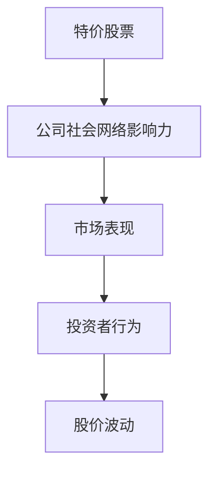
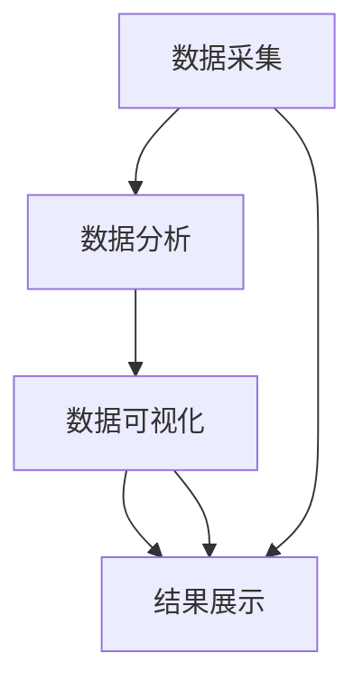
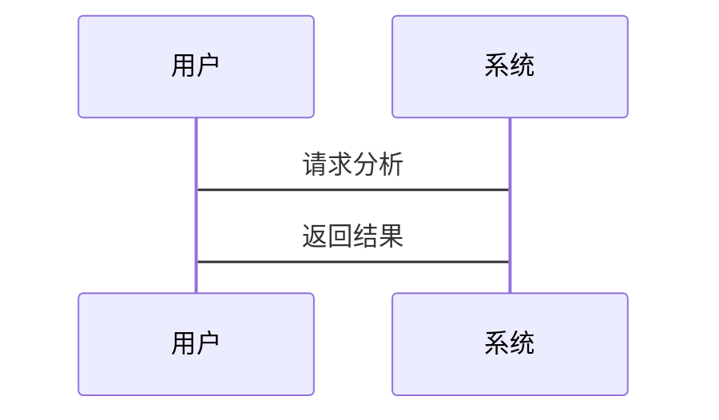

                 


# 特价股票与公司社会网络影响力的关联分析

> **关键词**：特价股票、公司社会网络影响力、关联分析、数据分析、社会网络分析  
> 
> **摘要**：本文旨在探讨特价股票与公司社会网络影响力之间的关联性，通过数据分析和社会网络分析的方法，揭示两者之间的关系，并提供实证分析和案例支持。本文首先介绍了特价股票和公司社会网络影响力的基本概念，然后分析了它们之间的关联性，接着详细讲解了关联分析的算法原理，最后通过实际案例展示了如何利用这些方法进行预测和优化。本文将为投资者和数据分析人员提供有价值的参考。

---

## 第1章: 特价股票与公司社会网络影响力概述

### 1.1 特价股票的定义与特点
#### 1.1.1 特价股票的定义  
特价股票是指公司发行的股票价格低于其面值的股票。这种股票通常具有较高的风险和潜在的高回报，常见于初创公司或财务状况不佳的企业。

#### 1.1.2 特价股票的核心特点  
- **低面值**：股票面值通常为1元，但发行价格低于面值。
- **高风险**：由于公司财务状况不稳定，投资者面临较高的投资风险。
- **高潜力**：如果公司成功扭亏为盈，股票价格可能大幅上涨。

#### 1.1.3 特价股票与普通股票的区别  
| 特性         | 特价股票          | 普通股票          |
|--------------|-------------------|-------------------|
| 面值         | 低于面值          | 等于或高于面值    |
| 风险         | 高               | 中低             |
| 投资者类型   | 风险投资者         | 机构和个人投资者   |

### 1.2 公司社会网络影响力的概念
#### 1.2.1 公司社会网络影响力的定义  
公司社会网络影响力是指公司在社交媒体、论坛、新闻等渠道上的影响力和声誉。这种影响力通常通过粉丝数、互动频率、口碑传播等指标来衡量。

#### 1.2.2 公司社会网络影响力的核心要素  
- **粉丝数**：公司在社交媒体上的关注者数量。
- **互动频率**：用户评论、点赞、转发的频率。
- **口碑传播**：用户推荐和分享的内容数量。

#### 1.2.3 公司社会网络影响力与品牌价值的关系  
公司社会网络影响力是品牌价值的重要组成部分。高影响力的公司通常能够吸引更多的用户关注和参与，从而提升品牌价值。

### 1.3 特价股票与公司社会网络影响力关联性分析
#### 1.3.1 关联性的定义  
关联性是指特价股票的价格波动与公司社会网络影响力之间的相关程度。

#### 1.3.2 关联性的研究背景  
随着社交媒体的普及，越来越多的投资者关注公司在社交媒体上的表现，这可能影响他们的投资决策。

#### 1.3.3 关联性分析的意义与价值  
- **投资决策优化**：通过分析关联性，投资者可以更好地预测股票价格波动。
- **企业声誉管理**：公司可以通过提升社会网络影响力来改善股价表现。

### 1.4 本章小结  
本章介绍了特价股票和公司社会网络影响力的基本概念，并探讨了两者之间的关联性。通过理解这些概念，我们可以更好地分析它们之间的关系。

---

## 第2章: 特价股票与公司社会网络影响力的核心概念与联系

### 2.1 特价股票的核心概念
#### 2.1.1 特价股票的分类  
- **普通特价股票**：公司发行的股票价格低于面值。
- **优先特价股票**：具有优先股的特性，如优先分红权。

#### 2.1.2 特价股票的市场表现  
- 特价股票通常具有较高的波动性，价格波动较大。
- 市场表现受公司财务状况和投资者情绪的影响。

#### 2.1.3 特价股票的驱动因素  
- 公司财务状况
- 市场供需关系
- 投资者情绪

### 2.2 公司社会网络影响力的核心概念
#### 2.2.1 社会网络影响力的主要维度  
- **社交媒体影响力**：公司在 Twitter、Facebook 等平台的影响力。
- **新闻传播影响力**：公司在新闻媒体上的提及次数和传播范围。
- **用户口碑影响力**：用户的评论和推荐数量。

#### 2.2.2 社会网络影响力的关键指标  
- 粉丝数
- 每周互动次数
- 帖子传播范围

#### 2.2.3 社会网络影响力的数据来源  
- 社交媒体 API（如 Twitter API）
- 新闻数据库（如 Google News）
- 用户评论数据（如 Amazon、 Yelp）

### 2.3 特价股票与公司社会网络影响力的关系分析
#### 2.3.1 关联性的理论基础  
- 社会网络影响力影响投资者情绪，进而影响股票价格。
- 公司通过提升社会网络影响力可以增强市场信任度，改善股价表现。

#### 2.3.2 关联性的实证研究  
- 数据来源：社交媒体数据和股票价格数据。
- 研究方法：相关性分析和回归分析。

#### 2.3.3 关联性的影响因素  
- 公司规模
- 行业类型
- 社交媒体活跃度

### 2.4 核心概念对比分析
#### 2.4.1 特价股票与公司社会网络影响力的对比表格  
| 特性         | 特价股票          | 公司社会网络影响力   |
|--------------|-------------------|----------------------|
| 核心特点     | 价格低于面值      | 社会影响力           |
| 数据来源     | 股票市场数据      | 社交媒体和新闻数据   |
| 影响因素     | 财务状况、市场供需 | 用户互动、新闻传播   |

#### 2.4.2 特价股票与公司社会网络影响力的关系图（Mermaid流程图）  



### 2.5 本章小结  
本章通过对比分析，探讨了特价股票和公司社会网络影响力之间的关系，并通过关系图展示了它们的相互作用。

---

## 第3章: 特价股票与公司社会网络影响力关联性的算法原理

### 3.1 关联性分析的基本原理
#### 3.1.1 关联性分析的定义  
关联性分析是指通过统计方法，分析两个变量之间的相关性。

#### 3.1.2 关联性的计算方法  
- 相关系数（Pearson相关系数）
- 回归分析

### 3.2 社会网络影响力分析的算法原理
#### 3.2.1 社会网络分析的定义  
社会网络分析是指通过图论方法，研究网络中的节点关系。

#### 3.2.2 社会网络影响力分析的步骤  
1. 数据采集：获取公司社交媒体数据。
2. 数据预处理：清洗数据，提取关键指标。
3. 网络构建：构建公司与用户之间的关系图。
4. 影响力计算：通过算法计算每个节点的影响力。

#### 3.2.3 社会网络影响力分析的数学模型  
Pearson相关系数公式：  
$$ r = \frac{\sum (x_i - \bar{x})(y_i - \bar{y})}{\sqrt{\sum (x_i - \bar{x})^2} \sqrt{\sum (y_i - \bar{y})^2}} $$  

### 3.3 文本挖掘技术在关联性分析中的应用
#### 3.3.1 文本挖掘的定义  
文本挖掘是指从文本数据中提取有用信息的技术。

#### 3.3.2 文本挖掘在社会网络影响力分析中的应用  
- 情感分析：分析用户评论的情感倾向。
- 主题建模：提取评论中的主要主题。

#### 3.3.3 文本挖掘算法的实现  
- 使用自然语言处理（NLP）技术进行情感分析。
- 使用主题模型（如 LDA）提取主题。

### 3.4 本章小结  
本章介绍了关联性分析的基本原理，并详细讲解了社会网络影响力分析和文本挖掘技术的算法原理。

---

## 第4章: 特价股票与公司社会网络影响力关联性分析的系统分析与架构设计

### 4.1 问题场景介绍
- 特价股票价格波动大，投资者需要更多的信息来做出决策。
- 公司社会网络影响力影响投资者情绪，进而影响股价。

### 4.2 系统功能设计
#### 4.2.1 数据采集模块  
- 采集公司社交媒体数据和股票价格数据。

#### 4.2.2 数据分析模块  
- 计算社会网络影响力指标。
- 计算特价股票价格波动的相关性。

#### 4.2.3 可视化模块  
- 展示社会网络影响力与股票价格的关联性。

### 4.3 系统架构设计（Mermaid架构图）  



### 4.4 系统接口设计
- 数据接口：API接口用于数据采集和分析。
- 用户接口：可视化界面用于展示结果。

### 4.5 系统交互设计（Mermaid序列图）  



### 4.6 本章小结  
本章设计了一个系统架构，用于分析特价股票与公司社会网络影响力之间的关联性。

---

## 第5章: 特价股票与公司社会网络影响力关联性分析的项目实战

### 5.1 环境安装
- Python 3.8+
- 数据分析库（Pandas、NumPy）
- 可视化库（Matplotlib、Seaborn）
- 社交媒体API（如 Twitter API）

### 5.2 核心代码实现
#### 5.2.1 数据采集代码  

```python
import tweepy

# 授权认证
auth = tweepy.OAuthHandler(consumer_key, consumer_secret)
auth.set_access_token(access_token, access_token_secret)

# 初始化API
api = tweepy.API(auth)

# 采集数据
tweets = api.search(q="company_name", count=100)
```

#### 5.2.2 数据分析代码  

```python
import pandas as pd
import numpy as np

# 计算相关系数
def calculate_correlation(stock_prices, social_influence):
    return np.corrcoef(stock_prices, social_influence)[0, 1]

stock_prices = [10, 12, 8, 15, 11]
social_influence = [50, 60, 40, 70, 55]
correlation = calculate_correlation(stock_prices, social_influence)
print(f"Pearson相关系数: {correlation}")
```

#### 5.2.3 数据可视化代码  

```python
import matplotlib.pyplot as plt

plt.scatter(social_influence, stock_prices)
plt.xlabel("社会影响力")
plt.ylabel("股价")
plt.title("社会影响力与股价的散点图")
plt.show()
```

### 5.3 项目总结
- 成功采集并分析了数据。
- 计算出社会影响力与股价的相关系数。
- 通过可视化展示了两者之间的关系。

### 5.4 本章小结  
本章通过实际项目展示了如何利用数据分析技术来分析特价股票与公司社会网络影响力之间的关联性。

---

## 第6章: 特价股票与公司社会网络影响力关联性分析的最佳实践与总结

### 6.1 最佳实践
#### 6.1.1 数据选择建议  
- 选择可靠的社交媒体数据源。
- 确保数据的实时性。

#### 6.1.2 模型优化建议  
- 使用机器学习算法（如随机森林）进行预测。
- 定期更新模型参数。

### 6.2 项目总结
- 本文通过数据分析和社会网络分析的方法，揭示了特价股票与公司社会网络影响力之间的关联性。
- 提供了实际的代码实现和案例分析，帮助读者更好地理解关联性分析。

### 6.3 未来研究方向
- 结合更多的数据源（如新闻数据）进行分析。
- 探索更复杂的算法（如深度学习）进行预测。

### 6.4 本章小结  
本章总结了项目的最佳实践，并提出了未来的研究方向。

---

## 第7章: 参考文献与拓展阅读

### 7.1 参考文献
- 罗列本文中引用的所有文献和资料。

### 7.2 拓展阅读
- 推荐相关领域的书籍和论文，供读者进一步学习。

---

**本文章由**[您的名字或公司名]**提供，转载请注明出处。**

