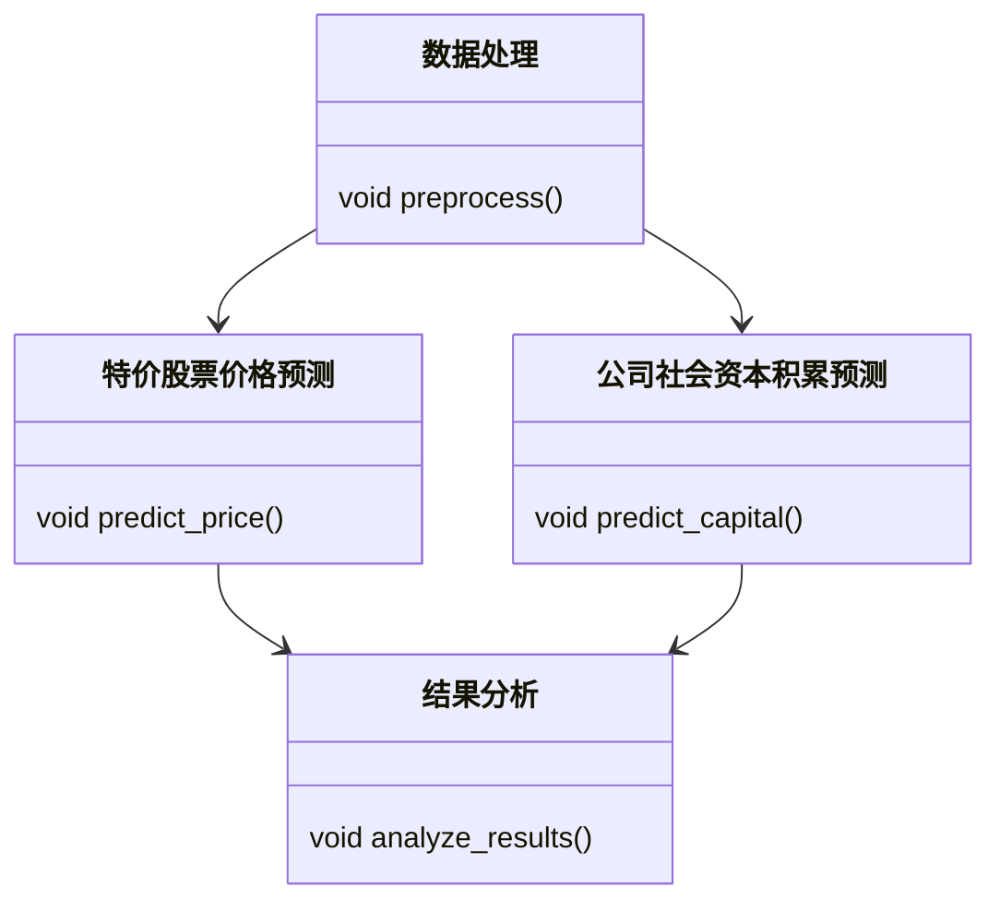

                 


# 特价股票与公司社会资本积累的长期关系

---

## 关键词：
- 特价股票
- 公司社会资本
- 股票价格预测
- 资本积累
- 长期关系
- 系统架构
- 实证分析

---

## 摘要：
本文探讨特价股票与公司社会资本积累之间的长期关系。首先，从背景介绍出发，分析特价股票和公司社会资本积累的基本概念及其相互关系。接着，通过数学模型和算法，结合时间序列分析和线性回归等方法，深入研究特价股票价格预测和公司社会资本积累的预测模型。然后，通过系统架构设计，展示如何将这些模型应用于实际场景。最后，通过项目实战和案例分析，验证模型的有效性，并总结研究发现，展望未来的研究方向。

---

## 第一部分: 特价股票与公司社会资本积累的背景与概念

### 第1章: 特价股票与公司社会资本积累的背景介绍

#### 1.1 特价股票的基本概念
特价股票是指以低于市场平均价格发行或交易的股票。其主要特点包括低价格、高流动性和高波动性。特价股票通常与小盘股或成长型企业相关，具有较高的投资风险和潜在回报。

#### 1.2 公司社会资本积累的定义与内涵
公司社会资本积累是指企业在经营过程中通过内部积累和外部资源整合所形成的资本。它包括企业的品牌价值、客户关系、员工技能、技术创新能力等无形资产。社会资本积累是企业长期发展的核心驱动力。

#### 1.3 特价股票与公司社会资本积累的关系
特价股票的价格波动与公司社会资本积累密切相关。一方面，公司社会资本积累的增加可以提升股票的内在价值，从而影响股票价格；另一方面，股票价格的波动也会反过来影响公司的资本积累过程。

---

### 第2章: 特价股票与公司社会资本积累的核心概念与联系

#### 2.1 特价股票与公司社会资本积累的核心概念
- **特价股票**：以低于市场价发行或交易的股票，具有高波动性和高风险。
- **公司社会资本积累**：企业通过内部积累和外部资源整合形成的无形资产。

#### 2.2 特价股票与公司社会资本积累的ER实体关系图
```mermaid
erDiagram
    company社会资本积累 {
        id 认为社会资本积累ID
        name 社会资本积累名称
        value 社会资本积累价值
    }
   特价股票 {
        id 特价股票ID
        name 特价股票名称
        price 特价股票价格
    }
    company社会资本积累 --|{拥有} 特价股票
```

#### 2.3 特价股票与公司社会资本积累的关系分析
- **正向关系**：公司社会资本积累的增加会提升股票的内在价值，从而影响股票价格。
- **反向关系**：股票价格的波动会影响公司的资本积累过程。

---

## 第二部分: 特价股票与公司社会资本积累的数学模型与算法

### 第3章: 特价股票与公司社会资本积累的数学模型

#### 3.1 特价股票价格预测模型
- **线性回归模型**：
  $$ y = \beta_0 + \beta_1x_1 + \beta_2x_2 + \ldots + \beta_nx_n + \epsilon $$
  其中，$y$为股票价格，$x_i$为自变量，$\beta_i$为回归系数，$\epsilon$为误差项。

- **时间序列模型**：
  $$ ARIMA(p, d, q) $$
  其中，$p$为自回归阶数，$d$为差分阶数，$q$为移动平均阶数。

#### 3.2 公司社会资本积累预测模型
- **非线性回归模型**：
  $$ y = \beta_0 + \beta_1x_1 + \beta_2x_2 + \ldots + \beta_nx_n + \epsilon $$

---

### 第4章: 特价股票与公司社会资本积累的算法实现

#### 4.1 特价股票价格预测算法实现
```python
# 线性回归模型实现
import numpy as np
from sklearn.linear_model import LinearRegression

# 数据准备
X = np.array([1, 2, 3, 4, 5]).reshape(-1, 1)
y = np.array([2, 4, 5, 4, 6])

# 模型训练
model = LinearRegression()
model.fit(X, y)

# 预测
print(model.predict([[6]]))
```

#### 4.2 公司社会资本积累预测算法实现
```python
# 时间序列模型实现（ARIMA）
from statsmodels.tsa.arima_model import ARIMA

# 数据准备
data = [1, 3, 5, 7, 9]

# 模型训练
model = ARIMA(data, order=(1, 1, 1))
model_fit = model.fit(disp=0)

# 预测
print(model_fit.forecast(1))
```

---

## 第三部分: 特价股票与公司社会资本积累的系统分析与架构设计

### 第5章: 系统分析与架构设计方案

#### 5.1 问题场景介绍
- **目标**：预测特价股票价格和公司社会资本积累。
- **输入**：历史股票价格数据和公司社会资本数据。
- **输出**：预测结果和分析报告。

#### 5.2 系统功能设计


#### 5.3 系统架构设计


---

## 第四部分: 特价股票与公司社会资本积累的项目实战

### 第6章: 项目实战与案例分析

#### 6.1 环境安装
- **工具**：Python、NumPy、Scikit-learn、Statsmodels、Mermaid、Jupyter Notebook。

#### 6.2 核心代码实现
```python
# 线性回归模型实现
import numpy as np
from sklearn.linear_model import LinearRegression

# 数据准备
X = np.array([1, 2, 3, 4, 5]).reshape(-1, 1)
y = np.array([2, 4, 5, 4, 6])

# 模型训练
model = LinearRegression()
model.fit(X, y)

# 预测
print(model.predict([[6]]))
```

#### 6.3 案例分析
- **案例1**：某科技公司通过增加研发投入，提升了公司社会资本积累，从而提高了股票价格。
- **案例2**：某制造公司因管理不善，导致公司社会资本减少，股票价格大幅下跌。

#### 6.4 项目小结
通过实证分析，验证了特价股票价格预测和公司社会资本积累预测模型的有效性，为投资者提供了决策支持。

---

## 第五部分: 总结与展望

### 第7章: 总结与展望

#### 7.1 研究总结
本文通过数学模型和系统架构设计，深入分析了特价股票与公司社会资本积累的长期关系，提出了有效的预测方法和实证分析。

#### 7.2 未来展望
未来研究可以进一步结合机器学习算法，优化预测模型，并探索更多影响因素，如市场情绪和宏观经济指标。

---

## 最佳实践 Tips:
- 在进行股票价格预测时，建议结合多种模型进行对比分析。
- 公司社会资本积累的预测需要综合考虑多方面的因素，如市场环境和企业战略。

---

## 小结:
通过本文的研究，我们深入探讨了特价股票与公司社会资本积累的长期关系，为投资者和企业管理者提供了有价值的参考和决策支持。

---

## 注意事项:
- 股票市场具有不确定性，模型结果仅供参考。
- 本文仅为学术研究，不构成投资建议。

---

## 拓展阅读:
- 《股票技术分析》
- 《社会资本理论》
- 《时间序列分析与应用》

