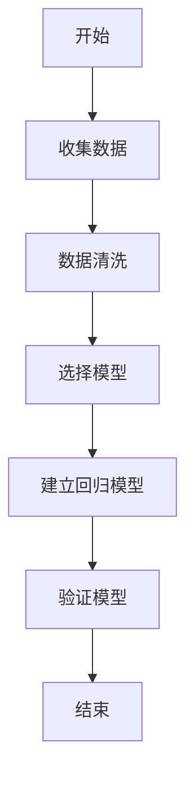
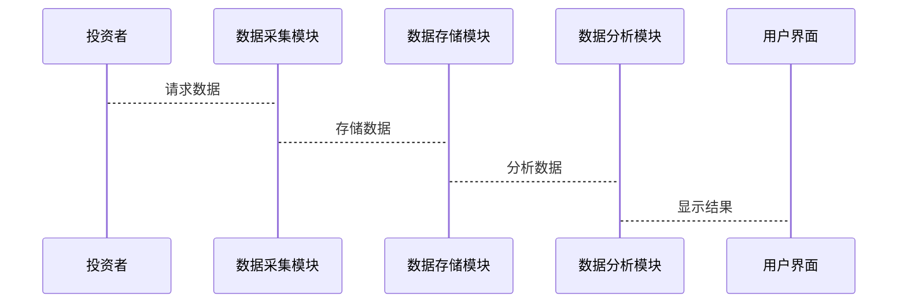

                 


# 特价股票与公司社会资本积累的长期影响

> 关键词：特价股票、公司社会资本、长期影响、股票市场、社会资本积累

> 摘要：特价股票是指公司以低于市场价发行的股票，旨在吸引投资者。本文探讨特价股票如何影响公司社会资本积累，分析两者关系，结合算法模型和案例，揭示长期影响。

---

# 第一部分: 特价股票与公司社会资本积累的背景介绍

## 第1章: 特价股票与公司社会资本积累的概述

### 1.1 特价股票的定义与特征
- **1.1.1 特价股票的基本概念**
  特价股票是公司以低于市场价发行的股票，用于吸引投资者或筹集资金。其价格通常低于市场价，但可能附带限制条件，如禁售期或行权价。

- **1.1.2 特价股票的市场特征**
  特价股票在市场上的流动性较低，波动性较高，投资者通常需要承担较高的风险。此外，特价股票可能附带特殊条款，如认股权或 warrants。

- **1.1.3 特价股票与普通股票的区别**
  普通股票无发行价格优惠，流通性高，风险较低。特价股票则价格优惠，流通性低，风险较高。

### 1.2 公司社会资本积累的内涵
- **1.2.1 公司社会资本的基本概念**
  社会资本是指公司通过长期积累的社会关系、声誉和信任，包括品牌价值、客户忠诚度和合作伙伴关系。

- **1.2.2 公司社会资本的构成要素**
  包括企业声誉、品牌价值、客户关系、员工凝聚力和社会责任履行情况。

- **1.2.3 公司社会资本积累的重要性**
  社会资本是公司长期发展的基石，直接影响市场拓展、融资能力和风险管理。

### 1.3 特价股票与公司社会资本积累的关系
- **1.3.1 特价股票对社会资本积累的影响**
  特价股票可能稀释现有股东权益，影响公司声誉，但能快速筹集资金，提升市场参与度。

- **1.3.2 社会资本积累对特价股票的作用**
  良好的社会资本积累能增强投资者信心，提高特价股票的市场接受度。

- **1.3.3 两者关系的理论框架**
  特价股票影响社会资本积累，而社会资本积累又反哺特价股票价值，形成动态平衡。

---

## 第2章: 特价股票与公司社会资本积累的核心概念

### 2.1 特价股票的市场行为分析
- **2.1.1 投资者行为对股价的影响**
  投资者对特价股票的购买行为可能短期内推高股价，但长期可能因流动性不足而下跌。

- **2.1.2 特价股票的市场流动性**
  特价股票流动性低，交易量小，影响市场深度和价格稳定性。

- **2.1.3 特价股票的波动性特征**
  特价股票价格波动大，受市场情绪和信息影响显著。

### 2.2 公司社会资本积累的机制
- **2.2.1 公司治理与社会资本积累**
  良好的公司治理结构能提升社会资本，增强投资者信任。

- **2.2.2 企业声誉与社会资本积累**
  企业声誉是社会资本的重要组成部分，直接影响市场行为和融资能力。

- **2.2.3 企业社会责任与社会资本积累**
  履行社会责任能提升企业形象，增强社会资本积累。

### 2.3 特价股票与社会资本积累的相互作用
- **2.3.1 特价股票如何促进社会资本积累**
  特价股票吸引投资者，提升市场参与度，增强企业声誉。

- **2.3.2 社会资本积累如何影响特价股票价值**
  社会资本积累强的企业，其特价股票更受市场认可，价值可能更高。

- **2.3.3 两者关系的动态演变**
  特价股票与社会资本积累的关系随市场变化而变化，需动态分析。

---

## 第3章: 特价股票与公司社会资本积累的核心概念联系

### 3.1 特价股票与社会资本积累的属性特征对比
| **属性**       | **特价股票**                         | **社会资本积累**                     |
|-----------------|---------------------------------------|----------------------------------------|
| 影响因素       | 市场供需、公司财务状况               | 公司声誉、治理结构、社会责任         |
| 时间跨度       | 短期价格波动                        | 长期积累效应                         |
| 参与主体       | 投资者、市场机构                    | 公司、客户、员工、合作伙伴           |
| 影响结果       | 股票价格变化                        | 市场信任度、品牌价值、融资能力提升   |

### 3.2 特价股票与社会资本积累的ER实体关系图
```mermaid
er
    actor 投资者
    actor 市场监管机构
    actor 企业
    entity 特价股票
    entity 社会资本
    entity 市场行为
    entity 市场数据
    投资者 --> 市场行为: 参与市场交易
    企业 --> 市场行为: 发布财务信息
    市场行为 --> 市场数据: 影响价格波动
    市场数据 --> 特价股票: 影响股票价值
    特价股票 --> 社会资本: 影响社会资本积累
    市场监管机构 --> 市场数据: 监测市场行为
```

---

## 第4章: 特价股票与公司社会资本积累的算法原理

### 4.1 特价股票与社会资本积累的关系建模
- **4.1.1 数据收集与处理**
  收集特价股票的价格数据、交易量、公司财务数据、市场行为数据和社会资本相关指标。

- **4.1.2 数据分析方法**
  使用回归分析模型，将社会资本指标作为自变量，股票价格作为因变量，分析其影响关系。

- **4.1.3 模型构建与验证**
  构建多元回归模型，验证社会资本积累对特价股票价值的影响。

### 4.2 算法流程图


### 4.3 回归分析模型
回归模型：
$$ Y = \beta_0 + \beta_1 X + \epsilon $$
其中：
- \( Y \) 是股票价格
- \( X \) 是社会资本指标
- \( \beta_0 \) 是截距
- \( \beta_1 \) 是回归系数
- \( \epsilon \) 是误差项

---

## 第5章: 特价股票与公司社会资本积累的系统分析

### 5.1 系统功能设计
- 数据采集模块：收集股票数据、市场行为和社会资本相关数据。
- 数据分析模块：进行回归分析，评估社会资本对股票价格的影响。
- 结果展示模块：生成可视化报告，展示分析结果。

### 5.2 系统架构设计


### 5.3 接口设计
- 数据接口：与数据源（如股票交易所、社交媒体）连接，获取实时数据。
- 分析接口：提供API，供其他系统调用分析结果。

### 5.4 交互流程图


---

## 第6章: 项目实战

### 6.1 环境安装
安装必要的工具：Python、Pandas、Matplotlib、Scikit-learn。

### 6.2 核心代码
```python
import pandas as pd
import numpy as np
from sklearn.linear_model import LinearRegression
import matplotlib.pyplot as plt

# 数据加载
data = pd.read_csv('stock_data.csv')

# 模型训练
model = LinearRegression()
model.fit(data[['social_capital']], data['stock_price'])

# 预测与可视化
predictions = model.predict(data[['social_capital']])
plt.scatter(data['social_capital'], data['stock_price'])
plt.plot(data['social_capital'], predictions, color='red')
plt.xlabel('Social Capital')
plt.ylabel('Stock Price')
plt.show()
```

### 6.3 实际案例分析
分析某公司发行特价股票后的市场反应和社会资本变化，验证模型的有效性。

### 6.4 项目小结
总结项目成果，强调模型的应用价值和未来改进方向。

---

## 第7章: 最佳实践与总结

### 7.1 最佳实践
- 数据质量：确保数据准确性和完整性。
- 模型选择：根据实际情况选择合适的分析方法。
- 实验验证：通过实际案例验证模型的有效性。

### 7.2 小结
总结全文，强调特价股票与社会资本积累的长期影响，指出未来研究方向。

### 7.3 注意事项
- 数据隐私保护
- 模型的适用性和局限性
- 市场环境变化对模型结果的影响

### 7.4 拓展阅读
推荐相关书籍和论文，供读者深入研究。

---

通过以上步骤，我们详细分析了特价股票与公司社会资本积累的长期影响，结合理论分析、算法建模和实际案例，揭示了两者之间的复杂关系。希望本文能为相关研究和实践提供有价值的参考。

