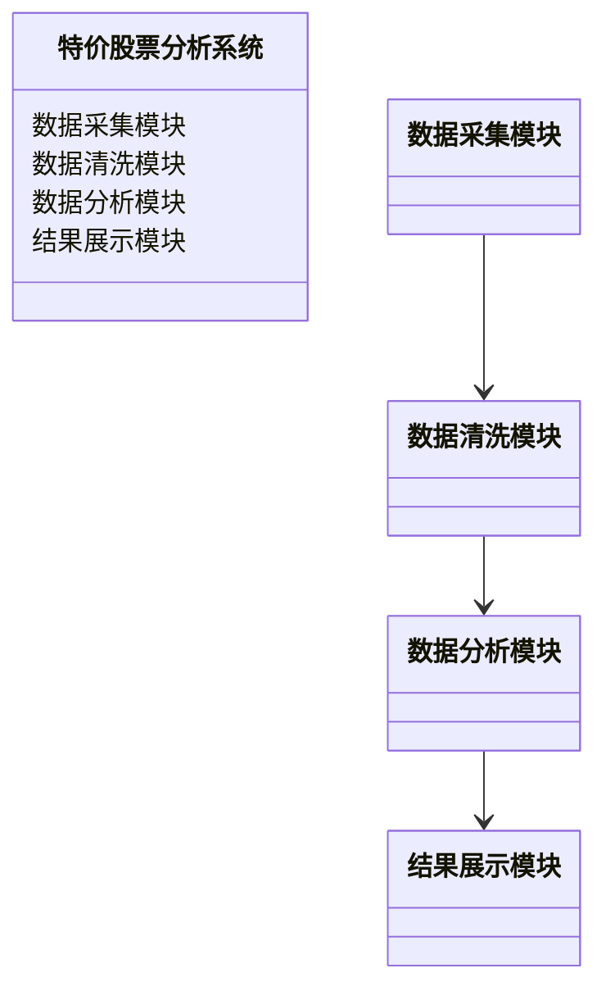

                 


# 特价股票与公司竞争优势的关系

> 关键词：特价股票，公司竞争优势，股票估值，数学模型，系统架构

> 摘要：本文探讨了特价股票与公司竞争优势之间的关系，分析了特价股票的定义、特征，公司竞争优势的核心要素，并通过股票估值模型和数学公式，结合实际案例，详细阐述了如何利用公司竞争优势分析特价股票的投资价值。本文还设计了一个基于竞争优势的特价股票分析系统，并给出了系统架构设计和项目实战案例。

---

## 第一部分：背景介绍

### 第1章：特价股票的基本概念

#### 1.1 特价股票的定义与特征
- **1.1.1 特价股票的定义**
  特价股票是指价格低于市场平均水平的股票。通常，特价股票指的是那些价格被市场低估的股票，可能由于市场波动、公司短期问题或行业周期性等因素导致股价暂时性下跌。

- **1.1.2 特价股票的市场表现特征**
  - 价格波动较大
  - 市盈率（P/E）和市净率（P/B）通常低于行业平均水平
  - 投资风险较高，但潜在收益也较大

- **1.1.3 特价股票的分类与特点**
  - 按行业分类：周期性行业、夕阳行业、成长行业等
  - 按公司规模分类：小盘股、中盘股、大盘股

#### 1.2 公司竞争优势的定义与特征
- **1.2.1 公司竞争优势的定义**
  公司竞争优势是指公司在行业中相对于竞争对手的核心优势，通常包括成本优势、技术优势、品牌优势、资源垄断、市场地位等。

- **1.2.2 公司竞争优势的分类**
  - 成本优势：单位产品成本低于竞争对手
  - 技术优势：拥有独特的技术或专利
  - 品牌优势：品牌知名度和美誉度高
  - 资源垄断：拥有独特的资源或原材料

- **1.2.3 公司竞争优势的核心要素组成**
  - 成本控制能力
  - 技术创新能力
  - 市场开拓能力
  - 管理团队能力

#### 1.3 特价股票与公司竞争优势的关系
- **1.3.1 特价股票与公司竞争优势的关联性**
  特价股票往往出现在具有竞争优势的公司中，尤其是那些暂时被市场低估的公司。

- **1.3.2 特价股票市场中的竞争优势分析**
  在特价股票市场中，公司竞争优势是决定股票长期价值的核心因素。

- **1.3.3 特价股票与公司竞争优势的相互作用**
  公司竞争优势决定了股票的长期价值，而特价股票的价格波动为投资者提供了以较低价格买入具有竞争优势的公司的机会。

---

## 第二部分：核心概念与联系

### 第2章：特价股票与公司竞争优势的核心要素

#### 2.1 特价股票的核心要素分析
- **2.1.1 特价股票的市场定位**
  特价股票通常位于市场底部区域，可能是由于市场恐慌或行业周期性导致的。

- **2.1.2 特价股票的估值指标**
  - 市盈率（P/E）
  - 市净率（P/B）
  - 股息率（Dividend Yield）

- **2.1.3 特价股票的风险与收益分析**
  - 风险：市场波动、公司基本面恶化
  - 收益：长期增值潜力

#### 2.2 公司竞争优势的核心要素分析
- **2.2.1 公司的核心竞争力**
  核心竞争力是公司长期竞争优势的基础，通常体现在技术创新、成本控制、品牌影响力等方面。

- **2.2.2 公司的市场地位**
  市场地位决定了公司在行业中的定价权和市场份额。

- **2.2.3 公司的财务健康状况**
  财务健康状况是公司竞争优势的重要保障，包括资产负债表、利润表和现金流等方面。

#### 2.3 特价股票与公司竞争优势的联系
- **2.3.1 特价股票与公司竞争优势的互动关系**
  公司竞争优势决定了股票的长期价值，而特价股票的价格波动为投资者提供了以较低价格买入具有竞争优势的公司的机会。

- **2.3.2 特价股票市场中的竞争优势表现**
  在特价股票市场中，公司竞争优势是决定股票长期价值的核心因素。

- **2.3.3 特价股票与公司竞争优势的相互影响**
  公司竞争优势决定了股票的长期价值，而特价股票的价格波动为投资者提供了以较低价格买入具有竞争优势的公司的机会。

---

## 第三部分：算法原理与数学模型

### 第3章：股票估值模型与算法

#### 3.1 常见股票估值模型
- **3.1.1 市盈率模型（P/E）**
  $$ P/E = \frac{\text{股价}}{\text{每股收益}} $$
  - 适用于盈利稳定的公司
  - 适用于成长性较好的公司

- **3.1.2 市净率模型（P/B）**
  $$ P/B = \frac{\text{股价}}{\text{每股净资产}} $$
  - 适用于重资产行业
  - 适用于亏损公司

- **3.1.3 股息率模型**
  $$ \text{股息率} = \frac{\text{每股股息}}{\text{股价}} \times 100\% $$
  - 适用于成熟行业
  - 适用于高分红公司

---

### 第4章：数学模型与公式

#### 4.1 市盈率模型
$$ P/E = \frac{\text{股价}}{\text{每股收益}} $$
- 示例：假设某公司股价为 $20，每股收益为 $2，其市盈率为 $10，表明该股票的市盈率合理，具有投资价值。

#### 4.2 市净率模型
$$ P/B = \frac{\text{股价}}{\text{每股净资产}} $$
- 示例：假设某公司股价为 $15，每股净资产为 $5，其市净率为 $3，表明该股票的市净率合理，具有投资价值。

#### 4.3 股息率模型
$$ \text{股息率} = \frac{\text{每股股息}}{\text{股价}} \times 100\% $$
- 示例：假设某公司每股股息为 $0.5，股价为 $10，其股息率为 $5\%，表明该股票具有较高的分红回报率。

---

## 第四部分：系统分析与架构设计

### 第5章：系统功能设计

#### 5.1 项目介绍
- 系统目标：基于公司竞争优势分析特价股票的投资价值。
- 系统功能：数据采集、数据清洗、数据分析、结果展示。

#### 5.2 领域模型


---

### 第6章：系统架构设计

#### 6.1 系统架构


---

## 第五部分：项目实战

### 第7章：项目实战

#### 7.1 环境安装
- Python 3.8+
- Pandas、NumPy、Matplotlib、Seaborn

#### 7.2 核心代码实现

```python
import pandas as pd
import numpy as np
import matplotlib.pyplot as plt
import seaborn as sns

# 数据采集
data = pd.read_csv('stock_data.csv')

# 数据清洗
data.dropna(inplace=True)
data['市盈率'] = data['股价'] / data['每股收益']

# 数据分析
data['市盈率'].describe()

# 结果展示
sns.boxplot(x='市盈率', y='行业', data=data)
plt.show()
```

#### 7.3 代码解读与分析
- 数据采集：从CSV文件中读取股票数据。
- 数据清洗：删除缺失值。
- 数据分析：计算市盈率并进行描述性统计。
- 结果展示：绘制行业市盈率分布图。

---

## 第六部分：最佳实践与小结

### 第8章：最佳实践

#### 8.1 投资建议
- 选择具有强大竞争优势的公司。
- 结合市盈率、市净率等指标进行估值。
- 长期持有，避免短期波动影响。

#### 8.2 小结
特价股票与公司竞争优势的关系是投资成功的关键。通过分析公司竞争优势和股票估值指标，可以找到具有投资价值的特价股票。

#### 8.3 注意事项
- 风险提示：投资有风险，入市需谨慎。
- 数据来源：确保数据的准确性和及时性。

#### 8.4 拓展阅读
- 《价值投资：从格雷厄姆到巴菲特》
- 《股票估值方法实战手册》

---

通过本文的分析，读者可以深入了解特价股票与公司竞争优势的关系，并通过实际案例和系统设计，掌握如何利用这些关系进行投资决策。希望本文对投资者和相关从业者有所帮助。

