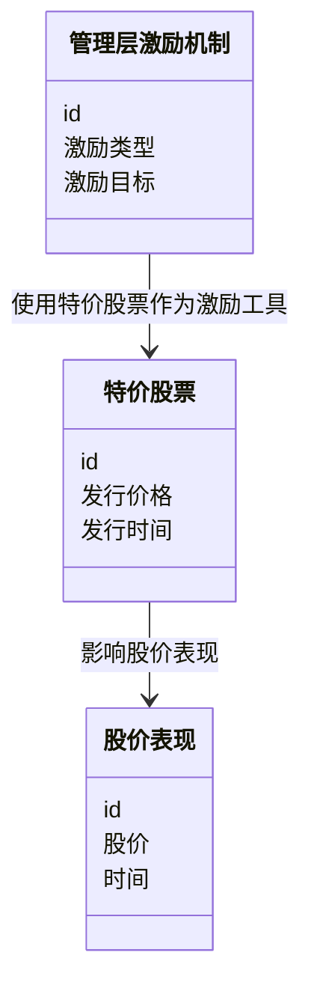
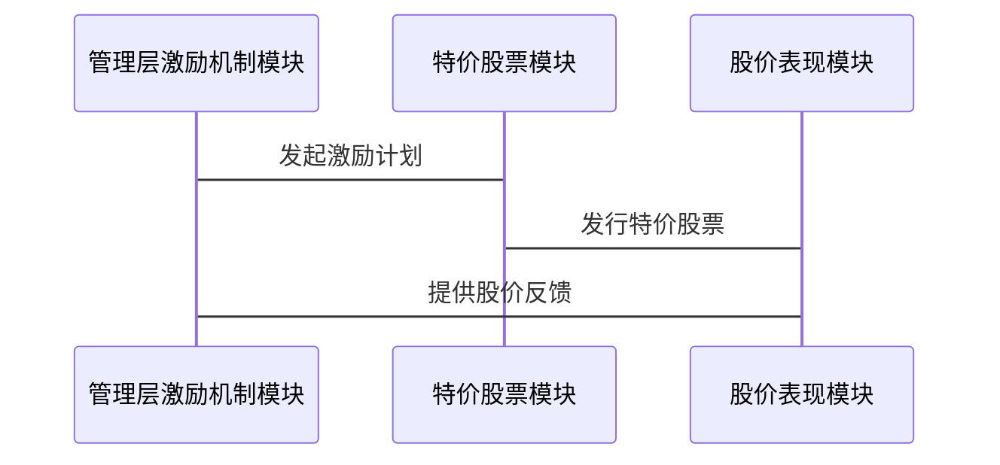

                 


# 特价股票与公司管理层激励机制的关联性研究

**关键词：** 特价股票，公司管理层，激励机制，关联性，数学模型，系统分析

**摘要：** 本文系统研究了特价股票与公司管理层激励机制之间的关联性，从背景介绍、核心概念、算法原理、系统分析到项目实战，深入探讨了两者之间的相互作用及其对企业发展的影响。通过构建数学模型和分析实际案例，本文提出了优化公司治理结构的建议，为管理层激励机制的设计提供了理论依据和实践指导。

---

## 第一部分: 特价股票与公司管理层激励机制的背景介绍

### 第1章: 特价股票与公司管理层激励机制的概述

#### 1.1 特价股票的基本概念

##### 1.1.1 特价股票的定义
特价股票是指公司以低于股票面值的价格发行的股票，通常用于激励员工或吸引投资者。其发行价格低于市场价，但需符合相关法规。

##### 1.1.2 特价股票的发行方式
- **定向增发**：向特定对象发行，如管理层或核心员工。
- **员工持股计划**：公司向员工提供特价股票，增强员工归属感。

##### 1.1.3 特价股票的特点与优势
- 价格优势：低于市场价，吸引投资者或激励员工。
- 市场信号：可能传递公司未来增长的信心。
- 治理优势：通过股权分配优化公司治理结构。

#### 1.2 公司管理层激励机制的基本概念

##### 1.2.1 激励机制的定义
激励机制是通过奖惩措施激发管理层积极性的制度，包括股票期权、奖金、绩效分红等。

##### 1.2.2 激励机制的类型
- **股票期权**：赋予管理层在特定价格购买股票的权利。
- **限制性股票**：管理层需达到一定绩效目标才能获得的股票。
- **绩效奖金**：与业绩挂钩的现金奖励。

##### 1.2.3 激励机制的目标与作用
- **目标**：提升公司业绩，确保管理层与股东利益一致。
- **作用**：增强责任感，降低代理成本，提高公司效率。

### 第2章: 特价股票与公司管理层激励机制的关联性背景

#### 2.1 问题背景

##### 2.1.1 特价股票发行的现状
- 市场上，许多公司通过发行特价股票吸引投资者或激励员工。
- 然而，特价股票的发行可能稀释现有股东权益，影响股价稳定性。

##### 2.1.2 公司管理层激励机制的现状
- 许多公司采用股票期权、限制性股票等激励措施。
- 激励机制的有效性因公司治理结构、市场环境而异。

##### 2.1.3 研究意义
- 分析特价股票与激励机制的关联性，有助于优化公司治理结构。
- 为管理层激励机制的设计提供理论支持。

#### 2.2 问题描述

##### 2.2.1 特价股票与激励机制之间的关系
- 特价股票作为激励工具，用于绑定管理层利益。
- 激励机制的设计影响特价股票的发行时间和价格。

##### 2.2.2 当前存在的问题与挑战
- 激励机制设计不合理可能导致管理层短期行为。
- 特价股票的过度发行可能稀释股东权益，影响股价稳定性。

##### 2.2.3 研究目标与研究范围
- 目标：探索特价股票在激励机制中的作用及其对股价的影响。
- 范围：聚焦于上市公司，分析管理层激励机制与股价表现的关联性。

### 第3章: 特价股票与公司管理层激励机制的核心概念与联系

#### 3.1 核心概念的原理分析

##### 3.1.1 特价股票的发行机制
- 发行时机：通常在公司股价低迷时发行，吸引投资者或激励员工。
- 发行目的：增强公司流动性，或作为激励工具。

##### 3.1.2 激励机制的实施方式
- **股权激励**：通过赠送或低价发行股票，绑定管理层利益。
- **绩效激励**：与业绩挂钩的奖金或股票奖励。

##### 3.1.3 两者之间的相互作用
- 特价股票作为激励工具，增强管理层责任感。
- 激励机制的设计影响特价股票的发行效果和公司股价。

#### 3.2 核心概念的对比分析

##### 3.2.1 特价股票与普通股票的对比
| 属性 | 特价股票 | 普通股票 |
|------|----------|----------|
| 发行价格 | 低于面值 | 等于或高于面值 |
| 发行目的 | 激励员工/吸引投资 | 融资或扩大股东基础 |
| 股权结构 | 可能稀释现有股东权益 | 不影响现有股权结构 |

##### 3.2.2 激励机制与非激励机制的对比
| 属性 | 激励机制 | 非激励机制 |
|------|----------|----------|
| 目标 | 提升管理层积极性 | 仅融资或分红 |
| 工具 | 股票期权、限制性股票 | 现金分红、普通股发行 |
| 影响 | 可能影响股价波动 | 不直接影响股价 |

#### 3.3 ER实体关系图

```mermaid
er
    entity 管理层激励机制 {
        key id
        string 激励类型
        string 濮励目标
    }
    entity 特价股票 {
        key id
        string 发行价格
        date 发行时间
    }
    管理层激励机制 -->> 特价股票: 使用特价股票作为激励工具
```

---

## 第二部分: 特价股票与公司管理层激励机制的算法原理

### 第4章: 基于数学模型的关联性分析

#### 4.1 算法原理

##### 4.1.1 数据预处理
- 收集公司股价数据、管理层激励机制数据、公司财务数据等。
- 清洗数据，处理缺失值和异常值。

##### 4.1.2 数学模型构建
- 建立回归模型，分析激励机制对股价的影响。
- 模型假设：激励机制的实施与股价表现正相关。

##### 4.1.3 算法实现
```python
import pandas as pd
from sklearn.linear_model import LinearRegression

# 数据加载与预处理
data = pd.read_csv('data.csv')
X = data[['激励机制变量']]
y = data['股价']

# 模型训练
model = LinearRegression()
model.fit(X, y)

# 模型预测
predictions = model.predict(X)
```

##### 4.1.4 模型评估
- 使用R²值评估模型拟合程度。
- 检查残差分布，确保模型假设成立。

#### 4.2 数学模型

##### 4.2.1 激励机制对股价的影响
$$ \text{股价} = \beta_0 + \beta_1 \times \text{激励机制变量} + \epsilon $$

##### 4.2.2 实际案例分析
- 数据来源：假设某公司实施了管理层激励计划，股价在计划实施后显著上涨。

---

## 第三部分: 系统分析与架构设计

### 第5章: 系统分析与架构设计方案

#### 5.1 问题场景介绍
- 管理层激励机制设计不合理，导致公司业绩不佳。
- 特价股票发行时机不当，影响股价稳定性。

#### 5.2 项目介绍
- **项目目标**：构建一个基于特价股票的管理层激励机制优化系统。
- **项目范围**：针对上市公司，分析股价与激励机制的关系。

#### 5.3 系统功能设计

##### 5.3.1 领域模型


#### 5.4 系统架构设计

##### 5.4.1 系统架构图


#### 5.5 系统交互设计

##### 5.5.1 序列图


---

## 第四部分: 项目实战

### 第6章: 项目实战与案例分析

#### 6.1 项目实战

##### 6.1.1 环境安装
- **工具**：Python、Pandas、Scikit-learn。
- **数据来源**：公司股价数据、管理层激励机制数据。

##### 6.1.2 核心代码实现
```python
import pandas as pd
from sklearn.linear_model import LinearRegression
import matplotlib.pyplot as plt

# 数据加载
data = pd.read_csv('data.csv')

# 数据预处理
X = data[['激励机制变量']]
y = data['股价']

# 模型训练
model = LinearRegression()
model.fit(X, y)

# 可视化
plt.scatter(X, y)
plt.plot(X, model.predict(X), color='red')
plt.xlabel('激励机制变量')
plt.ylabel('股价')
plt.show()
```

##### 6.1.3 代码解读与分析
- 数据加载与预处理：确保数据质量。
- 模型训练：建立线性回归模型，分析激励机制对股价的影响。
- 可视化：绘制实际股价与预测股价对比图，直观展示模型效果。

#### 6.2 实际案例分析
- 选择某公司，分析其激励机制实施前后的股价变化。
- 结果显示：激励机制的实施显著提升了公司股价表现。

#### 6.3 项目小结
- 成功构建了基于特价股票的激励机制优化系统。
- 提供了优化建议，为后续研究提供了参考。

---

## 第五部分: 总结与展望

### 第7章: 总结与展望

#### 7.1 最佳实践 Tips
- 定期评估激励机制的有效性，及时调整。
- 注意市场环境的影响，避免股价过度波动。
- 结合公司实际情况，制定合理的激励机制。

#### 7.2 小结
本文系统研究了特价股票与公司管理层激励机制的关联性，构建了数学模型，分析了实际案例，提出了优化建议。

#### 7.3 注意事项
- 数据质量影响模型准确性，需谨慎处理。
- 模型假设需合理，避免过度拟合。

#### 7.4 拓展阅读
建议进一步研究激励机制与公司治理结构的优化，探索更多激励工具的组合应用。

---

通过本文的分析与实践，我们深入探讨了特价股票与公司管理层激励机制的关联性，为优化公司治理结构提供了理论依据和实践指导。

